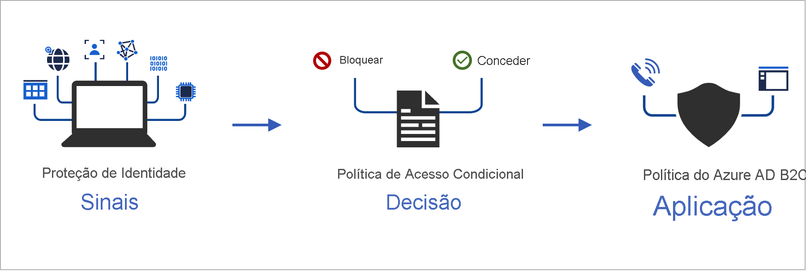
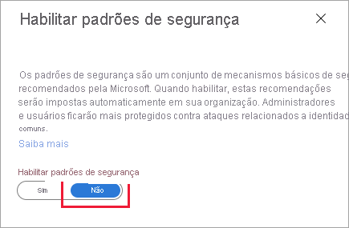
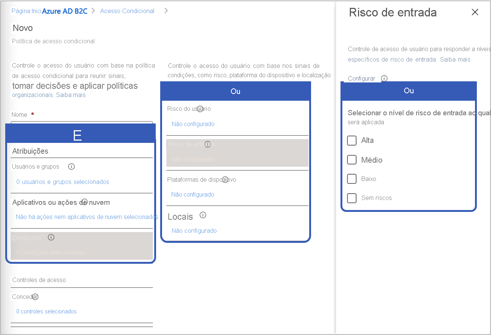

# <a name="add-conditional-access-to-user-flows-in-azure-active-directory-b2c"></a>Adicionar um acesso condicional a fluxos dos usuários do Azure Active Directory B2C

[!INCLUDE [active-directory-b2c-choose-user-flow-or-custom-policy](../../includes/active-directory-b2c-choose-user-flow-or-custom-policy.md)]

O acesso condicional pode ser adicionado aos fluxos dos usuários ou políticas personalizadas do Azure AD B2C (Azure Active Directory B2C) para gerenciar entradas suspeitas nos seus aplicativos. O acesso condicional do Azure AD (Azure Active Directory) é a ferramenta usada pelo Azure AD B2C para reunir sinais, tomar decisões e impor políticas organizacionais.



Automatizar a avaliação de riscos com condições de política significa que as entradas arriscadas são identificadas imediatamente e corrigidas ou bloqueadas.

[!INCLUDE [b2c-public-preview-feature](../../includes/active-directory-b2c-public-preview.md)]

## <a name="service-overview"></a>Visão geral do serviço

O Azure AD B2C avalia cada evento de entrada e garante que todos os requisitos de política sejam atendidos antes de conceder acesso ao usuário. Durante essa fase de **avaliação**, o serviço de acesso condicional avalia os sinais coletados pelas detecções de risco do Identity Protection durante eventos de entrada. O resultado desse processo de avaliação é um conjunto de declarações que indica se a entrada deve ser concedida ou bloqueada. A política do Azure AD B2C usa essas declarações para executar uma ação dentro do fluxo do usuário, como bloquear o acesso ou desafiar o usuário com uma correção específica, como a MFA (autenticação multifator). "Bloquear acesso" substitui todas as outras configurações.

::: zone pivot="b2c-custom-policy"
O exemplo a seguir mostra um perfil técnico de acesso condicional usado para avaliar a ameaça de entrada.

```XML
<TechnicalProfile Id="ConditionalAccessEvaluation">
  <DisplayName>Conditional Access Provider</DisplayName>
  <Protocol Name="Proprietary" Handler="Web.TPEngine.Providers.ConditionalAccessProtocolProvider, Web.TPEngine, Version=1.0.0.0, Culture=neutral, PublicKeyToken=null" />
  <Metadata>
    <Item Key="OperationType">Evaluation</Item>
  </Metadata>
  ...
</TechnicalProfile>
```

::: zone-end

Na fase de **correção** a seguir, o usuário é desafiado com a MFA. Uma vez concluído, o Azure AD B2C informa ao Identity Protection que a ameaça de entrada identificada foi corrigida e qual método foi usado. Neste exemplo, o Azure AD B2C sinaliza que o usuário concluiu com êxito o desafio de autenticação multifator. 

::: zone pivot="b2c-custom-policy"

O seguinte exemplo mostra um perfil técnico de acesso condicional usado para corrigir a ameaça identificada:

```XML
<TechnicalProfile Id="ConditionalAccessRemediation">
  <DisplayName>Conditional Access Remediation</DisplayName>
  <Protocol Name="Proprietary" Handler="Web.TPEngine.Providers.ConditionalAccessProtocolProvider, Web.TPEngine, Version=1.0.0.0, Culture=neutral, PublicKeyToken=null"/>
  <Metadata>
    <Item Key="OperationType">Remediation</Item>
  </Metadata>
  ...
</TechnicalProfile>
```

::: zone-end

## <a name="components-of-the-solution"></a>Componentes da solução

Estes são os componentes que habilitam o acesso condicional no Azure AD B2C:

- **Fluxo de usuário** ou **política personalizada** que orienta o usuário no processo de entrada e inscrição.
- **Política de acesso condicional** que reúne sinais para tomar decisões e impor políticas organizacionais. Quando um usuário entra em seu aplicativo por meio de uma política do Azure AD B2C, a política de acesso condicional usa sinais do Azure AD Identity Protection para identificar entradas arriscadas e apresenta a ação de correção apropriada.
- **Aplicativo registrado** que direciona os usuários para o fluxo de usuário ou a política personalizada do Azure AD B2C.
- [Navegador TOR](https://www.torproject.org/download/) para simular uma entrada suspeita.

## <a name="service-limitations-and-considerations"></a>Limitações e considerações do serviço

Ao usar o acesso condicional do Azure AD, considere o seguinte:

- O Identity Protection está disponível para identidades locais e sociais, como Google ou Facebook. Para identidades sociais, você precisa ativar manualmente o acesso condicional. A detecção é limitada porque as credenciais da conta de rede social são gerenciadas pelo provedor de identidade externo.
- Em locatários do Azure AD B2C, apenas um subconjunto de políticas de [acesso condicional do Azure AD](../active-directory/conditional-access/overview.md) está disponível.


## <a name="prerequisites"></a>Pré-requisitos

[!INCLUDE [active-directory-b2c-customization-prerequisites-custom-policy](../../includes/active-directory-b2c-customization-prerequisites-custom-policy.md)]

## <a name="pricing-tier"></a>Tipo de preço

O Azure AD B2C **Premium P2** é necessário para criar políticas de entrada suspeita. Os locatários **Premium P1** podem criar uma política baseada em políticas com base no local, no aplicativo, no usuário ou no grupo. Para obter mais informações, confira [Alterar o tipo de preço do Azure AD B2C](billing.md#change-your-azure-ad-pricing-tier)

## <a name="prepare-your-azure-ad-b2c-tenant"></a>Preparar seu locatário do Azure AD B2C

Para adicionar uma política de acesso condicional, desabilite os padrões de segurança:

1. Entre no [portal do Azure](https://portal.azure.com/).
2. Selecione o ícone **Diretório + Assinatura** na barra de ferramentas do portal e selecione o diretório que contém o locatário do Azure AD B2C.
3. Em **Serviços do Azure**, selecione **Azure AD B2C**. Ou use a caixa de pesquisa para localizar e selecionar **Azure AD B2C**.
4. Escolha **Propriedades** e selecione **Gerenciar Padrões de segurança**.

   

5. Em **Habilitar Padrões de segurança**, selecione **Não**.

   

## <a name="add-a-conditional-access-policy"></a>Adicionar uma política de acesso condicional

Uma política de acesso condicional é uma instrução if-then de atribuições e controles de acesso. Uma política de acesso condicional reúne sinais para tomar decisões e impor políticas organizacionais. O operador lógico entre as atribuições é *And*. O operador em cada atribuição é *Or*.



Para adicionar uma política de acesso condicional:

1. No portal do Azure, pesquise e selecione **Azure AD B2C**.
1. Em **Segurança**, escolha **Acesso Condicional (Versão Prévia)** . A página **Políticas de Acesso Condicional** será aberta.
1. Selecione **+ Nova política**.
1. Insira um nome para a política, como *Bloquear entrada suspeita*.
1. Em **Atribuições**, escolha **Usuários e grupos** e, em seguida, selecione uma das seguintes configurações com suporte:

    |Incluir  |Licença | Observações  |
    |---------|---------|---------|
    |**Todos os usuários** | P1, P2 |Se você optar por incluir **Todos os usuários**, essa política afetará todos os seus usuários. Para não se bloquear, exclua sua conta administrativa escolhendo **Excluir**, selecionando **Funções do diretório** e, em seguida, **Administrador Global** na lista. Você também pode selecionar **Usuários e Grupos** e, em seguida, selecionar sua conta na lista **Selecionar usuários excluídos**.  | 
 
1. Selecione **Aplicativos de nuvem ou ações** e, em seguida, **Selecionar aplicativos**. Procure seu [aplicativo de terceira parte confiável](tutorial-register-applications.md).

1. Selecione **Condições** e, em seguida, selecione uma das condições a seguir. Por exemplo, selecione **Risco de entrada** e os níveis **Alto**, **Médio** e **Baixo**.
    
    |Condição  |Licença  |Observações  |
    |---------|---------|---------|
    |**Risco do usuário**|P2|O risco do usuário representa a probabilidade de uma determinada identidade ou conta estar comprometida.|
    |**Risco de entrada**|P2|O risco de entrada representa a probabilidade de uma determinada solicitação de autenticação não estar autorizada pelo proprietário da identidade.|
    |**Plataformas de dispositivo**|Sem suporte| Caracterizado pelo sistema operacional executado em um dispositivo. Para obter mais informações, confira [Plataformas de dispositivos](../active-directory/conditional-access/concept-conditional-access-conditions.md#device-platforms).|
    |**Locais**|P1, P2|Os locais nomeados podem incluir informações de rede IPv4 públicas, país ou região ou áreas desconhecidas que não são mapeadas para países ou regiões específicas. Para obter mais informações, confira [Locais](../active-directory/conditional-access/concept-conditional-access-conditions.md#locations). |
 
1. Em **Controles de acesso**, selecione **Conceder**. Em seguida, selecione se deseja bloquear ou conceder acesso:
    
    |Opção  |Licença |Observação  |
    |---------|---------|---------|
    |**Bloquear o acesso**|P1, P2| Impede o acesso com base nas condições especificadas nesta política de acesso condicional.|
    |**Conceder acesso** com **Exigir autenticação multifator**|P1, P2|Com base nas condições especificadas nesta política de acesso condicional, o usuário precisa passar pela autenticação multifator do Azure AD B2C.|

1. Em **Habilitar política**, selecione um dos seguintes:
    
    |Opção  |Licença |Observação  |
    |---------|---------|---------|
    |**Somente relatório**|P1, P2| O modo Somente relatório permite que os administradores avaliem o impacto das políticas de acesso condicional antes de habilitá-las no ambiente deles. Recomendamos que você verifique a política com esse estado e determine o impacto para os usuários finais sem exigir a autenticação multifator ou bloquear usuários. Para obter mais informações, confira [Examinar resultados de acesso condicional no relatório de auditoria](#review-conditional-access-outcomes-in-the-audit-report)|
    | **Ativado**| P1, P2| A política de acesso é avaliada e não imposta. |
    | **Desativado** | P1, P2| A política de acesso não está ativada e não tem nenhum efeito sobre os usuários. |

1. Habilite a política de acesso condicional de teste selecionando **Criar**.

## <a name="add-conditional-access-to-a-user-flow"></a>Adicionar o acesso condicional a um fluxo de usuário

Depois de adicionar a política de acesso condicional do Azure AD, habilite o acesso condicional em seu fluxo de usuário ou sua política personalizada. Quando você habilita o acesso condicional, não precisa especificar um nome de política.

Várias políticas de acesso condicional podem se aplicar a um usuário individual a qualquer momento. Nesse caso, a política de controle de acesso mais estrita tem precedência. Por exemplo, se uma política exigir a MFA (autenticação multifator), enquanto a outra bloqueia o acesso, o usuário será bloqueado.

## <a name="enable-multi-factor-authentication-optional"></a>Habilitar a autenticação multifator (opcional)

Ao adicionar acesso condicional a um fluxo de usuário, considere o uso da **MFA (autenticação multifator)** . Os usuários podem usar um código de uso único por meio de SMS ou voz ou uma senha de uso único por email para a autenticação multifator. As configurações da MFA são independentes das configurações do acesso condicional. Defina a MFA como **Sempre Ativada**, de modo que ela sempre seja obrigatória, independentemente da configuração do acesso condicional. Ou, então, defina o MFA como **Condicional**, de modo que a MFA seja obrigatória somente quando uma política de acesso condicional ativa a exigir.

> [!IMPORTANT]
> Se sua política de acesso condicional conceder acesso com MFA, mas o usuário não tiver registrado um número de telefone, o usuário poderá ser bloqueado.

::: zone pivot="b2c-user-flow"

Para habilitar o acesso condicional para um fluxo de usuário, verifique se a versão dá suporte ao acesso condicional. Essas versões de fluxo de usuário são rotuladas **Recomendado**.

1. Entre no [portal do Azure](https://portal.azure.com).

1. Selecione o ícone **Diretório + Assinatura** na barra de ferramentas do portal e selecione o diretório que contém o locatário do Azure AD B2C.

1. Em **Serviços do Azure**, selecione **Azure AD B2C**. Ou use a caixa de pesquisa para localizar e selecionar **Azure AD B2C**.

1. Em **Políticas**, selecione **Fluxos dos usuários**. Em seguida, selecione o fluxo de usuário.

1. Selecione **Propriedades** e verifique se o fluxo de usuário dá suporte ao acesso condicional procurando a configuração rotulada **Acesso Condicional**.
 
   

1. Na seção **Autenticação multifator**, selecione o **Método de MFA** desejado e, em **Imposição de MFA**, escolha **Condicional (Recomendado)** .
 
1. Na seção **Acesso Condicional**, marque a caixa de seleção **Impor políticas de acesso condicional**.

1. Clique em **Salvar**.


::: zone-end

::: zone pivot="b2c-custom-policy"

## <a name="add-conditional-access-to-your-policy"></a>Adicionar o acesso condicional à sua política

1. Encontre um exemplo de uma política de acesso condicional no [GitHub](https://github.com/azure-ad-b2c/samples/tree/master/policies/conditional-access).
1. Em cada arquivo, substitua a cadeia de caracteres `yourtenant` pelo nome do seu locatário do Azure AD B2C. Por exemplo, se o nome do seu locatário B2C for *contosob2c*, todas as instâncias de `yourtenant.onmicrosoft.com` se tornarão `contosob2c.onmicrosoft.com`.
1. Carregue os arquivos de política.

## <a name="test-your-custom-policy"></a>Testar sua política personalizada

1. Selecione a política `B2C_1A_signup_signin_with_ca` ou `B2C_1A_signup_signin_with_ca_whatif` para abrir a página de visão geral dela. Selecione **Executar fluxo de usuário**. Em **Aplicativo**, selecione *webapp1*. A **URL de resposta** deve mostrar `https://jwt.ms`.
1. Copie a URL em **Executar ponto de extremidade de fluxo de usuário**.

1. Para simular uma entrada suspeita, abra o [Navegador Tor](https://www.torproject.org/download/) e use a URL copiada na etapa anterior para entrar no aplicativo registrado.

1. Insira as informações solicitadas na página de entrada e tente se conectar. O token é retornado para `https://jwt.ms` e deve ser exibido para você. No token decodificado jwt.ms, você verá que a entrada foi bloqueada.

::: zone-end

::: zone pivot="b2c-user-flow"

## <a name="test-your-user-flow"></a>Testar seu fluxo de usuário

1. Selecione o fluxo de usuário que você criou para abrir a página de visão geral e, em seguida, selecione **Executar fluxo de usuário**. Em **Aplicativo**, selecione *webapp1*. A **URL de resposta** deve mostrar `https://jwt.ms`.

1. Copie a URL em **Executar ponto de extremidade de fluxo de usuário**.

1. Para simular uma entrada suspeita, abra o [Navegador Tor](https://www.torproject.org/download/) e use a URL copiada na etapa anterior para entrar no aplicativo registrado.

1. Insira as informações solicitadas na página de entrada e tente se conectar. O token é retornado para `https://jwt.ms` e deve ser exibido para você. No token decodificado jwt.ms, você verá que a entrada foi bloqueada.

::: zone-end

## <a name="review-conditional-access-outcomes-in-the-audit-report"></a>Examinar os resultados do acesso condicional no relatório de auditoria

Para examinar o resultado de um evento de acesso condicional:

1. Entre no [portal do Azure](https://portal.azure.com/).

2. Selecione o ícone **Diretório + Assinatura** na barra de ferramentas do portal e selecione o diretório que contém o locatário do Azure AD B2C.

3. Em **Serviços do Azure**, selecione **Azure AD B2C**. Ou use a caixa de pesquisa para localizar e selecionar **Azure AD B2C**.

4. Em **Atividades**, selecione **Logs de auditoria**.

5. Filtre o log de auditoria definindo **Categoria** como **B2C** e configurando **Tipo de Recurso de Atividade** como **IdentityProtection**. Em seguida, selecione **Aplicar**.

6. Examine a atividade de auditoria no período de até os últimos sete dias. Os seguintes tipos de atividades estão incluídos:

   - **Avaliar as políticas de acesso condicional**: essa entrada de log de auditoria indica que uma avaliação de acesso condicional foi executada durante uma autenticação.
   - **Corrigir usuário**: essa entrada indica que a concessão ou os requisitos de uma política de acesso condicional foram atendidos pelo usuário final e que essa atividade foi relatada ao mecanismo de risco para mitigar o risco do usuário.

7. Selecione uma entrada de log **Avaliar a política de acesso condicional** na lista para abrir a página **Detalhes da Atividade: Log de auditoria**, que mostra os identificadores de log de auditoria, juntamente com estas informações na seção **Detalhes Adicionais**:

   - **ConditionalAccessResult**: a concessão necessária para a avaliação da política condicional.
   - **AppliedPolicies**: uma lista de todas as políticas de acesso condicional em que as condições foram atendidas e as políticas estão ativadas.
   - **ReportingPolicies**: uma lista das políticas de acesso condicional que foram definidas como modo somente relatório e nas quais as condições foram atendidas.

## <a name="next-steps"></a>Próximas etapas

[Personalizar a interface do usuário em um fluxo de usuário do Azure AD B2C](customize-ui-with-html.md)
