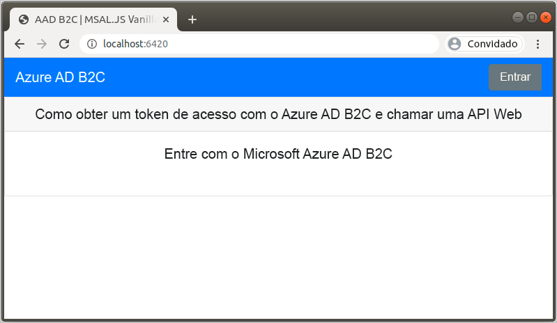
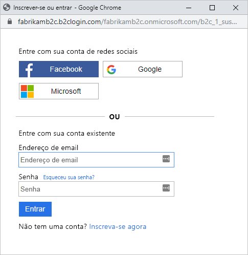
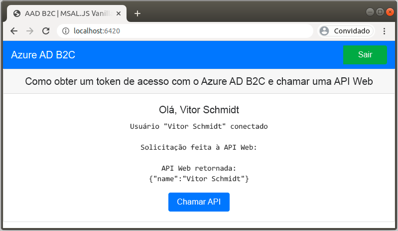

# <a name="quickstart-set-up-sign-in-for-a-single-page-app-using-azure-active-directory-b2c"></a>Início rápido: configurar a entrada para um aplicativo de página única usando o Azure Active Directory B2C

O Azure AD B2C (Azure Active Directory B2C) fornece gerenciamento de identidades de nuvem para manter seu aplicativo, sua empresa e seus clientes protegidos. O Azure AD B2C permite que seus aplicativos se autentiquem com contas sociais e corporativas usando protocolos padrão. Neste início rápido, você usa um aplicativo de página única para se conectar usando um provedor de identidade de redes sociais e chama uma API Web do Azure AD B2C protegida.

[!INCLUDE [quickstarts-free-trial-note](../../includes/quickstarts-free-trial-note.md)]

## <a name="prerequisites"></a>Pré-requisitos

- [Visual Studio Code](https://code.visualstudio.com/)
- [Node.js](https://nodejs.org/en/download/)
- Uma conta social do Facebook, do Google ou da Microsoft
- Exemplo de código do GitHub: [ms-identity-b2c-javascript-spa](https://github.com/Azure-Samples/ms-identity-b2c-javascript-spa)

    É possível [baixar os arquivos .zip](https://github.com/Azure-Samples/ms-identity-b2c-javascript-spa/archive/main.zip) ou clonar o repositório:

    ```console
    git clone https://github.com/Azure-Samples/ms-identity-b2c-javascript-spa.git
    ```

## <a name="run-the-application"></a>Executar o aplicativo

1. Inicie o servidor executando os seguintes comandos no prompt de comando do Node.js:

    ```console
    npm install && npm update
    npm start
    ```

    O servidor iniciado pelo *server.js* exibe a porta em que está escutando:

    ```console
    Listening on port 6420...
    ```

1. Navegue até a URL do aplicativo. Por exemplo, `http://localhost:6420`.

    

## <a name="sign-in-using-your-account"></a>Iniciar sessão usando sua conta

1. Selecione **Entrar** para iniciar o percurso do usuário.
1. O Azure AD B2C apresenta uma página de entrada para uma empresa fictícia chamada "Fabrikam" para o aplicativo Web de exemplo. Para inscrever-se usando um provedor de identidade social, selecione o botão do provedor de identidade que você deseja usar.

    

    Você se autentica (entra) usando as credenciais de sua conta social e autoriza o aplicativo a ler as informações da sua conta social. Ao conceder o acesso, o aplicativo poderá recuperar informações de perfil da conta social, tais como seu nome e cidade.

1. Conclua o processo de entrada para o provedor de identidade.

## <a name="access-a-protected-api-resource"></a>Acessar um recurso de API protegido

Selecione **Chamar API** para que seu nome de exibição seja retornado da API Web como um objeto JSON.



O aplicativo de página única inclui um token de acesso na solicitação para o recurso da API Web protegida.

## <a name="clean-up-resources"></a>Limpar recursos

Você pode usar o locatário do Azure AD B2C se planeja experimentar outros tutoriais ou inícios rápidos do Azure AD B2C. Quando não for mais necessário, você poderá [excluir o locatário do Azure AD B2C](faq.md#how-do-i-delete-my-azure-ad-b2c-tenant).

## <a name="next-steps"></a>Próximas etapas

Neste início rápido, você usou um aplicativo de página única de exemplo para:

- Entrar com um provedor de identidade social
- Criar uma conta de usuário do Azure AD B2C (criada automaticamente na entrada)
- Chamar uma API Web protegida pelo Azure AD B2C

Introdução à criação de seu próprio locatário do Azure AD B2C.

> [!div class="nextstepaction"]
> [Criar um locatário do Azure Active Directory B2C no Portal do Azure](tutorial-create-tenant.md)
