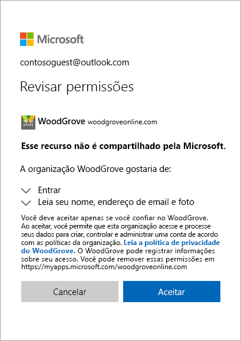
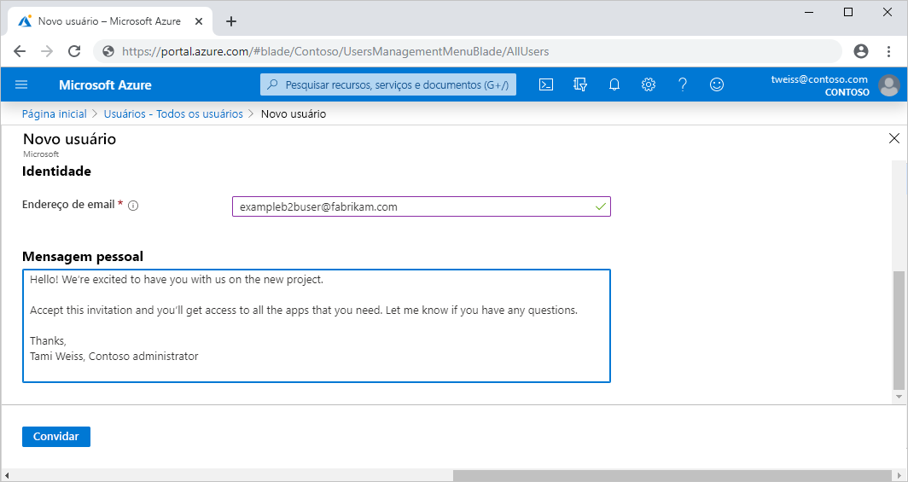
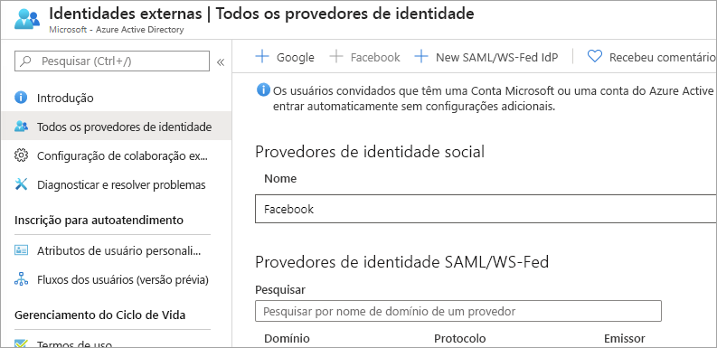
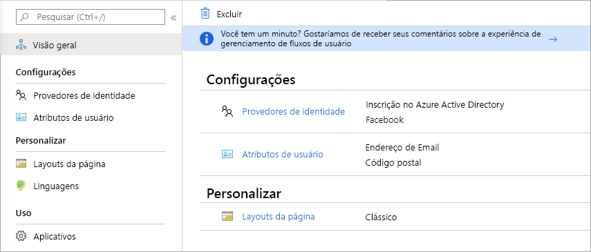

# O que é o acesso de usuários convidados na colaboração B2B do Azure Active Directory?

A colaboração B2B (entre empresas) do Azure AD (Azure Active Directory) permite compartilhar de forma segura os aplicativos e os serviços da empresa com usuários convidados qualquer organização e, ao mesmo tempo, controlar seus próprios dados corporativos. Trabalhe de forma segura com parceiros externos, de grande ou pequeno porte, mesmo se eles não tiverem o Azure AD ou um departamento de TI. Um processo de convite e resgate simples permite que os parceiros usem suas próprias credenciais para acessar recursos da empresa. Os desenvolvedores podem usar as APIs entre empresas do Azure AD para personalizar o processo de convite ou escrever aplicativos como portais de inscrição de autoatendimento.

Assista ao vídeo para saber como colaborar com segurança com usuários convidados ao convidá-los para entrar nos aplicativos e serviços da empresa usando suas próprias identidades.

O vídeo a seguir fornece uma visão geral útil.

>[!VIDEO https://www.youtube.com/embed/AhwrweCBdsc]

   > [!IMPORTANT]
   > **A partir de 31 de março de 2021**, a Microsoft não dará mais suporte ao resgate de convites criando contas e locatários do Azure AD não gerenciado para cenários de colaboração B2B. Durante a preparação, incentivamos os clientes a aceitarem a [autenticação de senha avulsa por email](one-time-passcode.md). Agradecemos seus comentários sobre essa versão prévia do recurso pública e estamos empolgados em criar ainda mais maneiras de colaborar.

## Colabore com qualquer parceiro usando as identidades deles

Com o Azure AD B2B, o parceiro usa sua própria solução de gerenciamento de identidades, portanto, não há nenhuma sobrecarga administrativa externa para a organização.

- O parceiro usa suas próprias identidades e credenciais; o Azure AD não é necessário.
- Não é necessário gerenciar contas ou senhas externas.
- Não é necessário sincronizar contas ou gerenciar ciclos de vida de contas.  

## Convidar usuários com um processo simples de convite e resgate

Os usuários convidados entram nos aplicativos e serviços com as próprias identidades empresariais, estudantis ou sociais. Se o usuário convidado não tiver uma conta Microsoft ou do Azure AD, uma será criada no momento do resgate do convite. 

- Convide usuários usando a identidade de email preferida deles.
- Envie um link direto para um aplicativo ou um convite para o Painel de Acesso do usuário convidado.
- Os usuários convidados precisam seguir algumas etapas de resgate simples para entrar.

## Usar políticas para compartilhar aplicativos e serviços com segurança

É possível usar as políticas de autorização para proteger seu conteúdo corporativo. Políticas de Acesso Condicional, como a autenticação multifator, podem ser aplicadas:

- No nível do locatário.
- No nível do aplicativo.
- Para que usuários convidados específicos protejam dados e aplicativos corporativos.

## Adicione usuários convidados no portal do Azure AD com facilidade

Como administrador, é possível adicionar facilmente usuários convidados à sua organização no portal do Azure.

- Crie um novo usuário convidado no Azure AD, do mesmo modo que você adicionaria um novo usuário.
- O usuário convidado imediatamente recebe um convite personalizável que permite entrar no Painel de Acesso dele.
- Os usuários convidados no diretório podem ser atribuídos a aplicativos ou grupos.  

## Permitir que o aplicativo e os proprietários de grupos gerenciem os próprios usuários convidados

É possível delegar o gerenciamento de usuários convidados para proprietários de aplicativos. Dessa forma, eles poderão adicionar os usuários convidados diretamente a qualquer aplicativo que quiserem compartilhar, seja da Microsoft ou não.

- Os administradores configuram o aplicativo de autoatendimento e o gerenciamento de grupos.
- Os não administradores usam o [Painel de Acesso](https://myapps.microsoft.com) para adicionar usuários convidados a aplicativos ou grupos.

## Personalizar a experiência de integração para usuários convidados B2B

Integre seus parceiros externos de modo personalizado às necessidades de sua organização.

- Use o [gerenciamento de direitos do Azure AD](https://docs.microsoft.com/azure/active-directory/governance/entitlement-management-overview) para configurar políticas que [gerenciam o acesso de usuários externos](https://docs.microsoft.com/azure/active-directory/governance/entitlement-management-external-users#how-access-works-for-external-users).
- Use as [APIs de convite de colaboração B2B](https://developer.microsoft.com/graph/docs/api-reference/v1.0/resources/invitation) para personalizar suas experiências de integração.

## Integrar-se aos Provedores de identidade

O Azure AD dá suporte a provedores de identidade externos como Facebook, contas da Microsoft, Google ou provedores de identidade corporativa. Você pode configurar a federação com provedores de identidade para que os usuários externos possam entrar com suas contas sociais ou corporativas existentes, em vez de criar uma nova conta apenas para seu aplicativo. Saiba mais sobre os provedores de identidade para Identidades Externas.

## Criar um fluxo de usuários com inscrição por autoatendimento (Versão Prévia)

Com um fluxo de usuários com inscrição por autoatendimento, você pode criar uma experiência de inscrição para usuários externos que desejam acessar seus aplicativos. Como parte do fluxo de inscrição, é possível fornecer opções para diferentes provedores de identidade social ou corporativa, e coletar informações sobre o usuário. Saiba mais sobre a inscrição por autoatendimento e como configurá-la.

## Próximas etapas

- [Diretriz de licenciamento para a colaboração no Azure AD B2B](licensing-guidance.md)
- [Adicionar usuários convidados de colaboração B2B ao portal](add-users-administrator.md)
- [Entender o processo de resgate de convites](redemption-experience.md)
- E, como sempre, conecte-se com a equipe do produto para enviar comentários, sugestões e participar de discussões por meio da [Microsoft Tech Community](https://techcommunity.microsoft.com/t5/Azure-Active-Directory-B2B/bd-p/AzureAD_B2b) (Comunidade Técnica da Microsoft).
