# Integrar uma floresta existente e uma nova com um único locatário do Azure AD

Este tutorial descreve a adição do provisionamento de nuvem em um ambiente de identidade híbrida existente. 

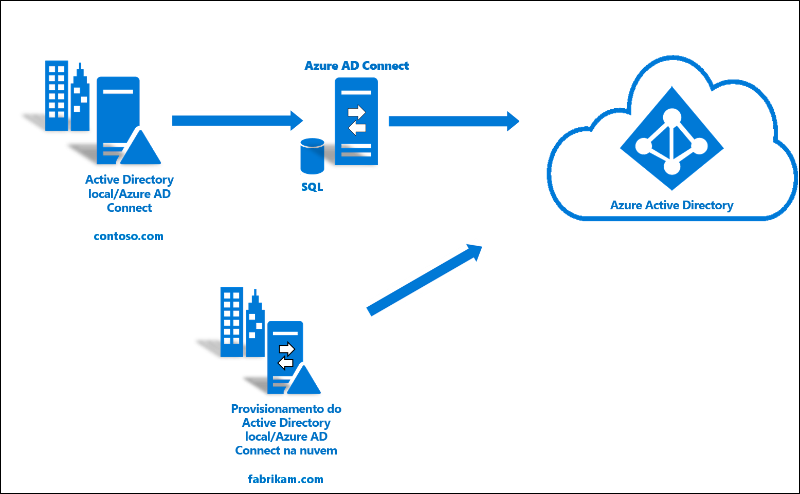

Você pode usar o ambiente criado neste tutorial para testes ou para se familiarizar mais com o funcionamento de uma identidade híbrida. 

Nesse cenário, há uma floresta sincronizada usando a sincronização do Azure AD Connect para um locatário do Azure AD. Além disso, você tem uma nova floresta que deseja sincronizar com o mesmo locatário do Azure AD. Você configurará o provisionamento de nuvem para a nova floresta. 

## Pré-requisitos
### No centro de administração do Azure Active Directory

1. Crie uma conta de administrador global somente em nuvem no seu locatário do Azure AD. Dessa forma, você pode gerenciar a configuração do seu locatário caso seus serviços locais falhem ou fiquem indisponíveis. Saiba mais sobre [adicionar uma conta de administrador global somente em nuvem](../active-directory-users-create-azure-portal.md). A conclusão dessa etapa é essencial para garantir que você não seja bloqueado de seu locatário.
2. Adicione um ou mais [nomes de domínio personalizados](../active-directory-domains-add-azure-portal.md) ao seu locatário do Azure AD. Os usuários podem entrar com um desses nomes de domínio.

### Em seu ambiente local

1. A identidade de um servidor de host ingressado no domínio que executa o Windows Server 2012 R2 ou superior com o mínimo de 4 GB de RAM e o runtime do .NET 4.7.1 + 

2. Se houver um firewall entre os servidores e o Azure AD, configure os seguintes itens:
   - Certifique-se de que os agentes possam fazer solicitações de *saída* para o Azure AD nas seguintes portas:

     | Número da porta | Como ele é usado |
     | --- | --- |
     | **80** | Baixa as listas de certificados revogados (CRLs) enquanto valida o certificado SSL |
     | **443** | Lida com toda a comunicação de saída com o serviço |
     | **8080** (opcional) | Agentes relatarão seu status a cada 10 minutos através da porta 8080, se a porta 443 não estiver disponível. Esse status é exibido no portal do Azure Active Directory. |
     
     Se o firewall impõe as regras de acordo com os usuários originadores, abra essas portas para o tráfego proveniente dos serviços Windows que são executados como um serviço de rede.
   - Se o firewall ou proxy permitir que você especifique sufixos seguros, adicione conexões a **\*. msappproxy.net** e **\*. servicebus.windows.net**. Caso contrário, permita o acesso aos [Intervalos de IP do datacenter do Azure](https://www.microsoft.com/download/details.aspx?id=41653), os quais são atualizados semanalmente.
   - Seus agentes devem acessar **login.windows.net** e **login.microsoftonline.com** para o registro inicial. Abra seu firewall para essas URLs também.
   - Para validação do certificado, desbloqueie as seguintes URLs: **mscrl.microsoft.com:80**, **crl.microsoft.com:80**, **ocsp.msocsp.com:80** e **www\.microsoft.com:80**. Uma vez que essas URLs são usadas para a validação de certificado com outros produtos da Microsoft, você talvez já tenha essas URLs desbloqueadas.

## Instalar o agente de provisionamento do Azure AD Connect
1. Entre no servidor ingressado no domínio.  Se você estiver usando o tutorial [Ambiente básico do AD e Azure](tutorial-basic-ad-azure.md), será o DC1.
2. Entre no portal do Azure usando credenciais de administrador global somente para nuvem.
3. À esquerda, selecione **Azure Active Directory**, clique em **Azure AD Connect** e, no centro, selecione **Gerenciar provisionamento (versão prévia)** . 
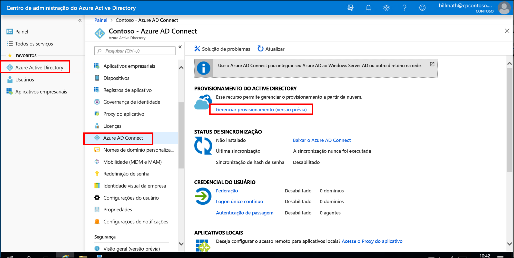 
4. Clique em "Baixar agente"
5. Execute o agente de provisionamento Azure AD Connect
6. Na tela inicial, **Aceite** os termos de licenciamento e clique em **Instalar**. 
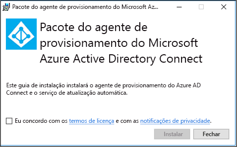 

7. Quando essa operação for concluída, o assistente de configuração será iniciado.  Entre com sua conta de administrador global do Azure AD.  Observe que, se você tiver a segurança aprimorada do IE habilitada, isso bloqueará a entrada.  Se esse for o caso, feche a instalação, desabilite a segurança aprimorada do IE no Gerenciador do Servidor e clique no **Assistente do Agente de Provisionamento AAD Connect** para reiniciar a instalação.
8. Na tela **Conectar Active Directory**, clique em **Adicionar diretório** e, em seguida, entre com sua conta de administrador de domínio do Active Directory.  OBSERVAÇÃO:  A conta de administrador de domínio não deve ter requisitos de alteração de senha. Caso a senha expire ou seja alterada, será necessário reconfigurar o agente com as novas credenciais. Esta operação adicionará o diretório local.  Clique em **Próximo**. 
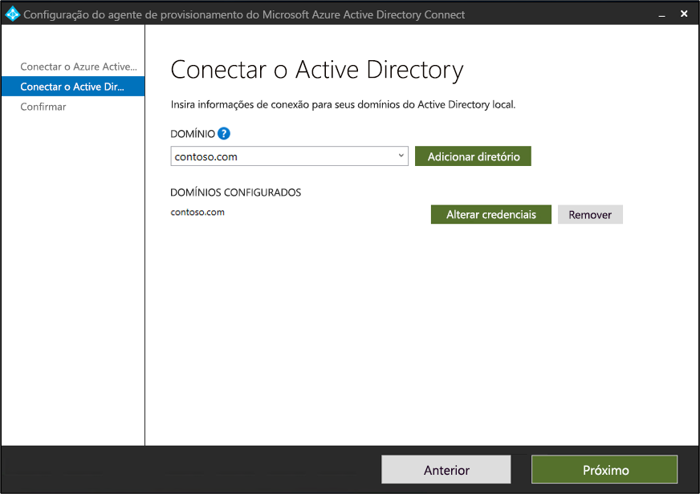 

9. Na tela **Configuração completa**, clique em **Confirmar**.  Esta operação registrará e reiniciará o agente. 
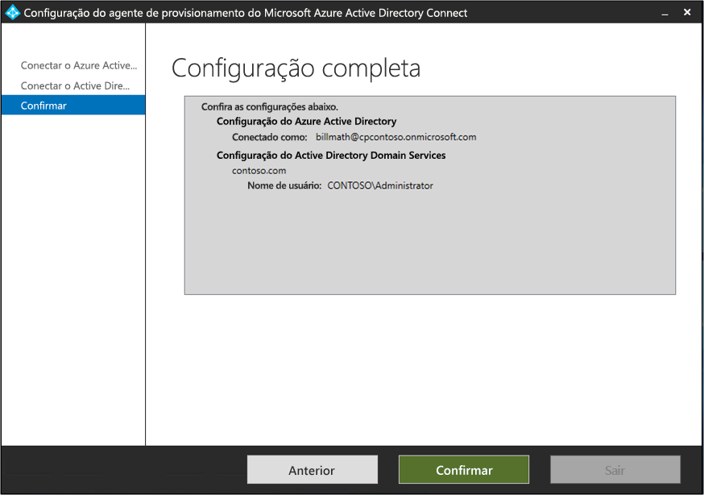 

10. Quando essa operação for concluída, você deverá ver um aviso: **A configuração do agente foi verificada com êxito.**  Você pode clicar em **Sair**. 
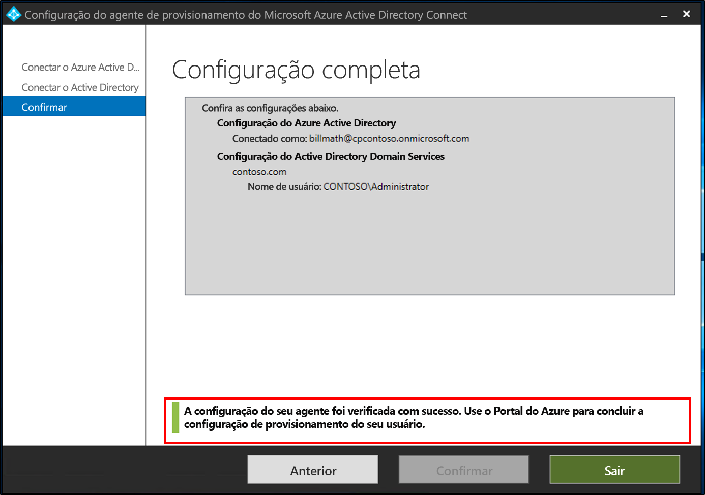 
11. Se ainda vir a tela inicial, clique em **Fechar**.

## Verificar a instalação do agente
A verificação do agente ocorre no portal do Azure e no servidor local que está executando o agente.

### Verificação do agente de portal do Azure
Para verificar se o agente está sendo visto pelo Azure, siga estas etapas:

1. Entre no portal do Azure.
2. À esquerda, selecione **Azure Active Directory**, clique em **Azure AD Connect** e, no centro, selecione **Gerenciar provisionamento (versão prévia)** . 
 

3.  Na tela **Provisionamento do Azure AD (versão prévia)** , clique em **Examinar todos os agentes**.
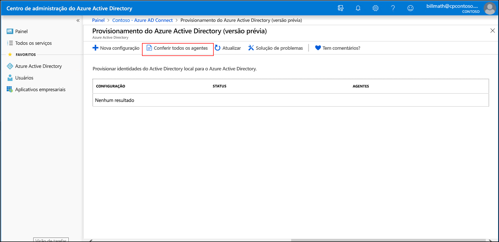 
 
4. Na **tela Agentes de provisionamento locais** você verá os agentes que instalou.  Verifique se o agente em questão está lá e se está marcado como **ativo**.
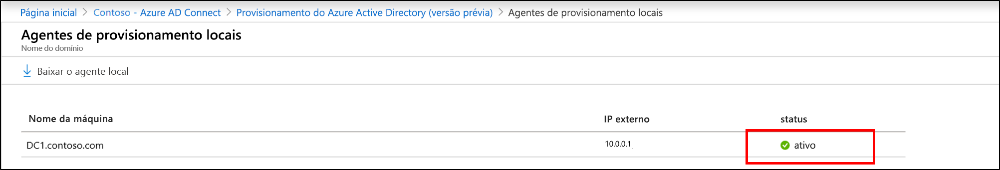 

### No servidor local
Para verificar se o agente está em execução, siga estas etapas:

1.  Faça logon no servidor com uma conta de administrador
2.  Abra **Serviços** navegando até ele ou acessando Iniciar/Executar/Services.msc.
3.  Em **Serviços** certifique-se de que o **Atualizador do Agente do Microsoft Azure AD Connect** e o **Agente de Provisionamento do Microsoft Azure AD Connect** estão presentes e se o status é **Em execução**.
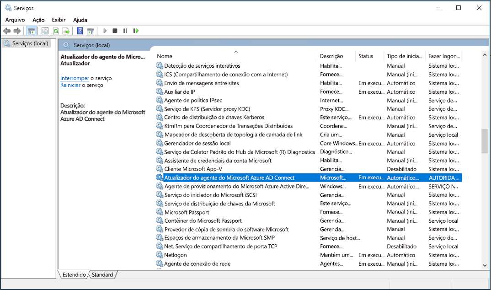

## Configurar o provisionamento de nuvem do Azure AD Connect
 Use as seguintes etapas para configurar o provisionamento

1.  Entre no Portal do Azure AD.
2.  Clique em **Azure Active Directory**
3.  Clique em **Azure AD Connect**
4.  Selecione **Gerenciar provisionamento (Versão Prévia)** 

5.  Clique em **Nova Configuração**
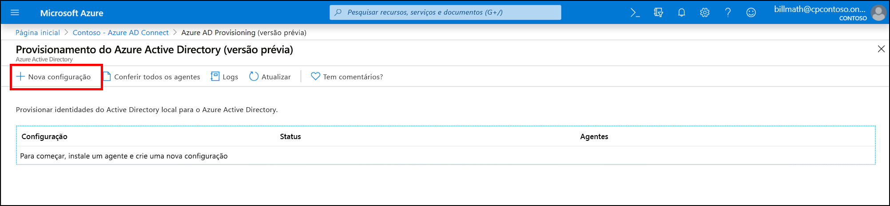
7.  Na tela configuração, insira um **Email de notificação**, mova o seletor para **Habilitar** e clique em **Salvar**.

1.  O status de configuração agora deve ser **Íntegro**.
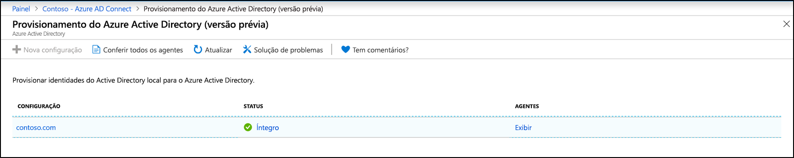

## Verificar se os usuários foram criados e a sincronização está ocorrendo
Agora, você verificará se os usuários que você tinha em nosso diretório local foram sincronizados e se eles existem no locatário do Azure AD.  Esteja ciente de que isso pode levar algumas horas para ser concluído.  Para verificar se os usuários estão sincronizados, faça o seguinte.

1. Navegue até o [portal do Azure](https://portal.azure.com) e entre com uma conta que tenha uma assinatura do Azure.
2. Na esquerda, selecione **Azure Active Directory**
3. Em **Gerenciar**, selecione **Usuários**.
4. Verifique se você vê os novos usuários em nosso inquilino 
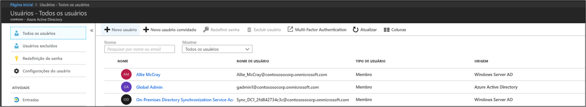 

## Testar entrando com um dos usuários

1. Navegue até [https://myapps.microsoft.com](https://myapps.microsoft.com)
2. Entre com uma conta de usuário que foi criada no novo locatário.  Será necessário entrar usando o formato a seguir: (user@domain.onmicrosoft.com). Use a mesma senha que o usuário usa para entrar localmente. 
   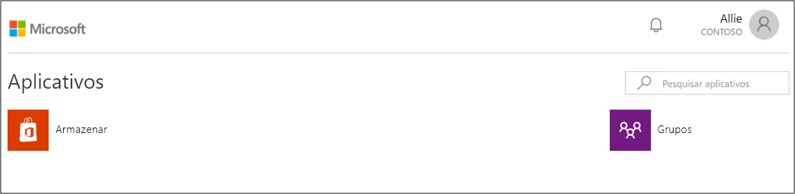 

Agora você configurou com êxito um ambiente de identidade híbrida que pode ser usado para testes e para se familiarizar com o que o Azure tem a oferecer.

## Próximas etapas 

- [O que é provisionamento?](what-is-provisioning.md)
- [O que é o provisionamento em nuvem do Azure AD Connect?](what-is-cloud-provisioning.md)
