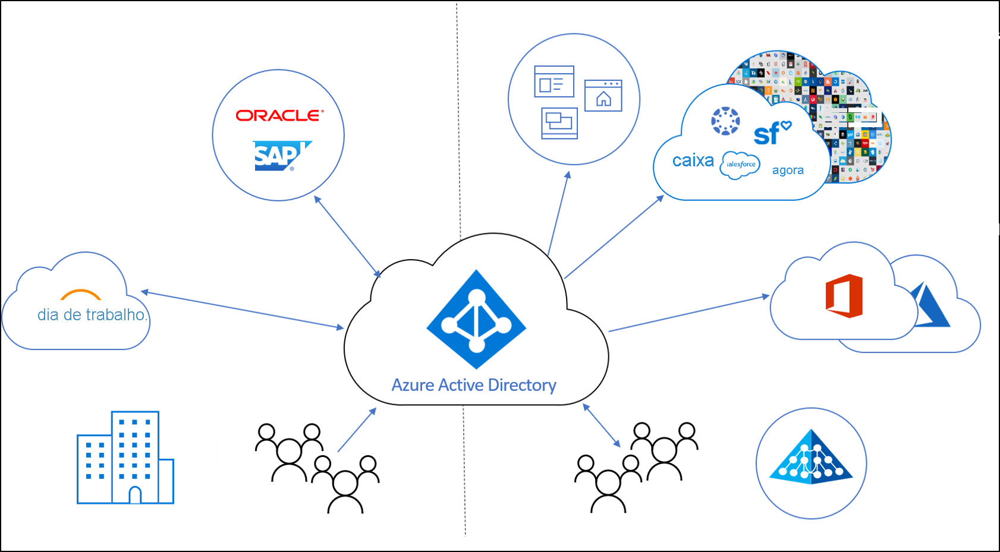
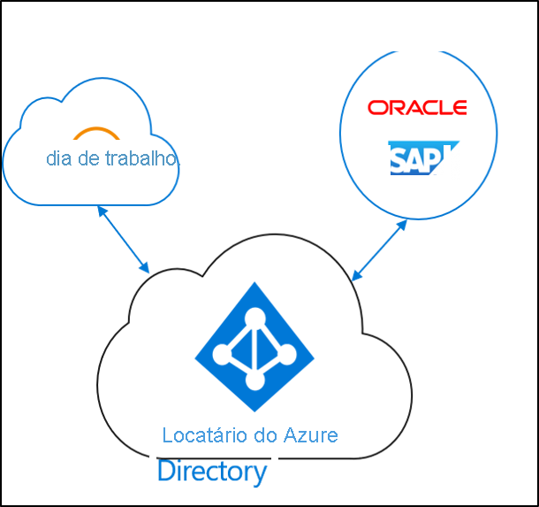
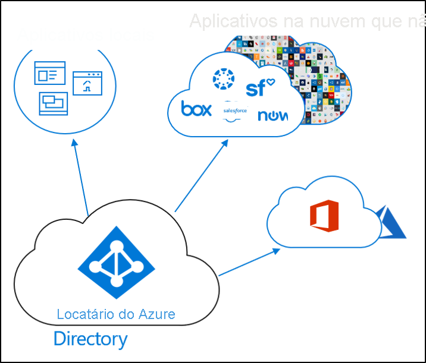
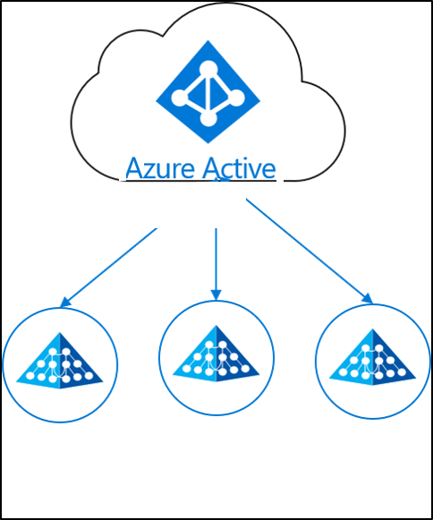

# O que é provisionamento de identidade?

Hoje, as empresas e corporações estão se tornando cada vez mais uma mistura de aplicativos locais e na nuvem.  Os usuários precisam ter acesso local e na nuvem a aos aplicativos. É necessário ter uma única identidade entre esses vários aplicativos (no local, bem como na nuvem).

O provisionamento é o processo de criação de um objeto com base em determinadas condições, mantendo o objeto atualizado e excluindo o objeto quando as condições não são mais atendidas. Por exemplo, quando um novo usuário ingressa em sua organização, esse usuário é inserido no sistema de RH.  Nesse ponto, o provisionamento pode criar uma conta de usuário correspondente na nuvem, no Active Directory e em diferentes aplicativos que o usuário precisa acessar.  Isso permite que o usuário inicie o trabalho e tenha acesso aos aplicativos e sistemas de que precisa, já no primeiro dia. 

Com relação ao Azure Active Directory, o provisionamento pode ser dividido nos cenários principais a seguir.  

- **[Provisionamento impulsionado por RH](#hr-driven-provisioning)**  
- **[Provisionamento de aplicativos](#app-provisioning)**  
- **[Provisionamento de diretório](#directory-provisioning)** 

## Provisionamento impulsionado por RH

O provisionamento de RH para a nuvem envolve a criação de objetos (usuários, funções, grupos, etc.) com base nas informações que estão em seu sistema de RH.  

O cenário mais comum seria quando um novo funcionário ingressasse na sua empresa e fosse inserido no sistema de RH.  Quando isso ocorre, ele é provisionado na nuvem.  Nesse caso, o Azure AD.  O provisionamento do RH pode abranger os cenários a seguir. 

- **Contratação de novos funcionários** – quando um novo funcionário é adicionado ao Cloud HR, uma conta de usuário é criada automaticamente no Active Directory, no Azure Active Directory e, opcionalmente, no Microsoft 365 e em outros aplicativos SaaS compatíveis com o Azure AD, com write-back do endereço de email para o Cloud HR.
- **Atualizações de perfil e atributo de funcionário** – quando um registro de funcionário é atualizado no Cloud HR (como seu nome, cargo ou gerente), sua conta de usuário é atualizada automaticamente no Active Directory, no Azure Active Directory e, opcionalmente, no Microsoft 365 e em outros aplicativos SaaS compatíveis com o Azure AD.
- **Rescisão de funcionário** – quando um funcionário é rescindido no Cloud HR, sua conta de usuário será desabilitada automaticamente no Active Directory, no Azure Active Directory e, opcionalmente, no Office 365 e outros aplicativos SaaS compatíveis com o Azure AD.
- **Recontratação de funcionário** – quando um funcionário é recontratado no Cloud HR, a conta antiga do funcionário pode ser reativada ou reprovisionada automaticamente (dependendo da sua preferência) no Active Directory, no Azure Active Directory e, opcionalmente, no Microsoft 365 e em outros aplicativos SaaS compatíveis com o Azure AD.

## Provisionamento de aplicativos

No Azure AD (Azure Active Directory), o termo **[provisionamento de aplicativo](../app-provisioning/user-provisioning.md)** refere-se à criação automática de identidades e funções de usuário nos aplicativos de nuvem aos quais os usuários precisam ter acesso. Além de criar identidades de usuário, o provisionamento automático inclui a manutenção e a remoção de identidades de usuário à medida que o status ou as funções mudam. Os cenários comuns incluem o provisionamento de um usuário do Azure AD em aplicativos como [Dropbox](../saas-apps/dropboxforbusiness-provisioning-tutorial.md), [Salesforce](../saas-apps/salesforce-provisioning-tutorial.md), [ServiceNow](../saas-apps/servicenow-provisioning-tutorial.md), entre outros.

## Provisionamento de diretório

O provisionamento local envolve o provisionamento de fontes locais (como Active Directory) para o Azure AD.  

O cenário mais comum seria quando um usuário do AD (Active Directory) fosse provisionado no Azure AD.

Isso foi realizado pela Sincronização do Azure AD Connect, pelo provisionamento do Azure AD Connect e pelo Microsoft Identity Manager. 
 
## Próximas etapas 

- [O que é a sincronização em nuvem do Azure AD Connect?](what-is-cloud-sync.md)
- [Instalar o provisionamento de nuvem](how-to-install.md)