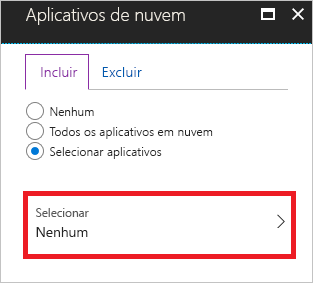
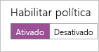

# Início Rápido: Exigir a aceitação dos termos de uso antes de acessar os aplicativos de nuvem

Antes de acessar determinados aplicativos de nuvem em seu ambiente, talvez você queira obter o consentimento dos usuários na forma de aceitar os termos de uso (ToU). O Acesso Condicional do Azure AD (Active Directory do Azure) oferece:

- Um método simples para configurar os termos de uso
- A opção de exigir a aceitar os termos de uso por meio de uma política de Acesso Condicional  

Este início rápido mostra como configurar uma [política de Acesso Condicional do Azure AD](./overview.md) que requer um termo de uso ser aceito para um aplicativo de nuvem selecionado em seu ambiente.

:::image type="content" source="./media/require-tou/5555.png" alt-text="Captura de tela do portal do Azure. Um painel que define uma política chamada Exigir Termos de Uso para Isabella está visível." border="false":::

Se você não tiver uma assinatura do Azure, crie uma [conta gratuita](https://azure.microsoft.com/free/?WT.mc_id=A261C142F) antes de começar.

## Pré-requisitos

Para concluir o cenário deste início rápido, você precisa de:

- **Acesso a uma edição do Azure AD Premium** – o acesso condicional ao Azure AD é um recurso do Azure AD Premium.
- **Uma conta de teste chamada Isabella Simonsen** – caso não saiba como criar uma conta de teste, consulte [Adicionar usuários baseados em nuvem](../fundamentals/add-users-azure-active-directory.md#add-a-new-user).

## Teste seu logon

O objetivo desta etapa é obter uma impressão da experiência de logon sem uma política de Acesso Condicional.

**Para testar seu logon:**

1. Entre no [Portal do Azure](https://portal.azure.com/) como Isabella Simonsen.
1. Saia.

## Criar seus termos de uso

Esta seção fornece as etapas para criar um exemplo de termos de uso. Quando você cria um termos de uso, você seleciona um valor para **impor com modelos de política de Acesso Condicional**. Selecionando **política personalizada** abre a caixa de diálogo para criar uma nova política de Acesso Condicional, assim que seus termos de uso foi criado.

**Para criar seus termos de uso:**

1. No Microsoft Word, crie um novo documento.
1. Digite **meu termos de uso** e, em seguida, salve o documento no seu computador como **mytou.pdf**.
1. Faça login no [portal do Azure](https://portal.azure.com) como administrador global, administrador de segurança ou administrador de acesso condicional.
1. No portal do Azure, na barra de navegação à esquerda, clique em **Azure Active Directory**.

   

1. Na página **Azure Active Directory**, na seção **Segurança**, clique em **Acesso Condicional**.

   

1. Na seção **Gerenciar**, clique em **Termos de uso**.

   :::image type="content" source="./media/require-tou/04.png" alt-text="Captura de tela da seção Gerenciar da página Azure Active Directory. O item Termos de uso está realçado." border="false":::

1. No menu na parte superior, clique em **Novos termos**.

   :::image type="content" source="./media/require-tou/05.png" alt-text="Captura de tela de um menu na página Azure Active Directory. O item Novos termos está realçado." border="false":::

1. Na página **Novos termos de uso**:

   :::image type="content" source="./media/require-tou/112.png" alt-text="Captura de tela da página Novos termos de uso, com o nome, nome de exibição, documento, idioma, acesso condicional e a alternância de termos em expansão realçada." border="false":::

   1. Na caixa de texto **Nome**, digite **Meus Termos de uso**.
   1. Na caixa de texto **Exibir nome**, digite **Meus Termos de uso**.
   1. Carregue seus termos de usar o arquivo de PDF.
   1. Como **Linguagem**, selecione **Inglês**.
   1. Para **Exigir que os usuários expandam os Termos de uso**, selecione **Ativado**.
   1. Para **Impor com modelos da política de Acesso Condicional**, selecione **Políticas personalizadas**.
   1. Clique em **Criar**.

## Criar sua política de acesso condicional

Esta seção mostra como criar a política de acesso condicional necessária. O cenário deste início rápido usa:

- O portal do Azure como espaço reservado para um aplicativo de nuvem que requer seus termos de uso serem aceitos. 
- Seu usuário de exemplo para testar a política de Acesso Condicional.  

Em sua política, defina:

| Configuração | Valor |
| --- | --- |
| Usuários e grupos | Isabella Simonsen |
| Aplicativos na nuvem | Gerenciamento do Microsoft Azure |
| Conceder acesso | Meus termos de uso |

:::image type="content" source="./media/require-tou/1234.png" alt-text="Captura de tela de um painel do portal do Azure que define uma política. As setas indicam que a política concede acesso ao Meus Termos de Uso e inclui um usuário e um aplicativo." border="false":::

**Para configurar sua política de acesso condicional:**

1. Na página **Novo**, na caixa de texto **Nome**, digite **Exige Termos de uso para Isabella**.

   

1. Na seção **Atribuição**, clique em **Usuários e Grupos**.

   :::image type="content" source="./media/require-tou/06.png" alt-text="Captura de tela da seção Atribuições de um painel do portal do Azure que define uma política. O item Usuários e grupos está visível, sem nenhum selecionado." border="false":::

1. Na página **Usuários e grupos**:

   :::image type="content" source="./media/require-tou/24.png" alt-text="Captura de tela da guia Incluir da página Usuários e grupos. Selecionar usuários e grupos está selecionado, assim como Usuários e grupos. Selecionar está realçado." border="false":::

   1. Clique em **Selecionar usuários e grupos** e selecione **Usuários e grupos**.
   1. Clique em **Selecionar**.
   1. Na página **Selecionar**, selecione **Isabella Simonsen** e depois clique em **Selecionar**.
   1. Na página **Usuários e grupos**, clique em **Concluído**.
1. Clique em **Aplicativos de nuvem**.

   :::image type="content" source="./media/require-tou/08.png" alt-text="Captura de tela da seção Atribuições de um painel do portal do Azure que define uma política. O item Aplicativos de nuvem está visível, sem nada selecionado." border="false":::

1. Na página de **aplicativos de nuvem**:

   

   1. Clique em **Selecionar aplicativos**.
   1. Clique em **Selecionar**.
   1. Na página **Selecionar**, selecione **Microsoft Azure** e clique em **Selecionar**.
   1. Na página **Aplicativos de nuvem**, clique em **Concluído**.
1. Na seção **Controles de acesso**, clique em **Conceder**.

   

1. Na página **Grant**:

   

   1. Selecione **Conceder acesso**.
   1. Selecione **Meus Termos de uso**.
   1. Clique em **Selecionar**.
1. Na seção **Habilitar política**, clique em **Ativar**.

   

1. Clique em **Criar**.

## Avaliar uma entrada simulada

Agora que você configurou a política de acesso condicional, provavelmente deseja saber se ela funciona conforme o esperado. Como primeira etapa, use a ferramenta de política What If do Acesso Condicional para simular uma entrada de seu usuário de teste. A simulação calcula o impacto que esse logon tem em suas políticas e gera um relatório de simulação.  

Para inicializar a ferramenta de avaliação de política **What If**, defina:

- **Isabella Simonsen** como usuário
- **Gerenciamento do Microsoft Azure** como aplicativo de nuvem

Ao clicar em **What If**, é criado um relatório de simulação que mostra:

- **Exigir termos de uso para Isabella** sob **políticas que se aplicam**
- **Meus Termos de uso** como **Conceder Controles**.

**Para avaliar sua política de acesso condicional:**

1. Na página [Acesso Condicional – Políticas](https://portal.azure.com/#blade/Microsoft_AAD_IAM/ConditionalAccessBlade/Policies), no menu superior, clique em **What If**.  

   

1. Clique **Usuários**, selecione **Isabella Simonsen** e depois clique em **Selecionar**.

   

1. Para selecionar um aplicativo de nuvem:

   :::image type="content" source="./media/require-tou/16.png" alt-text="Captura de tela da seção Aplicativos de nuvem. O texto indica que um aplicativo está selecionado." border="false":::

   1. Clique em **Aplicativos de nuvem**.
   1. Na **Página de aplicativos de nuvem**, clique em **Selecionar aplicativos**.
   1. Clique em **Selecionar**.
   1. Na página **Selecionar**, selecione **Microsoft Azure** e clique em **Selecionar**.
   1. Na página de aplicativos de nuvem, clique em **Concluído**.
1. Clique em **What If**.

## Teste sua política de acesso condicional

Na seção anterior, você aprendeu como avaliar uma entrada simulada. Além de uma simulação, você também deve testar sua política de acesso condicional para garantir que ela funcione conforme o esperado.

Para testar sua política, tente entrar no seu [portal do Azure](https://portal.azure.com) usando sua conta de teste **Isabella Simonsen**. Você deve ver uma caixa de diálogo que exige que você aceite os termos de uso.

:::image type="content" source="./media/require-tou/57.png" alt-text="Captura de tela de uma caixa de diálogo intitulada termos de uso da Proteção de Segurança de Identidade, com os botões Recusar e Aceitar rotulados Meus Termos de Uso." border="false":::

## Limpar os recursos

Quando não for mais necessário, exclua o usuário de teste e a política de acesso condicional:

- Caso não saiba como excluir um usuário do Azure AD, consulte [Excluir usuários do Azure AD](../fundamentals/add-users-azure-active-directory.md#delete-a-user).
- Para excluir sua política, selecione-a e clique em **Excluir** na barra de ferramentas de acesso rápido.

    :::image type="content" source="./media/require-tou/33.png" alt-text="Captura de tela mostrando uma política chamada Exigir MFA para usuários do portal do Azure. O menu de atalho está visível, com Excluir realçado." border="false":::

- Para excluir os termos de uso, selecione-o e, em seguida, clique em **excluir termos** na barra de ferramentas na parte superior.

    :::image type="content" source="./media/require-tou/29.png" alt-text="Captura de tela mostrando parte de uma tabela que lista documentos de termos de uso. O documento Meus Termos de Uso está visível. No menu, Excluir termos está realçado." border="false":::

## Próximas etapas

> [!div class="nextstepaction"]
> [Exigir MFA para aplicativos específicos](../authentication/tutorial-enable-azure-mfa.md)