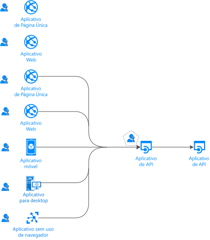
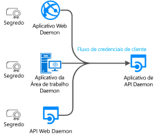
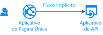
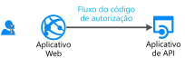
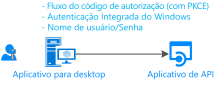
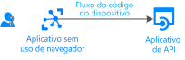
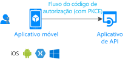
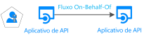

# Fluxos de autenticação e cenários de aplicativos

O ponto de extremidade da plataforma de identidade da Microsoft (v2.0) dá suporte à autenticação para diferentes tipos de arquiteturas de aplicativo modernas. Todas elas são baseadas nos protocolos padrão da indústria [OAuth 2.0 e OpenID Connect](active-directory-v2-protocols.md).  Usando as [bibliotecas de autenticação](reference-v2-libraries.md), os aplicativos autenticam identidades e adquirem tokens para acessar APIs protegidas.

Este artigo descreve os diferentes fluxos de autenticação e os cenários de aplicativos nos quais eles são usados. Este artigo também fornece listas de:
- [Fluxos de autenticação e cenários de aplicativos compatíveis](#scenarios-and-supported-authentication-flows).
- [Cenários de aplicativos e plataformas e linguagens compatíveis](#scenarios-and-supported-platforms-and-languages).

## Categorias de aplicativo

Os tokens podem ser adquiridos de vários tipos de aplicativo, incluindo:

- Aplicativos Web
- Aplicativos móveis
- Aplicativos da área de trabalho
- APIs da Web

Eles também podem ser adquiridos de aplicativos em execução em dispositivos que não têm um navegador ou que estão em execução no IoT.

Os aplicativos podem ser categorizados como na lista a seguir:

- [Recursos protegidos versus aplicativos cliente](#protected-resources-vs-client-applications): Alguns cenários são sobre proteger recursos como aplicativos Web ou APIs Web. Outros cenários são sobre adquirir um token de segurança para chamar uma API Web protegida.
- [Com usuários ou sem usuários](#with-users-or-without-users): Alguns cenários envolvem um usuário conectado; já outros, tais como os cenários de daemon, não envolvem um usuário.
- [Aplicativos de página única, aplicativos cliente públicos e aplicativos cliente confidenciais](#single-page-public-client-and-confidential-client-applications): Essas três são grandes categorias de tipos de aplicativos. Cada uma é usada com diferentes bibliotecas e objetos.
- [Público-alvo para entrada](v2-supported-account-types.md#certain-authentication-flows-dont-support-all-the-account-types): Os fluxos de autenticação disponíveis diferem de acordo com o público-alvo para entrada. Alguns fluxos estão disponíveis apenas para contas corporativas ou de estudante. Alguns estão disponíveis para contas corporativas ou de estudante e também para contas Microsoft pessoais. O público permitido depende dos fluxos de autenticação.
- [Fluxos OAuth 2.0 compatíveis](#scenarios-and-supported-authentication-flows):  Os fluxos de autenticação são usados para implementar os cenários de aplicativos que estão solicitando tokens. Não há um mapeamento individualizado entre cenários de aplicativos e fluxos de autenticação.
- [Plataformas compatíveis](#scenarios-and-supported-platforms-and-languages): Nem todos os cenários de aplicativos estão disponíveis para todas as plataformas.

### Recursos protegidos versus aplicativos cliente

Os cenários de autenticação envolvem duas atividades:

- **Aquisição de tokens de segurança para uma API Web protegida**: A Microsoft recomenda que você use [bibliotecas de autenticação](reference-v2-libraries.md#microsoft-supported-client-libraries) para adquirir tokens, especialmente a família MSAL (Biblioteca de Autenticação da Microsoft).
- **Proteger uma API Web ou um aplicativo Web**: Um desafio de proteger uma API Web ou recurso de aplicativo Web é validar o token de segurança. Em algumas plataformas, a Microsoft oferece [bibliotecas de middleware](reference-v2-libraries.md#microsoft-supported-server-middleware-libraries).

### Com usuários ou sem usuários

A maioria dos cenários de autenticação adquire tokens em nome de usuários conectados.

No entanto, também há cenários de aplicativos daemon, em que os aplicativos adquirem tokens em nome deles próprios, sem usuário.

### Aplicativos de página única, aplicativos cliente públicos e aplicativos cliente confidenciais

Os tokens de segurança podem ser adquiridos de vários tipos de aplicativos. Esses aplicativos tendem a ser divididos em três categorias:

- **Aplicativos de página única**: Também conhecido como SPAs, esses são aplicativos Web nos quais os tokens são adquiridos de um aplicativo JavaScript ou TypeScript em execução no navegador. Muitos aplicativos modernos têm um aplicativo de página única front-end que é escrito principalmente em JavaScript. O aplicativo geralmente usa uma estrutura como Angular, React ou Vue. MSAL.js é a única biblioteca de autenticação da Microsoft que dá suporte a aplicativos de página única.

- **Aplicativos cliente públicos**: Esses aplicativos sempre conectam usuários:
  - Aplicativos da área de trabalho que chamam APIs Web em nome do usuário conectado
  - Aplicativos móveis
  - Aplicativos em execução em dispositivos que não têm um navegador, assim como aqueles em execução em IoT

  Esses aplicativos são representados pela classe [PublicClientApplication](msal-client-applications.md) da MSAL.

- **Aplicativos cliente confidenciais**:
  - Aplicativos Web que chamam uma API Web
  - APIs Web que chamam uma API Web
  - Aplicativos daemon, mesmo quando implementados como um serviço de console, como um daemon no Linux ou um serviço Windows
 
  Esses tipos de aplicativos usam a classe [ConfidentialClientApplication](msal-client-applications.md).

## Cenários de aplicativos

O ponto de extremidade da plataforma de identidade da Microsoft dá suporte à autenticação para diferentes tipos de arquiteturas de aplicativo:

- Aplicativos de página única
- Aplicativos Web
- APIs da Web
- Aplicativos móveis
- Aplicativos nativos
- Aplicativos Daemon
- Aplicativos do lado do servidor

Os aplicativos usam fluxos de autenticação diferentes para conectar usuários e obter tokens para chamar APIs protegidas.

### Um aplicativo de página única

Muitos aplicativos Web modernos são criados como aplicativos de página única do lado do cliente escritos usando JavaScript ou uma estrutura SPA, tal como Angular, Vue.js e React.js. Esses aplicativos são executados em um navegador da Web. As características de autenticação deles diferem das de aplicativos Web do lado do servidor tradicionais. Usando a plataforma de identidade da Microsoft, aplicativos de página única podem conectar usuários e obter tokens para acessar serviços de back-end ou APIs Web.

Para obter mais informações, confira [Aplicativos de página única](scenario-spa-overview.md).

### Um aplicativo Web que está conectando um usuário

Para proteger um aplicativo Web que está conectando um usuário:

- Se desenvolver no .NET, você usará o ASP.NET ou o ASP.NET Core com o middleware ASP.NET Open ID Connect. A proteção de um recurso envolve validar o token de segurança, o que é feito pela biblioteca [Extensões IdentityModel para .NET](https://github.com/AzureAD/azure-activedirectory-identitymodel-extensions-for-dotnet/wiki), não por bibliotecas MSAL.

- Se desenvolve em Node.js, você usa o Passport.js.

Para obter mais informações, confira [Aplicativo Web que conecta os usuários](scenario-web-app-sign-user-overview.md).

### Um aplicativo Web que conecta um usuário e chama uma API Web em nome desse usuário

Para chamar uma API Web de um aplicativo Web em nome de um usuário, use a classe **ConfidentialClientApplication** da MSAL. Você usará o fluxo de código de autorização e armazenará os tokens adquiridos no cache de token. Quando necessário, o MSAL atualiza os tokens e o controlador adquire silenciosamente os tokens do cache.

Para obter mais informações, confira [Um aplicativo Web que chama APIs Web](scenario-web-app-call-api-overview.md).

### Um aplicativo da área de trabalho que chama uma API Web em nome de um usuário conectado

Para que um aplicativo da área de trabalho chame uma API Web que conecta usuários, você usará os métodos de aquisição de tokens interativos da classe **PublicClientApplication** da MSAL. Com esses métodos interativos, é possível controlar a experiência de interface do usuário de entrada. A MSAL usa um navegador da Web para essa interação.

Há outra possibilidade para aplicativos hospedados no Windows em execução em computadores ingressados em um domínio do Windows ou ingressados no Azure AD (Azure Active Directory). Esses aplicativos podem adquirir um token silenciosamente usando a [Autenticação Integrada do Windows](https://aka.ms/msal-net-iwa).

Os aplicativos em execução em um dispositivo sem um navegador continuam podendo chamar uma API em nome de um usuário. Para autenticar, o usuário precisa entrar em outro dispositivo que tem um navegador da Web. Este cenário requer que você use o [fluxo de código do dispositivo](https://aka.ms/msal-net-device-code-flow).

Embora não recomendemos que você o use, o [fluxo de nome de usuário/senha](https://aka.ms/msal-net-up) está disponível em aplicativos cliente públicos. Esse fluxo ainda é necessário em alguns cenários, tais como o DevOps.

Mas o uso desse fluxo impõe restrições em seus aplicativos. Por exemplo, os aplicativos que usam esse fluxo não podem conectar um usuário que precise realizar a autenticação multifator ou acesso condicional. Seus aplicativos também não se beneficiam do logon único.

A autenticação com nome de usuário/senha vai contra os princípios da autenticação moderna e só é oferecido por ser herdado.

Em aplicativos da área de trabalho, se você quiser que o cache de token seja persistente, precisará [personalizar a serialização do cache de token](https://aka.ms/msal-net-token-cache-serialization). Pela implementação da [serialização de cache de token duplo](https://aka.ms/msal-net-dual-cache-serialization), você pode até mesmo habilitar caches de token compatíveis com versões anteriores e posteriores que tenham gerações anteriores de bibliotecas de autenticação. Bibliotecas específicas incluem a ADAL.NET (Biblioteca de Autenticação do Azure AD para .NET) versão 3 e versão 4.

Para obter mais informações, confira [Aplicativo da área de trabalho que chama APIs Web](scenario-desktop-overview.md).

### Um aplicativo móvel que chama uma API Web em nome de um usuário interativo

Semelhante a um aplicativo da área de trabalho, um aplicativo móvel chama os métodos de aquisição de token interativo da classe **PublicClientApplication** da MSAL para adquirir um token para chamar uma API Web.

A MSAL iOS e a MSAL Android usam, por padrão, o navegador da Web do sistema. No entanto, você pode instruí-lo a usar em vez disso a exibição da Web inserida. Existem especificidades que dependem da plataforma móvel: UWP (Plataforma Universal do Windows), iOS ou Android.

Alguns cenários, assim como aqueles que envolvem o acesso condicional relacionado à ID do dispositivo ou um dispositivo que esteja sendo registrado, exigem a instalação de um [agente](https://github.com/AzureAD/azure-activedirectory-library-for-dotnet/wiki/leveraging-brokers-on-Android-and-iOS) no dispositivo. Alguns exemplos de agentes incluem o Portal da Empresa Microsoft no Android e o Microsoft Authenticator no Android e no iOS. Além disso, a MSAL agora pode interagir com agentes.

> [!NOTE]
> Seu aplicativo móvel que usa MSAL.iOS, MSAL.Android ou MSAL.NET no Xamarin pode ter políticas de proteção de aplicativo aplicadas a ele. Por exemplo, as políticas podem impedir que um usuário copie texto protegido. O aplicativo móvel é [gerenciado pelo Intune](https://docs.microsoft.com/intune/app-sdk) e reconhecido pelo Intune como um aplicativo gerenciado. O [SDK do aplicativo do Intune](https://docs.microsoft.com/intune/app-sdk-get-started) é separado das bibliotecas MSAL e interage com o Azure AD por conta própria.

Para obter mais informações, confira [Aplicativo móvel que chama APIs Web](scenario-mobile-overview.md).

### Uma API Web protegida

Você pode usar o ponto de extremidade da plataforma de identidade da Microsoft para proteger serviços Web, tais como a API Web RESTful do aplicativo. Uma API Web protegida é chamada com um token de acesso para proteger os dados da API e autenticar solicitações de entrada. O chamador de uma API Web acrescenta um token de acesso ao cabeçalho de autorização de uma solicitação HTTP.

Se você quiser proteger sua API Web do ASP.NET Core ou ASP.NET, será necessário validar o token de acesso. Para essa validação, você usará o middleware JWT ASP.NET. A validação é feita pela biblioteca [Extensões IdentityModel para .NET](https://github.com/AzureAD/azure-activedirectory-identitymodel-extensions-for-dotnet/wiki), não por MSAL.NET.

Para obter mais informações, confira [API Web protegida](scenario-protected-web-api-overview.md).

### Uma API Web que chama outra API Web em nome de um usuário

Para que a API Web ASP.NET ou ASP.NET Core protegida chame outra API Web em nome de um usuário, o aplicativo precisa adquirir um token para a API Web downstream. Ele faz isso chamando o método de [AcquireTokenOnBehalfOf](https://aka.ms/msal-net-on-behalf-of) da classe **ConfidentialClientApplication**. Essas também são conhecidas como chamadas de serviço para serviço. As APIs Web que chamam outras APIs Web também precisam fornecer serialização de cache personalizada.

  

Para obter mais informações, confira [API Web que chama APIs Web](scenario-web-api-call-api-overview.md).

### Um aplicativo daemon que chama uma API Web no nome do daemon

Os aplicativos com processos de longa duração ou que operam sem interação com um usuário também precisam de uma maneira de acessar APIs Web protegidas. Esse tipo de aplicativo pode autenticar e obter tokens usando a identidade do aplicativo em vez da identidade delegada de um usuário. O aplicativo provar a própria identidade usando um certificado ou o segredo do cliente.

É possível codificar tais aplicativos daemon que adquirem um token para o aplicativo chamador pelo uso dos métodos de aquisição de **credenciais de cliente** da classe [ConfidentialClientApplication](https://aka.ms/msal-net-client-credentials) da MSAL. Esses métodos exigem que o aplicativo chamador tenha registrado um segredo com o Azure AD. Em seguida, o aplicativo compartilha o segredo com o daemon chamado. Exemplos desses segredos incluem senhas de aplicativo, declaração de certificado ou asserção de cliente.

Para obter mais informações, confira [Aplicativo daemon que chama APIs Web](scenario-daemon-overview.md).

## Cenários e fluxos de autenticação com suporte

Os cenários que envolvem a aquisição de tokens também são mapeados para os fluxos de autenticação OAuth 2.0 descritos em detalhes nos [Protocolos da plataforma de identidade da Microsoft](active-directory-v2-protocols.md).

<table>
 <thead>
  <tr><th>Cenário</th> <th>Passo a passo detalhado do cenário</th> <th>Fluxo e concessão do OAuth 2.0</th> <th>Público-alvo</th></tr>
 </thead>
 <tbody>
  <tr>
   <td></td>
   <td><a href="scenario-spa-overview.md">Aplicativo de página única</a></td>
   <td><a href="v2-oauth2-implicit-grant-flow.md">Implícito</a></td>
   <td>Contas corporativas ou de estudante, contas pessoais e Microsoft Azure AD B2C (Azure Active Directory B2C)</td>
 </tr>

  <tr>
   <td></td>
   <td><a href="scenario-web-app-sign-user-overview.md">Aplicativo Web que conecta os usuários</a></td>
   <td><a href="v2-oauth2-auth-code-flow.md">Código de autorização</a></td>
   <td>Contas corporativas ou de estudante, contas pessoais e Azure AD B2C</td>
 </tr>

  <tr>
   <td></td>
   <td><a href="scenario-web-app-call-api-overview.md">Um aplicativo Web que chama as APIs Web</a></td>
   <td><a href="v2-oauth2-auth-code-flow.md">Código de autorização</a></td>
   <td>Contas corporativas ou de estudante, contas pessoais e Azure AD B2C</td>
 </tr>

  <tr>
   <td rowspan="3"></td>
   <td rowspan="4"><a href="scenario-desktop-overview.md">Um aplicativo da área de trabalho que chama as APIs Web</a></td>
   <td>Interativo usando o <a href="v2-oauth2-auth-code-flow.md">Código de Autorização</a> com PKCE</td>
   <td>Contas corporativas ou de estudante, contas pessoais e Azure AD B2C</td>
 </tr>

  <tr>
   <td>Autenticação integrada do Windows</td>
   <td>Contas corporativas ou de estudante</td>
 </tr>

  <tr>
   <td><a href="v2-oauth-ropc.md">Senha de proprietário do recurso</a></td>
   <td>Contas corporativas ou de estudante e Azure AD B2C</td>
 </tr>

  <tr>
   <td></td>
   <td><a href="v2-oauth2-device-code.md">Código do dispositivo</a></td>
   <td>Contas corporativas ou de estudante</td>
 </tr>

 <tr>
   <td rowspan="2"></td>
   <td rowspan="2"><a href="scenario-mobile-overview.md">Um aplicativo móvel que chama as APIs Web</a></td>
   <td>Interativo usando o <a href="v2-oauth2-auth-code-flow.md">Código de Autorização</a> com PKCE</td>
   <td>Contas corporativas ou de estudante, contas pessoais e Azure AD B2C</td>
 </tr>

  <tr>
   <td><a href="v2-oauth-ropc.md">Senha de proprietário do recurso</a></td>
   <td>Contas corporativas ou de estudante e Azure AD B2C</td>
 </tr>

  <tr>
   <td></td>
   <td><a href=scenario-daemon-overview.md">Um aplicativo daemon que chama as APIs Web</a></td>
   <td><a href="v2-oauth2-client-creds-grant-flow.md">Credenciais do cliente</a></td>
   <td>Permissões somente de aplicativo sem usuário e usadas somente em organizações do Azure AD</td>
 </tr>

  <tr>
   <td></td>
   <td><a href=scenario-web-api-call-api-overview.md">Uma API Web que chama as APIs Web</a></td>
   <td><a href="v2-oauth2-on-behalf-of-flow.md">Em nome de</a></td>
   <td>Contas corporativas ou de estudante e contas pessoais</td>
 </tr>

 </tbody>
</table>

## Cenários e plataformas e idiomas com suporte

As bibliotecas de autenticação da Microsoft dão suporte a várias plataformas:

- JavaScript
- .NET Framework
- .NET Core
- Windows 10/UWP
- Xamarin.iOS
- Xamarin.Android
- iOS nativo
- macOS
- Android nativo
- Java
- Python

Você também pode usar várias linguagens para compilar seus aplicativos. Observe que alguns tipos de aplicativos não estão disponíveis em todas as plataformas.

Na coluna Windows da tabela a seguir, cada vez que o .NET Core é mencionado, o .NET Framework também é possível. Esse último é omitido para evitar aglomeração na tabela.

|Cenário  | Windows | Linux | Mac | iOS | Android
|--|--|--|--|--|--|--|
| [Aplicativo de página única](scenario-spa-overview.md)   |  MSAL.js |  MSAL.js |  MSAL.js |  MSAL.js |  MSAL.js
| [Aplicativo Web que conecta os usuários](scenario-web-app-sign-user-overview.md)   |  ASP.NET Core |  ASP.NET Core |  ASP.NET Core
| [Aplicativo Web que chama as APIs Web](scenario-web-app-call-api-overview.md)     |  ASP.NET Core + MSAL.NET   msal4j  Flask + MSAL Python|  ASP.NET Core + MSAL.NET  msal4j  Flask + MSAL Python|  ASP.NET Core + MSAL.NET  msal4j   Flask + MSAL Python
| [Aplicativo da área de trabalho que chama APIs Web](scenario-desktop-overview.md)      | MSAL.NET  msal4j   MSAL Python| MSAL.NET msal4j  MSAL Python| MSAL.NET  msal4j  MSAL Python   MSAL.objc |
| [Aplicativo móvel que chama as APIs Web](scenario-mobile-overview.md)    |  MSAL.NET  MSAL.NET | | |  MSAL.objc |  MSAL.Android
| [Aplicativo daemon](scenario-daemon-overview.md)    | MSAL.NET  msal4j  MSAL Python|  MSAL.NET  msal4j  MSAL Python| MSAL.NET  msal4j  MSAL Python
| [API Web que chama as APIs Web](scenario-web-api-call-api-overview.md)     |  ASP.NET Core + MSAL.NET  msal4j  MSAL Python|  ASP.NET Core + MSAL.NET  msal4j  MSAL Python|  ASP.NET Core + MSAL.NET  msal4j  MSAL Python

Confira também [Bibliotecas compatíveis com a Microsoft por sistema operacional/linguagem de programação](reference-v2-libraries.md#microsoft-supported-libraries-by-os--language).

## Próximas etapas
Saiba mais sobre as [noções básicas de autenticação](authentication-scenarios.md) e os [tokens de acesso](access-tokens.md).
