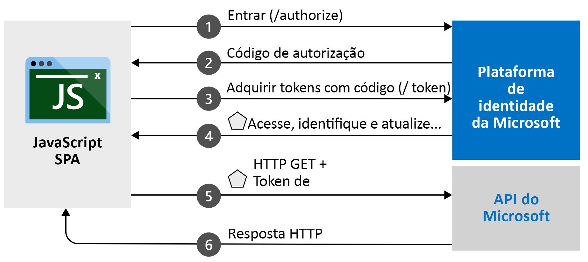

# <a name="quickstart-sign-in-and-get-an-access-token-in-a-react-spa-using-the-auth-code-flow"></a>Início rápido: Conectar e obter um token de acesso em um SPA React usando o fluxo de código de autenticação

Neste guia de início rápido, você baixará e executará um exemplo de código que demonstra como um SPA (aplicativo de página única) JavaScript React pode conectar usuários e chamar o Microsoft Graph usando o fluxo de código de autorização. O exemplo de código demonstra como obter um token de acesso para chamar a API do Microsoft Graph ou qualquer API Web. 

Confira [Como o exemplo funciona](#how-the-sample-works) para ver uma ilustração.

Este início rápido usa o MSAL React com o fluxo de código de autorização. Para ver um início rápido semelhante que usa o MSAL.js com o fluxo implícito, confira [Início rápido: Conectar usuários em aplicativos de página única JavaScript](./quickstart-v2-javascript.md).

> [!IMPORTANT]
> MSAL React [!INCLUDE [PREVIEW BOILERPLATE](../../../includes/active-directory-develop-preview.md)]

## <a name="prerequisites"></a>Pré-requisitos

* Assinatura do Azure – [crie uma assinatura do Azure gratuitamente](https://azure.microsoft.com/free/?WT.mc_id=A261C142F)
* [Node.js](https://nodejs.org/en/download/)
* [Visual Studio Code](https://code.visualstudio.com/download) ou outro editor de código

> [!div renderon="docs"]
> ## <a name="register-and-download-your-quickstart-application"></a>Registrar e baixar o aplicativo de início rápido
> Para iniciar seu aplicativo de início rápido, use qualquer uma das opções a seguir.
>
>
> ### <a name="option-1-express-register-and-auto-configure-your-app-and-then-download-your-code-sample"></a>Opção 1 (Expresso): Registrar e configurar o aplicativo automaticamente e, em seguida, baixar seu exemplo de código
>
> 1. Acesse a experiência de início rápido do <a href="https://portal.azure.com/#blade/Microsoft_AAD_RegisteredApps/ApplicationsListBlade/quickStartType/JavascriptSpaQuickstartPage/sourceType/docs" target="_blank">portal do Azure – Registros de aplicativo</a>.
> 1. Insira um nome para seu aplicativo.
> 1. Em **Tipos de conta com suporte**, selecione **Contas em qualquer diretório organizacional e contas pessoais da Microsoft**.
> 1. Selecione **Registrar**.
> 1. Acesse o painel do início rápido e siga as instruções para baixar e configurar automaticamente seu novo aplicativo.
>
> ### <a name="option-2-manual-register-and-manually-configure-your-application-and-code-sample"></a>Opção 2 (Manual): Registrar e configurar manualmente o aplicativo e o exemplo de código
>
> #### <a name="step-1-register-your-application"></a>Etapa 1: Registre seu aplicativo
>
> 1. Entre no <a href="https://portal.azure.com/" target="_blank">portal do Azure</a>.
> 1. Se você tem acesso a vários locatários, use o filtro **Diretório + assinatura** :::image type="icon" source="./media/common/portal-directory-subscription-filter.png" border="false"::: no menu superior para selecionar o locatário no qual você deseja registrar um aplicativo.
> 1. Pesquise **Azure Active Directory** e selecione-o.
> 1. Em **Gerenciar**, selecione **Registros de aplicativo** > **Novo registro**.
> 1. Quando a página **Registrar um aplicativo** aparecer, insira um nome para o seu aplicativo.
> 1. Em **Tipos de conta com suporte**, selecione **Contas em qualquer diretório organizacional e contas pessoais da Microsoft**.
> 1. Selecione **Registrar**. Na página **Visão geral** do aplicativo, anote o valor de **ID do aplicativo (cliente)** para uso posterior.
> 1. Em **Gerenciar**, selecione **Autenticação**.
> 1. Em **Configurações da plataforma**, selecione **Adicionar uma plataforma**. No painel que é aberto, selecione **Aplicativo de página única**.
> 1. Defina o valor **URIs de Redirecionamento** como `http://localhost:3000/`. Essa é a porta padrão que o NodeJS escutará em seu computador local. Retornaremos a resposta de autenticação para esse URI após a autenticação bem-sucedida do usuário. 
> 1. Selecione **Configurar** para aplicar as alterações.
> 1. Em **Configurações da Plataforma**, expanda **Aplicativo de página única**.
> 1. Confirme que, em **Tipos de concessão** , Seu URI de Redirecionamento seja qualificado para o Fluxo de Código de Autorização com PKCE.

> [!div class="sxs-lookup" renderon="portal"]
> #### <a name="step-1-configure-your-application-in-the-azure-portal"></a>Etapa 1: Configurar seu aplicativo no portal do Azure
> Para que o exemplo de código deste guia de início rápido funcione, adicione um **URI de Redirecionamento** igual a `http://localhost:3000/`.
> > [!div renderon="portal" id="makechanges" class="nextstepaction"]
> > [Fazer essas alterações para mim]()
>
> > [!div id="appconfigured" class="alert alert-info"]
> >  Seu aplicativo já está configurado com esses atributos.

#### <a name="step-2-download-the-project"></a>Etapa 2: Baixe o projeto

> [!div renderon="docs"]
> Para executar o projeto com um servidor Web usando Node.js, [baixe os arquivos de projeto de núcleo](https://github.com/Azure-Samples/ms-identity-javascript-react-spa/archive/main.zip).

> [!div renderon="portal" class="sxs-lookup"]
> Executar o projeto com um servidor Web usando o Node.js

> [!div renderon="portal" class="sxs-lookup" id="autoupdate" class="nextstepaction"]
> [Baixe o exemplo de código](https://github.com/Azure-Samples/ms-identity-javascript-react-spa/archive/main.zip)

> [!div renderon="docs"]
> #### <a name="step-3-configure-your-javascript-app"></a>Etapa 3: Configurar o aplicativo JavaScript
>
> Na pasta *src*, abra o arquivo *authConfig.js* e atualize os valores `clientID`, `authority` e `redirectUri` no objeto `msalConfig`.
>
> ```javascript
> /**
> * Configuration object to be passed to MSAL instance on creation. 
> * For a full list of MSAL.js configuration parameters, visit:
> * https://github.com/AzureAD/microsoft-authentication-library-for-js/blob/dev/lib/msal-browser/docs/configuration.md 
> */
> export const msalConfig = {
>    auth: {
>        clientId: "Enter_the_Application_Id_Here",
>        authority: "Enter_the_Cloud_Instance_Id_HereEnter_the_Tenant_Info_Here",
>        redirectUri: "Enter_the_Redirect_Uri_Here"
>    },
>    cache: {
>        cacheLocation: "sessionStorage", // This configures where your cache will be stored
>        storeAuthStateInCookie: false, // Set this to "true" if you are having issues on IE11 or Edge
>    },
> ```

> [!div renderon="portal" class="sxs-lookup"]
> > [!NOTE]
> > `Enter_the_Supported_Account_Info_Here`

> [!div renderon="docs"]
>
> Modifique os valores na seção `msalConfig` conforme descrito aqui:
>
> - `Enter_the_Application_Id_Here` é a **ID do aplicativo (cliente)** que você registrou.
>
>    Para encontrar os valores de **ID do aplicativo (cliente)** , ID de diretório (locatário), acesse a página **Visão Geral** do aplicativo no portal do Azure.
> - `Enter_the_Cloud_Instance_Id_Here` é a instância da nuvem do Azure. Para a nuvem principal ou global do Azure, insira `https://login.microsoftonline.com/`. Para nuvens **nacionais** (por exemplo, China), confira [Nuvens nacionais](authentication-national-cloud.md).
> - `Enter_the_Tenant_info_here` é definido como uma das seguintes opções:
>   - Se o aplicativo tem suporte para *contas neste diretório organizacional*, substitua esse valor pela **ID do locatário** ou pelo **Nome do locatário**. Por exemplo, `contoso.microsoft.com`.
>
>    Para encontrar o valor da **ID do Aplicativo (locatário)** , acesse a página **Visão Geral** do registro do aplicativo no portal do Azure.
>   - Se o aplicativo tem suporte para *contas em qualquer diretório organizacional*, substitua esse valor por `organizations`.
>   - Se o seu aplicativo tem suporte para *contas em qualquer diretório organizacional e contas pessoais Microsoft*, substitua esse valor por `common`. **Para este início rápido**, use `common`.
>   - Para restringir o suporte a *contas pessoais da Microsoft*, substitua esse valor por `consumers`.
>
>    Para encontrar o valor dos **Tipos de conta com suporte**, acesse a página **Visão Geral** do registro de aplicativo no portal do Azure.
> - `Enter_the_Redirect_Uri_Here` é `http://localhost:3000/`.
>
> O valor de `authority` em *authConfig.js* deverá ser semelhante ao seguinte se você estiver usando a nuvem principal (global) do Azure:
>
> ```javascript
> authority: "https://login.microsoftonline.com/common",
> ```
>
> [!div class="sxs-lookup" renderon="portal"]
> #### <a name="step-3-your-app-is-configured-and-ready-to-run"></a>Etapa 3: seu aplicativo está configurado e pronto para ser executado
> Configuramos seu projeto com os valores das propriedades do seu aplicativo.

> [!div renderon="docs"]
>
> Role para baixo no mesmo arquivo e atualize o `graphMeEndpoint`. 
> - Substitua a cadeia de caracteres `Enter_the_Graph_Endpoint_Herev1.0/me` por `https://graph.microsoft.com/v1.0/me`
> - `Enter_the_Graph_Endpoint_Herev1.0/me` é o ponto de extremidade no qual as chamadas à API serão feitas. Para o serviço da API do Microsoft Graph principal (global), insira `https://graph.microsoft.com/` (inclua a barra à direita). Para obter mais informações, confira a [documentação](/graph/deployments).
>
>
>
> ```javascript
>   // Add here the endpoints for MS Graph API services you would like to use.
>    export const graphConfig = {
>        graphMeEndpoint: "Enter_the_Graph_Endpoint_Herev1.0/me"
>    };
> ```
>
>
#### <a name="step-4-run-the-project"></a>Etapa 4: Executar o projeto

Execute o projeto com um servidor Web usando o Node.js:

1. Para iniciar o servidor, execute os seguintes comandos no diretório do projeto:
    ```console
    npm install
    npm start
    ```
1. Navegue até `http://localhost:3000/`.

1. Selecione **Entrar** para iniciar o processo de conexão e chame a API do Microsoft Graph.

    Na primeira vez em que entrar, você deverá fornecer seu consentimento para permitir que o aplicativo acesse seu perfil e conecte você. Depois que você tiver entrado com êxito, clique em **Solicitar Informações do Perfil** para exibir as informações do seu perfil na página.

## <a name="more-information"></a>Mais informações

### <a name="how-the-sample-works"></a>Como o exemplo funciona



### <a name="msaljs"></a>msal.js

A biblioteca MSAL.js conecta usuários e solicita os tokens que são usados para acessar uma API protegida pela plataforma de identidade da Microsoft.

Se tiver instalado o Node.js, você poderá baixar a versão mais recente usando o npm (Gerenciador de Pacotes do Node.js):

```console
npm install @azure/msal-browser @azure/msal-react
```

## <a name="next-steps"></a>Próximas etapas

Para obter um guia passo a passo detalhado sobre como criar o aplicativo de fluxo de código usando o Vanilla JavaScript, confira o seguinte tutorial:

> [!div class="nextstepaction"]
> [Tutorial para entrar e chamar o MS Graph](./tutorial-v2-javascript-auth-code.md)