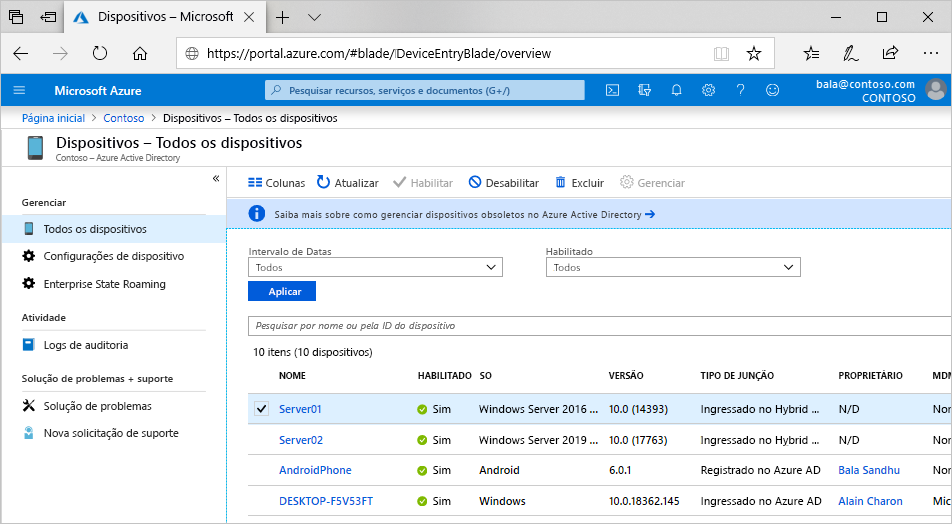

# O que é uma identidade do dispositivo?

Devido à proliferação de dispositivos de todos os tipos e tamanhos e ao conceito de BYOD (Traga seu próprio dispositivo), os profissionais de TI vêm se deparando com duas metas ligeiramente opostas:

- Capacitar os usuários finais para serem produtivos em qualquer situação e em qualquer lugar
- Proteger os ativos da organização

Para proteger esses ativos, a equipe de TI precisa primeiro gerenciar as identidades dos dispositivos. Eles podem usar a identidade do dispositivo como base em ferramentas como o Microsoft Intune para garantir o atendimento aos padrões de segurança e conformidade. O Azure AD (Azure Active Directory) permite o logon único em dispositivos, aplicativos e serviços em qualquer lugar por meio desses dispositivos.

- Seus usuários podem obter acesso aos ativos da organização de que precisam. 
- A equipe de TI obtém os controles de que precisam para proteger sua organização.

O gerenciamento de identidades do dispositivo também é a base para o [Acesso Condicional com base em dispositivos](../conditional-access/require-managed-devices.md). Com as políticas de Acesso Condicional baseadas em dispositivos, é possível garantir que o acesso a recursos em seu ambiente seja feita apenas por dispositivos gerenciados.

## Obter dispositivos no Azure AD

Há várias opções para colocar um dispositivo no Azure AD:

- **Registrado no Azure AD**
   - Os dispositivos que estão registrados no Azure AD normalmente são dispositivos móveis ou de propriedade pessoal e são conectados usando uma conta Microsoft pessoal ou outra conta local.
      - Windows 10
      - iOS
      - Android
      - MacOS
- **Ingressado no Azure AD**
   - Os dispositivos que estão ingressados no Azure AD são de propriedade de uma organização e são conectados usando uma conta do Azure AD que pertence a essa organização. Elas existem somente na nuvem.
      - Windows 10 
      - [Máquinas Virtuais do Windows Server 2019 em execução no Azure](howto-vm-sign-in-azure-ad-windows.md) (não há suporte para Server Core)
- **Ingressado no Azure AD híbrido**
   - Os dispositivos ingressados no Azure AD híbrido são de propriedade de uma organização e são conectados usando uma conta do Active Directory Domain Services que pertence a essa organização. Eles existem na nuvem e localmente.
      - no Windows 7, 8.1 ou 10
      - no Windows Server 2008 ou mais recente

> [!NOTE]
> Um estado híbrido refere-se a mais do que apenas o estado de um dispositivo. Para que um estado híbrido seja válido, um usuário válido do Azure AD também é necessário.

## Gerenciamento de dispositivos

Os dispositivos no Azure AD podem ser gerenciados usando ferramentas de MDM (Gerenciamento de Dispositivo Móvel), como o Microsoft Intune, o Microsoft Endpoint Configuration Manager ou a Política de Grupo (ingresso no Azure AD híbrido), ferramentas de MAM (Gerenciamento de Aplicativo Móvel) ou outras ferramentas de terceiros.

## Acesso a recursos

Registrar e ingressar dispositivos no Azure AD oferece aos usuários o SSO (logon contínuo) para recursos de nuvem. Esse processo também permite aos administradores a capacidade de aplicar políticas de Acesso Condicional a recursos com base no dispositivo do qual elas são acessadas. 

> [!NOTE]
> As políticas de Acesso Condicional com base no dispositivo exigem dispositivos ingressados no Azure AD híbridos ou dispositivos registrados no Azure AD em conformidade ou dispositivos registrados do Azure AD.

O PRT (token de atualização principal) contém informações sobre o dispositivo e é necessário para o SSO. Se você tiver uma política de acesso condicional baseada em dispositivo definida em um aplicativo, sem o PRT, o acesso será negado. As políticas de acesso condicional híbrido exigem um dispositivo de estado híbrido e um usuário válido que esteja conectado.

Os dispositivos ingressados no Azure AD ou no Azure AD híbrido beneficiam-se do SSO nos recursos locais da sua organização e nos recursos de nuvem. Saiba mais no artigo [Como funciona o SSO em recursos locais para dispositivos ingressados no Azure AD](azuread-join-sso.md).

## Segurança do dispositivo

- Os **dispositivos registrados no Azure AD** utilizam uma conta gerenciada pelo usuário final; essa conta é uma conta Microsoft ou outra credencial gerenciada localmente e protegida com uma ou mais das opções a seguir.
   - Senha
   - PIN
   - Padrão
   - Windows Hello
- Os **dispositivos ingressados no Azure AD ou no Azure AD híbrido** utilizam uma conta organizacional no Azure AD protegida com uma ou mais das opções a seguir.
   - Senha
   - Windows Hello for Business

## Provisionamento

A obtenção de dispositivos no Azure AD pode ser feita como autoatendimento ou por um processo de provisionamento controlado pelos administradores.

## Resumo

Com o gerenciamento de identidade do dispositivo no Azure AD, é possível:

- Simplificar o processo de colocar e gerenciar dispositivos no Azure AD
- Fornecer aos usuários um acesso fácil de usar a recursos baseados em nuvem da sua organização

## Requisitos de licença

[!INCLUDE [Active Directory P1 license](../../../includes/active-directory-p1-license.md)]

## Próximas etapas

- Saiba mais sobre [dispositivos registrados no Azure AD](concept-azure-ad-register.md)
- Saiba mais sobre [dispositivos ingressados no Azure AD](concept-azure-ad-join.md)
- Saiba mais sobre [dispositivos ingressados no Azure AD híbrido](concept-azure-ad-join-hybrid.md)
- Confira uma visão geral de como gerenciar identidades de dispositivo no portal do Azure em [Gerenciar identidades de dispositivo usando o portal do Azure](device-management-azure-portal.md).
- Para saber mais sobre o acesso condicional baseado em dispositivo, confira [Configurar as políticas de Acesso Condicional com base em dispositivo do Azure Active Directory](../conditional-access/require-managed-devices.md).
