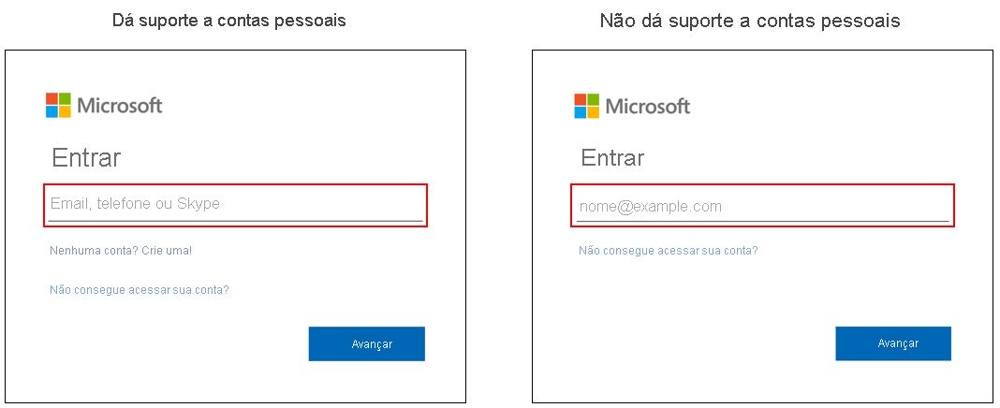

# Opções de entrada para contas Microsoft no Azure Active Directory

A página de entrada do Microsoft 365 para Azure AD (Azure Active Directory) dá suporte a contas corporativas ou de estudante e contas Microsoft, mas, dependendo da situação do usuário, ela pode ser uma ou outra ou ambas. Por exemplo, a página de entrada do Azure AD dá suporte a:

* Aplicativos que aceitam entradas de ambos os tipos de conta
* Organizações que aceitam convidados

## Identificação
Você pode saber se a página de entrada que sua organização usa dá suporte a contas Microsoft examinando o texto de dica no campo de nome de usuário. Se o texto de dica diz "Email, telefone ou Skype", a página de entrada dá suporte a contas Microsoft.

[As opções de entrada adicionais só funcionam para contas pessoais da Microsoft](https://azure.microsoft.com/updates/microsoft-account-signin-options/ ), mas não podem ser usadas para entrar em recursos de conta corporativa ou de estudante.

## Próximas etapas

[Personalizar sua identidade visual de entrada](../fundamentals/add-custom-domain.md)