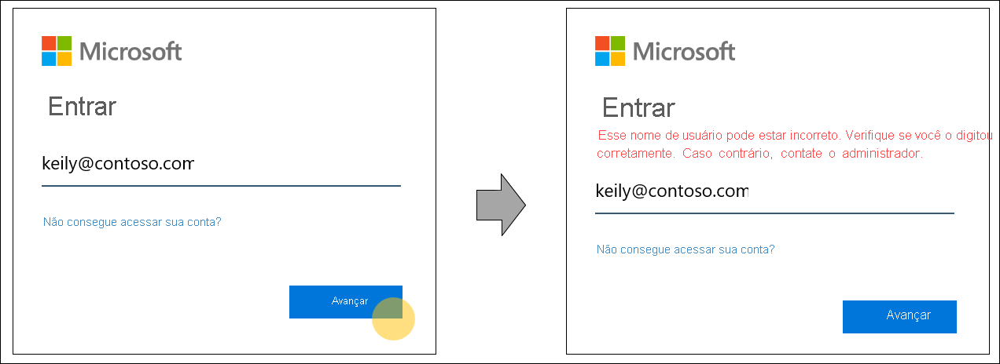
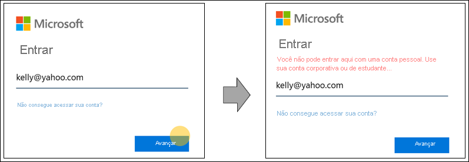
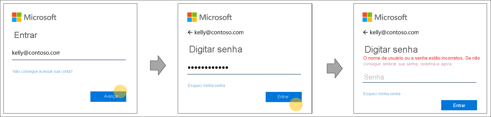

# Descoberta de realm inicial para páginas de entrada do Azure Active Directory

Estamos alterando nosso comportamento de entrada do Azure AD (Azure Active Directory) para liberar espaço para novos métodos de autenticação e aprimorar a usabilidade. Durante a entrada, o Azure AD determina onde um usuário precisa se autenticar. O Azure AD toma decisões inteligentes lendo as configurações da organização e do usuário para o nome de usuário inserido na página de entrada. Este é um passo rumo a um futuro sem senha que permite credenciais adicionais como FIDO 2.0.

## Comportamento de descoberta de realm inicial

Historicamente, a descoberta de realm inicial foi regida pelo domínio que é fornecido na entrada ou por uma política de Descoberta de Realm Inicial para alguns aplicativos herdados. Por exemplo, em nosso comportamento de descoberta, um usuário do Azure Active Directory poderia digitar o nome de usuário incorretamente, mas ainda acessaria a tela de coleta de credenciais de sua organização. Isso ocorre quando o usuário fornece corretamente o nome de domínio da organização "contoso.com". Esse comportamento não permite a granularidade de personalizar experiências para um usuário individual.

Para dar suporte a uma variedade maior de credenciais e aumentar a usabilidade, o comportamento de pesquisa de nome de usuário do Azure Active Directory durante o processo de entrada foi atualizado. O novo comportamento toma decisões inteligentes lendo as configurações de nível da organização e do usuário com base no nome de usuário inserido na página de entrada. Para tornar isso possível, o Azure Active Directory verificará se o nome de usuário inserido na página de entrada existe no domínio especificado ou redireciona o usuário para fornecer as credenciais dele.

Um benefício adicional desse trabalho é o sistema de mensagens de erro aprimorado. Veja alguns exemplos do sistema de mensagens de erro aprimorado ao entrar em um aplicativo que dá suporte apenas a usuários do Azure Active Directory.

- O nome de usuário foi digitado incorretamente ou ainda não foi sincronizado com o Azure AD:
  
    
  
- O nome de domínio foi digitado incorretamente:
  
    
  
- O usuário tenta entrar com um domínio de consumidor conhecido:
  
    
  
- A senha foi digitada incorretamente, mas o nome de usuário está correto:  
  
    
  
> [!IMPORTANT]
> Esse recurso pode ter um impacto em domínios federados que dependem da Descoberta de Realm Inicial no nível de domínio antigo para forçar a federação. Para obter atualizações sobre quando o suporte a domínio federado será adicionado, confira [Descoberta de realm inicial durante a entrada para os serviços do Microsoft 365](https://azure.microsoft.com/updates/signin-hrd/). Enquanto isso, algumas organizações treinaram os funcionários para entrar com um nome de usuário que não existe no Azure Active Directory, mas contém o nome de domínio apropriado, pois os nomes de domínio roteiam os usuários no momento para o ponto de extremidade de domínio da organização. O novo comportamento de entrada não permite isso. O usuário é notificado para corrigir o nome de usuário e não tem permissão para entrar com um nome de usuário que não existe no Azure Active Directory.
>
> Se você ou sua organização tiver práticas que dependem do comportamento antigo, é importante que os administradores da organização atualizem a documentação de entrada e de autenticação de funcionários e os treinem para usar o nome de usuário do Azure Active Directory deles para entrar.
  
Se você tiver preocupações com o novo comportamento, deixe seus comentários na seção **Comentários** deste artigo.  

## Próximas etapas

[Personalizar sua identidade visual de entrada](../fundamentals/add-custom-domain.md)
