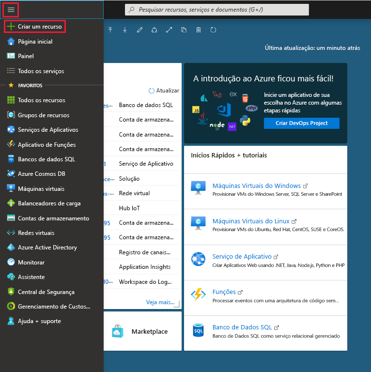
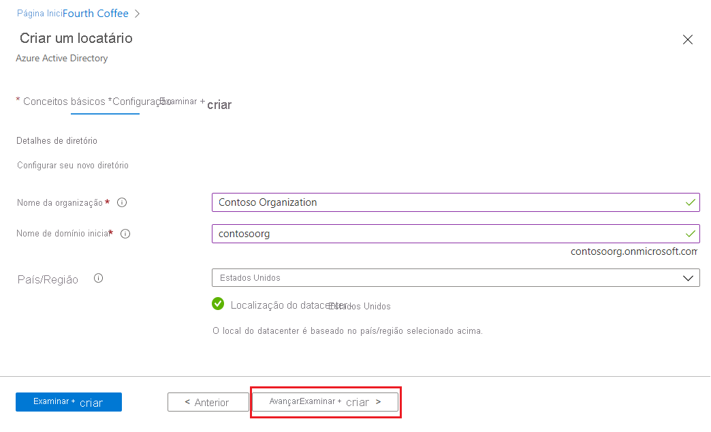
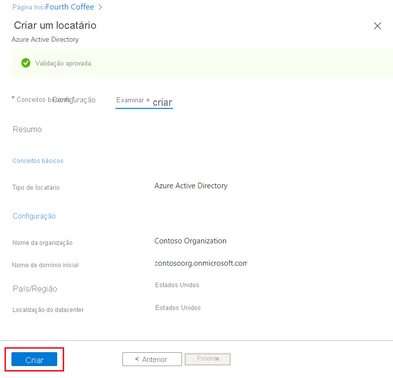

# Início Rápido: Crie um novo locatário no Azure Active Directory
É possível realizar todas as tarefas administrativas usando o portal do Azure AD (Azure Active Directory), incluindo a criação de um novo locatário para a organização. 

Neste início rápido, você aprenderá a acessar o portal do Azure e o Azure Active Directory e a criar um locatário básico para a organização.

Se você não tiver uma assinatura do Azure, crie uma [conta gratuita](https://azure.microsoft.com/free/) antes de começar.

## Criar um novo locatário para a organização
Após entrar no portal do Azure, é possível criar um novo locatário para a organização. O novo locatário representa a organização e ajuda a gerenciar uma instância específica dos serviços em nuvem da Microsoft para usuários internos e externos.

### Criar um novo locatário

1. Entre no [portal do Azure](https://portal.azure.com/) da sua organização.

1. No menu do portal do Azure, selecione **Azure Active Directory**.  

    <kbd></kbd>  

1. Selecione **Criar um locatário**.

1. Na guia Noções Básicas, selecione o tipo de locatário que você deseja criar, seja **Azure Active Directory** ou **Azure Active Directory (B2C)** .

1. Selecione **Avançar: Configuração** para passar para a guia Configuração.

    <kbd></kbd>

1.  Na guia Configuração, insira as seguintes informações:
    
    - Digite _Organização da Contoso_ na caixa **Nome da organização**.

    - Digite _Contosoorg_ na caixa **Nome de domínio inicial**.

    - Mantenha a opção _Estados Unidos_ na caixa **País ou região** box.

1. Selecione **Avançar: Examinar + Criar**. Examine as informações inseridas e, se elas estiverem corretas, selecione **criar**.

    <kbd></kbd>

O novo locatário será criado com o domínio contoso.onmicrosoft.com.

## Limpar os recursos
Se você não quiser continuar usando este aplicativo, poderá excluir o locatário seguindo estas etapas:

- Verifique se você está conectado ao diretório que deseja excluir por meio do filtro **Directory + assinatura** no portal do Azure e alterne para o diretório de destino, se necessário.
- Selecione **Azure Active Directory** e na página **Contoso – Visão geral**, selecione **Excluir diretório**.

    O locatário e suas informações associadas serão excluídos.

    <kbd></kbd>

## Próximas etapas
- Para alterar ou adicionar nomes de domínio, confira [Como adicionar um nome de domínio personalizado ao Azure Active Directory](add-custom-domain.md)

- Para adicionar usuários, confira [Adicionar ou excluir um novo usuário](add-users-azure-active-directory.md)

- Para adicionar grupos e membros, confira [Criar um grupo básico e adicionar membros](active-directory-groups-create-azure-portal.md)

- Saiba mais sobre o [acesso baseado em função usando o Privileged Identity Management](../../role-based-access-control/best-practices.md) e o [Acesso Condicional](../../role-based-access-control/conditional-access-azure-management.md) para ajudar a gerenciar o acesso a aplicativos e recursos da organização.

- Saiba mais sobre o Azure AD, incluindo [informações básicas de licenciamento, terminologia e recursos associados](active-directory-whatis.md).
