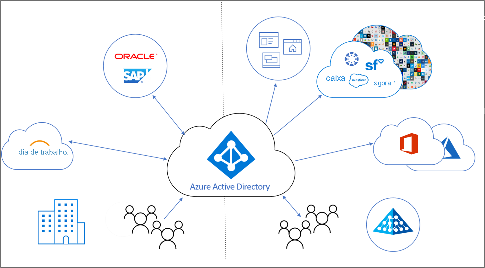

# O que é o gerenciamento do ciclo de vida de identidades?

O Identity Governance ajuda as organizações a alcançar um equilíbrio entre produtividade – Com que rapidez uma pessoa pode ter acesso aos recursos de que precisa, por exemplo, quando entra em minha organização? E segurança – Como o acesso deve mudar ao longo do tempo, como devido a alterações ao status de emprego da pessoa?

O **gerenciamento do ciclo de vida de identidades** é a base para o Identity Governance e a governança efetiva em escala requer modernizar a infraestrutura de gerenciamento do ciclo de vida de identidades para aplicativos. O objetivo do Gerenciamento do Ciclo de Vida de Identidades é automatizar e gerenciar todo o processo de ciclo de vida de identidade digital. 

## O que é uma identidade digital?

Uma identidade digital é uma informação em uma entidade usada por um ou mais recursos de computação, como sistemas operacionais ou aplicativos. Essas entidades podem representar pessoas, organizações, aplicativos ou dispositivos.  A identidade geralmente é descrita pelos atributos associados a ela, como o nome, identificadores e propriedades, como funções usadas para gerenciamento de acesso.  Esses atributos ajudam os sistemas a fazer as determinações, que têm acesso ao que e a quem tem permissão para usar esse ou aquele sistema.  

## Gerenciar o ciclo de vida de identidades digitais

O gerenciamento de identidades digitais é uma tarefa complexa, principalmente como ele relaciona a correlação de objetos do mundo real, como uma pessoa e seu relacionamento com uma organização, como um funcionário da organização, com uma representação digital.    Em pequenas organizações, manter a representação digital de indivíduos que exigem uma identidade pode ser um processo manual – quando alguém é contratado ou um prestador chega, um especialista em TI pode criar uma conta para eles em um diretório e atribuir a eles o acesso de que precisam.  No entanto, em organizações de médio e grande porte, a automação pode permitir que a organização seja escalada com mais eficiência e mantenha as identidades precisas.

O processo típico para estabelecer o gerenciamento do ciclo de vida de identidades em uma organização segue estas etapas:

1. Determinar se já existem sistemas de registro: fontes de dados que a organização trata como autoritativa.  Por exemplo, a organização pode ter um sistema de RH Workday e esse sistema é autoritativo para fornecer a lista atual de funcionários e algumas propriedades deles, como o nome ou o departamento do funcionário.  Ou um sistema de email, como o Exchange Online, pode ser autoritativo para um endereço de email do funcionário.

2. Conecte esses sistemas de registro a um ou mais diretórios e bancos de dados usados por aplicativos e resolva inconsistências entre os diretórios e os sistemas de registro. Por exemplo, um diretório pode ter dados obsoletos, como uma conta de um ex-funcionário, que não sejam mais necessários. 

3. Determine quais processos podem ser usados para fornecer informações autorizadas na ausência de um sistema de registro.  Por exemplo, se houver identidades digitais além de visitantes, mas a organização não tiver nenhum banco de dados para visitantes, poderá ser necessário encontrar uma forma alternativa de determinar quando uma identidade digital para um visitante não seja mais necessária.

4. Faça a configuração das alterações do sistema de registro ou de outros processos para que sejam replicadas para cada um dos diretórios ou bancos de dados que exigem uma atualização.

## Gerenciamento do ciclo de vida de identidades para representar funcionários e outros indivíduos com uma relação organizacional

Ao planejar o gerenciamento do ciclo de vida de identidades para funcionários ou outros indivíduos com uma relação organizacional, como um empreiteiro ou aluno, muitas organizações modelam o processo "ingressar, mover e sair".  Eles são:
    
   - Ingressar – quando um indivíduo entra no escopo da necessidade de acesso, uma identidade é exigida por esses aplicativos, portanto, uma nova identidade digital talvez precise ser criada se ainda não houver uma disponível
   - Mover – quando uma pessoa se move entre limites, que exigem autorizações de acesso adicionais a serem adicionadas ou removidas à sua identidade digital
   - Sair – quando uma pessoa sai do escopo de necessidade de acesso, talvez o acesso precise ser removido e, subsequentemente, a identidade pode não ser mais exigida por aplicativos que não sejam para fins de auditoria ou forenses

Por exemplo, se um novo funcionário ingressar em sua organização, que nunca foi afiliado à sua organização antes, esse funcionário precisará de uma nova identidade digital, representada como uma conta de usuário no Azure AD.  A criação dessa conta se enquadraria em um processo "Ingressar", que poderia ser automatizado se houvesse um sistema de registro como o Workday que pudesse indicar quando o novo funcionário começaria a trabalhar.  Mais tarde, se sua organização tiver um funcionário que mudou, digamos, do departamento de Vendas para o de Marketing, ele se enquadrará em um processo "Mover".  Isso exigiria a remoção dos direitos de acesso que ele tinha na organização Vendas, que não é mais necessário, e a concessão de direitos na organização Marketing de que ele precisa agora.

## Gerenciamento do ciclo de vida de identidades para convidados

Processos semelhantes também são necessários para convidados e outros usuários.  O gerenciamento de direitos do Azure AD utiliza o Azure AD B2B (entre empresas) para fornecer os controles de ciclo de vida necessários para fazer colaboração com pessoas de fora da sua organização que exigem acesso aos recursos da sua organização. Com o Azure AD B2B, os usuários externos fazem a autenticação em seu diretório base, mas têm uma representação em seu diretório. A representação em seu diretório permite que o usuário receba acesso aos seus recursos.  O gerenciamento de direitos permite que pessoas de fora da sua organização solicitem acesso, criando uma identidade digital para elas, conforme necessário. Essas identidades digitais são removidas automaticamente quando o usuário perde o acesso.  

## Como o Azure AD automatiza o gerenciamento do ciclo de vida de identidades?

No momento, o Azure AD fornece estes recursos:

* Usuários que representam funcionários podem ser criados e atualizados automaticamente no Azure AD e no Active Directory usando o [provisionamento controlado por RH](what-is-hr-driven-provisioning.md)
* Os usuários já presentes no Active Directory podem ser criados e mantidos automaticamente no Azure AD usando o [provisionamento entre diretórios](what-is-inter-directory-provisioning.md)
* Os usuários podem ser atribuídos automaticamente a grupos com base nas propriedades deles, usando [grupos dinâmicos](../external-identities/use-dynamic-groups.md#what-are-dynamic-groups), e podem, mediante solicitação, ser atribuídos a grupos, ao Teams, a funções do Azure AD, a funções de recursos do Azure e sites do SharePoint Online, usando o [gerenciamento de direitos](entitlement-management-scenarios.md) e o [Privileged Identity Management](../privileged-identity-management/pim-configure.md)
* As atualizações para os usuários podem ser enviadas automaticamente a mais aplicativos usando o [provisionamento de aplicativos](what-is-app-provisioning.md)

## Próximas etapas 

- [O que é provisionamento?](what-is-provisioning.md)
- [Controlar o acesso para usuários externos no gerenciamento de direitos do Azure AD](./entitlement-management-external-users.md)
- [O que é provisionamento controlado por RH?](what-is-hr-driven-provisioning.md)
- [O que é provisionamento de aplicativos?](what-is-app-provisioning.md)
- [O que é provisionamento entre diretórios?](what-is-inter-directory-provisioning.md)