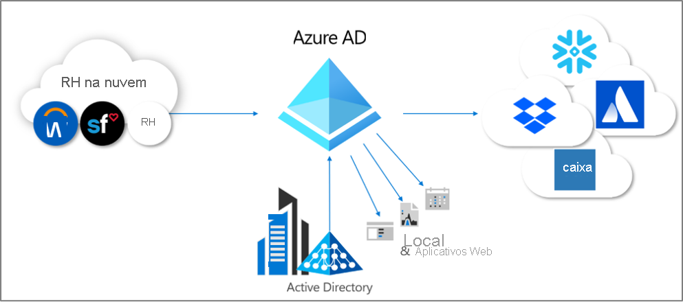
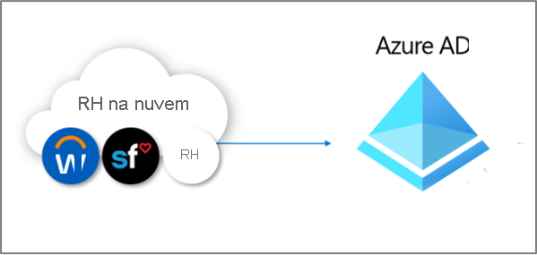
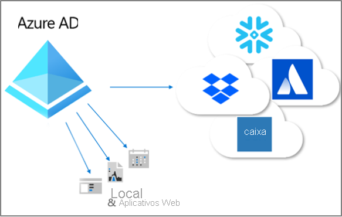

# O que é provisionamento?

O provisionamento e o desprovisionamento são os processos que garantem a consistência das identidades digitais em vários sistemas.  Esses processos normalmente são aproveitados como parte do [gerenciamento do ciclo de vida de identidades](what-is-identity-lifecycle-management.md).

O **provisionamento** é o processo de criação de uma identidade em um sistema de destino com base em determinadas condições.  O **desprovisionamento** é o processo de remover a identidade do sistema de destino quando as condições não são mais atendidas. A **sincronização** é o processo de manter o objeto provisionado atualizado para que o objeto de origem e o objeto de destino sejam semelhantes.

Por exemplo, quando um novo funcionário ingressa em sua organização, esse funcionário é inserido no sistema de RH.  Nesse ponto, o provisionamento de **do** RH **para** o Azure AD (Azure Active Directory) pode criar uma conta de usuário correspondente no Azure AD. Os aplicativos que consultam o Azure AD podem ver a conta desse novo funcionário.  Se houver aplicativos que não usam o Azure AD, o provisionamento **do** Azure AD **para** bancos de dados de aplicativos garantirá que o usuário possa acessar todos os aplicativos aos quais o usuário precisa de acesso.  Esse processo permite que o usuário inicie o trabalho e tenha acesso aos aplicativos e sistemas de que precisa já no primeiro dia.  Da mesma forma, quando as propriedades deles, como o departamento ou o status de emprego, mudam no sistema de RH, a sincronização dessas atualizações do sistema de RH com o Azure AD e, além disso, com outros aplicativos e bancos de dados de destino, garante a consistência.

No momento, o Azure AD fornece três áreas de provisionamento automatizado.  Elas são:  

- O provisionamento de um sistema de registro externo autoritativo que não é de diretório para o Azure AD, por meio de um **[provisionamento controlado por RH](#hr-driven-provisioning)**  
- O provisionamento do Azure AD para aplicativos, por meio do **[provisionamento de aplicativos](#app-provisioning)**  
- O provisionamento entre o Azure AD e o Active Directory Domain Services, por meio do **[provisionamento entre diretórios](#inter-directory-provisioning)** 

## Provisionamento impulsionado por RH

O provisionamento do RH para o Azure AD envolve a criação de objetos, normalmente identidades de usuário que representam cada funcionário, mas, em alguns casos, outros objetos que representam departamentos ou outras estruturas, com base nas informações que estão em seu sistema de RH.  

O cenário mais comum seria quando um novo funcionário ingressasse na sua empresa e fosse inserido no sistema de RH.  Quando isso ocorrer, eles serão provisionados automaticamente como um novo usuário no Azure AD, sem a necessidade de envolvimento administrativo para cada nova contratação.  Em geral, o provisionamento do RH pode abranger os cenários a seguir.

- **Contratação de novos funcionários** – quando um novo funcionário é adicionado a um sistema de RH, uma conta de usuário é criada automaticamente no Active Directory, no Azure AD e opcionalmente nos diretórios para outros aplicativos compatíveis com o Azure AD, com write-back do endereço de email para o sistema de RH.
- **Atualizações de perfil e atributo de funcionário** – quando um registro de um funcionário é atualizado no sistema de RH (como seu nome, cargo ou gerente), a conta de usuário dele é atualizada automaticamente no Active Directory, no Azure AD e, opcionalmente, em outros aplicativos compatíveis com o Azure AD.
- **Rescisão de funcionários** -quando o contrato de um funcionário é encerrado no RH, a conta de usuário dele tem automaticamente a entrada bloqueada ou é removida do Active Directory, do Azure AD e de outros aplicativos.
- **Recontratações de funcionário** – quando um funcionário é recontratado no RH de nuvem, a conta antiga dele pode ser reativada ou provisionada de novo automaticamente (dependendo de sua preferência).

Há três opções de implantação para provisionamento controlado por RH com o Azure AD:

1. Para organizações com uma assinatura única do Workday ou SuccessFactors e que não usam o Active Directory
1. Para organizações com uma assinatura única do Workday ou SuccessFactors, e que têm o Active Directory e o Azure AD
1. Para organizações com vários sistemas de RH ou um sistema de RH local como SAP, Oracle eBusiness ou PeopleSoft

Para obter mais informações, confira [O que é provisionamento controlado por RH?](what-is-hr-driven-provisioning.md)

## Provisionamento de aplicativos

No Azure AD, o termo **[provisionamento de aplicativos](../app-provisioning/user-provisioning.md)** refere-se à criação automática de cópias de identidades de usuário nos aplicativos que os usuários precisam acessar, para aplicativos que têm o próprio armazenamento de dados, distintos do Azure AD ou do Active Directory. Além de criar identidades de usuário, o provisionamento de aplicativos inclui a manutenção e a remoção de identidades de usuário desses aplicativos à medida que o status ou as funções do usuário mudam. Os cenários comuns incluem o provisionamento de um usuário do Azure AD em aplicativos como [Dropbox](../saas-apps/dropboxforbusiness-provisioning-tutorial.md), [Salesforce](../saas-apps/salesforce-provisioning-tutorial.md) e [ServiceNow](../saas-apps/servicenow-provisioning-tutorial.md), pois cada um desses aplicativos tem o próprio repositório de usuários distinto do Azure AD.

Para obter mais informações, confira [O que é provisionamento de aplicativos?](what-is-app-provisioning.md)

## Provisionamento entre diretórios

Muitas organizações dependem do Active Directory e do Azure AD e podem ter aplicativos conectados ao Active Directory, como servidores de arquivos locais.

Como muitas organizações implantaram historicamente o provisionamento controlado por RH no local, elas podem já ter identidades de usuário para todos os funcionários no Active Directory.   O cenário mais comum para o provisionamento entre diretórios é quando um usuário que já está no Active Directory é provisionado no Azure AD.  Esse provisionamento é normalmente realizado pela sincronização do Azure AD Connect ou pelo provisionamento de nuvem do Azure AD Connect. 

Além disso, as organizações talvez queiram também fazer o provisionamento para sistemas locais do Azure AD.  Por exemplo, uma organização pode ter migrado os convidados para o diretório do Azure AD, mas esses convidados precisarão de acesso a aplicativos Web baseados em WIA (Autenticação Integrada do Windows) local por meio do proxy de aplicativo.  Isso requer o provisionamento de contas do AD locais para esses usuários no Azure AD.

Para obter mais informações, confira [O que é provisionamento entre diretórios?](what-is-inter-directory-provisioning.md)

 
## Próximas etapas 
- [O que é o gerenciamento do ciclo de vida de identidades?](what-is-identity-lifecycle-management.md)
- [O que é provisionamento controlado por RH?](what-is-hr-driven-provisioning.md)
- [O que é provisionamento de aplicativos?](what-is-app-provisioning.md)
- [O que é provisionamento entre diretórios?](what-is-inter-directory-provisioning.md)