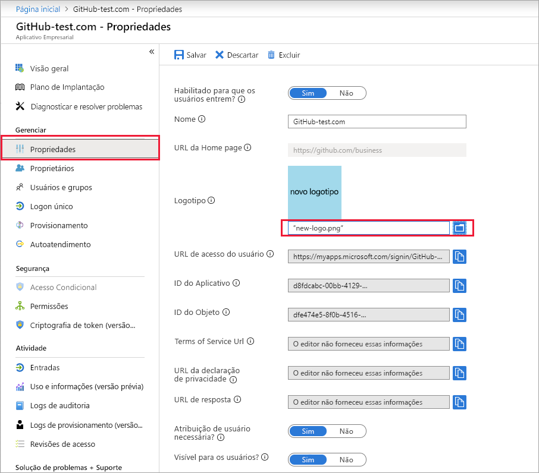

# Início Rápido: Configurar propriedades para um aplicativo em seu locatário do Azure AD (Azure Active Directory)

No guia de início rápido anterior, você adicionou um aplicativo ao seu locatário do Azure AD (Azure Active Directory). Quando você adiciona um aplicativo, está permitindo que seu locatário do Azure AD saiba que ele é o provedor de identidade do aplicativo. Agora você configurará algumas das propriedades para o aplicativo.
 
## Pré-requisitos

Para configurar as propriedades de um aplicativo em seu locatário do Azure AD, você precisa de:

- Uma conta do Azure com uma assinatura ativa. [Crie uma conta gratuitamente](https://azure.microsoft.com/free/?WT.mc_id=A261C142F).
- Uma das seguintes funções: administrador global, administrador de aplicativos de nuvem, administrador de aplicativos ou proprietário da entidade de serviço.
- Opcional: conclusão de [Exibir seus aplicativos](view-applications-portal.md).
- Opcional: conclusão de [Adicionar um aplicativo](add-application-portal.md).

>[!IMPORTANT]
>Use um ambiente de não produção para testar as etapas deste guia de início rápido.

## Configurar propriedades do aplicativo

Depois de concluir a adição de um aplicativo ao locatário do Azure AD, a página de visão geral é exibida. Se você estiver configurando um aplicativo que já tenha sido adicionado, confira o primeiro início rápido. Ele orienta você na exibição dos aplicativos adicionados ao seu locatário. 

Para editar as propriedades do aplicativo:

1. No portal do Azure AD, selecione **Aplicativos empresariais**. Em seguida, encontre e selecione o aplicativo que você deseja configurar.
2. Na seção **Gerenciar**, selecione **Propriedades** para abrir o painel **Propriedades** para edição.
3. Reserve um tempo para entender as opções disponíveis. As opções disponíveis dependerão de como o aplicativo está integrado ao Azure AD. Por exemplo, um aplicativo que usa o logon único baseado em SAML terá campos como *URL de acesso do usuário*, enquanto um aplicativo que usa o logon único baseado em OIDC não terá isso. Observe também que os aplicativos adicionados por meio de **Azure Active Directory > Registros de aplicativo** são, por padrão, aplicativos baseados em OIDC. Já os aplicativos adicionados por meio de **Azure Active Directory > Aplicativos empresariais** podem usar qualquer um dos vários padrões de logon único. Todos os aplicativos terão campos para configuração quando um aplicativo for exibido e puder ser usado. Esses campos são:
    - **Habilitado para que os usuários entrem?** determina se os usuários atribuídos ao aplicativo podem entrar nele.
    - **Atribuição do usuário obrigatória?** determina se os usuários não atribuídos ao aplicativo podem entrar nele.
    - A opção **Visível para os usuários?** determina se os usuários atribuídos a um aplicativo podem vê-lo em [Meus Aplicativos](https://myapps.microsoft.com) e no inicializador de aplicativos do Microsoft 365. (Confira o menu do waffle no canto superior esquerdo de um site do Microsoft 365.)
    
    > [!TIP]
    > A atribuição de usuários ocorre na seção **Usuários e grupos** da navegação.

    As três opções podem ser alternadas de maneira independente umas das outras e o comportamento resultante nem sempre é óbvio. Esta tabela pode ajudar:
    
    | Habilitado para os usuários entrarem? | Atribuição de usuário obrigatória? | Visível para os usuários? | Comportamento para usuários que foram atribuídos ao aplicativo ou não. |
    |---|---|---|---|
    | Sim | Sim | Sim | Usuários atribuídos podem ver o aplicativo e entrar. Usuários não atribuídos não podem ver o aplicativo nem entrar. |
    | Sim | Sim | Não  | Usuários atribuídos não podem ver o aplicativo, mas podem entrar. Usuários não atribuídos não podem ver o aplicativo nem entrar. |
    | Sim | Não  | Sim | Usuários atribuídos podem ver o aplicativo e entrar. Usuários não atribuídos não podem ver o aplicativo, mas podem entrar. |
    | Sim | Não  | Não  | Usuários atribuídos não podem ver o aplicativo, mas podem entrar. Usuários não atribuídos não podem ver o aplicativo, mas podem entrar. |
    | Não  | Sim | Sim | Usuários atribuídos não podem ver o aplicativo nem entrar. Usuários não atribuídos não podem ver o aplicativo nem entrar. |
    | Não  | Sim | Não  | Usuários atribuídos não podem ver o aplicativo nem entrar. Usuários não atribuídos não podem ver o aplicativo nem entrar. |
    | Não  | Não  | Sim | Usuários atribuídos não podem ver o aplicativo nem entrar. Usuários não atribuídos não podem ver o aplicativo nem entrar. |
    | Não  | Não  | Não  | Usuários atribuídos não podem ver o aplicativo nem entrar. Usuários não atribuídos não podem ver o aplicativo nem entrar. |

4. Quando terminar, selecione **Salvar**.

## Usar um logotipo personalizado

Para usar um logotipo personalizado:

1. Crie um logotipo de 215 x 215 pixels e salve-o no formato PNG.
2. No portal do Azure AD, selecione **Aplicativos empresariais**. Em seguida, encontre e selecione o aplicativo que você deseja configurar.
3. Na seção **Gerenciar**, selecione **Propriedades** para abrir o painel **Propriedades** para edição. 
4. Selecione o ícone para carregar o logotipo.
5. Quando terminar, selecione **Salvar**.

    

   > [!NOTE]
   > A miniatura exibida neste painel de **Propriedades** não é atualizada imediatamente. Você pode fechar e reabrir o painel **Propriedades** para ver o ícone atualizado.

> [!TIP]
> Para automatizar o gerenciamento de aplicativos usando a API do Graph, confira [Automatizar o gerenciamento de aplicativos com a API do Microsoft Graph](/graph/application-saml-sso-configure-api).

## Adicionar observações

Você pode usar o campo de notas para adicionar informações relevantes para o gerenciamento do aplicativo no Azure AD. Notas é um campo de texto livre com um tamanho máximo de 1024 caracteres.

1. No portal do Azure AD, selecione **Aplicativos empresariais**. Em seguida, encontre e selecione o aplicativo que você deseja configurar.
2. Na seção **Gerenciar**, selecione **Propriedades** para abrir o painel **Propriedades** para edição.
3. Atualize o campo Notas e selecione **Salvar**.

    

    
## Limpar os recursos

Se você não pretende continuar com a série de guias de início rápido, considere a possibilidade de excluir o aplicativo para limpar seu locatário de teste. A exclusão do aplicativo é abordada no último guia de início rápido desta série; confira [Excluir um aplicativo](delete-application-portal.md).

## Próximas etapas

Avance para o próximo artigo para saber como atribuir usuários ao aplicativo.
> [!div class="nextstepaction"]
> [Atribuir usuários a um aplicativo](add-application-portal-assign-users.md)