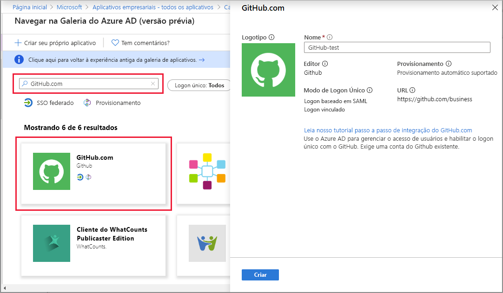
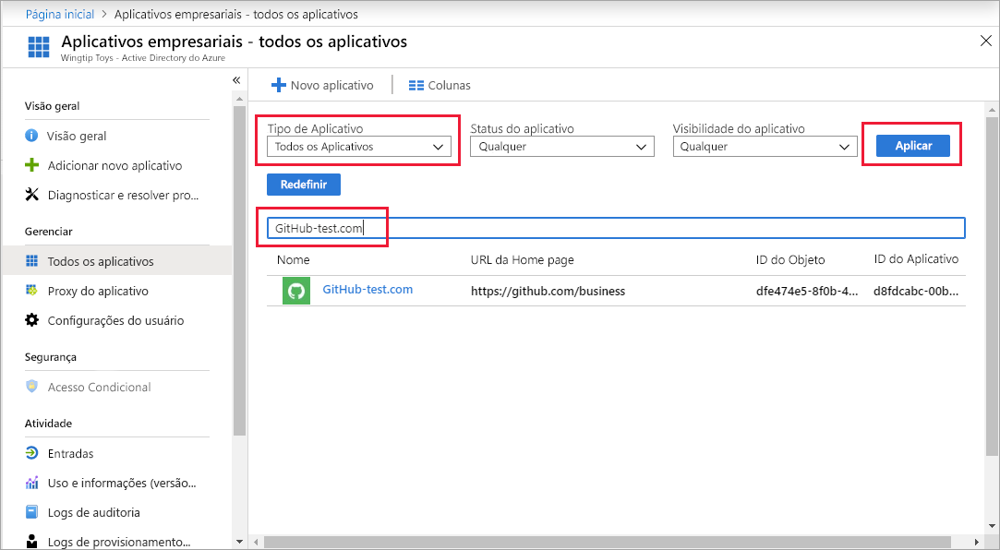
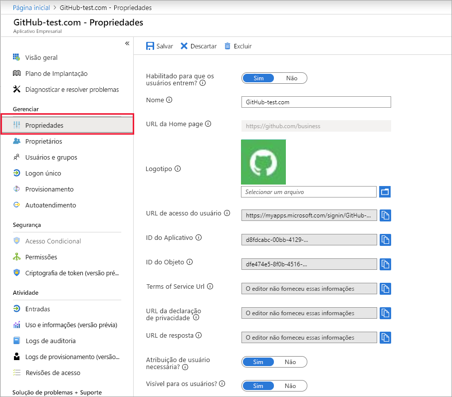

# Início Rápido: Adicionar um aplicativo a seu locatário do Azure Active Directory

O Azure AD (Azure Active Directory) tem uma galeria que contém milhares de aplicativos pré-integrados. Alguns dos aplicativos que sua organização usa provavelmente estão na galeria. Este início rápido usa o portal do Azure para adicionar um aplicativo de galeria ao locatário do Azure AD (Azure Active Directory).

Depois que um aplicativo é adicionado ao locatário do Azure AD, você pode:

- Gerenciar o acesso de usuário ao aplicativo com uma política de acesso condicional.
- Configurar usuários para logon único no aplicativo com suas contas do Azure AD.

## Antes de começar

Para adicionar um aplicativo ao locatário, você precisará de:

- Uma assinatura do Azure AD
- Uma assinatura habilitada com logon único para seu aplicativo

Entre no [portal do Azure](https://portal.azure.com) como administrador global do locatário do Azure AD, administrador do aplicativo de nuvem ou administrador do aplicativo.

Para testar as etapas deste tutorial, recomendamos o uso de um ambiente que não seja de produção. Se não tiver um ambiente do Azure AD que não seja de produção, você poderá [obter uma versão de avaliação de um mês](https://azure.microsoft.com/pricing/free-trial/).

## Adicionar um aplicativo ao locatário do Azure AD

Para adicionar um aplicativo de galeria ao locatário do Azure AD:

1. No [portal do Azure](https://portal.azure.com), no painel de navegação esquerdo, selecione **Azure Active Directory**.

2. No painel do **Azure Active Directory**, selecione **Aplicativos empresariais**. O painel **Todos os aplicativos** é aberto e exibe uma amostra aleatória dos aplicativos em seu locatário do Azure AD.

3. Para adicionar um aplicativo da galeria ao seu locatário, selecione **Novo aplicativo**. 

    

 4. Mude para a nova experiência de versão prévia da galeria: Na faixa na parte superior da **página Adicionar um aplicativo**, selecione o link que diz **Clique aqui para experimentar a galeria de aplicativos nova e aprimorada**.

5. O painel **Procurar na Galeria do Azure AD (versão prévia)** é aberto e exibe blocos de aplicativos para plataformas de nuvem, aplicativos locais e aplicativos em destaque. Observe que os aplicativos listados na seção **Aplicativos em destaque** têm ícones que indicam se eles dão suporte ao SSO (logon único) federado e ao provisionamento.

    

6. Você pode procurar na galeria pelo aplicativo que deseja adicionar ou pode pesquisá-lo inserindo seu nome na caixa de pesquisa. Em seguida, selecione o aplicativo entre os resultados. No formulário, você pode editar o nome do aplicativo para atender às necessidades de sua organização. Neste exemplo, alteramos o nome para **GitHub-test**.

    

7. Selecione **Criar**. Uma página de introdução é exibida com as opções para configurar o aplicativo para a organização.

Você terminou de adicionar seu aplicativo. As seções a seguir mostram como alterar o logotipo e editar outras propriedades do aplicativo.

## Localizar seu aplicativo de locatário do Azure AD

Vamos supor que você teve que sair e agora você está retornando para continuar a configurar o aplicativo. A primeira coisa a fazer é localizar o aplicativo.

1. No **[portal do Azure](https://portal.azure.com)** , no painel de navegação esquerdo, selecione **Azure Active Directory**.
1. No painel do **Azure Active Directory**, selecione **Aplicativos empresariais**.
1. No menu suspenso **Tipo de Aplicativo**, selecione **Todos os Aplicativos** e, sem seguida, **Aplicar**. Para saber mais sobre as opções de exibição, consulte [Exibir aplicativos de locatário](view-applications-portal.md).
1. Agora você pode ver uma lista de todos os aplicativos em seu locatário do Azure AD. A lista é uma amostra aleatória. Para ver mais aplicativos, selecione **Mostrar mais** uma ou mais vezes.
1. Para localizar rapidamente um aplicativo no locatário, insira o nome dele na caixa de pesquisa e selecione **Aplicar**. Este exemplo localiza o aplicativo de teste do GitHub adicionado anteriormente.

    

## Configurar propriedades de logon do usuário

Agora que você localizou o aplicativo, pode abri-lo e configurar suas propriedades.

Para editar as propriedades do aplicativo:

1. Selecione o aplicativo para abri-lo.
2. Selecione **Propriedades** para abrir o painel de propriedades para edição.

    

3. Reserve um tempo para entender as opções de entrada. As opções determinam como os usuários que foram atribuídos ou não ao aplicativo podem entrar nele. Além disso, as opções também determinam se um usuário pode ver o aplicativo no painel de acesso.

    - **Habilitado para que os usuários entrem?** determina se os usuários atribuídos ao aplicativo podem entrar nele.
    - **Atribuição do usuário obrigatória?** determina se os usuários não atribuídos ao aplicativo podem entrar nele.
    - **Visível para os usuários?** determina se os usuários atribuídos a um aplicativo podem vê-lo no painel de acesso e no inicializador do O365.

4. Use as tabelas a seguir para ajudar você a escolher as melhores opções para suas necessidades.

   - Comportamento de usuários **atribuídos**:

       | Configurações de propriedade do aplicativo | | | Experiência do usuário atribuído | |
       |---|---|---|---|---|
       | Habilitado para os usuários entrarem? | Atribuição de usuário obrigatória? | Visível para os usuários? | Os usuários atribuídos podem entrar? | Os usuários atribuídos podem ver o aplicativo?* |
       | Sim | Sim | Sim | Sim | Sim  |
       | Sim | Sim | não  | Sim | não   |
       | Sim | não  | Sim | Sim | Sim  |
       | Sim | não  | não  | Sim | não   |
       | não  | Sim | Sim | não  | não   |
       | não  | Sim | não  | não  | não   |
       | não  | não  | Sim | não  | não   |
       | não  | não  | não  | não  | não   |

   - Comportamento de usuários **não atribuídos**:

       | Configurações de propriedade do aplicativo | | | Experiência de usuário não atribuído | |
       |---|---|---|---|---|
       | Habilitado para os usuários entrarem? | Atribuição de usuário obrigatória? | Visível para os usuários? | Os usuários não atribuídos podem entrar? | Os usuários não atribuídos podem ver o aplicativo?* |
       | Sim | Sim | Sim | não  | não   |
       | Sim | Sim | não  | não  | não   |
       | Sim | não  | Sim | Sim | não   |
       | Sim | não  | não  | Sim | não   |
       | não  | Sim | Sim | não  | não   |
       | não  | Sim | não  | não  | não   |
       | não  | não  | Sim | não  | não   |
       | não  | não  | não  | não  | não   |

     *O usuário pode ver o aplicativo no painel de acesso e no iniciador de aplicativos do Office 365?

## Usar um logotipo personalizado

Para usar um logotipo personalizado:

1. Crie um logotipo de 215 x 215 pixels e salve-o no formato PNG.
1. Como você já localizou seu aplicativo, selecione-o.
1. No painel esquerdo, selecione **Propriedades**.
1. Carregue o logotipo.
1. Quando terminar, selecione **Salvar**. 

    

   > [!NOTE]
   > A miniatura exibida neste painel de **Propriedades** não é atualizada imediatamente. Você pode fechar e reabrir as propriedades para ver o ícone atualizado.

## Próximas etapas

Agora que você adicionou o aplicativo à sua organização do Azure AD, [escolha um método de logon único](what-is-single-sign-on.md#choosing-a-single-sign-on-method) que deseja usar e veja o artigo apropriado abaixo:

- [Configurar o logon único baseado em SAML](configure-single-sign-on-non-gallery-applications.md)
- [Configurar o logon único com senha](configure-password-single-sign-on-non-gallery-applications.md)
- [Configurar o logon vinculado](configure-linked-sign-on.md)
