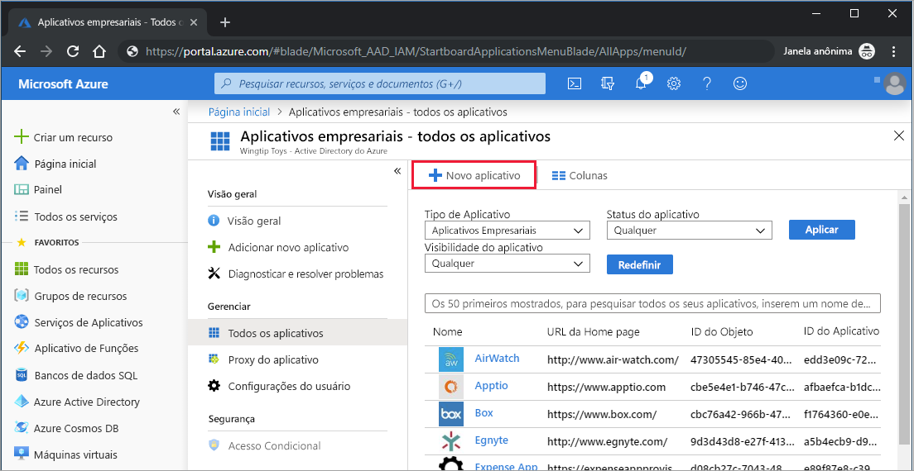
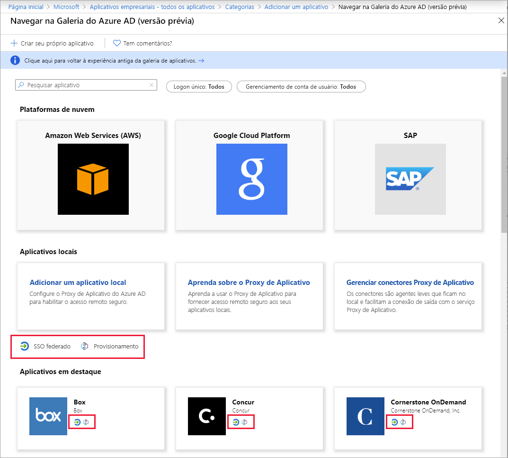

# Início Rápido: Adicionar um aplicativo a seu locatário do Azure AD (Azure Active Directory)

O Azure AD (Azure Active Directory) tem uma galeria que contém milhares de aplicativos pré-integrados. Muitos dos aplicativos que sua organização usa provavelmente já estão na galeria.

Depois que um aplicativo é adicionado ao locatário do Azure AD, você pode:

- Configure as propriedades do aplicativo.
- Gerenciar o acesso de usuário ao aplicativo com uma política de acesso condicional.
- Configure o logon único para que os usuários possam entrar no aplicativo com suas credenciais do Azure AD.

## Pré-requisitos

Para adicionar um aplicativo ao locatário do Azure AD, é preciso:

- Uma conta do Azure com uma assinatura ativa. [Crie uma conta gratuitamente](https://azure.microsoft.com/free/?WT.mc_id=A261C142F).
- Uma das seguintes funções: administrador global, administrador de aplicativos de nuvem, administrador de aplicativos ou proprietário da entidade de serviço.
- (Opcional: Conclusão de [Exibir seus aplicativos](view-applications-portal.md)).

>[!IMPORTANT]
>Recomendamos usar um ambiente que não seja de produção para testar as etapas neste início rápido.

## Adicionar um aplicativo ao seu locatário do Azure AD

Para adicionar um aplicativo ao locatário do Azure AD:

1. No [portal do Azure](https://portal.azure.com), no painel de navegação esquerdo, selecione **Azure Active Directory**.
2. No painel do **Azure Active Directory**, selecione **Aplicativos empresariais**. O painel **Todos os aplicativos** é aberto e exibe uma amostra aleatória dos aplicativos em seu locatário do Azure AD.
3. No painel **Aplicativos empresariais**, selecione **Novo aplicativo**. 
    
4. Mude para a nova experiência de versão prévia da galeria: Na faixa na parte superior da **página Adicionar um aplicativo**, selecione o link que diz **Clique aqui para experimentar a galeria de aplicativos nova e aprimorada**.
5. O painel **Procurar na Galeria do Azure AD (versão prévia)** é aberto e exibe blocos de aplicativos para plataformas de nuvem, aplicativos locais e aplicativos em destaque. Aplicativos listados na seção **Aplicativos em destaque** têm ícones que indicam se eles dão suporte ao SSO (logon único) federado e ao provisionamento. 
    
6. Você pode procurar na galeria pelo aplicativo que deseja adicionar ou pode pesquisá-lo inserindo seu nome na caixa de pesquisa. Em seguida, selecione o aplicativo entre os resultados. 
7. A próxima etapa depende da maneira como o desenvolvedor do aplicativo implementou o SSO (logon único). O logon único pode ser implementado por desenvolvedores de aplicativos de quatro maneiras. Essas quatro maneiras são SAML, OpenID Connect, por senha ou vinculado. Quando adiciona um aplicativo, você pode optar por filtrar e ver somente os aplicativos que usam uma implementação de SSO específica, conforme mostrado na captura de tela. Por exemplo, um padrão popular para implementar o SSO é o SAML (Security Assertion Markup Language). Outro padrão popular é o OIDC (OpenID Connect). A maneira como você configura o SSO com esses padrões é diferente, sendo assim, tome nota do tipo de SSO implementado pelo aplicativo que você está adicionando.

    :::image type="content" source="media/add-application-portal/sso-types.png" alt-text="Captura de tela mostrando o seletor de tipos de SSO." lightbox="media/add-application-portal/sso-types.png":::

    - Se o desenvolvedor do aplicativo usou o **padrão OIDC** para SSO, selecione **Inscrever-se**. A página de configuração é exibida. Em seguida, vá para o início rápido sobre como configurar o logon único baseado em OIDC.
    :::image type="content" source="media/add-application-portal/sign-up-oidc-sso.png" alt-text="Captura de tela mostrando o processo de adicionar um aplicativo com SSO baseado em OIDC.":::

    - Se o desenvolvedor do aplicativo usou o **padrão SAML** para o SSO, selecione **Criar**. Uma página de introdução é exibida com as opções para configurar o aplicativo para a organização. No formulário, você pode editar o nome do aplicativo para atender às necessidades de sua organização. Em seguida, vá para o início rápido sobre como configurar o logon único baseado em SAML.
    :::image type="content" source="media/add-application-portal/create-application.png" alt-text="Captura de tela mostrando o processo de adicionar um aplicativo com SSO baseado em SAML.":::

> [!IMPORTANT]
> Há algumas diferenças importantes entre as implementações de SSO baseadas em SAML e em OIDC. Com os aplicativos baseados em SAML, você pode adicionar várias instâncias do mesmo aplicativo. Por exemplo, GitHub1, GitHub2 etc. Para aplicativos baseados em OIDC, você pode adicionar apenas uma instância de um aplicativo. Se você já tiver adicionado um aplicativo baseado em OIDC e tentar adicioná-lo novamente e fornecer consentimento duas vezes, ele não será adicionado novamente no locatário.

Se o aplicativo que você está procurando não estiver na galeria, selecione o link **Criar seu aplicativo** e, em **O que você deseja fazer com o seu aplicativo?** , escolha **Integrar qualquer outro aplicativo que você não encontrar na galeria**. A Microsoft já trabalhou com muitos desenvolvedores de aplicativos para configurá-los para funcionar com o Azure AD. Os aplicativos pré-configurados aparecem na galeria. Porém, se o aplicativo que você deseja adicionar não estiver listado, você poderá criar um aplicativo genérico e configurá-lo por conta própria ou com diretrizes do desenvolvedor que o criou.

Você terminou de adicionar um aplicativo. O próximo guia de início rápido mostra como alterar o logotipo e editar outras propriedades do aplicativo.

> [!TIP]
> Para automatizar o gerenciamento de aplicativos usando a API do Graph, confira [Automatizar o gerenciamento de aplicativos com a API do Microsoft Graph](/graph/application-saml-sso-configure-api).

## Limpar os recursos

Se você não pretende continuar com a série de guias de início rápido, considere a possibilidade de excluir o aplicativo para limpar seu locatário de teste. A exclusão do aplicativo é abordada no último guia de início rápido desta série; confira [Excluir um aplicativo](delete-application-portal.md).

## Próximas etapas

Prossiga para o próximo artigo para aprender a configurar um aplicativo.
> [!div class="nextstepaction"]
> [Configurar um aplicativo](add-application-portal-configure.md)