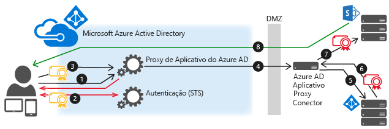

# <a name="kerberos-constrained-delegation-for-single-sign-on-sso-to-your-apps-with-application-proxy"></a>Delegação restrita de Kerberos para SSO (logon único) para seus aplicativos com o proxy de aplicativo

Você pode fornecer o logon único para aplicativos locais, publicados por meio do Proxy do Aplicativo, que sejam protegidos com a Autenticação Integrada do Windows. Esses aplicativos exigem um tíquete Kerberos para acessar. O Proxy do Aplicativo usa a KCD (Delegação restrita de Kerberos) para dar suporte a esses aplicativos. 

Você pode habilitar o logon único para seus aplicativos usando a IWA (Autenticação Integrada do Windows) concedendo permissão aos conectores do Proxy de Aplicativo no Active Directory para representar usuários. Os conectores usam essa permissão para enviar e receber tokens em seu nome.

## <a name="how-single-sign-on-with-kcd-works"></a>Como funciona o logon único com a KCD
Este diagrama explica o fluxo quando um usuário tenta acessar um aplicativo local que usa IWA.



1. O usuário insere a URL para acessar o aplicativo local por meio do Proxy de Aplicativo.
2. O Proxy de Aplicativo redireciona a solicitação para serviços de autenticação do AD do Azure para pré-autenticação. Neste ponto, o AD do Azure se aplica a qualquer política de autenticação e autorização aplicável, tal como autenticação multifator. Se o usuário for validado, o AD do Azure cria um token e o envia para o usuário.
3. O usuário passa o token para o Proxy de Aplicativo.
4. O proxy de aplicativo valida o token e recupera o UPN (nome principal do usuário) dele e, em seguida, o conector recebe o UPN e o SPN (nome da entidade de serviço) por meio de um canal seguro com autenticação dupla.
5. O conector executa a negociação de KCD (delegação restrita de Kerberos) com o AD local, representando o usuário para obter um token Kerberos para o aplicativo.
6. O Active Directory envia o token Kerberos para o aplicativo para o Conector.
7. O Conector envia a solicitação original para o servidor de aplicativos usando o token Kerberos recebido do AD.
8. O aplicativo envia a resposta para o Conector, que é retornada para o serviço de Proxy de Aplicativo e, finalmente, para o usuário.

## <a name="prerequisites"></a>Pré-requisitos
Antes de começar com o logon único para aplicativos da IWA, verifique se seu ambiente está preparado com as seguintes configurações e definições:

* Seus aplicativos, como os aplicativos Web do SharePoint, são definidos para usar a Autenticação Integrada do Windows. Para sabe rmais, veja [Habilitar suporte para autenticação Kerberos](/previous-versions/windows/it-pro/windows-server-2008-R2-and-2008/dd759186(v=ws.11)), ou para o SharePoint, consulte [Planejar a autenticação Kerberos no SharePoint 2013](/SharePoint/security-for-sharepoint-server/kerberos-authentication-planning).
* Todos os seus aplicativos têm [nomes de entidade de serviço](https://social.technet.microsoft.com/wiki/contents/articles/717.service-principal-names-spns-setspn-syntax-setspn-exe.aspx).
* O servidor que executa o Conector e o servidor que executa o aplicativo que você está publicando são ingressados em domínio e fazem parte desse mesmo domínio ou em domínios confiáveis. Para obter mais informações sobre o ingresso no domínio, consulte [Ingressar um computador em um domínio](/previous-versions/windows/it-pro/windows-server-2012-R2-and-2012/dd807102(v=ws.11)).
* O servidor que executa o conector tem acesso de leitura ao atributo TokenGroupsGlobalAndUniversal para usuários. Essa configuração padrão pode ter sido afetada pelo aumento das restrições de segurança que protegem o ambiente.

### <a name="configure-active-directory"></a>Configurar o Active Directory
A configuração do Active Directory varia, dependendo de se o conector do Proxy do Aplicativo e o servidor de aplicativos estão no mesmo domínio ou não.

#### <a name="connector-and-application-server-in-the-same-domain"></a>O conector e o servidor de aplicativos estão no mesmo domínio
1. Em Active Directory, vá para **ferramentas**  >  **usuários e computadores**.
2. Selecione o servidor que executa o conector.
3. Clique com o botão direito do mouse e selecione **Propriedades**  >  **delegação**.
4. Selecione **Confiar no computador para delegação apenas a serviços especificados**. 
5. Selecione **Usar qualquer protocolo de autenticação**.
6. Em **Serviços aos quais esta conta pode apresentar credenciais delegadas**, adicione o valor da identidade SPN do servidor de aplicativos. Isso permite que o Conector do Proxy de Aplicativo represente usuários no AD para os aplicativos definidos na lista.

   

#### <a name="connector-and-application-server-in-different-domains"></a>O conector e o servidor de aplicativos estão em domínios diferentes
1. Para obter uma lista de pré-requisitos para trabalhar com o KCD entre domínios, consulte [Delegação restrita de Kerberos nos domínios](/previous-versions/windows/it-pro/windows-server-2012-R2-and-2012/hh831477(v=ws.11)).
2. Use a `principalsallowedtodelegateto` propriedade da conta de serviço (conta de usuário do computador ou do domínio dedicado) do aplicativo Web para habilitar a delegação de autenticação Kerberos do proxy de aplicativo (conector). O servidor de aplicativos está sendo executado no contexto de `webserviceaccount` e o servidor de delegação é `connectorcomputeraccount` . Execute os comandos abaixo em um controlador de domínio (executando o Windows Server 2012 R2 ou posterior) no domínio de `webserviceaccount` . Use nomes simples (não UPN) para ambas as contas.

   Se o `webserviceaccount` for uma conta de computador, use estes comandos:

   ```powershell
   $connector= Get-ADComputer -Identity connectorcomputeraccount -server dc.connectordomain.com

   Set-ADComputer -Identity webserviceaccount -PrincipalsAllowedToDelegateToAccount $connector

   Get-ADComputer webserviceaccount -Properties PrincipalsAllowedToDelegateToAccount
   ```

   Se o `webserviceaccount` for uma conta de usuário, use estes comandos:

   ```powershell
   $connector= Get-ADComputer -Identity connectorcomputeraccount -server dc.connectordomain.com

   Set-ADUser -Identity webserviceaccount -PrincipalsAllowedToDelegateToAccount $connector

   Get-ADUser webserviceaccount -Properties PrincipalsAllowedToDelegateToAccount
   ```

## <a name="configure-single-sign-on"></a>Configurar o logon único 
1. Publique seu aplicativo seguindo as instruções descritas em [Publicar aplicativos com o Proxy de Aplicativo](application-proxy-add-on-premises-application.md). Certifique-se de selecionar **Active Directory do Azure** como o **Método de pré-autenticação**.
2. Depois que o aplicativo aparecer na lista de aplicativos empresariais, selecione-o e clique em **Logon único**.
3. Defina o modo de logon único como **Autenticação Integrada do Windows**.  
4. Insira o **SPN do aplicativo interno** do servidor de aplicativos. Neste exemplo, o SPN para nosso aplicativo publicado é http/www.contoso.com. Esse SPN precisa estar na lista de serviços aos quais o conector pode apresentar credenciais delegadas. 
5. Escolha a **Identidade de Logon Delegada** para que o conector use em nome de seus usuários. Para obter mais informações, consulte [trabalhando com diferentes identidades locais e na nuvem](#working-with-different-on-premises-and-cloud-identities)

     

## <a name="sso-for-non-windows-apps"></a>SSO para aplicativos não Windows

O fluxo de delegação de Kerberos no Proxy de Aplicativo do AD do Azure é iniciado quando o AD do Azure autentica o usuário na nuvem. Depois que a solicitação chega localmente, o conector do Proxy de Aplicativo Azure AD emite um tíquete do Kerberos em nome do usuário interagindo com o Active Directory local. Esse processo é conhecido como KCD (delegação restrita do Kerberos). 

Na próxima fase, uma solicitação é enviada ao aplicativo de back-end com esse tíquete Kerberos. 

Há vários mecanismos que definem como enviar o tíquete Kerberos em tais solicitações. A maioria dos servidores não Windows espera recebê-lo na forma de token SPNEGO. Esse mecanismo tem suporte na Proxy de Aplicativo do AD do Azure, mas está desabilitado por padrão. Um conector pode ser configurado para o token de Kerberos SPNEGO ou Standard, mas não para ambos.

Se você configurar um computador conector para SPNEGO, certifique-se de que todos os outros conectores nesse grupo conector também estejam configurados com SPNEGO. Os aplicativos que esperam token Kerberos padrão devem ser roteados por meio de outros conectores que não estão configurados para SPNEGO. Alguns aplicativos Web aceitam os dois formatos sem a necessidade de qualquer alteração na configuração. 
 

Para habilitar SPNEGO:

1. Abra um prompt de comando que é executado como administrador.
2. No prompt de comando, execute os seguintes comandos em servidores do conector que precisam de SPNEGO.

    ```
    REG ADD "HKLM\SOFTWARE\Microsoft\Microsoft AAD App Proxy Connector" /v UseSpnegoAuthentication /t REG_DWORD /d 1
    net stop WAPCSvc & net start WAPCSvc
    ```

Os aplicativos que não são do Windows normalmente utilizam nomes de usuário ou nomes de conta SAM em vez de endereços de email de domínio. Se essa situação se aplicar aos seus aplicativos, você precisará configurar o campo de identificação de logon delegada para conectar as identidades de nuvem às identidades de aplicativo. 

## <a name="working-with-different-on-premises-and-cloud-identities"></a>Trabalhando com identidades diferentes de nuvem e local
O Proxy do Aplicativo pressupõe que os usuários têm a mesma identidade na nuvem e localmente. Mas, em alguns ambientes, devido a políticas corporativas ou dependências de aplicativos, as organizações podem precisar usar IDs alternativas para entrar. Nesses casos, você ainda pode usar o KCD para logon único. Configure uma **Identificação de logon delegada** para cada aplicativo a fim de especificar qual identidade deve ser usada ao realizar o logon único.  

Essa capacidade permite que muitas organizações com identidades diferentes localmente e na nuvem usem o SSO da nuvem para aplicativos locais, sem exigir que os usuários insiram senhas e nomes de usuários diferentes. Isso inclui as organizações que:

* Têm vários domínios internamente (joe@us.contoso.com, joe@eu.contoso.com) e um único domínio na nuvem (joe@contoso.com).
* Têm um nome de domínio não roteável internamente (joe@contoso.usa) e um nome legal na nuvem.
* Não usem nomes de domínio internamente (joe)
* Use aliases diferentes no local e na nuvem. Por exemplo, joe-johns@contoso.com versus joej@contoso.com  

Com o Proxy de Aplicativo, você pode selecionar qual identidade deve ser usada para obter o tíquete Kerberos. Essa configuração é por aplicativo. Algumas dessas opções são adequadas para sistemas que não aceitam o formato de endereço de email, e outras são desenvolvidas para logon alternativo.


Se a identidade de logon delegada for usada, o valor não poderá ser exclusivo em todos os domínios ou florestas em sua organização. Você pode evitar esse problema publicando esses aplicativos duas vezes com dois grupos diferentes de Conectores. Como cada aplicativo tem um público de usuários diferente, é possível ingressar seus Conectores em um domínio diferente.

Se o **nome da conta Sam local** for usado para a identidade de logon, o computador que hospeda o conector deverá ser adicionado ao domínio no qual a conta de usuário está localizada.

### <a name="configure-sso-for-different-identities"></a>Configurar o SSO para diferentes identidades
1. Defina as configurações do Azure AD Connect para que a identidade principal seja o endereço de email (email). Isso é feito como parte do processo de personalização, alterando o campo **Nome UPN** nas configurações de sincronização. Essas configurações também determinam como os usuários fazem logon no Office365, em dispositivos Windows10 e outros aplicativos que usam o Azure AD como seu armazenamento de identidade.  
     
2. Nas definições de configuração de aplicativo para o aplicativo que você deseja modificar, selecione a **Identidade de Logon Delegada** a ser usada:

   * Nome UPN (por exemplo, joe@contoso.com)
   * Nome UPN alternativo (por exemplo, joed@contoso.local)
   * Nome de usuário que faz parte do nome UPN (por exemplo, joe)
   * Nome de usuário que faz parte do nome UPN alternativo (por exemplo, joed)
   * Nome da conta SAM local (depende da configuração do controlador de domínio)

### <a name="troubleshooting-sso-for-different-identities"></a>Solucionando problemas de SSO para diferentes identidades
Se houver um erro no processo de SSO, ele aparecerá no log de eventos da máquina do conector, conforme explicado em [solução de problemas](application-proxy-back-end-kerberos-constrained-delegation-how-to.md).
Porém, em alguns casos, a solicitação será enviada com êxito para o aplicativo de back-end embora este aplicativo responderá em várias outras respostas HTTP. Nesses casos, a solução de problemas deve começar examinando o número de evento 24029 no computador do conector, no log de eventos da sessão do Proxy do Aplicativo. A identidade do usuário que foi usada para delegação será exibida no campo "usuário" nos detalhes do evento. Para ativar o log de sessão, selecione **Mostrar logs analíticos e de depuração** no menu de exibição do visualizador de eventos.

## <a name="next-steps"></a>Próximas etapas

* [Como configurar um aplicativo de Application Proxy para usar a delegação restrita de Kerberos](application-proxy-back-end-kerberos-constrained-delegation-how-to.md)
* [Solucionar problemas que surgirem com o Proxy de Aplicativo](application-proxy-troubleshoot.md)