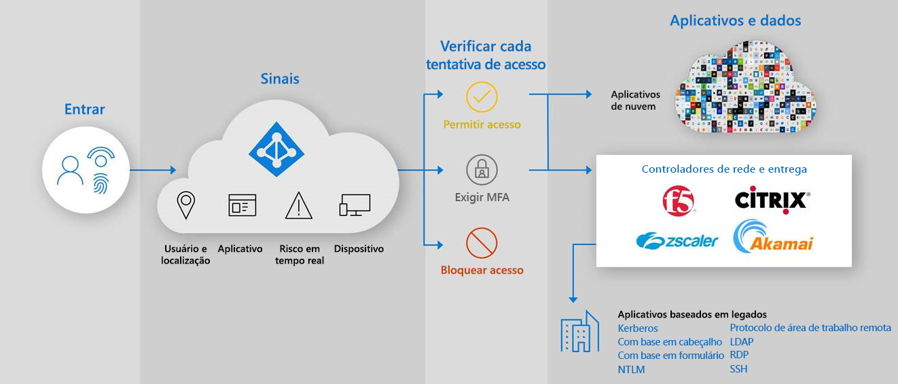

# Acesso híbrido seguro: proteger aplicativos herdados com o Azure Active Directory

Agora você pode proteger seus aplicativos de autenticação herdados locais e na nuvem conectando-os ao Azure Active Directory (AD) com:

- [Proxy de Aplicativo do AD do Azure](#secure-hybrid-access-sha-through-azure-ad-application-proxy)

- [Seus controladores e redes de entrega de aplicativos existentes](#sha-through-networking-and-delivery-controllers)

- [Aplicativos de rede virtual privada (VPN) e de perímetro de Software-Defined (SDP)](#sha-through-vpn-and-sdp-applications)

Você pode preencher a lacuna e fortalecer sua postura de segurança em todos os aplicativos com recursos do Azure AD, como o [acesso condicional](../conditional-access/overview.md) do Azure AD e o Azure ad [Identity Protection](../identity-protection/overview-identity-protection.md).

## Acesso híbrido seguro (SHA) por meio do Azure Proxy de Aplicativo do AD
  
Usando o [proxy de aplicativo](./what-is-application-proxy.md) , você pode fornecer [acesso remoto seguro](./application-proxy.md) aos seus aplicativos Web locais. Os usuários não precisam usar uma VPN. Os usuários se beneficiam com a conexão fácil com seus aplicativos de qualquer dispositivo após um [logon único](./add-application-portal-setup-sso.md). O proxy de aplicativo fornece acesso remoto como um serviço e permite que você [publique facilmente seus aplicativos locais](./application-proxy-add-on-premises-application.md) para usuários fora da rede corporativa. Ele ajuda a dimensionar o gerenciamento de acesso à nuvem sem exigir que você modifique seus aplicativos locais. [Planeje uma implantação de proxy de aplicativo do AD do Azure](./application-proxy-deployment-plan.md) como uma próxima etapa.

## Integrações de parceiros do Azure AD

### SHA por meio de controladores de rede e entrega

Além do [proxy de aplicativo do AD do Azure](./what-is-application-proxy.md), para permitir que você use a [estrutura de confiança zero](https://www.microsoft.com/security/blog/2020/04/02/announcing-microsoft-zero-trust-assessment-tool/), a Microsoft é parceira com provedores de terceiros. Você pode usar seus controladores de rede e de entrega existentes e proteger facilmente os aplicativos herdados que são essenciais para seus processos de negócios, mas que não poderiam ser protegidos antes do Azure AD. É provável que você já tenha tudo o que precisa para começar a proteger esses aplicativos.

Os fornecedores de rede a seguir oferecem soluções predefinidas e diretrizes detalhadas para a integração com o Azure AD.

- [EAA (Akamai Enterprise Application Access)](../saas-apps/akamai-tutorial.md)

- [ADC (Application Delivery Controller) Citrix](../saas-apps/citrix-netscaler-tutorial.md)

- [F5 Big-IP APM](./f5-aad-integration.md)

- [Kemp](../saas-apps/kemp-tutorial.md)

- [Gerenciador de tráfego virtual de Pulse Secure (VTM)](../saas-apps/pulse-secure-virtual-traffic-manager-tutorial.md)

### SHA por meio de aplicativos VPN e SDP

Usando soluções VPN e SDP, você pode fornecer acesso seguro à sua rede corporativa a partir de qualquer dispositivo, a qualquer momento, em qualquer local, ao mesmo tempo em que protege os dados da sua organização. Com o Azure AD como um IDP (provedor de identidade), você pode usar métodos de autenticação e autorização modernos, como o [logon único](./what-is-single-sign-on.md) do Azure AD e a [autenticação multifator](../authentication/concept-mfa-howitworks.md) para proteger seus aplicativos herdados locais.  

Os fornecedores de VPN a seguir oferecem soluções predefinidas e diretrizes detalhadas para a integração com o Azure AD.

- [Cisco AnyConnect](../saas-apps/cisco-anyconnect.md)

- [Fortinet](../saas-apps/fortigate-ssl-vpn-tutorial.md)

- [F5 Big-IP APM](./f5-aad-password-less-vpn.md)

- [Proteção global de redes Palo Alto](../saas-apps/paloaltoadmin-tutorial.md)

- [Proteção do Pulse Secure Pulse Connect (PCS)](../saas-apps/pulse-secure-pcs-tutorial.md)

Os seguintes fornecedores de SDP oferecem soluções predefinidas e diretrizes detalhadas para a integração com o Azure AD.

- [Agente de acesso do Datawiza](./add-application-portal-setup-oidc-sso.md)

- [Perimeter 81](../saas-apps/perimeter-81-tutorial.md)

- [Plataforma de autenticação Silverfort](./add-application-portal-setup-oidc-sso.md)

- [Strata](../saas-apps/maverics-identity-orchestrator-saml-connector-tutorial.md)

- [Zscaler Private Access (ZPA)](../saas-apps/zscalerprivateaccess-tutorial.md)
