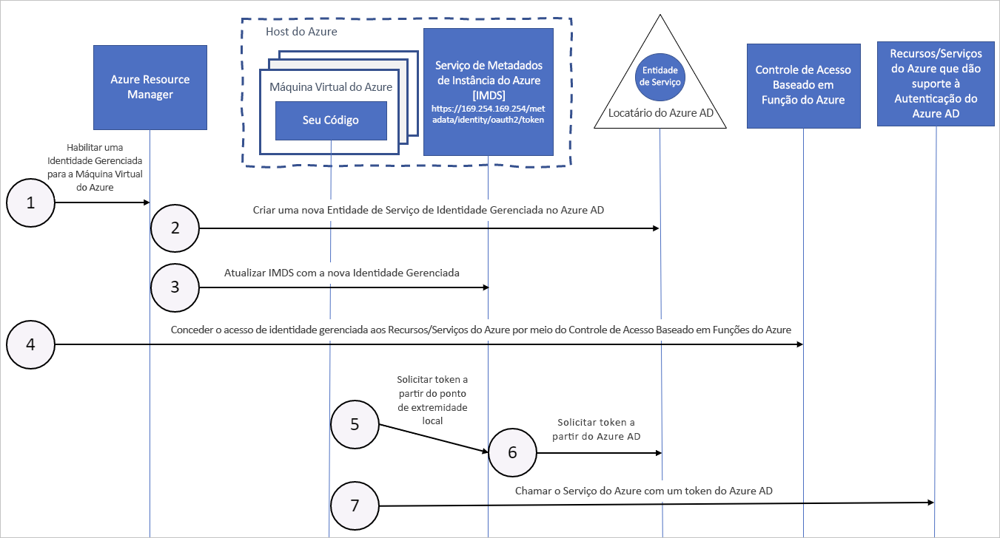

# Como as identidades gerenciadas para recursos do Azure funcionam com máquinas virtuais do Azure

As identidades gerenciadas dos recursos do Azure fornecem aos serviços do Azure uma identidade gerenciada automaticamente no Azure Active Directory. Você pode usar essa identidade para autenticar em qualquer serviço que dá suporte à autenticação do Azure AD, incluindo o Key Vault, sem ter as credenciais no seu código.

Neste artigo, você aprende como as identidades gerenciadas funcionam com VMs (máquinas virtuais) do Azure.

## Como ele funciona

Internamente, as identidades gerenciadas são entidades de serviço de um tipo especial, que só podem ser usadas com recursos do Azure. Quando a identidade gerenciada é excluída, a entidade de serviço correspondente é removida automaticamente.
Além disso, quando uma identidade atribuída pelo usuário ou pelo sistema é criada, o MSRP (Provedor de Recursos de Identidade Gerenciada) emite um certificado internamente para essa identidade. 

Seu código pode usar uma identidade gerenciada para solicitar tokens de acesso para os serviços que dão suporte à autenticação do Azure AD. O Azure é responsável por reverter as credenciais que são usadas pela instância de serviço. 

O diagrama abaixo mostra como as identidades de serviço gerenciadas funcionam com VMs (máquinas virtuais):

|  Propriedade    | Identidade gerenciada atribuída pelo sistema | Identidade gerenciada atribuída pelo usuário |
|------|----------------------------------|--------------------------------|
| Criação |  Criada como parte de um recurso do Azure (por exemplo, uma máquina virtual do Azure ou o Serviço de Aplicativo do Azure). | Criada como um recurso independente do Azure. |
| Ciclo de vida | Ciclo de vida compartilhado com o recurso do Azure com o qual a identidade gerenciada é criada.   Quando o recurso pai é excluído, a identidade gerenciada também é excluída. | Ciclo de vida independente.   Precisa ser explicitamente excluída. |
| Compartilhamento entre recursos do Azure | Não pode ser compartilhada.   Só pode ser associada a um único recurso do Azure. | Pode ser compartilhada.   A mesma identidade gerenciada atribuída pelo usuário pode ser associada a mais de um recurso do Azure. |
| Casos de uso comuns | Cargas de trabalho que estão contidas em um único recurso do Azure.   Cargas de trabalho para as quais você precisa de identidades independentes.   Por exemplo, um aplicativo que é executado em uma única máquina virtual | Cargas de trabalho que são executadas em vários recursos e que podem compartilhar uma única identidade.   Cargas de trabalho que precisam de pré-autorização para um recurso seguro como parte de um fluxo de provisionamento.   Cargas de trabalho em que os recursos são reciclados com frequência, mas as permissões devem permanecer consistentes.   Por exemplo, uma carga de trabalho em que várias máquinas virtuais precisam acessar o mesmo recurso |

## Identidade gerenciada atribuída pelo sistema

1. O Azure Resource Manager recebe uma solicitação para habilitar a identidade gerenciada atribuída pelo sistema em uma VM.

2. O Azure Resource Manager cria uma entidade de serviço no Azure AD para a identidade da VM. A entidade de serviço é criada no locatário do Azure AD confiado pela assinatura.

3. O Azure Resource Manager configura a identidade na VM atualizando o ponto de extremidade de identidade do Serviço de Metadados de Instância do Azure com o certificado e a ID do cliente da entidade de serviço.

4. Depois que a máquina virtual ganhar uma identidade, use as informações da entidade de serviço para conceder acesso aos recursos do Microsoft Azure à VM. Para chamar Azure Resource Manager, use o controle de acesso baseado em função do Azure (RBAC do Azure) para atribuir a função apropriada à entidade de serviço da VM. Para chamar o Key Vault, conceda o acesso de código para o segredo ou chave específica no Key Vault.

5. O código que está em execução na VM pode solicitar um token do ponto de extremidade de serviço de Metadados de Instância do Azure, acessível somente a partir da VM: `http://169.254.169.254/metadata/identity/oauth2/token`
    - O parâmetro de recurso especifica o serviço ao qual o token é enviado. Para se autenticar no Azure Resource Manager, use `resource=https://management.azure.com/`.
    - O parâmetro de versão de API Especifica a versão IMDS, use a versão da API = 2018-02-01 ou superior.

6. A chamada é feita ao Azure AD para solicitar acesso ao token (conforme especificado na etapa 5) usando a ID do cliente e o certificado configurados na etapa 3. O Azure AD retorna um token de acesso do JSON Web Token (JWT).

7. Seu código envia o token de acesso em uma chamada para um serviço que dá suporte à autenticação do Azure AD.

## Identidade gerenciada atribuída pelo usuário

1. O Azure Resource Manager recebe uma solicitação para criar uma identidade gerenciada atribuída pelo usuário.

2. O Azure Resource Manager cria uma entidade de serviço no Azure AD para a identidade gerenciada atribuída pelo usuário. A entidade de serviço é criada no locatário do Azure AD confiado pela assinatura.

3. O Azure Resource Manager recebe uma solicitação para configurar a identidade gerenciada atribuída pelo usuário em uma VM e atualiza o ponto de extremidade de identidade do Serviço de Metadados de Instância do Azure com o certificado e a ID do cliente da entidade de serviço de identidade gerenciada atribuída pelo usuário.

4. Depois que a identidade gerenciada atribuída pelo usuário for criada, use as informações da entidade de serviço para conceder o acesso de identidade aos recursos do Azure. Para chamar Azure Resource Manager, use o RBAC do Azure para atribuir a função apropriada à entidade de serviço da identidade atribuída pelo usuário. Para chamar o Key Vault, conceda o acesso de código para o segredo ou chave específica no Key Vault.

   > [!Note]
   > Você também pode executar essa etapa antes da etapa 3.

5. O código que está em execução na VM pode solicitar um token do ponto de extremidade de identidade do Serviço de Metadados de Instância do Azure, acessível somente a partir da VM: `http://169.254.169.254/metadata/identity/oauth2/token`
    - O parâmetro de recurso especifica o serviço ao qual o token é enviado. Para se autenticar no Azure Resource Manager, use `resource=https://management.azure.com/`.
    - O parâmetro de ID de cliente especifica a identidade para a qual o token é solicitado. Esse valor é necessário para eliminar a ambiguidade quando mais de uma identidade atribuída pelo usuário está em uma mesma VM.
    - O parâmetro de versão da API especifica a versão do Serviço de Metadados de Instância do Azure. Use `api-version=2018-02-01` ou superior.

6. A chamada é feita ao Azure AD para solicitar acesso ao token (conforme especificado na etapa 5) usando a ID do cliente e o certificado configurados na etapa 3. O Azure AD retorna um token de acesso do JSON Web Token (JWT).
7. Seu código envia o token de acesso em uma chamada para um serviço que dá suporte à autenticação do Azure AD.

## Próximas etapas

Comece a usar as identidades gerenciadas para funcionalidade de recursos do Azure com os seguintes inícios rápidos:

* [Usar uma identidade gerenciada atribuída pelo sistema da VM do Windows para acessar o Resource Manager](tutorial-windows-vm-access-arm.md)
* [Usar uma identidade gerenciada atribuída pelo sistema da VM do Linux para acessar o Resource Manager](tutorial-linux-vm-access-arm.md)
