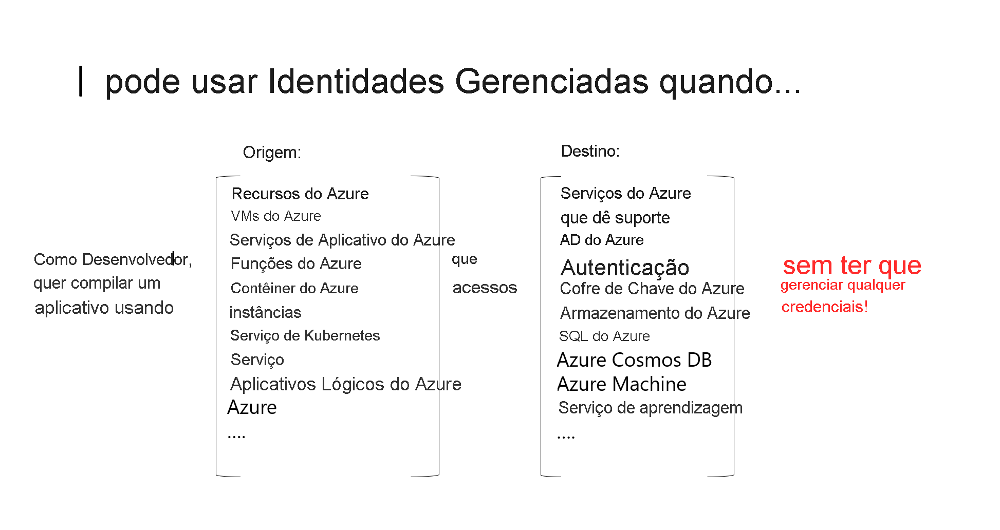

# O que são identidades gerenciadas para recursos do Azure?

Um desafio comum para desenvolvedores é o gerenciamento de segredos e credenciais para proteger a comunicação entre diferentes serviços. No Azure, as identidades gerenciadas eliminam a necessidade de os desenvolvedores precisarem gerenciar credenciais fornecendo uma identidade para o recurso do Azure no Azure AD e a usando para obter tokens do Azure AD (Azure Active Directory). Isso também ajuda a acessar o [Azure Key Vault](../../key-vault/general/overview.md), em que os desenvolvedores podem armazenar credenciais de maneira segura. As identidades gerenciadas para recursos do Azure resolvem esse problema fornecendo serviços do Azure com uma identidade gerenciada automaticamente no Azure AD.

Para que uma identidade gerenciada pode ser usada?

   > [!VIDEO https://www.youtube.com/embed/5lqayO_oeEo]

Aqui estão alguns dos benefícios de usar identidades gerenciadas:

- Você não precisa gerenciar credenciais. As credenciais nem sequer estão acessíveis para você.
- Você pode usar identidades gerenciadas para fazer a autenticação em qualquer serviço do Azure que dê suporte à autenticação do Azure AD incluindo o Azure Key Vault.
- Identidades gerenciadas podem ser usadas sem nenhum custo adicional.

> [!NOTE]
> Identidades gerenciadas para recursos do Azure é o novo nome para o serviço anteriormente conhecido como MSI (Identidade de Serviço Gerenciada).

## Tipos de identidade gerenciada

Há dois tipos de identidades gerenciadas:

- **Atribuídas pelo sistema** Alguns serviços do Azure permitem que você habilite uma identidade gerenciada diretamente em uma instância de serviço. Quando você habilita uma identidade gerenciada atribuída pelo sistema, uma identidade é criada no Azure AD que está vinculada ao ciclo de vida dessa instância de serviço. Assim, quando o recurso é excluído, o Azure exclui automaticamente a identidade para você. Por design, somente o recurso do Azure pode usar essa identidade para solicitar tokens do Azure AD.
- **Atribuídas pelo usuário** Você também pode criar uma identidade gerenciada como um recurso autônomo do Azure. Você pode [criar uma identidade gerenciada atribuída pelo usuário](how-to-manage-ua-identity-portal.md) e atribuí-la a uma ou mais instâncias de um serviço do Azure. No caso de identidades gerenciadas atribuídas pelo usuário, a identidade é gerenciada separadamente dos recursos que a usam.   

  > [!VIDEO https://www.youtube.com/embed/OzqpxeD3fG0]

A tabela abaixo mostra as diferenças entre os dois tipos de identidades gerenciadas.

|  Propriedade    | Identidade gerenciada atribuída pelo sistema | Identidade gerenciada atribuída pelo usuário |
|------|----------------------------------|--------------------------------|
| Criação |  Criada como parte de um recurso do Azure (por exemplo, uma máquina virtual do Azure ou o Serviço de Aplicativo do Azure) | Criada como um recurso independente do Azure |
| Ciclo de vida | Ciclo de vida compartilhado com o recurso do Azure com o qual a identidade gerenciada é criada.   Quando o recurso pai é excluído, a identidade gerenciada também é excluída. | Ciclo de vida independente.   Precisa ser explicitamente excluída. |
| Compartilhamento entre recursos do Azure | Não pode ser compartilhada.   Só pode ser associada a um único recurso do Azure. | Pode ser compartilhada   A mesma identidade gerenciada atribuída pelo usuário pode ser associada a mais de um recurso do Azure. |
| Casos de uso comuns | Cargas de trabalho que estão contidas em um único recurso do Azure   Cargas de trabalho para as quais você precisa de identidades independentes.   Por exemplo, um aplicativo que é executado em uma única máquina virtual | Cargas de trabalho que são executadas em vários recursos e que podem compartilhar uma única identidade.   Cargas de trabalho que precisam de pré-autorização para um recurso seguro como parte de um fluxo de provisionamento.   Cargas de trabalho em que os recursos são reciclados com frequência, mas as permissões devem permanecer consistentes.   Por exemplo, uma carga de trabalho em que várias máquinas virtuais precisam acessar o mesmo recurso |

>[!IMPORTANT]
>Independentemente do tipo de identidade escolhida, a identidade gerenciada é uma entidade de serviço de um tipo especial que só pode ser usado com recursos do Azure. Quando a identidade gerenciada é excluída, a entidade de serviço correspondente é removida automaticamente.

## Como usar identidades gerenciadas para recursos do Azure?

## O recurso tem suporte de quais serviços do Azure?

As identidades gerenciadas para recursos do Azure podem ser usadas para autenticar os serviços que são compatíveis com a autenticação do Azure AD. Para obter uma lista de serviços do Azure que dão suporte para identidades gerenciadas para a funcionalidade de recursos do Azure, veja [Serviços que dão suporte a identidades gerenciadas para recursos do Azure](./services-support-managed-identities.md).

## Próximas etapas

* [Usar uma identidade gerenciada atribuída pelo sistema da VM do Windows para acessar o Resource Manager](tutorial-windows-vm-access-arm.md)
* [Usar uma identidade gerenciada atribuída pelo sistema da VM do Linux para acessar o Resource Manager](tutorial-linux-vm-access-arm.md)
* [Como usar identidades gerenciadas para o Serviço de Aplicativo e o Azure Functions](../../app-service/overview-managed-identity.md)
* [Como usar identidades gerenciadas com Instâncias de Contêiner do Azure](../../container-instances/container-instances-managed-identity.md)
* [Como implementar identidades gerenciadas para recursos do Microsoft Azure](https://www.pluralsight.com/courses/microsoft-azure-resources-managed-identities-implementing).