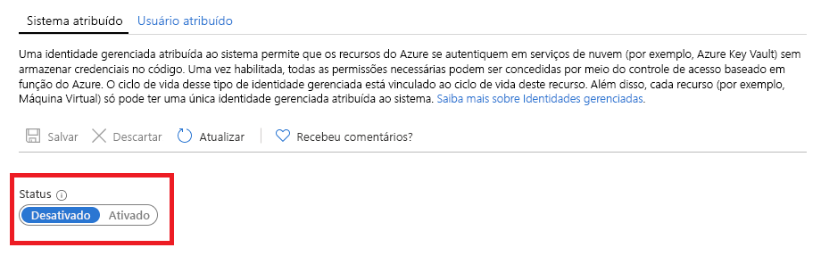

# O que são identidades gerenciadas para recursos do Azure?

[!INCLUDE [preview-notice](../../../includes/active-directory-msi-preview-notice.md)]

Como um desenvolvedor de nuvem, você provavelmente está procurando o método mais simples e seguro de acessar os recursos do Azure em seu código. 

As identidades gerenciadas para recursos do Azure podem ajudar você com esse requisito, pois elas:

- **Eliminam** a necessidade de credenciais em seu código.
- **Giram** as credenciais automaticamente.
- **Reduzem** seu envolvimento no gerenciamento de identidades a um mínimo.

## Como ele funciona 

Todos os recursos do Azure que dão suporte a identidades gerenciadas podem obter tokens para trocar dados sem ter credenciais no código. O processo consiste nas seguintes etapas:

 
1.  **Habilitar** – crie a identidade gerenciada para o recurso.
2.  **Conceder acesso** – permita acesso a recursos com o RBAC do Azure.
3.  **Acessar** – execute as ações permitidas.
4.  **Desabilitar** – exclua a identidade gerenciada. 

## Tipos de identidade gerenciada

Há dois tipos de identidades gerenciadas:

- Identidade gerenciada atribuída pelo sistema

- Identidade gerenciada atribuída pelo usuário

Para recursos autônomos do Azure, você pode habilitar identidades gerenciadas **atribuídas pelo sistema**. As identidades gerenciadas atribuídas pelo sistema fornecem o suporte mais conveniente da perspectiva do gerenciamento de identidades. Com apenas um clique, você pode habilitar o gerenciamento automatizado do ciclo de vida de uma identidade para seu recurso.   

   

Embora as identidades gerenciadas atribuídas pelo sistema forneçam a solução mais conveniente para recursos autônomos, a situação muda se você precisa gerenciar um grupo de recursos do Azure para a mesma tarefa. Nesse cenário, é melhor criar uma identidade manualmente e atribuir essa identidade mestra a todos os recursos do Azure que você precisa agrupar. Essa atribuição é conhecida como identidade gerenciada **atribuída pelo usuário**. 
  

## Serviços com suporte

Você pode usar identidades gerenciadas para recursos do Azure podem para autenticar os serviços que são compatíveis com a autenticação do Azure AD. Para obter uma lista de serviços do Azure que dão suporte para identidades gerenciadas para a funcionalidade de recursos do Azure, veja [Serviços que dão suporte a identidades gerenciadas para recursos do Azure](services-support-msi.md).

## Próximas etapas

Comece a usar as identidades gerenciadas para funcionalidade de recursos do Azure com os seguintes inícios rápidos:

* [Usar uma identidade gerenciada atribuída pelo sistema da VM do Windows para acessar o Resource Manager](tutorial-windows-vm-access-arm.md)
* [Usar uma identidade gerenciada atribuída pelo sistema da VM do Linux para acessar o Resource Manager](tutorial-linux-vm-access-arm.md)
