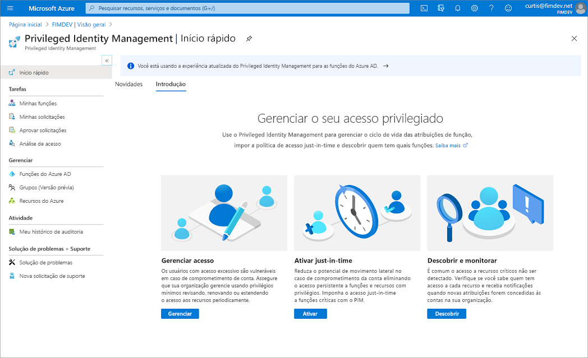

# O que é o Azure AD Privileged Identity Management?

 O PIM (Privileged Identity Management) é um serviço no Azure AD (Azure Active Directory) que permite gerenciar, controlar e monitorar o acesso a importantes recursos na sua organização. Esses recursos incluem os recursos no Azure AD, no Azure e em outros Microsoft Online Services, como o Microsoft 365 ou o Microsoft Intune. O vídeo a seguir apresenta os principais conceitos e recursos do PIM.
  

> [!VIDEO https://www.youtube.com/embed/f-0K7mRUPpQ]

## Motivos para usá-lo

As empresas desejam minimizar o número de pessoas que têm acesso a informações seguras ou recursos, porque isso reduz a chance de um ator mal-intencionado obter esse tipo de acesso ou um usuário autorizado afetar acidentalmente um recurso confidencial. No entanto, os usuários ainda precisam executar operações privilegiadas em aplicativos do Azure AD, Azure, Microsoft 365 ou SaaS. As organizações podem proporcionar aos usuários acesso privilegiado Just-In-Time aos recursos do Azure e ao Azure AD. É preciso supervisionar o que esses usuários estão fazendo com seus privilégios de administrador.

## O que ela faz?

O Privileged Identity Management fornece ativação de função baseada em tempo e aprovação para atenuar os riscos de permissões de acesso excessivas, desnecessárias ou que foram indevidamente utilizadas em recursos importantes. Estes são alguns dos principais recursos do Privileged Identity Management:

- Fornecer acesso privilegiado **just-in-time** ao Azure AD e aos recursos do Azure
- Atribua acesso com **limite de tempo** aos recursos usando as datas de início e término
- Exigir **aprovação** para ativar funções com privilégios
- Impor **autenticação multifator** para ativar qualquer função
- Usar **justificativa** para entender por que os usuários ativam
- Obter **notificações** quando as funções privilegiadas forem ativadas
- Realizar **revisões de acesso** para garantir que os usuários ainda precisem de funções
- Baixar o **histórico de auditoria** para auditoria interna ou externa

## O que posso fazer com ele?

Depois de configurar o Privileged Identity Management, você verá as opções **Tarefas**, **Gerenciar** e **Atividade** no menu de navegação à esquerda. Como administrador, você escolherá entre opções como gerenciar **funções do Azure AD**, gerenciar funções do **recurso do Azure** ou grupos de acesso privilegiado. Ao escolher o que você deseja gerenciar, você verá o conjunto apropriado de opções para essa opção.

## Quem pode fazer o quê?

Para as funções do Azure AD no Privileged Identity Management, somente um usuário que está na função de administrador de funções com privilégios ou administrador global pode gerenciar atribuições para outros administradores. Você pode [permitir acesso a outros administradores para gerenciar o Privileged Identity Management](pim-how-to-give-access-to-pim.md). Os Administradores globais, os Administradores de segurança, os Leitores globais e os Leitores de segurança também podem exibir as atribuições às funções do Azure AD no Privileged Identity Management.

Para as funções de recurso do Azure no Privileged Identity Management, somente um administrador de assinatura, um proprietário de recurso ou um administrador de acesso de usuário de recurso pode gerenciar atribuições para outros administradores. Por padrão, os usuários que são Administradores de funções com privilégios, Administradores da segurança ou Leitores de segurança não têm acesso para exibir as atribuições às funções de recurso do Azure no Privileged Identity Management.

## Cenários

O PIM dá suporte aos seguintes cenários:

### Permissões do Administrador de funções com privilégios

- Habilitar a aprovação para funções específicas
- Especificar usuários ou grupos aprovadores para aprovar solicitações
- Exibir o histórico de solicitações e aprovações de todas as funções com privilégios

### Permissões do aprovador

- Exibir as aprovações pendentes (solicitações)
- Aprovar ou rejeitar solicitações de elevação de função (única e em massa)
- Fornecer uma justificativa para minha aprovação ou rejeição

### Permissões de usuário de função qualificado

- Solicitar a ativação de uma função que exige aprovação
- Exibir o status de sua solicitação a ser ativada
- Concluir a tarefa no Azure AD caso a ativação tenha sido aprovada

## Terminologia

Para entender melhor o Privileged Identity Management e a documentação dele, examine os termos a seguir.

| Termo ou conceito | Categoria de atribuição de função | Descrição |
| --- | --- | --- |
| qualificado | Type | Uma atribuição de função que requer que um usuário execute uma ou mais ações para usá-la. Se um usuário se qualificou para uma função, isso significa que ele poderá ativá-la quando precisar executar tarefas privilegiadas. Não há nenhuma diferença no modo de acesso concedido a uma pessoa com uma atribuição de função permanente em comparação com uma qualificada. A única diferença é que algumas pessoas não precisam desse acesso o tempo todo. |
| ativo | Type | Uma atribuição de função que não requer que um usuário execute nenhuma ação para usar a função. Usuários atribuídos como ativos têm os privilégios atribuídos à função. |
| ativar |  | O processo de execução de uma ou mais ações a fim de usar uma função para a qual um usuário está qualificado. As ações podem incluir a execução de uma verificação de MDA (Autenticação Multifator), fornecimento de uma justificativa comercial ou solicitação de aprovação dos aprovadores designados. |
| atribuída | Estado | Um usuário que tem uma atribuição de função ativa. |
| ativada | Estado | Um usuário que tem uma atribuição de função qualificada, executou as ações para ativar a função e agora está ativo.  Depois que a função for ativada, o usuário poderá usar a função por um período pré-configurado antes de precisar ativá-la novamente. |
| qualificada permanentemente | Duration | Uma atribuição de função em que um usuário sempre está qualificado para ativar a função. |
| permanentemente ativa | Duration | Uma atribuição de função em que um usuário sempre pode usar a função sem executar nenhuma ação. |
| tempo associado qualificado | Duração | Uma atribuição de função em que um usuário está qualificado para ativar a função somente na data de início e término especificada. |
| tempo associado ativo | Duração | Uma atribuição de função em que um usuário pode usar determinada função somente na data de início e término especificada. |
| Acesso JIT (Just-In-Time) |  | Um modelo no qual os usuários recebem permissões temporárias para executar tarefas privilegiadas, o que impede que usuários mal-intencionados ou não autorizados obtenham acesso após a expiração das permissões. O acesso é concedido somente quando os usuários precisam dele. |
| princípio de acesso de privilégios mínimos |  | Uma prática de segurança recomendada na qual todos os usuários recebem apenas os privilégios mínimos necessários para realizar as tarefas que estão autorizados a executar. Essa prática minimiza o número de Administradores Globais usando funções de administrador específicas para determinados cenários. |

## Requisitos de licença

[!INCLUDE [Azure AD Premium P2 license](../../../includes/active-directory-p2-license.md)]

Para obter informações sobre licenças para usuários, confira [Requisitos de licença para usar o Privileged Identity Management](subscription-requirements.md).

## Próximas etapas

- [Requisitos de licença para usar o Privileged Identity Management](subscription-requirements.md)
- [Protegendo o acesso privilegiado para implantações de nuvem e híbridos no Azure AD](../roles/security-planning.md?toc=%2fazure%2factive-directory%2fprivileged-identity-management%2ftoc.json)
- [Implantar o Privileged Identity Management](pim-deployment-plan.md)
