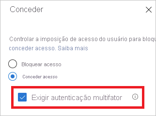

# O que é o diagnóstico de entrada no Azure AD?

O Azure AD (Active Directory) fornece um modelo de segurança flexível para controlar o que os usuários podem fazer com os recursos gerenciados. O acesso a esses recursos é controlado não só por *quem* os acessa, mas também por *como* são acessados. Normalmente, um modelo flexível vem com um certo grau de complexidade devido ao número de opções de configuração que você tem. A complexidade tem o potencial de aumentar o risco de erros.

Como administrador de TI, você precisa de uma solução que forneça insights sobre as atividades em seu sistema. Essa visibilidade pode permitir que você diagnostique e resolva problemas quando eles ocorrem. O diagnóstico de entrada do Azure AD é um exemplo dessa solução. Você pode usar o diagnóstico para analisar o que aconteceu durante uma tentativa de entrada e obter recomendações para resolver problemas sem precisar envolver o Suporte da Microsoft.

Este artigo fornece uma visão geral do que a solução faz e como você pode usá-la.

## Requisitos

O diagnóstico de entrada está disponível em todas as edições do Azure AD.

Você precisa ser um Administrador global no Azure AD para usá-lo.

## Como ele funciona

No Azure AD, a resposta a uma tentativa de entrada está associada a *quem* entra e *como* a pessoa acessa o locatário. Por exemplo, um administrador normalmente pode configurar todos os aspectos do locatário quando entra na rede corporativa. Mas o mesmo usuário pode ser bloqueado quando entra com a mesma conta de uma rede não confiável.

Devido à maior flexibilidade do sistema para responder a uma tentativa de entrada, você poderá terminar em cenários em que precise solucionar problemas de entradas. O diagnóstico de entrada é um recurso que:

- Analisa dados de eventos de entrada.

- Exibe o que aconteceu.

- Fornece recomendações sobre como resolver problemas.

O diagnóstico de entrada para o Azure AD foi projetado para habilitar o autodiagnóstico de erros de entrada. Para concluir o processo de diagnóstico, você precisará:

1. Defina o escopo dos eventos de entrada do seu interesse.

2. Selecione a entrada que deseja examinar.

3. Examine os resultados do diagnóstico.

4. Execute a ação.

### Definir o escopo

A meta desta etapa é definir o escopo para os eventos de entrada que deseja investigar. Seu escopo é baseado em um usuário ou um identificador (correlationId, requestId) e um intervalo de tempo. Para restringir ainda mais o escopo, você pode especificar um nome de aplicativo. O Azure AD usa as informações de escopo para localizar os eventos certos para você.  

### Selecionar a entrada  

Com base nos critérios de pesquisa, o Azure AD recupera todos os eventos de entrada correspondentes e as apresenta em uma exibição de lista de resumo de autenticação.

Você pode personalizar as colunas mostradas nessa exibição.

### Examinar o diagnóstico

Para o evento de entrada selecionado, o Azure AD fornece os resultados de diagnóstico.

Esses resultados começam com uma avaliação, que explica o que aconteceu em algumas frases. A explicação ajuda você a entender o comportamento do sistema.

Em seguida, você obtém um resumo das políticas de acesso condicional relacionadas que foram aplicadas ao evento de entrada selecionado. Os resultados de diagnóstico também incluem as etapas de correção recomendadas para resolver o problema. Como nem sempre é possível resolver problemas sem ajuda adicional, uma etapa recomendada pode ser a abertura de um tíquete de suporte.

### Executar ação

Neste ponto, você deverá ter as informações necessárias para corrigir o problema.

## Cenários

Os seguintes cenários são abrangidos pelo diagnóstico de entrada:

- Bloqueado pelo acesso condicional

- Acesso condicional com falha

- MFA (autenticação multifator) do acesso condicional

- MFA por meio de outros requisitos

- Verificação da MFA necessária

- Verificação de MFA necessária (localização de entrada suspeita)

- Entrada bem-sucedida

### Bloqueado pelo acesso condicional

Nesse cenário, uma tentativa de entrada foi bloqueada por uma política de acesso condicional.

A seção de diagnóstico desse cenário mostra os detalhes sobre o evento de entrada do usuário e as políticas aplicadas.

### Acesso condicional com falha

Esse cenário normalmente é um resultado de uma tentativa de entrada que falhou devido aos requisitos de uma política de acesso condicional não serem atendidos. Alguns exemplos comuns são:

- Exigir um dispositivo ingressado no Azure AD híbrido

- Exigir um aplicativo cliente aprovado

- Requer política de proteção do aplicativo

A seção de diagnóstico deste cenário mostra os detalhes sobre a tentativa de entrada do usuário e as políticas aplicadas.

### MFA por meio do acesso condicional

Nesse cenário, uma política de acesso condicional tem o requisito de entrar usando a autenticação multifator definida.

A seção de diagnóstico deste cenário mostra os detalhes sobre a tentativa de entrada do usuário e as políticas aplicadas.

### MFA por meio de outros requisitos

Nesse cenário, um requisito de autenticação multifator não foi imposto por uma política de acesso condicional. Por exemplo, a autenticação multifator por usuário.

A intenção deste cenário de diagnóstico é fornecer mais detalhes sobre:

- A origem da interrupção da autenticação multifator
- O resultado da interação do cliente

Você também pode ver todos os detalhes da tentativa de entrada do usuário.

### Verificação da MFA necessária

Nesse cenário, tentativas de entrada foram interrompidas por solicitações para configurar a autenticação multifator. Essa configuração também é conhecida como verificação.

A verificação da autenticação multifator ocorre quando um usuário precisa usar a autenticação multifator, mas ainda não a configurou, ou um administrador exigiu que o usuário a configurasse.

A intenção desse cenário de diagnóstico é revelar que a interrupção da autenticação multifator foi devido à falta de configuração do usuário. A solução recomendada é que o usuário conclua a verificação.

### Verificação de MFA necessária (localização de entrada suspeita)

Nesse cenário, as tentativas de entrada foram interrompidas por uma solicitação para configurar a autenticação multifator em uma localização de entrada suspeita.

A intenção desse cenário de diagnóstico é revelar que a interrupção da autenticação multifator foi devido à falta de configuração do usuário. A solução recomendada é que o usuário conclua a verificação, especificamente em uma localização de rede que não parece suspeito.

Por exemplo, se uma rede corporativa for definida como uma localização nomeada, o usuário deverá tentar fazer a verificação na rede corporativa.

### Entrada bem-sucedida

Nesse cenário, os eventos de entrada não foram interrompidos pelo acesso condicional nem pela autenticação multifator.

Esse cenário de diagnóstico fornece detalhes sobre eventos de entrada do usuário que devem ser interrompidos devido a políticas de acesso condicional ou à autenticação multifator.

## Próximas etapas

- [O que são os relatórios do Azure Active Directory?](overview-reports.md)
- [O que é o monitoramento do Azure Active Directory?](overview-monitoring.md)
