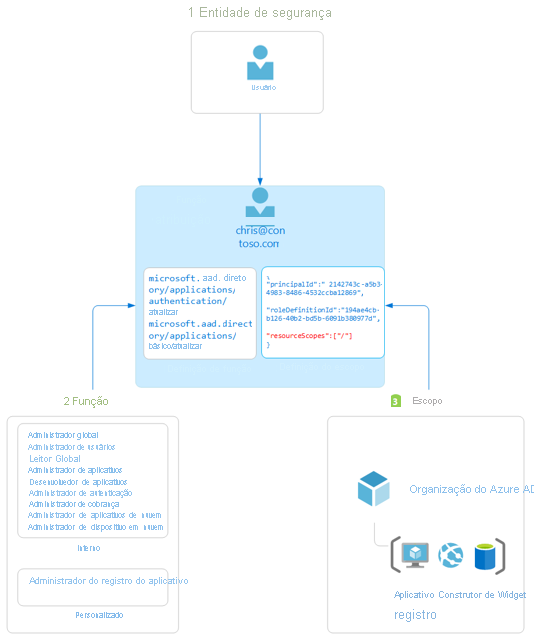

# Visão geral do controle de acesso baseado em função no Azure Active Directory

Este artigo descreve o controle de acesso baseado em função do Azure AD (Azure Active Directory). As funções do Azure AD permitem conceder permissões granulares aos administradores, cumprindo o princípio dos privilégios mínimos. As funções internas e personalizadas do Azure AD operam segundo conceitos semelhantes aos que você encontrará no [sistema de controle de acesso baseado em função para recursos do Azure](../../role-based-access-control/overview.md) (funções do Azure). A [diferença entre esses dois sistemas de controle de acesso baseado em função](../../role-based-access-control/rbac-and-directory-admin-roles.md) é:

- As funções do Azure AD controlam o acesso a recursos do Azure AD como usuários, grupos e aplicativos usando a API do Graph
- As funções do Azure controlam o acesso a recursos do Azure como máquinas virtuais ou armazenamento usando o Gerenciamento de Recursos do Azure

Os dois sistemas têm semelhanças no uso de definições de função e atribuições de função. No entanto, as permissões de função do Azure AD não podem ser usadas em funções personalizadas do Azure e vice-versa.

## Noções básicas sobre o controle de acesso baseado em função do Azure AD
O Azure AD dá suporte a dois tipos de definições de função:
* [Funções internas](./permissions-reference.md)
* [Funções personalizadas](./custom-create.md)

As funções internas são funções prontas para uso que têm um conjunto fixo de permissões. Essas definições de função não podem ser modificadas. Há muitas [funções internas](./permissions-reference.md) às quais o Azure AD dá suporte, e a lista está crescendo. Para arredondar as bordas e atender aos seus requisitos sofisticados, o Azure AD também dá suporte a [funções personalizadas](./custom-create.md). Conceder permissão usando funções personalizadas do Azure AD é um processo de duas etapas que envolve a criação de uma definição de função personalizada e, em seguida, a atribuição dela usando uma atribuição de função. Uma definição de função personalizada é uma coleção de permissões que podem ser adicionadas de uma lista predefinida. Essas permissões são as mesmas permissões usadas nas funções internas.  

Quando você tiver criado sua definição de função personalizada (ou usando uma função interna), você poderá atribuí-la a um usuário criando uma atribuição de função. Uma atribuição de função concede ao usuário as permissões em uma definição de função em um escopo especificado. Esse processo de duas etapas permite criar uma única definição de função e atribuí-la muitas vezes em escopos diferentes. Um escopo define o conjunto de recursos do Azure AD ao qual o membro da função tem acesso. O escopo mais comum é o escopo de toda a organização (toda a empresa). Uma função personalizada pode ser atribuída no escopo de toda a organização, o que significa que o membro da função tem as permissões de função sobre todos os recursos na empresa. Uma função personalizada também pode ser atribuída em um escopo de objeto. Um exemplo de escopo de objeto seria um único aplicativo. A mesma função pode ser atribuída a um usuário em todos os aplicativos da organização e, em seguida, a outro usuário com um escopo apenas do aplicativo de Relatórios de Despesas da Contoso.  

### Como o Azure AD determina se um usuário tem acesso a um recurso

Veja a seguir as etapas de alto nível que o Azure AD usa para determinar se você tem acesso a um recurso de gerenciamento. Use essas informações para solucionar problemas de acesso.

1. Um usuário (ou entidade de serviço) adquire um token para o ponto de extremidade do Microsoft Graph ou do Azure AD Graph.
1. O usuário faz uma chamada à API para o Azure AD (Azure Active Directory) por meio do Microsoft Graph ou do Azure AD Graph usando o token emitido.
1. Dependendo da circunstância, o Azure AD usa uma das seguintes ações:
   - Avalia as associações de função do usuário com base na [declaração de wids](../../active-directory-b2c/access-tokens.md) no token de acesso do usuário.
   - Recupera todas as atribuições de função que se aplicam para usuário, diretamente ou por meio da associação de grupo, ao recurso no qual a ação está sendo executada.
1. O Azure AD determina se a ação na chamada à API está incluída nas funções que o usuário tem para este recurso.
1. Se o usuário não tem uma função com a ação no escopo solicitado, o acesso não é concedido. Caso contrário, o acesso será permitido.

## Atribuição de função

Uma atribuição de função é um recurso do Azure AD que anexa uma *definição de função* a um *usuário* em um *escopo* específico para conceder acesso a recursos do Azure AD. O acesso é concedido criando uma atribuição de função, e é revogado removendo uma atribuição de função. Em essência, uma atribuição de função consiste em três elementos:

- Usuário do Azure AD
- Definição de função
- Escopo do recurso

Você pode [criar atribuições de função](custom-create.md) usando o portal do Azure, o Azure AD PowerShell ou a API do Graph. Você também pode [listar as atribuições de função](view-assignments.md).

O diagrama a seguir mostra um exemplo de uma atribuição de função. Neste exemplo, foi atribuída a Chris Green a função personalizada de Administrador de registro de aplicativo no escopo do registro de aplicativo do Construtor de Widgets da Contoso. A atribuição concede a Chris as permissões da função de Administrador de registro de aplicativo apenas para esse registro de aplicativo específico.

### Entidade de segurança

A entidade de segurança representa o usuário que deve receber acesso aos recursos do Azure AD. Um usuário é um indivíduo que tem um perfil do usuário no Azure Active Directory.

### Função

Uma definição de função, ou função, é um conjunto de permissões. Uma definição de função lista as operações que podem ser executadas em recursos do Azure AD, como criação, leitura, atualização e exclusão. Há dois tipos de funções no Azure AD:

- Funções internas criadas pela Microsoft que não podem ser alteradas.
- Funções personalizadas criadas e gerenciadas pela sua organização.

### Escopo

Um escopo é a restrição de ações permitidas a um recurso específico do Azure AD como parte de uma atribuição de função. Ao atribuir uma função, você pode especificar um escopo que limita o acesso do administrador a um recurso específico. Por exemplo, se desejar conceder uma função personalizada a um desenvolvedor, mas apenas para gerenciar um registro de aplicativo específico, você poderá incluir o registro de aplicativo específico como um escopo na atribuição de função.

## Plano de licença necessária

O uso de funções internas no Azure AD é gratuito, enquanto as funções personalizadas exigem uma licença P1 do Azure AD Premium. Para localizar a licença correta para os requisitos, consulte [Comparar recursos geralmente disponíveis nas edições Gratuita, Básica e Premium](https://azure.microsoft.com/pricing/details/active-directory).

## Próximas etapas

- [Entender as funções do Azure AD](concept-understand-roles.md)
- Criar atribuições de função personalizada usando [o portal do Azure, o Azure AD PowerShell e a API do Graph](custom-create.md)
- [Listar atribuições de função](view-assignments.md)