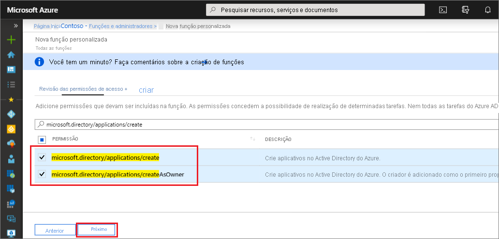

# <a name="quickstart-grant-permission-to-create-unlimited-app-registrations"></a>Início Rápido: Conceder permissão para criar registros de aplicativo ilimitados

Neste guia de início rápido, você criará uma função personalizada com permissão para criar um número ilimitado de registros de aplicativo e, em seguida, atribuirá essa função a um usuário. O usuário atribuído pode usar o portal do Azure AD, o PowerShell do Azure AD ou a API do Microsoft Graph para criar registros de aplicativo. Diferentemente da função de Desenvolvedor de Aplicativos interna, essa função personalizada concede a capacidade de criar um número ilimitado de registros de aplicativo. A função de Desenvolvedor de Aplicativos concede a capacidade, mas o número total de objetos criados é limitado a 250 para evitar atingir [a cota de objeto de todo o diretório](../enterprise-users/directory-service-limits-restrictions.md). A função menos privilegiada necessária para criar e atribuir funções personalizadas do Azure AD é a de Administrador de funções com privilégios.

Se você não tiver uma assinatura do Azure, [crie uma conta gratuita](https://azure.microsoft.com/free/) antes de começar.

## <a name="create-a-custom-role-using-the-azure-ad-portal"></a>Criar uma função personalizada usando o portal do Azure AD

1. Entre no [centro de administração do Azure AD](https://aad.portal.azure.com) com permissões do administrador de funções com privilégios ou administrador global na organização do Azure AD.
1. Selecione **Azure Active Directory**, selecione **Funções e administradores** e, em seguida, selecione **Nova função personalizada**.

    

1. Na guia **Noções Básicas**, forneça "Criador do Registro de Aplicativo" para o nome da função e "Pode criar um número ilimitado de registros de aplicativo" para a descrição da função e, em seguida, selecione **Próximo**.

    

1. Na guia **Permissões**, digite "microsoft.directory/applications/create" na caixa de pesquisa e, em seguida, marque as caixas de seleção ao lado das permissões desejadas e selecione **Próximo**.

    

1. Na guia **Examinar + criar**, examine as permissões e selecione **Criar**.

### <a name="assign-the-role-in-the-azure-ad-portal"></a>Atribuir a função no portal do Azure AD

1. Entre no [centro de administração do Azure AD](https://aad.portal.azure.com) com permissões do administrador de funções com privilégios ou administrador global na organização do Azure AD.
1. Selecione **Azure Active Directory** e, em seguida, selecione **Funções e administradores**.
1. Selecione a função Criador de Registro de Aplicativo e selecione **Adicionar atribuição**.
1. Selecione o usuário desejado e clique em **Selecionar** para adicioná-lo à função.

Feito! Neste guia de início rápido, você criou com êxito uma função personalizada com permissão para criar um número ilimitado de registros de aplicativo e, em seguida, atribuirá essa função a um usuário.

> [!TIP]
> Para atribuir a função a um aplicativo usando o portal do Azure AD, insira o nome do aplicativo na caixa de pesquisa da página de atribuição. Os aplicativos não são mostrados na lista por padrão, mas são retornados nos resultados da pesquisa.

### <a name="app-registration-permissions"></a>Permissões de registro de aplicativo

Há duas permissões disponíveis para conceder a capacidade de criar registros de aplicativo, cada um com um comportamento diferente.

- microsoft.directory/applications/createAsOwner: a atribuição dessa permissão faz com que o criador seja adicionado como o primeiro proprietário do registro do aplicativo criado, e o registro do aplicativo criado será contabilizado na cota de 250 objetos criados do criador.
- microsoft.directory/applications/create: a atribuição dessa permissão faz com que o criador não seja adicionado como o primeiro proprietário do registro do aplicativo criado, e o registro do aplicativo criado não será contabilizado na cota de 250 objetos criados do criador. Use essa permissão com cuidado, pois não há nada impedindo que o destinatário crie registros de aplicativo até que a cota de nível de diretório seja atingida. Se ambas as permissões forem atribuídas, essa permissão terá precedência.

## <a name="create-a-custom-role-in-azure-ad-powershell"></a>Criar uma função personalizada no PowerShell do Azure AD

### <a name="prepare-powershell"></a>Preparar o PowerShell

Primeiro, instale o módulo do Azure AD PowerShell da [Galeria do PowerShell](https://www.powershellgallery.com/packages/AzureADPreview/2.0.0.17). Em seguida, importe o módulo de versão prévia do Azure AD PowerShell usando o seguinte comando:

```powershell
Import-Module -Name AzureADPreview
```

Para verificar se o módulo está pronto para uso, a versão retornada pelo seguinte comando deve coincidir com o comando listado aqui:

```powershell
Get-Module -Name AzureADPreview
  ModuleType Version      Name                         ExportedCommands
  ---------- ---------    ----                         ----------------
  Binary     2.0.0.115    AzureADPreview               {Add-AzureADAdministrati...}
```

### <a name="create-the-custom-role-in-azure-ad-powershell"></a>Criar a função personalizada no PowerShell do Azure AD

Crie uma função usando o seguinte script do PowerShell:

```powershell

# Basic role information
$displayName = "Application Registration Creator"
$description = "Can create an unlimited number of application registrations."
$templateId = (New-Guid).Guid

# Set of permissions to grant
$allowedResourceAction =
@(
    "microsoft.directory/applications/create"
    "microsoft.directory/applications/createAsOwner"
)
$rolePermissions = @{'allowedResourceActions'= $allowedResourceAction}

# Create new custom admin role
$customRole = New-AzureAdMSRoleDefinition -RolePermissions $rolePermissions -DisplayName $displayName -Description $description -TemplateId $templateId -IsEnabled $true
```

### <a name="assign-the-role-in-azure-ad-powershell"></a>Atribuir a função no PowerShell do Azure AD

Atribua a função usando o seguinte script do PowerShell:

```powershell
# Get the user and role definition you want to link
$user = Get-AzureADUser -Filter "userPrincipalName eq 'Adam@contoso.com'"
$roleDefinition = Get-AzureADMSRoleDefinition -Filter "displayName eq 'Application Registration Creator'"

# Get resource scope for assignment
$resourceScope = '/'

# Create a scoped role assignment
$roleAssignment = New-AzureADMSRoleAssignment -ResourceScope $resourceScope -RoleDefinitionId $roleDefinition.Id -PrincipalId $user.objectId
```

## <a name="create-a-custom-role-in-the-microsoft-graph-api"></a>Criar uma função personalizada na API do Microsoft Graph

Solicitação HTTP para criar a função personalizada.

POST

``` HTTP
https://graph.microsoft.com/beta/roleManagement/directory/roleDefinitions
```

Corpo

```HTTP
{
    "description":"Can create an unlimited number of application registrations.",
    "displayName":"Application Registration Creator",
    "isEnabled":true,
    "rolePermissions":
    [
        {
            "resourceActions":
            {
                "allowedResourceActions":
                [
                    "microsoft.directory/applications/create"
                    "microsoft.directory/applications/createAsOwner"
                ]
            },
            "condition":null
        }
    ],
    "templateId":"<PROVIDE NEW GUID HERE>",
    "version":"1"
}
```

### <a name="assign-the-role-in-the-microsoft-graph-api"></a>Atribuir a função na API do Microsoft Graph

A atribuição de função combina uma ID de entidade de segurança (que pode ser um usuário ou uma entidade de serviço), ID de definição de função (função) e um escopo de recurso do Azure AD.

Solicitação HTTP à qual atribuir uma função personalizada.

POST

``` HTTP
https://graph.microsoft.com/beta/roleManagement/directory/roleAssignments
```

Corpo

``` HTTP
{
    "principalId":"<PROVIDE OBJECTID OF USER TO ASSIGN HERE>",
    "roleDefinitionId":"<PROVIDE OBJECTID OF ROLE DEFINITION HERE>",
    "resourceScopes":["/"]
}
```

## <a name="next-steps"></a>Próximas etapas

- Fique à vontade para compartilhar seus comentários conosco no [fórum de funções administrativas do Azure AD](https://feedback.azure.com/forums/169401-azure-active-directory?category_id=166032).
- Para obter mais informações sobre as atribuições de função do Azure AD, confira [Atribuir funções de administrador](permissions-reference.md).
- Para saber mais sobre as permissões de usuário padrão, confira uma [comparação entre as permissões de usuário membro e convidado padrão](../fundamentals/users-default-permissions.md).
