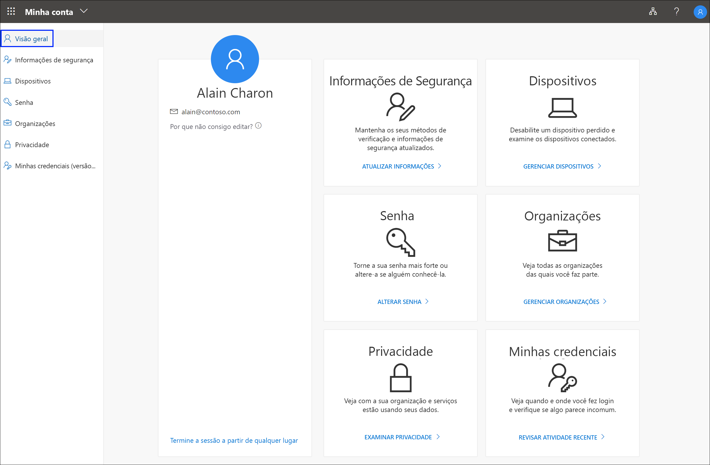

# O que é o portal Minha Conta?

No portal **Minha Conta**, você pode gerenciar sua conta corporativa ou de estudante configurando e gerenciando suas informações de segurança, gerenciando as organizações e dispositivos conectados e verificando como a organização usa seus dados.

Acesse o portal **Minha Conta** (https://myprofile.microsoft.com), da versão atual de um dos seguintes navegadores:

- Chrome
- Microsoft Edge
- Safari
- Firefox
- Internet Explorer 11

>[!Important]
>Este artigo destina-se a usuários que estão tentando acessar o portal Minha Conta para atualizar suas informações de segurança, informações do dispositivo, senha, organizações conectadas, privacidade ou informações de entrada anteriores. Caso seja um administrador que está em busca de informações sobre como ativar a autenticação e outros recursos do Azure AD (Azure Active Directory) para seus funcionários ou outros usuários, confira a [Documentação do Azure AD para administradores](https://docs.microsoft.com/azure/active-directory/).

## Próximas etapas

- Selecionar para exibir ou gerenciar suas [informações de segurança](user-help-security-info-overview.md)

- Exibir ou gerenciar seus [dispositivos](my-account-portal-devices-page.md) conectados

- Exibir e gerenciar suas [organizações](my-account-portal-organizations-page.md)

- Exibir sua [atividade de entrada](my-account-portal-sign-ins-page.md)

- Exibir como a organização [usa os dados relacionados à privacidade](my-account-portal-privacy-page.md)

## Conteúdo relacionado ao Microsoft Office

- [Entrar para gerenciar o produto do Office](https://support.office.com/article/sign-in-to-manage-your-office-product-959ac957-8d37-4ae4-b1b6-d6e4874e013f)

- [Ir para a página **Minha Conta** do Office](https://portal.office.com/account/)

- [Ir para a página **Minhas instalações** do Office](https://portal.office.com/account/#installs)

- [Ir para a página **Assinaturas** do Office](https://portal.office.com/account/#subscriptions)