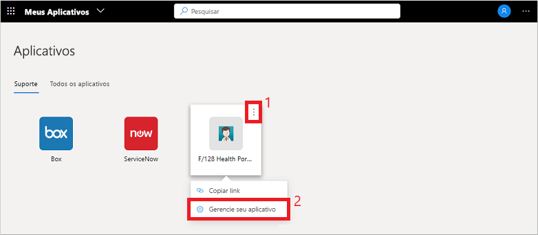
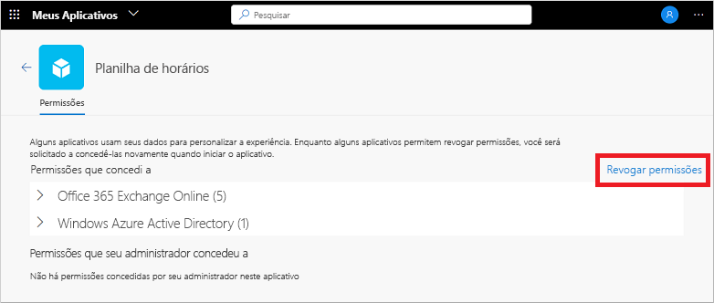

# Editar ou revogar permissões de aplicativos no portal Meus Aplicativos (versão prévia)

Ao usar aplicativos organizacionais no portal **Meus Aplicativos** (versão prévia), você geralmente concede permissões e salva as informações da conta. Para manter seus dados seguros, talvez você queira examinar e revogar permissões ou limpar as credenciais da conta salva. A remoção de permissões ou contas pode interromper algumas funcionalidades do aplicativo. Se você tiver problemas depois de remover permissões ou contas, entre em contato com o suporte técnico da sua organização para obter assistência adicional.

[!INCLUDE [preview-notice](../../../includes/active-directory-end-user-my-apps-and-workspaces.md)]

>[!Important]
>Este conteúdo destina-se aos usuários. Se você for administrador, poderá encontrar mais informações sobre como configurar e gerenciar seus aplicativos baseados em nuvem na [Documentação de Gerenciamento do Aplicativo](https://docs.microsoft.com/azure/active-directory/manage-apps/access-panel-workspaces).

## Gerenciar permissões do aplicativo

Para exibir as permissões consentidas por você ou seu administrador, selecione **...** ao passar o mouse sobre um aplicativo no portal **Meus Aplicativos** e, em seguida, selecione **Gerenciar seu aplicativo**:

A parte superior da janela de permissões mostra o que você consentiu pessoalmente. Os exemplos de permissões de aplicativos incluem a capacidade de acessar seu calendário, contatos ou câmera.

Você pode revogar qualquer uma das permissões que você consentiu selecionando **Revogar Permissões**, no entanto, a remoção de uma permissão pode interromper algumas das funcionalidades dos aplicativos. Se você tiver problemas depois de remover permissões ou contas, entre em contato com o suporte técnico da sua organização para obter assistência adicional.

A parte inferior da janela de permissões mostra o que o administrador consentiu em seu nome. Esta seção não será mostrada se não houver permissões consentidas pelo administrador. Você não pode revogar essas permissões porque o administrador consentiu a elas, e geralmente são necessárias para a política da sua organização.

## Próximas etapas

Depois de gerenciar as permissões do aplicativo e as contas salvas no portal **Meus Aplicativos**, você pode:

- Organize seus aplicativos em várias categorias criadas e fornecidas pela sua organização. Para saber mais, confira [Acessar e usar espaços de trabalho no portal Meus Aplicativos (versão prévia)](my-applications-portal-workspaces.md).

## Artigos relacionados

- [Atualizar suas informações de perfil e conta](my-account-portal-overview.md). Instruções sobre como atualizar suas informações pessoais exibidas no portal **Meus Perfil** (versão prévia).

- [Gerenciar suas organizações](my-account-portal-organizations-page.md). Instruções sobre como exibir e gerenciar suas informações relacionadas à organização na página **Organizações** do portal **Meu Perfil**.

- [Gerenciar seus dispositivos conectados](my-account-portal-devices-page.md). Instruções sobre como gerenciar os dispositivos aos quais você está conectado usando sua conta corporativa ou de estudante, na página **Dispositivos** do portal **Meu Perfil**.