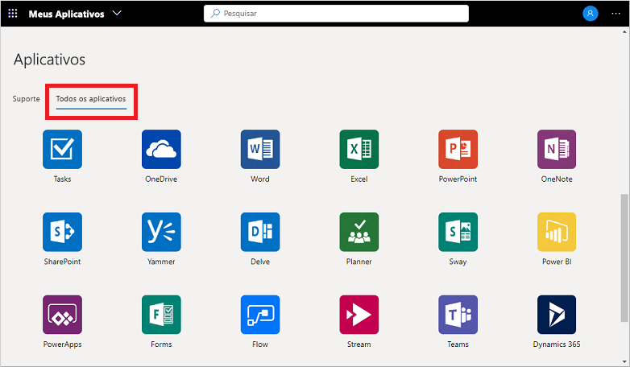

# Acesse e use espaços de trabalho no portal Meus Aplicativos (versão prévia)

Os espaços de trabalho são exibições de aplicativo diferentes que você vê no portal **Meus Aplicativos** (versão prévia). Os aplicativos podem ser agrupados em espaços de trabalho por função de departamento ou função de usuário, por exemplo. Se você não vê nenhum espaço de trabalho ou categoria disponível, significa que seu administrador não configurou ou compartilhou nenhum com você. Entre em contato com o suporte técnico da sua organização para obter assistência ou permissões adicionais para ver espaços de trabalho compartilhados.

[!INCLUDE [preview-notice](../../../includes/active-directory-end-user-my-apps-and-workspaces.md)]

>[!Important]
>Este conteúdo destina-se aos usuários. Se você for administrador, poderá encontrar mais informações sobre como configurar e gerenciar seus aplicativos baseados em nuvem na [Documentação de Gerenciamento do Aplicativo](https://docs.microsoft.com/azure/active-directory/manage-apps/access-panel-workspaces).

## Acessar aplicativos usando espaços de trabalho

Por padrão, a lista de espaços de trabalho no portal **Meus Aplicativos** exibe o espaço de trabalho **Todos os aplicativos**, que contém todos os aplicativos aos quais você tem acesso:

Qualquer outro espaço de trabalho que você vê nessa lista foi criado por seu administrador e compartilhado com você. Você pode escolher um desses espaços de trabalho para ver um conjunto de aplicativos com mais escopo, como *Suporte* no exemplo a seguir:

Ao selecionar e exibir um espaço de trabalho, você verá apenas os aplicativos padrão aos quais você tem acesso.

## Próximas etapas

Depois de organizar seus aplicativos em várias categorias no portal do **Meus Aplicativos**, você pode:

- Revisar, atualizar ou revogar permissões concedidas a aplicativos. Para saber mais, confira [Editar ou revogar permissões de aplicativos no portal Meus aplicativos (versão prévia)](my-applications-portal-permissions-saved-accounts.md).

## Artigos relacionados

- [Atualizar suas informações de perfil e conta](my-account-portal-overview.md). Instruções sobre como atualizar suas informações pessoais exibidas no portal **Meus Perfil** (versão prévia).

- [Gerenciar suas organizações](my-account-portal-organizations-page.md). Instruções sobre como exibir e gerenciar suas informações relacionadas à organização na página **Organizações** do portal **Meu Perfil**.

- [Gerenciar seus dispositivos conectados](my-account-portal-devices-page.md). Instruções sobre como gerenciar os dispositivos aos quais você está conectado usando sua conta corporativa ou de estudante, na página **Dispositivos** do portal **Meu Perfil**.