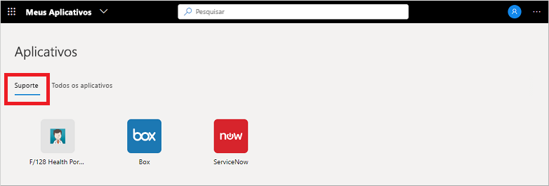

# Usar coleções no portal Meus Aplicativos

As coleções são diferentes exibições de aplicativo que você vê no portal **Meus Aplicativos**. Os aplicativos podem ser agrupados em coleções por função de departamento ou função de usuário, por exemplo. Se você não vê nenhuma coleção ou categoria disponível, isso significa que o administrador não configurou nem compartilhou nenhuma delas com você. Contate a assistência técnica da sua organização para obter assistência ou permissões adicionais para ver as coleções compartilhadas.

[!INCLUDE [preview-notice](../../../includes/active-directory-end-user-my-apps-and-workspaces.md)]

>[!Important]
>Este conteúdo destina-se aos usuários do portal **Meus Aplicativos**. Se você for administrador, poderá encontrar mais informações sobre como configurar e gerenciar seus aplicativos baseados em nuvem na [Documentação de Gerenciamento do Aplicativo](../manage-apps/access-panel-collections.md).

## Acessar aplicativos usando coleções

A lista de coleções do portal **Meus Aplicativos** mostra como padrão uma chamada **Todos os Aplicativos**, que contém todos os aplicativos aos quais você tem acesso:

Qualquer outra coleção exibida nessa lista foi criada pelo administrador e compartilhada com você. Você pode escolher uma dessas coleções para ver um conjunto de aplicativos com mais escopo, como *Suporte* no seguinte exemplo:

Ao selecionar e exibir uma coleção, você só verá os aplicativos padrão aos quais tem acesso.

## Próximas etapas

Depois de organizar seus aplicativos em várias categorias no portal do **Meus Aplicativos**, você pode:

- Revisar, atualizar ou revogar permissões concedidas a aplicativos. Para obter mais informações, confira [Editar ou revogar permissões de aplicativo no portal Meus Aplicativos](my-applications-portal-permissions-saved-accounts.md).

## Artigos relacionados

- [Atualizar suas informações de perfil e conta](my-account-portal-overview.md). Instruções sobre como atualizar suas informações pessoais exibidas no portal **Meu Perfil**.

- [Gerenciar suas organizações](my-account-portal-organizations-page.md). Instruções sobre como exibir e gerenciar suas informações relacionadas à organização na página **Organizações** do portal **Meu Perfil**.

- [Gerenciar seus dispositivos conectados](my-account-portal-devices-page.md). Instruções sobre como gerenciar os dispositivos aos quais você está conectado usando sua conta corporativa ou de estudante, na página **Dispositivos** do portal **Meu Perfil**.