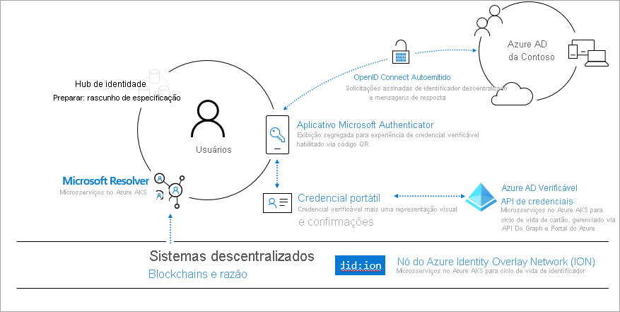
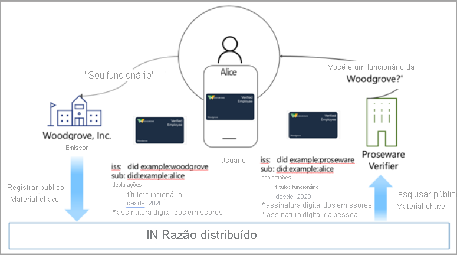
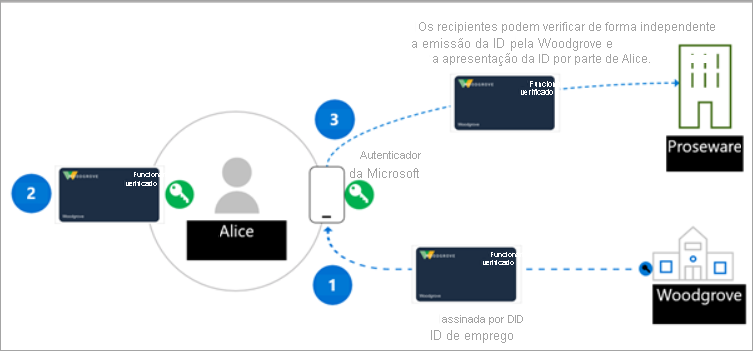

# <a name="introduction-to-azure-active-directory-verifiable-credentials-preview"></a>Introdução às Credenciais Verificáveis do Azure Active Directory (versão prévia)

> [!IMPORTANT]
> No momento, as Credenciais Verificáveis do Azure Active Directory estão em versão prévia pública.
> Essa versão prévia é fornecida sem um contrato de nível de serviço e não é recomendada para cargas de trabalho de produção. Alguns recursos podem não ter suporte ou podem ter restrição de recursos. Para obter mais informações, consulte [Termos de Uso Complementares de Versões Prévias do Microsoft Azure](https://azure.microsoft.com/support/legal/preview-supplemental-terms/).

Nossas vidas físicas e digitais estão cada vez mais vinculadas aos aplicativos, serviços e dispositivos que usamos para acessar um conjunto sofisticado de experiências. Essa transformação digital nos permite interagir com centenas de empresas e milhares de outros usuários de maneiras que anteriormente não podiam ser imaginadas.

No entanto, muitas vezes, os dados de identidade eram expostos em violações de segurança. Essas violações causam um grande impacto nas vidas das pessoas que afetam nossas vidas sociais, profissionais e financeiras. A Microsoft acredita que há uma forma melhor. Cada pessoa tem direito a uma identidade da qual seja o proprietário e o controlador, que armazene com segurança os elementos da respectiva identidade digital e preserve a privacidade. Este primer explica como estamos unindo nossas forças a uma comunidade diversificada para criar uma solução de DID (identidade descentralizada) aberta, confiável, interoperável e baseada em padrões para indivíduos e organizações.

## <a name="why-we-need-decentralized-identity"></a>Por que precisamos da identidade descentralizada

Hoje, usamos nossa identidade digital no trabalho, em casa e em todos os aplicativos, serviços e dispositivos que usamos. Ela é formada por tudo que dizemos, fazemos e experienciamos em nossas vidas: comprar ingressos para um evento, fazer check-in em um hotel ou, até mesmo, pedir um almoço. Atualmente, nossa identidade e todas as nossas interações digitais são de propriedade e são controladas por outras partes, algumas das quais nem estamos cientes.

Em geral, os usuários fornecem consentimento a vários aplicativos e dispositivos. Essa abordagem exige um alto grau de vigilância na parte do usuário para controlar quem tem acesso a quais informações. Nas atividades empresariais, a colaboração com os consumidores e os parceiros exige uma orquestração de muita interação para trocar dados de maneira segura, de modo a manter a privacidade e a segurança de todos os envolvidos.

Acreditamos que um sistema de identidade descentralizada baseada em padrões pode revelar um novo conjunto de experiências que proporciona aos usuários e às organizações mais controle sobre os respectivos dados, além de fornecer um nível mais alto de confiança e segurança para aplicativos, dispositivos e provedores de serviços

## <a name="lead-with-open-standards"></a>Liderar com padrões abertos

Estamos comprometidos com o trabalho em conjunto com os clientes, os parceiros e a comunidade a fim de desenvolver a próxima geração de experiências baseadas em identidade descentralizada e estamos animados em fazer parcerias com indivíduos e organizações que estão fazendo contribuições incríveis nessa área. Se o ecossistema de DID deve aumentar, os padrões, os componentes técnicos e as entregas de código precisam ter software livre e ser acessíveis para todos.

A Microsoft está colaborando ativamente com os membros da DIF (Decentralized Identity Foundation), o W3C Credentials Community Group e a comunidade de identidade mais ampla. Estamos trabalhando com esses grupos para identificar e desenvolver padrões críticos, e os padrões a seguir foram implementados em nossos serviços.

* [Identificadores Descentralizados do W3C](https://www.w3.org/TR/did-core/)
* [Credenciais Verificáveis do W3C](https://www.w3.org/TR/vc-data-model/)
* [Sidetree da DIF](https://identity.foundation/sidetree/spec/)
* [Configuração de DID Conhecida da DIF](https://identity.foundation/specs/did-configuration/)
* [DID-SIOP da DIF](https://identity.foundation/did-siop/)
* [Troca de Apresentação da DIF](https://identity.foundation/presentation-exchange/)


## <a name="what-are-dids"></a>O que são DIDs?

Para podermos entender as DIDs, será útil compará-las com os sistemas de identidade atuais. Os endereços de email e as IDs de rede social são aliases amigáveis para colaboração, mas agora estão sobrecarregados para servir como pontos de controle para acesso a dados em muitos cenários além da colaboração. Isso criará um problema potencial, pois o acesso a essas IDs poderá ser removido a qualquer momento por partes externas.

As DIDs (Identificadores Descentralizados) são diferentes. Elas são identificadores globais exclusivos, de propriedade própria e gerados pelo usuário, com raiz em sistemas descentralizados, como o ION. Têm características exclusivas, como maior garantia de imutabilidade, resistência a censura e evasividade de adulteração. Esses atributos são essenciais para qualquer sistema de ID destinado a fornecer autopropriedade e controle de usuário. 

A solução de credenciais verificáveis da Microsoft usa DIDs (credenciais descentralizadas) para assinatura criptográfica como prova de que uma terceira parte confiável (verificador) atesta as informações, a fim de provar que é o proprietário de uma credencial verificável. Portanto, uma compreensão básica dos identificadores descentralizados é recomendada para qualquer pessoa que esteja criando uma solução de credencial verificável baseada na oferta da Microsoft.
## <a name="what-are-verifiable-credentials"></a>O que são as Credenciais Verificáveis?

 Usamos IDs em nossas vidas diárias. Temos carteiras de motorista que usamos como evidência de nossa capacidade de dirigir um carro. As universidades emitem diplomas que provam que obtivemos um nível de educação. Usamos passaportes para provar quem somos para autoridades quando chegamos a outros países. O modelo de dados descreve como podemos lidar com esses tipos de cenários ao trabalhar pela Internet, mas de uma forma segura que respeite a privacidade do usuário. Obtenha mais informações no [Modelo de Dados de Credenciais Verificáveis 1.0](https://www.w3.org/TR/vc-data-model/)

Em resumo, as credenciais verificáveis são objetos de dados que consistem em declarações feitas pelo emissor que atesta as informações sobre uma entidade. Essas declarações são identificadas por esquema e incluem a DID, o emissor e a entidade. A DID do emissor cria uma assinatura digital como prova de que ele atesta essas informações.


## <a name="how-does-decentralized-identity-work"></a>Como funciona a identidade descentralizada?

Precisamos de uma nova forma de identidade. Precisamos de uma identidade que reúna tecnologias e padrões para fornecer os principais atributos de identidade, como autopropriedade e resistência a censura. Essas funcionalidades são difíceis de ser obtidas por meio dos sistemas existentes.

Para cumprir essas promessas, precisamos de uma base técnica composta por sete inovações fundamentais. Uma inovação fundamental são identificadores que pertencem ao usuário, um agente do usuário para gerenciar as chaves associadas a esses identificadores e armazenamentos de dados criptografados e controlados pelo usuário.



**1. DIDs (Identificadores Descentralizados) do W3C** As IDs que os usuários criam, têm e controlam independentemente de qualquer organização ou governo. As DIDs são identificadores globais exclusivos vinculados a metadados descentralizados de DPKI (infraestrutura de chave pública) compostos por documentos JSON que contêm materiais de chave pública, descritores de autenticação e pontos de extremidade de serviço.

**2. Sistema descentralizado: ION (Identity Overlay Network)** O ION é uma rede aberta de Camada 2 sem permissão baseada no protocolo Sidetree puramente determinístico, que não exige tokens especiais, validadores confiáveis nem outros mecanismos de consenso. Tudo o que é necessário para a operação é a progressão linear da cadeia de tempo de Bitcoin. [Disponibilizamos um pacote npm em software livre](https://www.npmjs.com/package/@decentralized-identity/ion-tools) para facilitar a integração da rede ION a aplicativos e serviços. As bibliotecas incluem a criação de uma DID, a geração de chaves e a ancoragem da DID no blockchain de Bitcoin. 

**3. Agente do usuário/carteira da DID: aplicativo Microsoft Authenticator** Permite que pessoas reais usem identidades descentralizadas e Credenciais Verificáveis. O Authenticator cria DIDs, facilita as solicitações de emissão e apresentação de credenciais verificáveis e gerencia o backup da semente da DID, por meio de um arquivo de carteira criptografado.

**4. Resolvedor da Microsoft** Uma API que se conecta ao nó do ION para pesquisar e resolver DIDs usando o método ```did:ion``` e retornar o DDO (Objeto de Documento da DID). O DDO inclui metadados de DPKI associados à DID, como chaves públicas e pontos de extremidade de serviço. 

**5. Serviço de Credenciais Verificadas do Azure Active Directory** Uma API de emissão e verificação e um SDK de software livre para [Credenciais Verificáveis do W3C](https://www.w3.org/TR/vc-data-model/) assinadas com o método ```did:ion```. Elas permitem que os proprietários de identidade gerem, apresentem e verifiquem as declarações. Isso forma a base da confiança entre os usuários dos sistemas.

## <a name="a-sample-scenario"></a>Um cenário de exemplo

O cenário que usamos para explicar como as VCs funcionam:

- Woodgrove Inc., uma empresa.
- Proseware, uma empresa que oferece descontos aos funcionários da Woodgrove.
- Alice, uma funcionária da Woodgrove, Inc., que deseja obter um desconto da Proseware


Hoje, Alice fornece um nome de usuário e uma senha para fazer logon no ambiente de rede da Woodgrove. A Woodgrove está implantando uma solução de VC para oferecer uma forma mais gerenciável para Alice provar que é funcionária da Woodgrove. A Proseware está usando uma solução de VC compatível com a solução de VC da Woodgrove e aceita as credenciais emitidas pela Woodgrove como prova de vínculo empregatício.

O emissor da credencial, a Woodgrove Inc., cria uma chave pública e uma chave privada. A chave pública é armazenada no ION. Quando a chave é adicionada à infraestrutura, a entrada é registrada em um razão descentralizado baseado em blockchain. O emissor fornece a Alice a chave privada que está armazenada em um aplicativo de carteira. Toda vez que Alice usa com êxito a chave privada, a transação é registrada no aplicativo de carteira.



## <a name="roles-in-a-verifiable-credential-solution"></a>Funções em uma solução de credencial verificável 

Há três atores principais na solução de credencial verificável. No seguinte diagrama:

- **Etapa 1**, o **usuário** solicita uma credencial verificável de um emissor.
- **Etapa 2**, o **emissor** da credencial atesta que a prova fornecida pelo usuário é precisa e cria uma credencial verificável assinada com a respectiva DID, e a DID do usuário é a entidade.
- **Na Etapa 3**, o usuário assina uma VP (apresentação verificável) com a DID e a envia ao **verificador.** Depois, o verificador valida a credencial fazendo a correspondência dela com a chave pública colocada no DPKI.

As funções neste cenário são:



**emissor**: o emissor é uma organização que cria uma solução de emissão solicitando informações de um usuário. As informações são usadas para verificar a identidade do usuário. Por exemplo, a Woodgrove, Inc. tem uma solução de emissão que permite criar e distribuir VCs (credenciais verificáveis) para todos os funcionários. O funcionário usa o aplicativo Authenticator para se conectar com o nome de usuário e a senha, que transmite um token de ID para o serviço emissor. Depois que a Woodgrove, Inc. valida o token de ID enviado, a solução de emissão cria uma VC que inclui declarações sobre o funcionário e é assinada com a DID da Woodgrove, Inc. Agora, o funcionário tem uma credencial verificável que é assinada pelo empregador, que inclui a DID dos funcionários como a DID da entidade.  

**usuário**: o usuário é a pessoa ou a entidade que solicita uma VC. Por exemplo, Alice é uma nova funcionária da Woodgrove, Inc. e recebeu anteriormente a prova da credencial verificável de vínculo empregatício. Quando Alice precisar fornecer uma prova de vínculo empregatício para obter um desconto na Proseware, ela poderá permitir acesso à credencial no aplicativo Authenticator assinando uma apresentação verificável provando que é a proprietária da DID. A Proseware consegue validar que a credencial foi emitida pela Woodgrove, Inc. e Alice é a proprietária dela. 

**verificador**: o verificador é uma empresa ou uma entidade que precisa verificar as declarações de um ou mais emissores nos quais confiam. Por exemplo, a Proseware tem a confiança de que a Woodgrove, Inc. faz um trabalho adequado de verificar a identidade dos funcionários e emitir VCs autênticas e válidas. Quando Alice tentar solicitar o equipamento de que precisa para o trabalho, a Proseware usará padrões abertos como o SIOP e a Troca de Apresentação para solicitar credenciais do usuário, provando que ele é funcionário da Woodgrove, Inc. Por exemplo, a Proseware pode fornecer a Alice um link para um site com um código QR que ela digitalizará com a câmera do telefone. Isso iniciará a solicitação de uma VC específica, que o Authenticator analisará e dará a Alice a capacidade de aprovar a solicitação a fim de provar seu vínculo empregatício para a Proseware. A Proseware pode usar a API ou o SDK de serviço de credenciais verificáveis para verificar a autenticidade da apresentação verificável. Com base nas informações fornecidas por Alice, ela dá o desconto a Alice. Se outras empresas e organizações souberem que a Woodgrove, Inc. emite VCs para os funcionários, elas também poderão criar uma solução de verificação e usar a credencial verificável da Woodgrove, Inc. para apresentar ofertas especiais reservadas aos funcionários da Woodgrove, Inc.

## <a name="next-steps"></a>Próximas etapas

Agora que você conhece as DIDs e as credenciais verificáveis, experimente-as seguindo nosso artigo de introdução ou um de nossos artigos que fornece mais detalhes sobre os conceitos de credenciais verificáveis.

- [Introdução às credenciais verificáveis](get-started-verifiable-credentials.md)
- [Como personalizar suas credenciais](credential-design.md)
- [Perguntas frequentes sobre credenciais verificáveis](verifiable-credentials-faq.md)