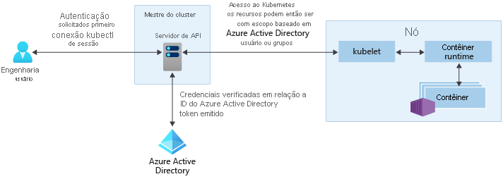

# Acesso e opções de identidade para o Serviço de Kubernetes do Azure (AKS)

Há diferentes maneiras de se autenticar, controlar o acesso/autorizar e proteger os clusters kubernetes. Usando o kubernetes RBAC (controle de acesso baseado em função), você pode conceder a usuários, grupos e contas de serviço acesso apenas aos recursos de que precisam. Com o AKS (serviço kubernetes do Azure), você pode aprimorar ainda mais a estrutura de segurança e permissões usando o Azure Active Directory e o RBAC do Azure. Essas abordagens ajudam você a proteger o acesso ao cluster e fornecer apenas as permissões mínimas necessárias para os desenvolvedores e operadores.

Este artigo apresenta os principais conceitos que ajudam você a autenticar e atribuir permissões no AKS.

## Permissões de serviço AKS

Ao criar um cluster, o AKS cria ou modifica os recursos necessários para criar e executar o cluster, como VMs e NICs, em nome do usuário que está criando o cluster. Essa identidade é distinta da permissão de identidade do cluster, que é criada durante a criação do cluster.

### Identidade criando e operando as permissões de cluster

As permissões a seguir são necessárias para a identidade criando e operando o cluster.

| Permissão | Motivo |
|---|---|
| Microsoft. Compute/diskEncryptionSets/Read | Necessário para ler a ID do conjunto de criptografia de disco. |
| Microsoft. Compute/proximityPlacementGroups/Write | Necessário para atualizar grupos de posicionamento de proximidade. |
| Microsoft.Network/applicationGateways/read   Microsoft.Network/applicationGateways/write   Microsoft.Network/virtualNetworks/subnets/join/action | Necessário para configurar os gateways de aplicativo e ingressar na sub-rede. |
| Microsoft.Network/virtualNetworks/subnets/join/action | Necessário para configurar o grupo de segurança de rede para a sub-rede ao usar uma VNET personalizada.|
| Microsoft.Network/publicIPAddresses/join/action   Microsoft.Network/publicIPPrefixes/join/action | Necessário para configurar os IPs públicos de saída no Standard Load Balancer. |
| Microsoft. OperationalInsights/Workspaces/sharedkeys/Read   Microsoft.OperationalInsights/workspaces/read   Microsoft.OperationsManagement/solutions/write   Microsoft.OperationsManagement/solutions/read   Microsoft.ManagedIdentity/userAssignedIdentities/assign/action | Necessário para criar e atualizar espaços de trabalho Log Analytics e monitoramento do Azure para contêineres. |

### Permissões de identidade do cluster AKS

As permissões a seguir são usadas pela identidade do cluster AKS, que é criada e associada ao cluster AKS quando o cluster é criado. Cada permissão é usada pelos motivos abaixo:

| Permissão | Motivo |
|---|---|
| Microsoft.Network/loadBalancers/delete   Microsoft.Network/loadBalancers/read   Microsoft.Network/loadBalancers/write | Necessário para configurar o balanceador de carga para um serviço Balancer. |
| Microsoft.Network/publicIPAddresses/delete   Microsoft.Network/publicIPAddresses/read   Microsoft.Network/publicIPAddresses/write | Necessário para localizar e configurar IPS públicos para um serviço Balancer. |
| Microsoft.Network/publicIPAddresses/join/action | Necessário para configurar IPS públicos para um serviço Balancer. |
| Microsoft.Network/networkSecurityGroups/read   Microsoft.Network/networkSecurityGroups/write | Necessário para criar ou excluir regras de segurança para um serviço Balancer. |
| Microsoft.Compute/disks/delete   Microsoft.Compute/disks/read   Microsoft.Compute/disks/write   Microsoft. Compute/Locations/DiskOperations/Read | Necessário para configurar o AzureDisks. |
| Microsoft.Storage/storageAccounts/delete   Microsoft.Storage/storageAccounts/listKeys/action   Microsoft.Storage/storageAccounts/read   Microsoft.Storage/storageAccounts/write   Microsoft.Storage/operations/read | Necessário para configurar contas de armazenamento para o Azurefile ou o AzureDisk. |
| Microsoft.Network/routeTables/read   Microsoft.Network/routeTables/routes/delete   Microsoft.Network/routeTables/routes/read   Microsoft.Network/routeTables/routes/write   Microsoft.Network/routeTables/write | Necessário para configurar as tabelas de rota e rotas para nós. |
| Microsoft.Compute/virtualMachines/read | Necessário para encontrar informações para máquinas virtuais em um VMAS, como zonas, domínio de falha, tamanho e discos de dados. |
| Microsoft.Compute/virtualMachines/write | Necessário para anexar AzureDisks a uma máquina virtual em um VMAS. |
| Microsoft.Compute/virtualMachineScaleSets/read   Microsoft.Compute/virtualMachineScaleSets/virtualMachines/read   Microsoft. Compute/virtualMachineScaleSets/VirtualMachines/instanceView/Read | Necessário para encontrar informações para máquinas virtuais em um conjunto de dimensionamento de máquinas virtuais, como zonas, domínio de falha, tamanho e discos de dados. |
| Microsoft.Network/networkInterfaces/write | Necessário para adicionar uma máquina virtual em um VMAS a um pool de endereços de back-end do balanceador de carga. |
| Microsoft.Compute/virtualMachineScaleSets/write | Necessário para adicionar um conjunto de dimensionamento de máquinas virtuais a um pool de endereços de back-end do balanceador de carga e nós de expansão em um conjunto de dimensionamento de máquinas virtuais. |
| Microsoft. Compute/virtualMachineScaleSets/VirtualMachines/Write | Necessário para anexar AzureDisks e adicionar uma máquina virtual de um conjunto de dimensionamento de máquinas virtuais ao balanceador de carga. |
| Microsoft.Network/networkInterfaces/read | Necessário para pesquisar IPs internos e pools de endereços de back-end de balanceador de carga para máquinas virtuais em um VMAS. |
| Microsoft.Compute/virtualMachineScaleSets/virtualMachines/networkInterfaces/read | Necessário para pesquisar IPs internos e pools de endereços de back-end de balanceador de carga para uma máquina virtual em um conjunto de dimensionamento de máquinas virtuais. |
| Microsoft. Compute/virtualMachineScaleSets/virtualMachines/networkInterfaces/ipconfigurations/publicipaddresses/Read | Necessário para encontrar IPs públicos para uma máquina virtual em um conjunto de dimensionamento de máquinas virtuais. |
| Microsoft.Network/virtualNetworks/read   Microsoft.Network/virtualNetworks/subnets/read | Necessário para verificar se existe uma sub-rede para o balanceador de carga interno em outro grupo de recursos. |
| Microsoft.Compute/snapshots/delete   Microsoft.Compute/snapshots/read   Microsoft.Compute/snapshots/write | Necessário para configurar instantâneos para AzureDisk. |
| Microsoft.Compute/locations/vmSizes/read   Microsoft.Compute/locations/operations/read | Necessário para encontrar tamanhos de máquina virtual para localizar limites de volume de AzureDisk. |

### Permissões adicionais de identidade do cluster

As permissões adicionais a seguir são necessárias para a identidade do cluster ao criar um cluster com atributos específicos. Essas permissões não são atribuídas automaticamente, portanto, você deve adicionar essas permissões à identidade do cluster após sua criação.

| Permissão | Motivo |
|---|---|
| Microsoft.Network/networkSecurityGroups/write   Microsoft.Network/networkSecurityGroups/read | Necessário se estiver usando um grupo de segurança de rede em outro grupo de recursos. Necessário para configurar regras de segurança para um serviço Balancer. |
| Microsoft.Network/virtualNetworks/subnets/read   Microsoft.Network/virtualNetworks/subnets/join/action | Necessário se estiver usando uma sub-rede em outro grupo de recursos, como uma VNET personalizada. |
| Microsoft.Network/routeTables/routes/read   Microsoft.Network/routeTables/routes/write | Necessário se estiver usando uma sub-rede associada a uma tabela de rotas em outro grupo de recursos, como uma VNET personalizada com uma tabela de rotas personalizada. Necessário para verificar se uma sub-rede já existe para a sub-rede no outro grupo de recursos. |
| Microsoft.Network/virtualNetworks/subnets/read | Necessário se estiver usando um balanceador de carga interno em outro grupo de recursos. Necessário para verificar se uma sub-rede já existe para o balanceador de carga interno no grupo de recursos. |

## Controle de acesso baseado em função do kubernetes (kubernetes RBAC)

Para fornecer filtragem granular das ações que os usuários podem fazer, o kubernetes usa o controle de acesso baseado em função do kubernetes (kubernetes RBAC). Esse mecanismo de controle permite que você atribua usuários ou grupos de usuários, permissão para fazer coisas como criar ou modificar os recursos ou visualizar logs de cargas de trabalho de aplicativo. Essas permissões podem ser um único namespace no escopo ou concedidas em todo o cluster AKS. Com o Kubernetes RBAC, você cria *funções* para definir permissões e, em seguida, atribuir essas funções a usuários com *associações de função*.

Para obter mais informações, consulte [usando a autorização do RBAC kubernetes][kubernetes-rbac].

### Funções e ClusterRoles

Antes de você atribuir permissões a usuários com RBAC de Kubernetes, você primeiro define essas permissões como uma *Função*. As funções de Kubernetes *concedem* permissões. Não há nenhum conceito de permissão *Deny* .

Funções são usadas para conceder permissões em um namespace. Se você precisar conceder permissões em todo o cluster ou a recursos de cluster fora de um namespace específico, você pode usar *ClusterRoles*.

Um ClusterRole funciona da mesma forma para conceder permissões para recursos, mas pode ser aplicado a recursos em todo o cluster, não um namespace específico.

### RoleBindings e ClusterRoleBindings

Depois que as funções são definidas para conceder permissões a recursos, você atribui essas permissões de RBAC Kubernetes com um *RoleBinding*. Se o cluster AKS se [integrar com o Azure Active Directory (Azure AD)](#azure-active-directory-integration), as associações serão como esses usuários do Azure ad recebem permissões para executar ações no cluster, consulte como [controlar o acesso a recursos de cluster usando o controle de acesso baseado em função kubernetes e identidades de Azure Active Directory](azure-ad-rbac.md).

Associações de função são usadas para atribuir funções para um namespace específico. Essa abordagem permite separar logicamente um único cluster AKS, com os usuários que só odem acessar os recursos do aplicativo em seu namespace atribuído. Se você precisar conceder permissões em todo o cluster ou a recursos de cluster fora de um namespace específico, você pode usar *ClusterRoles*.

Um ClusterRole funciona da mesma forma para conceder permissões para recursos, mas pode ser aplicado a recursos em todo o cluster, não um namespace específico. Essa abordagem permite que você conceda ou aos engenheiros de suporte acesso a todos os recursos no cluster AKS.

> [!NOTE]
> Todas as ações de cluster tomadas pela Microsoft/AKS são feitas com consentimento do usuário em uma função interna kubernetes `aks-service` e Associação de função interna `aks-service-rolebinding` . Essa função permite que o AKS solucione problemas e diagnostique problemas de cluster, mas não pode modificar permissões nem criar funções ou associações de função nem outras ações de alto privilégio. O acesso à função só é habilitado em Tíquetes de suporte ativos com acesso JIT (just-in-time). Leia mais sobre [as políticas de suporte do AKS](support-policies.md).

### Contas de serviço do Kubernetes

Um dos tipos de usuário primário no Kubernetes é uma *conta de serviço*. Uma conta de serviço existe e é gerenciada pela API do Kubernetes. As credenciais para contas de serviço são armazenadas como segredos do Kubernetes, que permite que sejam utilizados pelo pods autorizados para se comunicar com o servidor de API. A maioria das solicitações de API fornecem um token de autenticação para uma conta de serviço ou uma conta de usuário normal.

As contas de usuário normais permitem acesso mais tradicional a administradores ou desenvolvedores humanos, não apenas a serviços e processos. O kubernetes em si não fornece uma solução de gerenciamento de identidades onde contas de usuário e senhas regulares são armazenadas. Em vez disso, as soluções de identidade externa podem ser integradas em Kubernetes. Para clusters AKS, essa solução integrada de identidade é o Microsoft Azure Active Directory.

Para obter mais informações sobre as opções de identidade no Kubernetes, consulte [Autenticação de Kubernetes][kubernetes-authentication].

## Integração do Microsoft Azure Active Directory

A segurança dos clusters AKS pode ser aprimorada com a integração do Microsoft Azure Active Directory (AD). Embasado em décadas de gerenciamento de identidades corporativas, o Azure Active Directory é um diretório multilocatário baseado em nuvem e o serviço de gerenciamento de identidade que combina os principais serviços de diretório, gerenciamento de acesso do aplicativo e proteção de identidade. Com o Microsoft Azure Active Directory, você pode integrar identidades locais em clusters AKS para fornecer uma única fonte para segurança e gerenciamento de conta.

Com os clusters AKS integrados ao Microsoft Azure Active Directory, você pode conceder a usuários ou grupos o acesso a recursos dentro do Kubernetes dentro de um namespace ou através do cluster. Para obter um `kubectl` contexto de configuração, um usuário pode executar [az aks get-credentials][az-aks-get-credentials] comando. Quando um usuário interage com o cluster AKS com `kubectl` , ele é solicitado a entrar com suas credenciais do Azure AD. Essa abordagem fornece uma única fonte para o gerenciamento de contas de usuário e as credenciais de senha. O usuário só pode acessar os recursos, conforme definido pelo administrador do cluster.

A autenticação do Azure AD é fornecida aos clusters do AKS com OpenID Connect. O OpenID Connect é uma camada de identidade compilada sobre o protocolo OAuth 2.0. Para obter mais informações sobre o OpenID Connect, consulte a [documentação do Open ID Connect][openid-connect]. De dentro do cluster kubernetes, a [autenticação de token de webhook][webhook-token-docs] é usada para verificar tokens de autenticação. A autenticação de token do Webhook é configurada e gerenciada como parte do cluster AKS.

### Webhook e servidor de API

Conforme mostrado no gráfico acima, o servidor de API chama o servidor de webhook AKS e executa as seguintes etapas:

1. O aplicativo cliente do Azure AD é usado pelo kubectl para conectar usuários com o [fluxo de concessão de autorização de dispositivo OAuth 2,0](../active-directory/develop/v2-oauth2-device-code.md).
2. O Azure AD fornece um access_token, id_token e um refresh_token.
3. O usuário faz uma solicitação para kubectl com um access_token de kubeconfig.
4. Kubectl envia o access_token ao servidor de API.
5. O servidor de API está configurado com o servidor de webhook de autenticação para executar a validação.
6. O servidor de webhook de autenticação confirma que a assinatura do token Web JSON é válida verificando a chave de assinatura pública do Azure AD.
7. O aplicativo de servidor usa credenciais fornecidas pelo usuário para consultar associações de grupo do usuário conectado do MS API do Graph.
8. Uma resposta é enviada ao servidor de API com informações de usuário, como a declaração de UPN (nome principal do usuário) do token de acesso e a associação de grupo do usuário com base na ID de objeto.
9. A API executa uma decisão de autorização baseada na função/Rolebinding do kubernetes.
10. Depois de autorizado, o servidor de API retorna uma resposta a kubectl.
11. Kubectl fornece comentários para o usuário.
 
**Saiba como integrar o AKS com o AAD [aqui](managed-aad.md).**

## RBAC do Azure (controle de acesso baseado em função do Azure)

O RBAC do Azure é um sistema de autorização baseado no [Azure Resource Manager](../azure-resource-manager/management/overview.md) que fornece gerenciamento de acesso refinado dos recursos do Azure.

 O RBAC do Azure foi projetado para trabalhar em recursos em sua assinatura do Azure enquanto o RBAC kubernetes é projetado para funcionar em recursos do kubernetes no cluster do AKS. 

Com o RBAC do Azure, você cria um *definição de função* que descreve as permissões a serem aplicadas. Em seguida, um usuário ou grupo atribui essa definição de função por meio de uma *atribuição de função* para um *escopo* específico, que pode ser um recurso individual, um grupo de recursos ou pela assinatura.

Para obter mais informações, consulte [o que é o Azure RBAC (controle de acesso baseado em função)?][azure-rbac]

Há dois níveis de acesso necessários para operar totalmente um cluster AKS: 
1. [Acesse o recurso AKS em sua assinatura do Azure](#azure-rbac-to-authorize-access-to-the-aks-resource). Esse processo permite controlar as coisas que dimensionam ou atualizam o cluster usando as APIs AKS, bem como efetuam pull de seu kubeconfig.
2. Acesso à API do kubernetes. Esse acesso é controlado por [KUBERNETES RBAC](#kubernetes-role-based-access-control-kubernetes-rbac) (tradicionalmente) ou [integrando o RBAC do Azure com AKs para autorização de kubernetes](#azure-rbac-for-kubernetes-authorization-preview)

### RBAC do Azure para autorizar o acesso ao recurso AKS

Com o RBAC do Azure, você pode fornecer seus usuários (ou identidades) com acesso granular aos recursos do AKS em uma ou mais assinaturas. Por exemplo, você pode ter a [função colaborador do serviço kubernetes do Azure](../role-based-access-control/built-in-roles.md#azure-kubernetes-service-contributor-role) que permite executar ações como dimensionar e atualizar seu cluster. Embora outro usuário possa ter a [função de administrador de cluster do serviço kubernetes do Azure](../role-based-access-control/built-in-roles.md#azure-kubernetes-service-cluster-admin-role) que concede apenas permissão para efetuar pull do Kubeconfig do administrador.

Como alternativa, você pode dar ao usuário a função de [colaborador](../role-based-access-control/built-in-roles.md#contributor) geral, que abrange as permissões acima e todas as ações possíveis no recurso AKs, com exceção do gerenciamento de permissões em si.

Veja mais como usar o RBAC do Azure para proteger o acesso ao arquivo kubeconfig que fornece acesso à API kubernetes [aqui](control-kubeconfig-access.md).

### Azure RBAC para autorização de kubernetes (versão prévia)

Com a integração do RBAC do Azure, o AKS usará um servidor de webhook de autorização do kubernetes para permitir que você gerencie permissões e atribuições de recursos de cluster do K8s integrado do Azure AD usando a definição de função e as atribuições de função do Azure.

Conforme mostrado no diagrama acima, ao usar a integração do RBAC do Azure, todas as solicitações para a API kubernetes seguirão o mesmo fluxo de autenticação conforme explicado na [seção integração ativa do Azure](#azure-active-directory-integration). 

Mas, depois disso, em vez de depender apenas do RBAC kubernetes para autorização, a solicitação será, na verdade, autorizada pelo Azure, desde que a identidade que fez a solicitação exista no AAD. Se a identidade não existir no AAD, por exemplo, uma conta de serviço kubernetes, o RBAC do Azure não iniciará e será o RBAC kubernetes normal.

Nesse cenário, você pode fornecer aos usuários uma das quatro funções internas ou criar funções personalizadas como faria com as funções kubernetes, mas nesse caso, usando os mecanismos e APIs do RBAC do Azure. 

Esse recurso permitirá, por exemplo, não só conceder permissões aos usuários para o recurso AKS em assinaturas, mas configurados e dar a eles a função e permissões que eles terão dentro de cada um desses clusters que controlam o acesso à API kubernetes. Por exemplo, você pode conceder a `Azure Kubernetes Service RBAC Viewer` função no escopo da assinatura e seu destinatário poderá listar e obter todos os objetos kubernetes de todos os clusters, mas não modificá-los.

#### Funções internas

O AKS fornece as quatro funções internas a seguir. Eles são semelhantes às [funções internas do kubernetes](https://kubernetes.io/docs/reference/access-authn-authz/rbac/#user-facing-roles) , mas com algumas diferenças, como suporte a crds. Para obter a lista completa de ações permitidas por cada função interna, consulte [aqui](../role-based-access-control/built-in-roles.md).

| Função                                | Descrição  |
|-------------------------------------|--------------|
| Visualizador de RBAC do serviço kubernetes do Azure  | Permite acesso somente leitura para ver a maioria dos objetos em um namespace. Ele não permite a exibição de funções ou associações de função. Essa função não permite a exibição `Secrets` , pois a leitura do conteúdo de segredos permite `ServiceAccount` o acesso a credenciais no namespace, o que permitiria o acesso à API como qualquer `ServiceAccount` no namespace (uma forma de escalonamento de privilégios)  |
| Gravador RBAC do serviço kubernetes do Azure | Permite acesso de leitura/gravação à maioria dos objetos em um namespace. Essa função não permite exibir ou modificar funções ou associações de função. No entanto, essa função permite acessar `Secrets` e executar pods como qualquer uma das contas no namespace, para que possa ser usada para obter os níveis de acesso de API de qualquer conta no namespace. |
| Administrador de RBAC do serviço kubernetes do Azure  | Permite o acesso de administrador, destinado a ser concedido em um namespace. Permite acesso de leitura/gravação para a maioria dos recursos em um namespace (ou escopo de cluster), incluindo a capacidade de criar funções e associações de função no namespace. Essa função não permite acesso de gravação à cota de recursos ou ao próprio namespace. |
| Administrador de cluster do RBAC do serviço kubernetes do Azure  | Permite o acesso de superusuário para executar qualquer ação em qualquer recurso. Ele fornece controle total sobre cada recurso no cluster e em todos os namespaces. |

**Para saber como habilitar o RBAC do Azure para autorização de kubernetes, [Leia aqui](manage-azure-rbac.md).**

## Resumo

Esta tabela resume as maneiras como os usuários podem se autenticar no kubernetes quando a integração do Azure AD está habilitada.  Em todos os casos, a sequência de comandos do usuário é:
1. Execute `az login` para autenticar no Azure.
1. Execute `az aks get-credentials` para baixar as credenciais do cluster no `.kube/config` .
1. Executar `kubectl` comandos (o primeiro deles pode disparar a autenticação baseada em navegador para autenticar no cluster, conforme descrito na tabela a seguir).

A concessão de função referida na segunda coluna é a concessão de função do RBAC do Azure mostrada na guia **controle de acesso** na portal do Azure. O grupo administrador do cluster do Azure AD é mostrado na guia **configuração** no portal (ou com o nome `--aad-admin-group-object-ids` do parâmetro no CLI do Azure).

| Descrição        | Concessão de função necessária| Grupo (s) do Azure AD de administrador do cluster | Quando usar |
| -------------------|------------|----------------------------|-------------|
| Logon de administrador herdado usando o certificado do cliente| **Função de administrador de kubernetes do Azure**. Essa função permite que `az aks get-credentials` seja usada com o `--admin` sinalizador, que baixa um [certificado de administrador de cluster herdado (não Azure AD)](control-kubeconfig-access.md) para o usuário `.kube/config` . Essa é a única finalidade da "função de administrador de kubernetes do Azure".|N/D|Se você estiver permanentemente bloqueado por não ter acesso a um grupo válido do Azure AD com acesso ao seu cluster.| 
| Azure AD com RoleBindings manual (cluster)| **Função de usuário kubernetes do Azure**. A função "usuário" permite que `az aks get-credentials` seja usada sem o `--admin` sinalizador. (Essa é a única finalidade da "função de usuário kubernetes do Azure".) O resultado, em um cluster habilitado para Azure AD, é o download de [uma entrada vazia](control-kubeconfig-access.md) no `.kube/config` , que dispara a autenticação baseada em navegador quando é usado pela primeira vez pelo `kubectl` .| O usuário não está em nenhum desses grupos. Como o usuário não está em nenhum grupo de administração de cluster, seus direitos serão controlados inteiramente por qualquer RoleBindings ou ClusterRoleBindings que tenha sido configurado pelos administradores de cluster. O (cluster) RoleBindings indica [usuários do Azure ad ou grupos do Azure ad](azure-ad-rbac.md) como seu `subjects` . Se nenhuma dessas associações tiver sido configurada, o usuário não poderá excute nenhum `kubectl` comando.|Se você quiser um controle de acesso refinado e não estiver usando o RBAC do Azure para autorização kubernetes. Observe que o usuário que configura as associações deve fazer logon por um dos outros métodos listados nesta tabela.|
| Azure AD por membro do grupo de administradores| O mesmo que o descrito acima|O usuário é um membro de um dos grupos listados aqui. O AKS gera automaticamente um ClusterRoleBinding que associa todos os grupos listados à `cluster-admin` função kubernetes. Portanto, os usuários nesses grupos podem executar todos os `kubectl` comandos como `cluster-admin` .|Se você quiser conceder convenientemente aos usuários direitos de administrador completo e _não_ estiver usando o RBAC do Azure para autorização kubernetes.|
| Azure AD com o Azure RBAC para autorização de kubernetes|Duas funções: primeiro, **função de usuário kubernetes do Azure** (como acima). Em segundo lugar, um dos "serviços de kubernetes do Azure **RBAC**..." funções listadas acima ou sua própria alternativa personalizada.|O campo funções de administrador na guia configuração é irrelevante quando o RBAC do Azure para autorização kubernetes está habilitado.|Você está usando o RBAC do Azure para autorização kubernetes. Essa abordagem oferece um controle refinado, sem a necessidade de configurar RoleBindings ou ClusterRoleBindings.|

## Próximas etapas

- Para começar com o Microsoft Azure Active Directory e o RBAC do Kubernetes, consulte [Integrar o Azure Active Directory ao AKS][aks-aad].
- Para obter as práticas recomendadas associadas, consulte [práticas recomendadas para autenticação e autorização no AKs][operator-best-practices-identity].
- Para começar com a autorização do Azure RBAC para kubernetes, consulte [usar o RBAC do Azure para autorizar o acesso no cluster do AKS (serviço kubernetes do Azure)](manage-azure-rbac.md).
- Para começar a proteger o arquivo kubeconfig, consulte [limitar o acesso ao arquivo de configuração de cluster](control-kubeconfig-access.md)

Para obter mais informações sobre os principais conceitos do Kubernetes e do AKS, confira os seguintes artigos:

- [Clusters e cargas de trabalho do Kubernetes/AKS][aks-concepts-clusters-workloads]
- [Kubernetes / segurança AKS][aks-concepts-security]
- [Redes virtuais do Kubernetes/AKS][aks-concepts-network]
- [Armazenamento do Kubernetes/AKS][aks-concepts-storage]
- [Escala do Kubernetes/AKS][aks-concepts-scale]

<!-- LINKS - External -->
[kubernetes-authentication]: https://kubernetes.io/docs/reference/access-authn-authz/authentication
[webhook-token-docs]: https://kubernetes.io/docs/reference/access-authn-authz/authentication/#webhook-token-authentication
[kubernetes-rbac]: https://kubernetes.io/docs/reference/access-authn-authz/rbac/

<!-- LINKS - Internal -->
[openid-connect]: ../active-directory/develop/v2-protocols-oidc.md
[az-aks-get-credentials]: /cli/azure/aks#az-aks-get-credentials
[azure-rbac]: ../role-based-access-control/overview.md
[aks-aad]: managed-aad.md
[aks-concepts-clusters-workloads]: concepts-clusters-workloads.md
[aks-concepts-security]: concepts-security.md
[aks-concepts-scale]: concepts-scale.md
[aks-concepts-storage]: concepts-storage.md
[aks-concepts-network]: concepts-network.md
[operator-best-practices-identity]: operator-best-practices-identity.md
[upgrade-per-cluster]: ../azure-monitor/insights/container-insights-update-metrics.md#upgrade-per-cluster-using-azure-cli