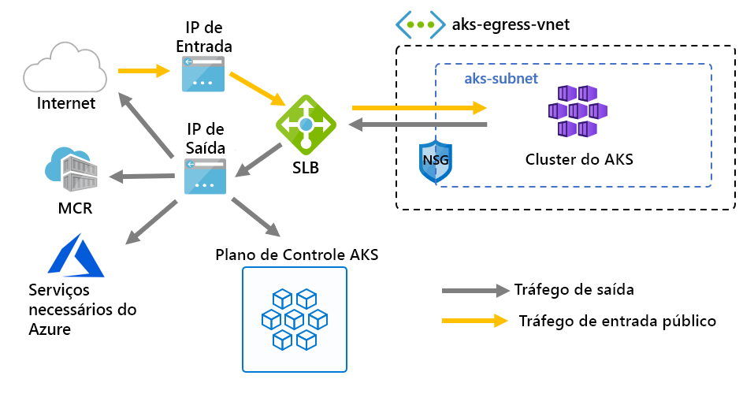

# <a name="customize-cluster-egress-with-a-user-defined-route-preview"></a>Personalizar a saída do cluster com uma rota definida pelo usuário (versão prévia)

A saída de um cluster AKS pode ser personalizada para se ajustar a cenários específicos. Por padrão, o AKS provisionará um Load Balancer de SKU padrão para ser configurado e usado para saída. No entanto, a configuração padrão pode não atender aos requisitos de todos os cenários se IPs públicos não forem permitidos ou saltos adicionais forem necessários para saída.

Este artigo explica como personalizar a rota de saída de um cluster para dar suporte a cenários de rede personalizados, como aqueles que não permitem IPs públicos e requer que o cluster fique atrás de uma NVA (solução de virtualização de rede).

> [!IMPORTANT]
> Os recursos de visualização do AKS são de autoatendimento e são oferecidos de acordo com a aceitação. As visualizações são fornecidas *como estão* e disponíveis e são excluídas do SLA (contrato de nível de serviço) e *da* garantia limitada. As visualizações do AKS são parcialmente cobertas pelo suporte ao cliente em uma base de *melhor esforço* . Portanto, os recursos não são destinados ao uso em produção. Para obter mais informações, consulte os seguintes artigos de suporte:
>
> * [Políticas de suporte do AKS](support-policies.md)
> * [Perguntas frequentes sobre o suporte do Azure.](faq.md)

## <a name="prerequisites"></a>Pré-requisitos
* CLI do Azure versão 2.0.81 ou posterior
* CLI do Azure versão de extensão de visualização 0.4.28 ou superior
* Versão de API `2020-01-01` do ou superior

## <a name="install-the-latest-azure-cli-aks-preview-extension"></a>Instalar a extensão mais recente do CLI do Azure AKS Preview
Para definir o tipo de saída de um cluster, você precisa do CLI do Azure extensão de visualização AKS versão 0.4.18 ou posterior. Instale a extensão de visualização do CLI do Azure AKS usando o comando AZ Extension Add e, em seguida, verifique se há atualizações disponíveis usando o seguinte comando AZ Extension Update:

```azure-cli
# Install the aks-preview extension
az extension add --name aks-preview

# Update the extension to make sure you have the latest version installed
az extension update --name aks-preview
```

## <a name="limitations"></a>Limitações
* Durante a visualização `outboundType` , só pode ser definido no momento da criação do cluster e não pode ser atualizado posteriormente.
* Durante a visualização `outboundType` , os clusters AKs devem usar o CNI do Azure. Kubenet é configurável, o uso requer associações manuais da tabela de rotas para a sub-rede AKS.
* A `outboundType` configuração requer clusters AKs com `vm-set-type` um `VirtualMachineScaleSets` de `load-balancer-sku` e `Standard`de.
* A `outboundType` configuração para um valor `UDR` de requer uma rota definida pelo usuário com conectividade de saída válida para o cluster.
* A `outboundType` definição de um valor `UDR` de implica que o IP de origem de entrada roteado para o balanceador de carga pode **não corresponder** ao endereço de destino de egresso de saída do cluster.

## <a name="overview-of-outbound-types-in-aks"></a>Visão geral dos tipos de saída no AKS

Um cluster AKS pode ser personalizado com um balanceador de carga de tipo exclusivo `outboundType` ou um roteamento definido pelo usuário.

> [!IMPORTANT]
> O tipo de saída afeta apenas o tráfego de saída do cluster. Consulte [configurando controladores de entrada](ingress-basic.md) para obter mais informações.

### <a name="outbound-type-of-loadbalancer"></a>Tipo de saída do balanceador de carga

Se `loadBalancer` for definido, AKs concluirá a configuração a seguir automaticamente. O balanceador de carga é usado para saída por meio de um IP público atribuído por AKS. Um tipo de saída `loadBalancer` do dá suporte aos serviços `loadBalancer`kubernetes do tipo, que esperam a saída do balanceador de carga criado pelo provedor de recursos do AKS.

A configuração a seguir é feita por AKS.
   * Um endereço IP público é provisionado para a saída do cluster.
   * O endereço IP público é atribuído ao recurso de balanceador de carga.
   * Os pools de back-end para o balanceador de carga são configurados para nós de agente no cluster.

Abaixo está uma topologia de rede implantada em clusters AKS por padrão, `outboundType` que `loadBalancer`usa um de.



### <a name="outbound-type-of-userdefinedrouting"></a>Tipo de saída de userDefinedRouting

> [!NOTE]
> O uso do tipo de saída é um cenário de rede avançado e requer uma configuração de rede adequada.

Se `userDefinedRouting` for definido, o AKs não configurará automaticamente os caminhos de saída. Espera-se que a seguir seja feita pelo **usuário**.

O cluster deve ser implantado em uma rede virtual existente com uma sub-rede que foi configurada. Uma rota definida pelo usuário válida (UDR) deve existir na sub-rede com conectividade de saída.

O provedor de recursos AKS implantará um SLB (balanceador de carga padrão). O balanceador de carga não está configurado com nenhuma regra e [não incorre em um encargo até que uma regra seja colocada](https://azure.microsoft.com/pricing/details/load-balancer/). O AKS **não** provisionará automaticamente um endereço IP público para o front-end SLB. O AKS **não** configurará automaticamente o pool de back-end do balanceador de carga.

## <a name="deploy-a-cluster-with-outbound-type-of-udr-and-azure-firewall"></a>Implantar um cluster com o tipo de saída de UDR e o Firewall do Azure

Para ilustrar o aplicativo de um cluster com o tipo de saída usando uma rota definida pelo usuário, um cluster pode ser configurado em uma rede virtual emparelhada com um firewall do Azure.


* A entrada é forçada a fluir por filtros de firewall
   * Uma sub-rede isolada mantém um balanceador de carga interno para roteamento em nós de agente
   * Nós de agente são isolados em uma sub-rede dedicada
* Solicitações de saída iniciam de nós de agente para o IP interno do firewall do Azure usando uma rota definida pelo usuário
   * As solicitações de nós do agente AKS seguem um UDR que foi colocado na sub-rede em que o cluster AKS foi implantado.
   * O Firewall do Azure sai da rede virtual de um front-end IP público
   * O acesso ao plano de controle AKS é protegido por um NSG, que habilitou o endereço IP de front-end do firewall
   * Acesso à Internet pública ou a outros serviços do Azure fluem de e para o endereço IP de front-end do firewall

### <a name="set-configuration-via-environment-variables"></a>Definir a configuração por meio de variáveis de ambiente

Defina um conjunto de variáveis de ambiente a ser usado em criações de recursos.

```bash
PREFIX="contosofin"
RG="${PREFIX}-rg"
LOC="eastus"
NAME="${PREFIX}outboundudr"
AKS_NAME="${PREFIX}aks"
VNET_NAME="${PREFIX}vnet"
AKSSUBNET_NAME="${PREFIX}akssubnet"
SVCSUBNET_NAME="${PREFIX}svcsubnet"
# DO NOT CHANGE FWSUBNET_NAME - This is currently a requirement for Azure Firewall.
FWSUBNET_NAME="AzureFirewallSubnet"
FWNAME="${PREFIX}fw"
FWPUBLICIP_NAME="${PREFIX}fwpublicip"
FWIPCONFIG_NAME="${PREFIX}fwconfig"
FWROUTE_TABLE_NAME="${PREFIX}fwrt"
FWROUTE_NAME="${PREFIX}fwrn"
FWROUTE_NAME_INTERNET="${PREFIX}fwinternet"
DEVSUBNET_NAME="${PREFIX}dev"
```

Em seguida, defina IDs de assinatura.

```azure-cli
# Get ARM Access Token and Subscription ID - This will be used for AuthN later.

ACCESS_TOKEN=$(az account get-access-token -o tsv --query 'accessToken')

# NOTE: Update Subscription Name
# Set Default Azure Subscription to be Used via Subscription ID

az account set -s <SUBSCRIPTION_ID_GOES_HERE>

# NOTE: Update Subscription Name for setting SUBID

SUBID=$(az account show -s '<SUBSCRIPTION_NAME_GOES_HERE>' -o tsv --query 'id')
```

## <a name="create-a-virtual-network-with-multiple-subnets"></a>Criar uma rede virtual com várias sub-redes

Provisione uma rede virtual com três sub-redes separadas, uma para o cluster, uma para o firewall e outra para a entrada do serviço.


Crie um grupo de recursos para manter todos os recursos.

```azure-cli
# Create Resource Group

az group create --name $RG --location $LOC
```

Crie duas redes virtuais para hospedar o cluster AKS e o Firewall do Azure. Cada uma terá sua própria sub-rede. Vamos começar com a rede AKS.

```
# Dedicated virtual network with AKS subnet

az network vnet create \
    --resource-group $RG \
    --name $VNET_NAME \
    --address-prefixes 100.64.0.0/16 \
    --subnet-name $AKSSUBNET_NAME \
    --subnet-prefix 100.64.1.0/24

# Dedicated subnet for K8s services

az network vnet subnet create \
    --resource-group $RG \
    --vnet-name $VNET_NAME \
    --name $SVCSUBNET_NAME \
    --address-prefix 100.64.2.0/24

# Dedicated subnet for Azure Firewall (Firewall name cannot be changed)

az network vnet subnet create \
    --resource-group $RG \
    --vnet-name $VNET_NAME \
    --name $FWSUBNET_NAME \
    --address-prefix 100.64.3.0/24
```

## <a name="create-and-setup-an-azure-firewall-with-a-udr"></a>Criar e configurar um firewall do Azure com um UDR

As regras de entrada e saída do firewall do Azure devem ser configuradas. A principal finalidade do firewall é permitir que as organizações configurem as regras de entrada granulares e de tráfego de saída para dentro e fora do cluster AKS.


Crie um recurso de IP público de SKU padrão que será usado como o endereço de front-end do firewall do Azure.

```azure-cli
az network public-ip create -g $RG -n $FWPUBLICIP_NAME -l $LOC --sku "Standard"
```

Registre a extensão da CLI de visualização para criar um firewall do Azure.
```azure-cli
# Install Azure Firewall preview CLI extension

az extension add --name azure-firewall

# Deploy Azure Firewall

az network firewall create -g $RG -n $FWNAME -l $LOC
```

O endereço IP criado anteriormente agora pode ser atribuído ao front-end do firewall.
> [!NOTE]
> A configuração do endereço IP público para o Firewall do Azure pode levar alguns minutos.
> 
> Se os erros forem recebidos repetidamente no comando abaixo, exclua o firewall existente e o IP público e provisione o IP público e o Firewall do Azure por meio do portal ao mesmo tempo.

```azure-cli
# Configure Firewall IP Config

az network firewall ip-config create -g $RG -f $FWNAME -n $FWIPCONFIG_NAME --public-ip-address $FWPUBLICIP_NAME --vnet-name $VNET_NAME
```

Quando o comando anterior tiver sido bem-sucedido, salve o endereço IP de front-end do firewall para configuração mais tarde.

```bash
# Capture Firewall IP Address for Later Use

FWPUBLIC_IP=$(az network public-ip show -g $RG -n $FWPUBLICIP_NAME --query "ipAddress" -o tsv)
FWPRIVATE_IP=$(az network firewall show -g $RG -n $FWNAME --query "ipConfigurations[0].privateIpAddress" -o tsv)
```

### <a name="create-a-udr-with-a-hop-to-azure-firewall"></a>Criar um UDR com um salto para o Firewall do Azure

O Azure roteia o tráfego automaticamente entre redes virtuais, redes locais e sub-redes do Azure. Se você desejar alterar qualquer roteamento padrão do Azure, poderá criar uma tabela de rotas para fazer isso.

Crie uma tabela de rotas vazia a ser associada a uma determinada sub-rede. A tabela de rotas definirá o próximo salto como o Firewall do Azure criado acima. Cada sub-rede pode ter zero ou uma tabela de rotas associada a ela.

```azure-cli
# Create UDR and add a route for Azure Firewall

az network route-table create -g $RG --name $FWROUTE_TABLE_NAME
az network route-table route create -g $RG --name $FWROUTE_NAME --route-table-name $FWROUTE_TABLE_NAME --address-prefix 0.0.0.0/0 --next-hop-type VirtualAppliance --next-hop-ip-address $FWPRIVATE_IP --subscription $SUBID
az network route-table route create -g $RG --name $FWROUTE_NAME_INTERNET --route-table-name $FWROUTE_TABLE_NAME --address-prefix $FWPUBLIC_IP/32 --next-hop-type Internet
```

Consulte a [documentação da tabela de rotas de rede virtual](../virtual-network/virtual-networks-udr-overview.md#user-defined) sobre como você pode substituir as rotas do sistema padrão do Azure ou adicionar outras rotas à tabela de rotas de uma sub-rede.

## <a name="adding-network-firewall-rules"></a>Adicionando regras de firewall de rede

> [!WARNING]
> Veja abaixo um exemplo de como adicionar uma regra de firewall. Todos os pontos de extremidade de saída definidos nos [pontos de extremidade de saída necessários](egress.md) devem ser habilitados pelas regras de firewall do aplicativo para que os clusters AKs funcionem. Sem esses pontos de extremidade habilitados, o cluster não funciona.

Veja abaixo um exemplo de uma regra de rede e de aplicativo. Adicionamos uma regra de rede que permite qualquer protocolo, endereço de origem, endereço de destino e portas de destino. Também adicionamos uma regra de aplicativo para **alguns** dos pontos de extremidade exigidos pelo AKs.

Em um cenário de produção, você só deve habilitar o acesso a pontos de extremidade necessários para seu aplicativo e aqueles definidos em [AKs de saída necessária](egress.md).

```
# Add Network FW Rules

az network firewall network-rule create -g $RG -f $FWNAME --collection-name 'aksfwnr' -n 'netrules' --protocols 'Any' --source-addresses '*' --destination-addresses '*' --destination-ports '*' --action allow --priority 100

# Add Application FW Rules
# IMPORTANT: Add AKS required egress endpoints

az network firewall application-rule create -g $RG -f $FWNAME \
    --collection-name 'AKS_Global_Required' \
    --action allow \
    --priority 100 \
    -n 'required' \
    --source-addresses '*' \
    --protocols 'http=80' 'https=443' \
    --target-fqdns \
        'aksrepos.azurecr.io' \
        '*blob.core.windows.net' \
        'mcr.microsoft.com' \
        '*cdn.mscr.io' \
        '*.data.mcr.microsoft.com' \
        'management.azure.com' \
        'login.microsoftonline.com' \
        'ntp.ubuntu.com' \
        'packages.microsoft.com' \
        'acs-mirror.azureedge.net'
```

Consulte a [documentação do firewall do Azure](https://docs.microsoft.com/azure/firewall/overview) para saber mais sobre o serviço de firewall do Azure.

## <a name="associate-the-route-table-to-aks"></a>Associar a tabela de rotas a AKS

Para associar o cluster ao firewall, a sub-rede dedicada para a sub-rede do cluster deve fazer referência à tabela de rotas criada acima. A associação pode ser feita emitindo um comando para a rede virtual que mantém o cluster e o firewall para atualizar a tabela de rotas da sub-rede do cluster.

```azure-cli
# Associate route table with next hop to Firewall to the AKS subnet

az network vnet subnet update -g $RG --vnet-name $VNET_NAME --name $AKSSUBNET_NAME --route-table $FWROUTE_TABLE_NAME
```

## <a name="deploy-aks-with-outbound-type-of-udr-to-the-existing-network"></a>Implantar AKS com o tipo de saída de UDR na rede existente

Agora um cluster AKS pode ser implantado na configuração de rede virtual existente. Para definir um tipo de saída de cluster como roteamento definido pelo usuário, uma sub-rede existente deve ser fornecida para AKS.


### <a name="create-a-service-principal-with-access-to-provision-inside-the-existing-virtual-network"></a>Criar uma entidade de serviço com acesso para provisionar dentro da rede virtual existente

Uma entidade de serviço é usada pelo AKS para criar recursos de cluster. A entidade de serviço passada no momento da criação é usada para criar recursos de AKS subjacentes, como VMs, armazenamento e balanceadores de carga usados pelo AKS. Se forem concedidas poucas permissões, não será possível provisionar um cluster AKS.

```azure-cli
# Create SP and Assign Permission to Virtual Network

az ad sp create-for-rbac -n "${PREFIX}sp" --skip-assignment
```

Agora `APPID` , substitua e `PASSWORD` abaixo pela AppID da entidade de serviço e pela senha da entidade de serviço gerada automaticamente pela saída do comando anterior. Vamos referenciar a ID do recurso VNET para conceder as permissões para a entidade de serviço para que AKS possa implantar recursos nela.

```azure-cli
APPID="<SERVICE_PRINCIPAL_APPID_GOES_HERE>"
PASSWORD="<SERVICEPRINCIPAL_PASSWORD_GOES_HERE>"
VNETID=$(az network vnet show -g $RG --name $VNET_NAME --query id -o tsv)

# Assign SP Permission to VNET

az role assignment create --assignee $APPID --scope $VNETID --role Contributor

# View Role Assignment
az role assignment list --assignee $APPID --all -o table
```

### <a name="deploy-aks"></a>Implantar AKS

Por fim, o cluster AKS pode ser implantado na sub-rede existente que dedicamos ao cluster. A sub-rede de destino a ser implantada é definida com a variável `$SUBNETID`de ambiente,. Não definimos a `$SUBNETID` variável nas etapas anteriores. Para definir o valor da ID de sub-rede, você pode usar o seguinte comando:

```azurecli
SUBNETID="/subscriptions/$SUBID/resourceGroups/$RG/providers/Microsoft.Network/virtualNetworks/$VNET_NAME/subnets/$AKSSUBNET_NAME"
```

Vamos definir o tipo de saída para seguir o UDR que existe na sub-rede, permitindo que AKS ignore a instalação e o provisionamento de IP para o balanceador de carga, que agora pode ser estritamente interno.

O recurso AKS para [intervalos de IP autorizados do servidor de API](api-server-authorized-ip-ranges.md) pode ser adicionado para limitar o acesso do servidor de API somente ao ponto de extremidade público do firewall. O recurso de intervalos de IP autorizado é indicado no diagrama como o NSG que deve ser passado para acessar o plano de controle. Ao habilitar o recurso de intervalo de IP autorizado para limitar o acesso do servidor de API, suas ferramentas de desenvolvedor devem usar um Jumpbox da rede virtual do firewall ou você deve adicionar todos os pontos de extremidade do desenvolvedor ao intervalo de IP autorizado.

> [!TIP]
> Recursos adicionais podem ser adicionados à implantação de cluster, como (cluster privado) []. Ao usar intervalos de IP autorizados, um Jumpbox será necessário dentro da rede de cluster para acessar o servidor de API.

```azure-cli
az aks create -g $RG -n $AKS_NAME -l $LOC \
  --node-count 3 \
  --network-plugin azure --generate-ssh-keys \
  --service-cidr 192.168.0.0/16 \
  --dns-service-ip 192.168.0.10 \
  --docker-bridge-address 172.22.0.1/29 \
  --vnet-subnet-id $SUBNETID \
  --service-principal $APPID \
  --client-secret $PASSWORD \
  --load-balancer-sku standard \
  --outbound-type userDefinedRouting \
  --api-server-authorized-ip-ranges $FWPUBLIC_IP
  ```

### <a name="enable-developer-access-to-the-api-server"></a>Habilitar o acesso do desenvolvedor ao servidor de API

Devido à configuração dos intervalos de IP autorizados para o cluster, você deve adicionar seus endereços IP de ferramentas de desenvolvedor à lista de clusters do AKS de intervalos de IP aprovados para acessar o servidor de API. Outra opção é configurar um Jumpbox com as ferramentas necessárias dentro de uma sub-rede separada na rede virtual do firewall.

Adicione outro endereço IP aos intervalos aprovados com o seguinte comando

```bash
# Retrieve your IP address
CURRENT_IP=$(dig @resolver1.opendns.com ANY myip.opendns.com +short)

# Add to AKS approved list
az aks update -g $RG -n $AKS_NAME --api-server-authorized-ip-ranges $CURRENT_IP/32

```

 Use o comando [AZ AKs Get-Credentials][az-aks-get-credentials] para `kubectl` configurar o para se conectar ao cluster kubernetes recém-criado. 

 ```azure-cli
 az aks get-credentials -g $RG -n $AKS_NAME
 ```

### <a name="setup-the-internal-load-balancer"></a>Configurar o balanceador de carga interno

O AKS implantou um balanceador de carga com o cluster que pode ser configurado como um [balanceador de carga interno](internal-lb.md).

Para criar um balanceador de carga interno, crie um manifesto de serviço chamado Internal-lb. YAML com o tipo de serviço Balancer e a anotação interna do balanceador de carga do Azure, conforme mostrado no exemplo a seguir:

```yaml
apiVersion: v1
kind: Service
metadata:
  name: internal-app
  annotations:
    service.beta.kubernetes.io/azure-load-balancer-internal: "true"
    service.beta.kubernetes.io/azure-load-balancer-internal-subnet: "contosofinsvcsubnet"
spec:
  type: LoadBalancer
  ports:
  - port: 80
  selector:
    app: internal-app
```

Implante o balanceador de carga interno usando o kubectl Apply e especifique o nome do seu manifesto YAML:

```bash
kubectl apply -f internal-lb.yaml
```

## <a name="deploy-a-kubernetes-service"></a>Implantar um serviço kubernetes

Como o tipo de saída de cluster é definido como UDR, associar os nós de agente como o pool de back-end para o balanceador de carga não é concluído automaticamente pelo AKS no momento da criação do cluster. No entanto, a associação de pool de back-end é manipulada pelo provedor de nuvem do Azure kubernetes quando o serviço kubernetes é implantado.

Implante o aplicativo de aplicativo de votação do Azure copiando o YAML abaixo para `example.yaml`um arquivo chamado.

```yaml
apiVersion: apps/v1
kind: Deployment
metadata:
  name: azure-vote-back
spec:
  replicas: 1
  selector:
    matchLabels:
      app: azure-vote-back
  template:
    metadata:
      labels:
        app: azure-vote-back
    spec:
      nodeSelector:
        "beta.kubernetes.io/os": linux
      containers:
      - name: azure-vote-back
        image: redis
        resources:
          requests:
            cpu: 100m
            memory: 128Mi
          limits:
            cpu: 250m
            memory: 256Mi
        ports:
        - containerPort: 6379
          name: redis
---
apiVersion: v1
kind: Service
metadata:
  name: azure-vote-back
spec:
  ports:
  - port: 6379
  selector:
    app: azure-vote-back
---
apiVersion: apps/v1
kind: Deployment
metadata:
  name: azure-vote-front
spec:
  replicas: 1
  selector:
    matchLabels:
      app: azure-vote-front
  template:
    metadata:
      labels:
        app: azure-vote-front
    spec:
      nodeSelector:
        "beta.kubernetes.io/os": linux
      containers:
      - name: azure-vote-front
        image: microsoft/azure-vote-front:v1
        resources:
          requests:
            cpu: 100m
            memory: 128Mi
          limits:
            cpu: 250m
            memory: 256Mi
        ports:
        - containerPort: 80
        env:
        - name: REDIS
          value: "azure-vote-back"
---
apiVersion: v1
kind: Service
metadata:
  name: azure-vote-front
  annotations:
    service.beta.kubernetes.io/azure-load-balancer-internal: "true"
    service.beta.kubernetes.io/azure-load-balancer-internal-subnet: "contosofinsvcsubnet"
spec:
  type: LoadBalancer
  ports:
  - port: 80
  selector:
    app: azure-vote-front
```

Implante o serviço executando:

```bash
kubectl apply -f example.yaml
```

## <a name="add-a-dnat-rule-to-azure-firewall"></a>Adicionar uma regra DNAT ao firewall do Azure

Para configurar a conectividade de entrada, uma regra DNAT deve ser gravada no firewall do Azure. Para testar a conectividade com nosso cluster, uma regra é definida para o endereço IP público de front-end do firewall para rotear para o IP interno exposto pelo serviço interno.

O endereço de destino pode ser personalizado, pois é a porta no firewall a ser acessado. O endereço traduzido deve ser o endereço IP do balanceador de carga interno. A porta traduzida deve ser a porta exposta para o serviço kubernetes.

Será necessário especificar o endereço IP interno atribuído ao balanceador de carga criado pelo serviço kubernetes. Recupere o endereço executando:

```bash
kubectl get services
```

O endereço IP necessário será listado na coluna IP externo, semelhante à seguinte.

```bash
NAME               TYPE           CLUSTER-IP       EXTERNAL-IP   PORT(S)        AGE
azure-vote-back    ClusterIP      192.168.92.209   <none>        6379/TCP       23m
azure-vote-front   LoadBalancer   192.168.19.183   100.64.2.5    80:32106/TCP   23m
kubernetes         ClusterIP      192.168.0.1      <none>        443/TCP        4d3h
```

```azure-cli
az network firewall nat-rule create --collection-name exampleset --destination-addresses $FWPUBLIC_IP --destination-ports 80 --firewall-name $FWNAME --name inboundrule --protocols Any --resource-group $RG --source-addresses '*' --translated-port 80 --action Dnat --priority 100 --translated-address <INSERT IP OF K8s SERVICE>
```

## <a name="clean-up-resources"></a>Limpar os recursos

> [!NOTE]
> Ao excluir o serviço interno do kubernetes, se o balanceador de carga interno não estiver mais em uso por nenhum serviço, o provedor de nuvem do Azure excluirá o balanceador de carga interno. Na próxima implantação de serviço, um balanceador de carga será implantado se nenhum puder ser encontrado com a configuração solicitada.

Para limpar os recursos do Azure, exclua o grupo de recursos AKS.

```azure-cli
az group delete -g $RG
```

## <a name="validate-connectivity"></a>Validar a conectividade

Navegue até o endereço IP de front-end do firewall do Azure em um navegador para validar a conectividade.

Você deve ver uma imagem do aplicativo de votação do Azure.

## <a name="next-steps"></a>Próximas etapas

Consulte [visão geral do UDR de rede do Azure](https://docs.microsoft.com/azure/virtual-network/virtual-networks-udr-overview).

Consulte [como criar, alterar ou excluir uma tabela de rotas](https://docs.microsoft.com/azure/virtual-network/manage-route-table).

<!-- LINKS - internal -->
[az-aks-get-credentials]: /cli/azure/aks?view=azure-cli-latest#az-aks-get-credentials
