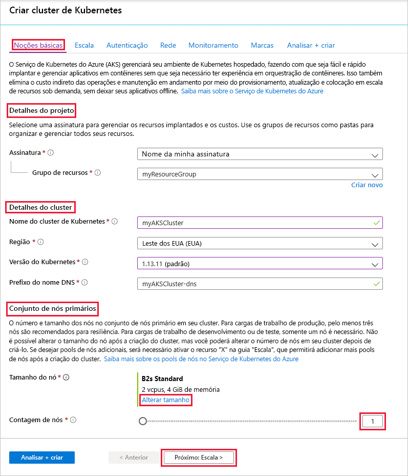
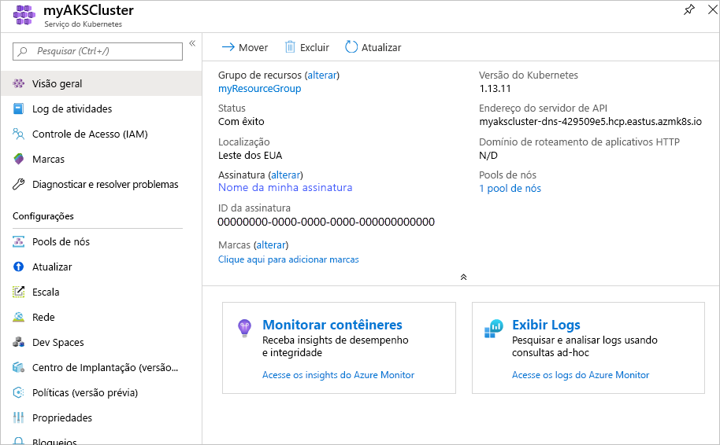
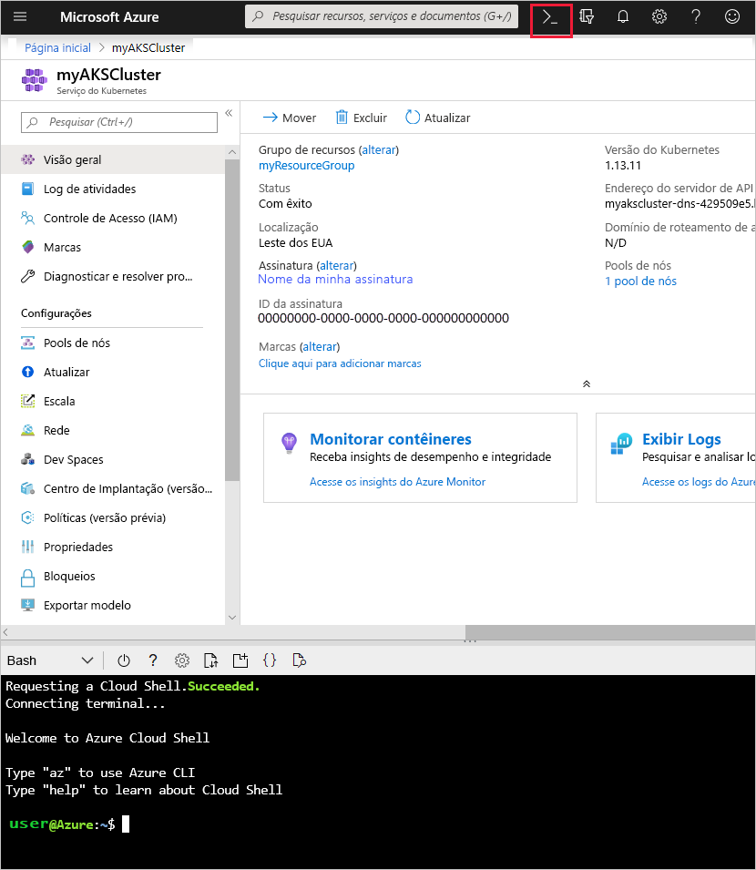

# <a name="quickstart-deploy-an-azure-kubernetes-service-aks-cluster-using-the-azure-portal"></a>Início Rápido: Implantar um cluster do AKS (Serviço de Kubernetes do Azure) usando o portal do Azure

O AKS (Serviço de Kubernetes do Azure) é um serviço de Kubernetes gerenciado que permite implantar e gerenciar clusters rapidamente. Neste guia de início rápido, você vai:
* Implantar um cluster do AKS usando o portal do Azure. 
* Executar um aplicativo de vários contêineres com um front-end da Web e uma instância do Redis no cluster. 
* Monitorar a integridade do cluster e dos pods que executam o aplicativo.


Este guia de início rápido pressupõe uma compreensão básica dos conceitos do Kubernetes. Para obter mais informações, confira [Principais conceitos do Kubernetes para o AKS (Serviço de Kubernetes do Azure)][kubernetes-concepts].

Se você não tiver uma assinatura do Azure, crie uma [conta gratuita](https://azure.microsoft.com/free/?WT.mc_id=A261C142F) antes de começar.

## <a name="prerequisites"></a>Pré-requisitos

Entre no Portal do Azure em [https://portal.azure.com](https://portal.azure.com).

## <a name="create-an-aks-cluster"></a>Criar um cluster AKS

1. No menu do portal do Azure ou na **Página Inicial**, selecione **Criar um recurso**.

2. Selecione **contêineres** > **Serviço Kubernetes**.

3. Na página **Noções básicas**, configure as seguintes opções:
    - **Detalhes do projeto**: 
        * Selecione uma **Assinatura** do Azure.
        * Selecione ou crie um **Grupo de recursos** do Azure, como *myResourceGroup*.
    - **Detalhes do cluster**: 
        * Insira um **nome do cluster do Kubernetes**, como *myAKSCluster*. 
        * Selecione uma **Região** e uma **versão do Kubernetes** para o cluster do AKS.
    - **Pool de nós primários**: 
        * Selecione o **Tamanho do nó** da VM para os nós do AKS. O tamanho da VM *não pode* ser alterado após a implantação de um cluster AKS.
        * Selecione o número de nós para implantação no cluster. Para este início rápido, defina **Contagem de nós** como *1*. A contagem de nós *pode* ser ajustada após a implantação do cluster.
    
    

4. Selecione **Avançar: Pools de nó** quando terminar.

5. Mantenha as opções padrão de **Pools de nós**. Na parte inferior da tela, clique em **Avançar: Autenticação**.
    > [!CAUTION]
    > As entidades de serviço do Azure AD recém-criadas podem levar vários minutos para serem propagadas e disponibilizadas, levando a erros de "entidade de serviço não encontrada" e a falhas de validação no portal do Azure. Se você atingir esse obstáculo, visite [nosso artigo de solução de problemas](troubleshooting.md#received-an-error-saying-my-service-principal-wasnt-found-or-is-invalid-when-i-try-to-create-a-new-cluster) para fins de mitigação.

6. Na página **Autenticação**, configure as seguintes opções:
    - Crie uma identidade de cluster de uma das seguintes maneiras:
        * Deixando o campo **Autenticação** com a **Identidade gerenciada atribuída pelo sistema** ou
        * Escolhendo **Entidade de Serviço** para usar uma entidade de serviço. 
            * Clique em *(nova) entidade de serviço padrão* para criar uma entidade de serviço padrão ou
            * Selecione *Configurar entidade de serviço* para usar uma existente. Você precisará fornecer o segredo e ID do cliente do SPN da entidade de segurança existente.
    - Habilite a opção de RBAC (controle de acesso baseado em função) do Kubernetes para fornecer um controle mais refinado sobre o acesso aos recursos do Kubernetes implantados em seu cluster do AKS.

    Por padrão, a rede *Básica* é usada e o Azure Monitor para contêineres está habilitado. 

7. Clique em **Revisar+ criar** e depois em **Criar** quando terminar a validação. 


8. Leva alguns minutos para o cluster do AKS ser criado. Quando a implantação for concluída, navegue até o recurso:
    * Clicando em **Ir para recurso** ou
    * Navegando até o grupo de recursos de cluster do AKS e selecionando o recurso do AKS. 
        * Por exemplo, no painel de cluster abaixo: navegando até *myResourceGroup* e selecionando o recurso *myAKSCluster*.

        

## <a name="connect-to-the-cluster"></a>Conectar-se ao cluster

Para gerenciar um cluster do Kubernetes, use o cliente de linha de comando do Kubernetes, [kubectl][kubectl]. `kubectl` já está instalado se você usa o Azure Cloud Shell. 

1. Abra o Cloud Shell usando o botão `>_` na parte superior do portal do Azure.

    

    > [!NOTE]
    > Para executar essas operações em uma instalação do shell local:
    > 1. Verifique se a CLI do Azure está instalada.
    > 2. Conecte-se ao Azure por meio do comando `az login`.

2. Configure o `kubectl` para se conectar ao cluster do Kubernetes usando o comando [az aks get-credentials][az-aks-get-credentials]. O comando a seguir baixa as credenciais e configura a CLI do Kubernetes para usá-las.

    ```azurecli
    az aks get-credentials --resource-group myResourceGroup --name myAKSCluster
    ```

3. Verifique a conexão com o cluster usando `kubectl get` para retornar uma lista dos nós de cluster.

    ```console
    kubectl get nodes
    ```

    A saída mostra o único nó criado nas etapas anteriores. Verifique se que o status do nó é *Pronto*:

    ```output
    NAME                       STATUS    ROLES     AGE       VERSION
    aks-agentpool-14693408-0   Ready     agent     15m       v1.11.5
    ```

## <a name="run-the-application"></a>Executar o aplicativo

Um arquivo de manifesto do Kubernetes define o estado desejado de um cluster, por exemplo, quais imagens de contêiner executar. 

Neste início rápido, você usará um manifesto para criar todos os objetos necessários para executar o aplicativo Azure Vote. Esse manifesto inclui duas implantações do Kubernetes:
* Os aplicativos Azure Vote de exemplo em Python.
* Uma instância do Redis. 

Dois Serviços Kubernetes também são criados:
* Um serviço interno para a instância do Redis.
* Um serviço externo para acessar o aplicativo Azure Vote da Internet.

1. No Cloud Shell, use um editor para criar um arquivo chamado `azure-vote.yaml`, como:
    * `code azure-vote.yaml`
    * `nano azure-vote.yaml`, ou 
    * `vi azure-vote.yaml`. 

1. Copie a seguinte definição YAML:

    ```yaml
    apiVersion: apps/v1
    kind: Deployment
    metadata:
      name: azure-vote-back
    spec:
      replicas: 1
      selector:
        matchLabels:
          app: azure-vote-back
      template:
        metadata:
          labels:
            app: azure-vote-back
        spec:
          nodeSelector:
            "beta.kubernetes.io/os": linux
          containers:
          - name: azure-vote-back
            image: mcr.microsoft.com/oss/bitnami/redis:6.0.8
            env:
            - name: ALLOW_EMPTY_PASSWORD
              value: "yes"
            resources:
              requests:
                cpu: 100m
                memory: 128Mi
              limits:
                cpu: 250m
                memory: 256Mi
            ports:
            - containerPort: 6379
              name: redis
    ---
    apiVersion: v1
    kind: Service
    metadata:
      name: azure-vote-back
    spec:
      ports:
      - port: 6379
      selector:
        app: azure-vote-back
    ---
    apiVersion: apps/v1
    kind: Deployment
    metadata:
      name: azure-vote-front
    spec:
      replicas: 1
      selector:
        matchLabels:
          app: azure-vote-front
      template:
        metadata:
          labels:
            app: azure-vote-front
        spec:
          nodeSelector:
            "beta.kubernetes.io/os": linux
          containers:
          - name: azure-vote-front
            image: mcr.microsoft.com/azuredocs/azure-vote-front:v1
            resources:
              requests:
                cpu: 100m
                memory: 128Mi
              limits:
                cpu: 250m
                memory: 256Mi
            ports:
            - containerPort: 80
            env:
            - name: REDIS
              value: "azure-vote-back"
    ---
    apiVersion: v1
    kind: Service
    metadata:
      name: azure-vote-front
    spec:
      type: LoadBalancer
      ports:
      - port: 80
      selector:
        app: azure-vote-front
    ```

1. Implante o aplicativo usando o comando `kubectl apply`. Além disso, especifique o nome do manifesto YAML:

    ```console
    kubectl apply -f azure-vote.yaml
    ```

    A saída mostra as implantações e os serviços criados com êxito:

    ```output
    deployment "azure-vote-back" created
    service "azure-vote-back" created
    deployment "azure-vote-front" created
    service "azure-vote-front" created
    ```

## <a name="test-the-application"></a>Testar o aplicativo

Quando o aplicativo é executado, um serviço de Kubernetes expõe o front-end do aplicativo à Internet. A conclusão desse processo pode levar alguns minutos.

Para monitorar o andamento, use o comando `kubectl get service` com o argumento `--watch`.

```console
kubectl get service azure-vote-front --watch
```

A saída **EXTERNAL-IP** do serviço `azure-vote-front` será mostrada inicialmente como *pendente*.

```output
NAME               TYPE           CLUSTER-IP   EXTERNAL-IP   PORT(S)        AGE
azure-vote-front   LoadBalancer   10.0.37.27   <pending>     80:30572/TCP   6s
```

Quando o endereço **EXTERNAL-IP** for alterado de *pendente* para um endereço IP público real, use `CTRL-C` para interromper o processo de inspeção do `kubectl`. A seguinte saída de exemplo mostra um endereço IP público válido atribuído ao serviço:


```output
azure-vote-front   LoadBalancer   10.0.37.27   52.179.23.131   80:30572/TCP   2m
```

Para ver o aplicativo Azure Vote em ação, abra um navegador da Web no endereço IP externo do serviço.


## <a name="monitor-health-and-logs"></a>Monitorar integridade e logs

Quando você criou o cluster, o Azure Monitor para contêineres foi habilitado. O Azure Monitor para contêineres fornece métricas de integridade do cluster do AKS e dos pods em execução no cluster.

Os dados das métricas levam alguns minutos para serem preenchidos no portal do Azure. Para ver o status da integridade, o tempo de atividade e o uso de recursos atuais para os pods do Azure Vote:

1. Navegue para o recurso do AKS no portal do Azure.
1. Em **Monitoramento**, no lado esquerdo, escolha **Insights**.
1. Na parte superior, escolha **+ Adicionar Filtro**.
1. Selecione **Namespace** como a propriedade e escolha *\<All but kube-system\>* .
1. Selecione **Contêineres** para exibi-los.

Os contêineres `azure-vote-back` e `azure-vote-front` serão exibidos, conforme mostrado no seguinte exemplo:


Para exibir os logs do pod `azure-vote-front`, selecione **Exibir logs de contêiner** na lista suspensa de contêineres. Esses logs incluem os fluxos *stdout* e *stderr* do contêiner.


## <a name="delete-cluster"></a>Excluir cluster

Para evitar encargos do Azure, limpe os recursos desnecessários. Selecione o botão **Excluir** no painel do cluster do AKS. Você também pode usar o comando [az aks delete][az-aks-delete] no Cloud Shell:

```azurecli
az aks delete --resource-group myResourceGroup --name myAKSCluster --no-wait
```
> [!NOTE]
> Quando você excluir o cluster, a entidade de serviço do Azure Active Directory usada pelo cluster do AKS não será removida. Para obter as etapas para remover a entidade de serviço, confira [Considerações sobre a entidade de serviço do AKS e sua exclusão][sp-delete].
> 
> Se você tiver usado uma identidade gerenciada, ela será gerenciada pela plataforma e não exigirá remoção.

## <a name="get-the-code"></a>Obter o código

Imagens de contêiner existentes foram usadas neste início rápido para criar uma implantação do Kubernetes. O código do aplicativo relacionado, o Dockerfile e o arquivo de manifesto Kubernetes estão [disponíveis no GitHub.][azure-vote-app]

## <a name="next-steps"></a>Próximas etapas

Neste início rápido, você implantou um cluster do Kubernetes e um aplicativo com vários contêineres nele. Acesse o painel da Web do Kubernetes para seu cluster do AKS.


Para saber mais sobre o AKS seguindo um exemplo completo, incluindo: como criar um aplicativo, como implantar o Registro de Contêiner do Azure, como atualizar um aplicativo em execução, bem como dimensionar e atualizar seu cluster, prossiga para o tutorial do cluster do Kubernetes.

> [!div class="nextstepaction"]
> [Tutorial do AKS][aks-tutorial]

<!-- LINKS - external -->
[azure-vote-app]: https://github.com/Azure-Samples/azure-voting-app-redis.git
[kubectl]: https://kubernetes.io/docs/user-guide/kubectl/
[kubectl-apply]: https://kubernetes.io/docs/reference/generated/kubectl/kubectl-commands#apply
[kubectl-get]: https://kubernetes.io/docs/reference/generated/kubectl/kubectl-commands#get
[kubernetes-documentation]: https://kubernetes.io/docs/home/

<!-- LINKS - internal -->
[kubernetes-concepts]: concepts-clusters-workloads.md
[az-aks-get-credentials]: /cli/azure/aks#az-aks-get-credentials
[az-aks-delete]: /cli/azure/aks#az-aks-delete
[aks-monitor]: ../azure-monitor/containers/container-insights-overview.md
[aks-network]: ./concepts-network.md
[aks-tutorial]: ./tutorial-kubernetes-prepare-app.md
[http-routing]: ./http-application-routing.md
[sp-delete]: kubernetes-service-principal.md#additional-considerations