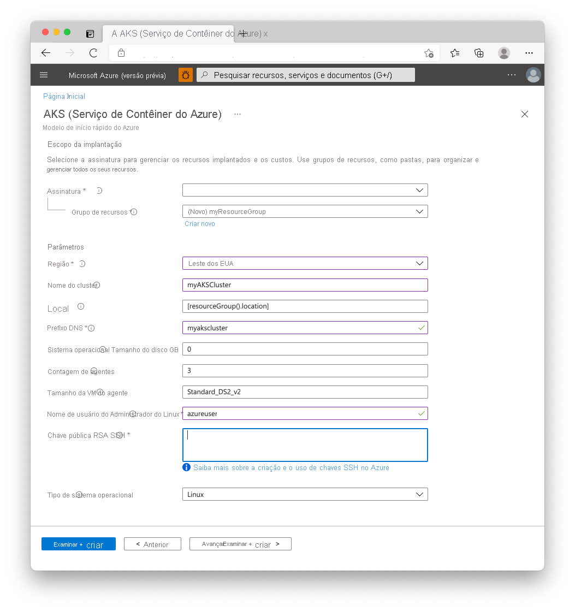

# <a name="quickstart-deploy-an-azure-kubernetes-service-aks-cluster-using-an-arm-template"></a>Início Rápido: Implantar um cluster do AKS (Serviço de Kubernetes do Azure) usando um modelo do Resource Manager

O AKS (Serviço de Kubernetes do Azure) é um serviço de Kubernetes gerenciado que permite implantar e gerenciar clusters rapidamente. Neste guia de início rápido, você implantará um cluster do AKS usando um modelo do Azure Resource Manager. Um aplicativo de vários contêineres que inclui um front-end da Web e uma instância do Redis é executado no cluster.


[!INCLUDE [About Azure Resource Manager](../../includes/resource-manager-quickstart-introduction.md)]

Este guia de início rápido pressupõe uma compreensão básica dos conceitos do Kubernetes. Para obter mais informações, confira [Principais conceitos do Kubernetes para o AKS (Serviço de Kubernetes do Azure)][kubernetes-concepts].

Se seu ambiente atender aos pré-requisitos e você estiver familiarizado com o uso de modelos ARM, selecione o botão **Implantar no Azure**. O modelo será aberto no portal do Azure.

[](https://portal.azure.com/#create/Microsoft.Template/uri/https%3A%2F%2Fraw.githubusercontent.com%2FAzure%2Fazure-quickstart-templates%2Fmaster%2F101-aks%2Fazuredeploy.json)

[!INCLUDE [quickstarts-free-trial-note](../../includes/quickstarts-free-trial-note.md)]

[!INCLUDE [azure-cli-prepare-your-environment.md](../../includes/azure-cli-prepare-your-environment.md)]

- Este artigo exige a versão 2.0.61 ou posterior da CLI do Azure. Se você está usando o Azure Cloud Shell, a versão mais recente já está instalada.

- Para criar um cluster do AKS usando um modelo do Resource Manager, forneça uma chave pública SSH e a entidade de serviço do Azure Active Directory. Como alternativa, é possível usar uma [identidade gerenciada](use-managed-identity.md) em vez de uma entidade de serviço para permissões. Se precisar de um desses recursos, confira a seção a seguir; caso contrário, vá para a seção [Examinar o modelo](#review-the-template).

### <a name="create-an-ssh-key-pair"></a>Criar um par de chaves SSH

Para acessar nós do AKS, conecte-se usando um par de chaves SSH. Use o comando `ssh-keygen` para gerar arquivos de chave SSH pública e privada. Por padrão, esses arquivos são criados no diretório *~/.ssh*. Se um par de chaves SSH com o mesmo nome existir no local especificado, esses arquivos serão substituídos.

Acesse [https://shell.azure.com](https://shell.azure.com) para abrir o Cloud Shell no navegador.

O comando a seguir cria um par de chaves SSH usando a criptografia RSA e o tamanho de bit 2048:

```console
ssh-keygen -t rsa -b 2048
```

Para obter mais informações sobre como criar chaves SSH, confira [Criar e gerenciar chaves SSH para autenticação no Azure][ssh-keys].

### <a name="create-a-service-principal"></a>Criar uma entidade de serviço

Para permitir a interação de um cluster AKS com outros recursos do Azure, usamos uma entidade de serviço do Azure Active Directory. Use o comando [az ad sp create-for-rbac][az-ad-sp-create-for-rbac] para criar uma entidade de serviço. O parâmetro `--skip-assignment` limita a atribuição de outras permissões. Por padrão, essa entidade de serviço é válida por um ano. Observe que você pode usar uma identidade gerenciada em vez de uma entidade de serviço. Para obter mais informações, confira [Usar identidades gerenciadas](use-managed-identity.md).

```azurecli-interactive
az ad sp create-for-rbac --skip-assignment
```

A saída deverá ser semelhante ao seguinte exemplo:

```json
{
  "appId": "8b1ede42-d407-46c2-a1bc-6b213b04295f",
  "displayName": "azure-cli-2019-04-19-21-42-11",
  "name": "http://azure-cli-2019-04-19-21-42-11",
  "password": "27e5ac58-81b0-46c1-bd87-85b4ef622682",
  "tenant": "73f978cf-87f2-41bf-92ab-2e7ce012db57"
}
```

Anote a *appId* e a *senha*. Esses valores serão usados nas próximas etapas.

## <a name="review-the-template"></a>Examinar o modelo

O modelo usado neste início rápido é proveniente dos [modelos de Início Rápido do Azure](https://azure.microsoft.com/resources/templates/101-aks/).

:::code language="json" source="~/quickstart-templates/101-aks/azuredeploy.json":::

Para obter mais amostras do AKS, confira o site de [modelos de início rápido do AKS][aks-quickstart-templates].

## <a name="deploy-the-template"></a>Implantar o modelo

1. Selecione a imagem a seguir para entrar no Azure e abrir um modelo.

    [](https://portal.azure.com/#create/Microsoft.Template/uri/https%3A%2F%2Fraw.githubusercontent.com%2FAzure%2Fazure-quickstart-templates%2Fmaster%2F101-aks%2Fazuredeploy.json)

2. Selecione ou insira os seguintes valores.

    Para este início rápido, deixe os valores padrão para *Tamanho em GB do Disco do Sistema Operacional*, *Contagem de Agentes*, *Tamanho da VM do Agente*, *Tipo de Sistema Operacional* e *Versão do Kubernetes*. Forneça seus próprios valores para os seguintes parâmetros de modelo:

    * **Assinatura**: Selecione uma assinatura do Azure.
    * **Grupo de recursos**: Selecione **Criar novo**. Insira um nome exclusivo para o grupo de recursos, como *myResourceGroup*, e escolha **OK**.
    * **Localização**: selecione um local, como **Leste dos EUA**.
    * **Nome do cluster**: insira um nome exclusivo para o cluster do AKS, como *myAKSCluster*.
    * **Prefixo DNS**: insira um prefixo DNS exclusivo para seu cluster, como *myakscluster*.
    * **Nome do Usuário Administrador do Linux**: insira um nome de usuário para se conectar usando SSH, como *azureuser*.
    * **Chave pública RSA SSH**: copie e cole a parte *pública* do seu par de chaves SSH (por padrão, o conteúdo de *~/.ssh/id_rsa.pub*).
    * **ID de Cliente da Entidade de Serviço**: copie e cole a *appId* de sua entidade de serviço do comando `az ad sp create-for-rbac`.
    * **Segredo do Cliente da Entidade de Serviço**: copie e cole a *senha* de sua entidade de serviço do comando `az ad sp create-for-rbac`.
    * **Concordo com os termos e condições declarados acima**: Marque esta caixa para concordar.

    

3. Selecione **Comprar**.

Leva alguns minutos para o cluster do AKS ser criado. Aguarde até que o cluster seja implantado com êxito antes de passar para a próxima etapa.

## <a name="validate-the-deployment"></a>Validar a implantação

### <a name="connect-to-the-cluster"></a>Conectar-se ao cluster

Para gerenciar um cluster do Kubernetes, use [kubectl][kubectl], o cliente de linha de comando do Kubernetes. Se você usar o Azure Cloud Shell, o `kubectl` já estará instalado. Para instalar o `kubectl` localmente, use o comando [az aks install-cli][az-aks-install-cli]:

```azurecli
az aks install-cli
```

Para configurar o `kubectl` para se conectar ao cluster do Kubernetes, use o comando [az aks get-credentials][az-aks-get-credentials]. Este comando baixa as credenciais e configura a CLI do Kubernetes para usá-las.

```azurecli-interactive
az aks get-credentials --resource-group myResourceGroup --name myAKSCluster
```

Para verificar a conexão com o cluster, use o comando [kubectl get][kubectl-get] para retornar uma lista dos nós de cluster.

```console
kubectl get nodes
```

A saída de exemplo a seguir mostra os nós criados nas etapas anteriores. Verifique se o status para todos os nós é *Pronto*:

```output
NAME                       STATUS   ROLES   AGE     VERSION
aks-agentpool-41324942-0   Ready    agent   6m44s   v1.12.6
aks-agentpool-41324942-1   Ready    agent   6m46s   v1.12.6
aks-agentpool-41324942-2   Ready    agent   6m45s   v1.12.6
```

### <a name="run-the-application"></a>Executar o aplicativo

Um arquivo de manifesto do Kubernetes define um estado desejado para o cluster, como as imagens de contêiner a serem executadas. Neste início rápido, um manifesto é usado para criar todos os objetos necessários para executar o aplicativo Azure Vote. Esse manifesto inclui duas [implantações do Kubernetes][kubernetes-deployment] – uma para os aplicativos de exemplo do Azure Vote Python e outra para uma instância do Redis. Dois [Serviços de Kubernetes][kubernetes-service] também são criados – um serviço interno para a instância do Redis e um serviço externo para acessar o aplicativo Azure Vote na Internet.

Crie um arquivo chamado `azure-vote.yaml` e copie a definição YAML a seguir. Se você usar o Azure Cloud Shell, esse arquivo poderá ser criado usando `vi` ou `nano`, como se você estivesse trabalhando em um sistema físico ou virtual:

```yaml
apiVersion: apps/v1
kind: Deployment
metadata:
  name: azure-vote-back
spec:
  replicas: 1
  selector:
    matchLabels:
      app: azure-vote-back
  template:
    metadata:
      labels:
        app: azure-vote-back
    spec:
      nodeSelector:
        "beta.kubernetes.io/os": linux
      containers:
      - name: azure-vote-back
        image: mcr.microsoft.com/oss/bitnami/redis:6.0.8
        env:
        - name: ALLOW_EMPTY_PASSWORD
          value: "yes"
        resources:
          requests:
            cpu: 100m
            memory: 128Mi
          limits:
            cpu: 250m
            memory: 256Mi
        ports:
        - containerPort: 6379
          name: redis
---
apiVersion: v1
kind: Service
metadata:
  name: azure-vote-back
spec:
  ports:
  - port: 6379
  selector:
    app: azure-vote-back
---
apiVersion: apps/v1
kind: Deployment
metadata:
  name: azure-vote-front
spec:
  replicas: 1
  selector:
    matchLabels:
      app: azure-vote-front
  template:
    metadata:
      labels:
        app: azure-vote-front
    spec:
      nodeSelector:
        "beta.kubernetes.io/os": linux
      containers:
      - name: azure-vote-front
        image: mcr.microsoft.com/azuredocs/azure-vote-front:v1
        resources:
          requests:
            cpu: 100m
            memory: 128Mi
          limits:
            cpu: 250m
            memory: 256Mi
        ports:
        - containerPort: 80
        env:
        - name: REDIS
          value: "azure-vote-back"
---
apiVersion: v1
kind: Service
metadata:
  name: azure-vote-front
spec:
  type: LoadBalancer
  ports:
  - port: 80
  selector:
    app: azure-vote-front
```

Implante o aplicativo usando o comando [kubectl apply][kubectl-apply] e especifique o nome do manifesto YAML:

```console
kubectl apply -f azure-vote.yaml
```

A seguinte saída de exemplo mostra as Implantações e os Serviços criados com êxito:

```output
deployment "azure-vote-back" created
service "azure-vote-back" created
deployment "azure-vote-front" created
service "azure-vote-front" created
```

### <a name="test-the-application"></a>Testar o aplicativo

Quando o aplicativo é executado, um serviço de Kubernetes expõe o front-end do aplicativo à Internet. A conclusão desse processo pode levar alguns minutos.

Para monitorar o andamento, use o comando [kubectl get service][kubectl-get] com o argumento `--watch`.

```console
kubectl get service azure-vote-front --watch
```

Inicialmente, o *EXTERNAL-IP* para o serviço *azure-vote-front* é mostrado como *pendente*.

```output
NAME               TYPE           CLUSTER-IP   EXTERNAL-IP   PORT(S)        AGE
azure-vote-front   LoadBalancer   10.0.37.27   <pending>     80:30572/TCP   6s
```

Quando o endereço *EXTERNAL-IP* for alterado de *pendente* para um endereço IP público real, use `CTRL-C` para interromper o processo de inspeção do `kubectl`. A seguinte saída de exemplo mostra um endereço IP público válido atribuído ao serviço:

```output
azure-vote-front   LoadBalancer   10.0.37.27   52.179.23.131   80:30572/TCP   2m
```

Para ver o aplicativo Azure Vote em ação, abra um navegador da Web no endereço IP externo do serviço.


## <a name="clean-up-resources"></a>Limpar os recursos

Quando o cluster não for mais necessário, use o comando [az group delete][az-group-delete] para remover o grupo de recursos, o serviço de contêiner e todos os recursos relacionados.

```azurecli-interactive
az group delete --name myResourceGroup --yes --no-wait
```

> [!NOTE]
> Quando você excluir o cluster, a entidade de serviço do Azure Active Directory usada pelo cluster do AKS não será removida. Para obter as etapas para remover a entidade de serviço, confira [Considerações sobre a entidade de serviço do AKS e sua exclusão][sp-delete]. Se você tiver usado uma identidade gerenciada, ela será gerenciada pela plataforma e não exigirá remoção.

## <a name="get-the-code"></a>Obter o código

Neste início rápido, foram usadas imagens de contêiner pré-criadas para criar uma implantação do Kubernetes. O código de aplicativo relacionado, o Dockerfile e o arquivo de manifesto Kubernetes estão disponíveis no GitHub.

[https://github.com/Azure-Samples/azure-voting-app-redis][azure-vote-app]

## <a name="next-steps"></a>Próximas etapas

Neste início rápido, você implantou um cluster Kubernetes e um aplicativo de com vários contêineres nele. [Acesse o painel da Web do Kubernetes][kubernetes-dashboard] do cluster criado.

Para saber mais sobre o AKS e percorrer um código completo de exemplo de implantação, prossiga para o tutorial de cluster Kubernetes.

> [!div class="nextstepaction"]
> [Tutorial do AKS][aks-tutorial]

<!-- LINKS - external -->
[azure-vote-app]: https://github.com/Azure-Samples/azure-voting-app-redis.git
[kubectl]: https://kubernetes.io/docs/user-guide/kubectl/
[kubectl-apply]: https://kubernetes.io/docs/reference/generated/kubectl/kubectl-commands#apply
[kubectl-get]: https://kubernetes.io/docs/reference/generated/kubectl/kubectl-commands#get
[azure-dev-spaces]: ../dev-spaces/index.yml
[aks-quickstart-templates]: https://azure.microsoft.com/resources/templates/?term=Azure+Kubernetes+Service

<!-- LINKS - internal -->
[kubernetes-concepts]: concepts-clusters-workloads.md
[aks-monitor]: ../azure-monitor/containers/container-insights-onboard.md
[aks-tutorial]: ./tutorial-kubernetes-prepare-app.md
[az-aks-browse]: /cli/azure/aks#az-aks-browse
[az-aks-create]: /cli/azure/aks#az-aks-create
[az-aks-get-credentials]: /cli/azure/aks#az-aks-get-credentials
[az-aks-install-cli]: /cli/azure/aks#az-aks-install-cli
[az-group-create]: /cli/azure/group#az-group-create
[az-group-delete]: /cli/azure/group#az-group-delete
[azure-cli-install]: /cli/azure/install-azure-cli
[sp-delete]: kubernetes-service-principal.md#additional-considerations
[azure-portal]: https://portal.azure.com
[kubernetes-deployment]: concepts-clusters-workloads.md#deployments-and-yaml-manifests
[kubernetes-service]: concepts-network.md#services
[kubernetes-dashboard]: kubernetes-dashboard.md
[ssh-keys]: ../virtual-machines/linux/create-ssh-keys-detailed.md
[az-ad-sp-create-for-rbac]: /cli/azure/ad/sp#az-ad-sp-create-for-rbac
