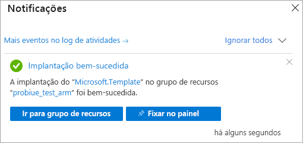

# <a name="quickstart-create-a-server---azure-resource-manager-template"></a>Início Rápido: Criar um servidor – modelo do Azure Resource Manager

Este início rápido descreve como criar um recurso de servidor do Analysis Services em sua assinatura do Azure usando o modelo do Resource Manager.

[!INCLUDE [About Azure Resource Manager](../../includes/resource-manager-quickstart-introduction.md)]

## <a name="prerequisites"></a>Pré-requisitos

* **Assinatura do Azure**: Acesse [Avaliação Gratuita do Azure](https://azure.microsoft.com/offers/ms-azr-0044p/) para criar uma conta.
* **Azure Active Directory**: sua assinatura deve estar associada a um locatário do Azure Active Directory. Também é preciso estar conectado ao Azure com uma conta no Azure Active Directory em questão. Para obter mais informações, confira [Autenticação e permissões de usuário](analysis-services-manage-users.md).

## <a name="create-a-server"></a>Criar um servidor

### <a name="review-the-template"></a>Examinar o modelo

O modelo usado neste início rápido é proveniente dos [modelos de Início Rápido do Azure](https://azure.microsoft.com/resources/templates/101-analysis-services-create/).

:::code language="json" source="~/quickstart-templates/101-analysis-services-create/azuredeploy.json" range="1-79" highlight="63-78":::

Um recurso [Microsoft.AnalysisServices/servers](https://docs.microsoft.com/azure/templates/microsoft.analysisservices/2017-08-01/servers) único com uma regra de firewall é definido no modelo. 

### <a name="deploy-the-template"></a>Implantar o modelo

1. Selecione o link Implantar no Azure a seguir para entrar no Azure e abrir um modelo. O modelo é usado para criar um recurso de servidor do Analysis Services e especificar as propriedades obrigatórias e opcionais.

   [](https://portal.azure.com/#create/Microsoft.Template/uri/https%3A%2F%2Fraw.githubusercontent.com%2FAzure%2Fazure-quickstart-templates%2Fmaster%2F101-analysis-services-create%2Fazuredeploy.json)

2. Selecione ou insira os seguintes valores.

    A menos que especificado de outra forma, use valores padrão.

    * **Assinatura**: Selecione uma assinatura do Azure.
    * **Grupo de recursos**: clique em **Criar** e insira um nome exclusivo para o novo grupo de recursos.
    * **Localização**: selecione uma localização padrão para os recursos criados no grupo de recursos.
    * **Nome do Servidor**: insira um nome para o recurso de servidor. 
    * **Localização**: ignore para Analysis Services. A localização é especificada na Localização do Servidor.
    * **Localização do servidor**: insira a localização do servidor do Analysis Services. Geralmente é a mesma região que a localização padrão especificada para o grupo de recursos, mas isso não é obrigatório. Por exemplo, **Centro-Norte dos EUA**. Para ver as regiões com suporte, confira [Disponibilidade do Analysis Services por região](analysis-services-overview.md#availability-by-region).
    * **Nome do SKU**: insira o nome do SKU para o servidor do Analysis Services a ser criado. Escolha entre: B1, B2, D1, S0, S1, S2, S3, S4, S8v2, S9v2. A disponibilidade do SKU depende da região. Recomenda-se S0 ou D1 para avaliação e teste.
    * **Capacity**: insira o número total de instâncias de expansão de réplica de consulta. Há suporte para a expansão de mais de uma instância apenas em regiões selecionadas.
    * **Configurações de Firewall**: insira regras de firewall de entrada a serem definidas para o servidor. Se não for especificado, o firewall será desabilitado.
    * **URI do Contêiner de Blobs de Backup**: insira o URI de SAS para um contêiner do Armazenamento de Blobs do Azure privado com permissões de leitura, gravação e lista. Necessário somente se você pretende usar [Backup/restauração](analysis-services-backup.md).
    * **Concordo com os termos e condições declarados acima**: selecione.

3. Selecione **Comprar**. Depois que o servidor for implantado com êxito, você receberá uma notificação:

   

## <a name="validate-the-deployment"></a>Validar a implantação

Use o portal do Azure ou o Azure PowerShell para verificar se o grupo de recursos e o recurso de servidor foram criados.

### <a name="powershell"></a>PowerShell

```azurepowershell-interactive
$resourceGroupName = Read-Host -Prompt "Enter the Resource Group name"
(Get-AzResource -ResourceType "Microsoft.AnalysisServices/servers" -ResourceGroupName $resourceGroupName).Name
 Write-Host "Press [ENTER] to continue..."
```

---

## <a name="clean-up-resources"></a>Limpar os recursos

Quando não for mais necessário, use o portal do Azure, a CLI do Azure ou o Azure PowerShell para excluir o grupo de recursos e o recurso de servidor.

# <a name="cli"></a>[CLI](#tab/CLI)

```azurecli-interactive
echo "Enter the Resource Group name:" &&
read resourceGroupName &&
az group delete --name $resourceGroupName &&
echo "Press [ENTER] to continue ..."
```

# <a name="powershell"></a>[PowerShell](#tab/PowerShell)

```azurepowershell-interactive
$resourceGroupName = Read-Host -Prompt "Enter the Resource Group name"
Remove-AzResourceGroup -Name $resourceGroupName
Write-Host "Press [ENTER] to continue..."
```

---

## <a name="next-steps"></a>Próximas etapas

Neste guia de início rápido, você usou um modelo de Azure Resource Manager para criar um grupo de recursos e um recurso de servidor do Azure Analysis Services. Depois de criar um recurso de servidor usando o modelo, considere o seguinte:
- [Início Rápido: Criar um servidor – PowerShell](analysis-services-create-powershell.md)
- [Adicionar um modelo de exemplo do portal](analysis-services-create-sample-model.md)
- [Configurar funções de administrador do servidor e usuário](tutorials/analysis-services-tutorial-roles.md)
