# <a name="quickstart-create-an-aspnet-core-web-app-in-azure"></a>Início Rápido: Criar um aplicativo Web ASP.NET Core no Azure

Neste guia de início rápido, você aprenderá a criar e implantar seu primeiro aplicativo Web ASP.NET Core no [Serviço de Aplicativo do Azure](overview.md). 

Quando terminar, você terá um grupo de recursos do Azure que consistirá em um plano de hospedagem do Serviço de Aplicativo e um Serviço de Aplicativo com um aplicativo Web implantado.

## <a name="prerequisites"></a>Pré-requisitos

- Uma conta do Azure com uma assinatura ativa. [Crie uma conta gratuitamente](https://azure.microsoft.com/free/dotnet/).
- Este guia de início rápido implanta um aplicativo no Serviço de Aplicativo no Windows. Para implantar o Serviço de Aplicativo em _Linux_, consulte [Criar um aplicativo Web .NET Core no Serviço de Aplicativo em Linux](./containers/quickstart-dotnetcore.md).
- Instale o <a href="https://www.visualstudio.com/downloads/" target="_blank">Visual Studio 2019</a> com a carga de trabalho de **desenvolvimento Web e do ASP.NET**.

  Se você já instalou o Visual Studio 2019:

  - Instale as atualizações mais recentes no Visual Studio selecionando **Ajuda** > **Verificar Atualizações**.
  - Adicione a carga de trabalho selecionando **Ferramentas** > **Obter Ferramentas e Recursos**.


## <a name="create-an-aspnet-core-web-app"></a>Criar um aplicativo Web ASP.NET Core

Crie um aplicativo Web ASP.NET Core no Visual Studio seguindo estas etapas:

1. Abra o Visual Studio e selecione **Criar um projeto**.

1. Em **Criar um projeto**, selecione **Aplicativo Web ASP.NET Core** e confirme se **C#** está listado nas linguagens para essa escolha e, em seguida, selecione **Avançar**.

1. Em **Configurar seu novo projeto**, dê ao projeto de aplicativo Web o nome *myFirstAzureWebApp* e selecione **Criar**.

   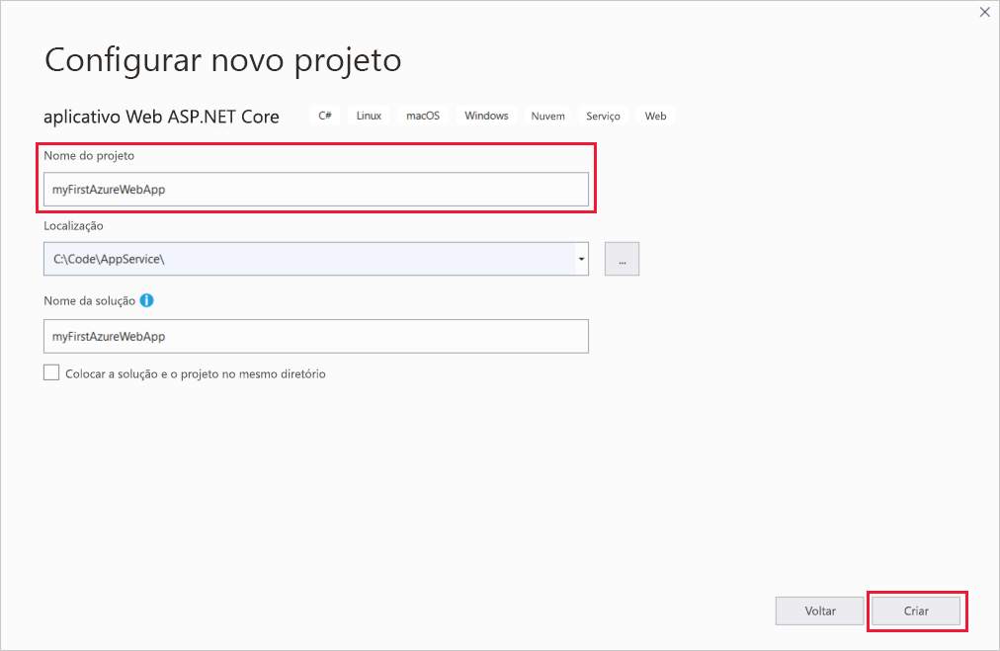

1. Você pode implantar qualquer tipo de aplicativo Web ASP.NET Core no Azure, mas para este guia de início rápido, escolha o modelo **Aplicativo Web**. Defina **Autenticação** como **Sem Autenticação** e não deixe nenhuma outra opção selecionada. Em seguida, selecione **Criar**.

   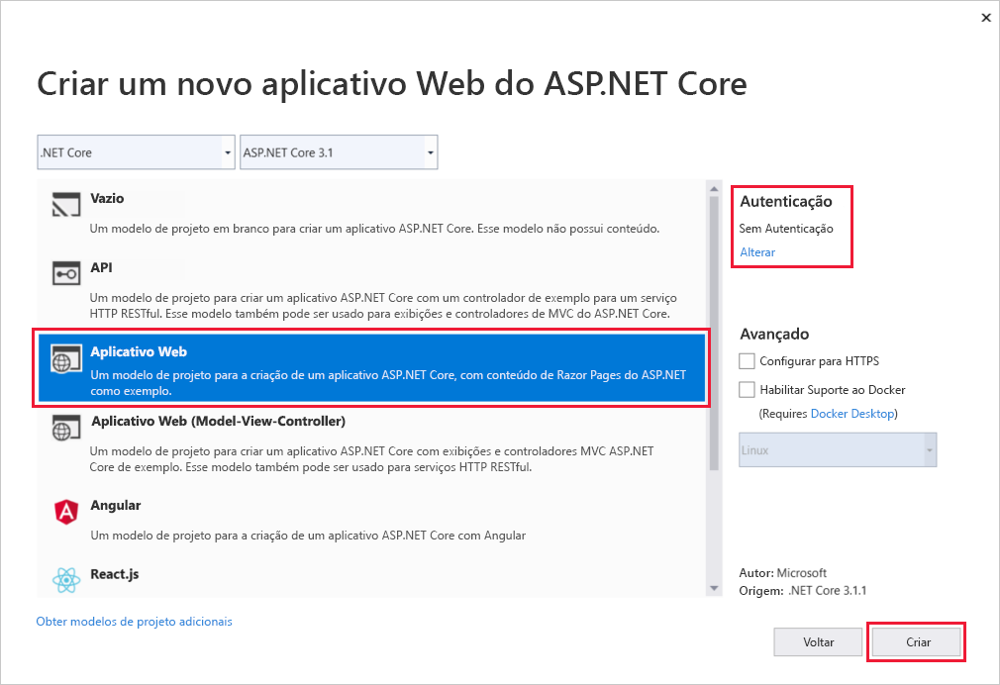 
   
1. No menu do Visual Studio, selecione **Depurar** > **Iniciar Sem Depuração** para executar o aplicativo Web localmente.

   

## <a name="publish-your-web-app"></a>Publicar seu aplicativo Web

Para publicar o aplicativo Web, você deve primeiro criar e configurar um novo Serviço de Aplicativo no qual você possa publicá-lo. 

Como parte da configuração do Serviço de Aplicativo, você criará:

- Um novo [grupo de recursos](https://docs.microsoft.com/azure/azure-resource-manager/management/overview#terminology) para conter todos os recursos do Azure para o serviço.
- Um novo [Plano de Hospedagem](https://docs.microsoft.com/azure/app-service/overview-hosting-plans) que especifica o local, o tamanho e os recursos do farm de servidores Web que hospeda o aplicativo.

Siga estas etapas para criar seu Serviço de Aplicativo e publicar o aplicativo Web:

1. No **Gerenciador de Soluções**, clique com o botão direito do mouse no projeto **myFirstAzureWebApp** e selecione **Publicar**. Se você ainda não entrou em sua conta do Azure do Visual Studio, selecione **Adicionar uma conta** ou **Entrar**. Também é possível criar uma conta gratuita do Azure.

1. Na caixa de diálogo **Escolher um destino de publicação**, escolha **Serviço de Aplicativo**, selecione **Criar Novo** e, em seguida, selecione **Criar Perfil**.

   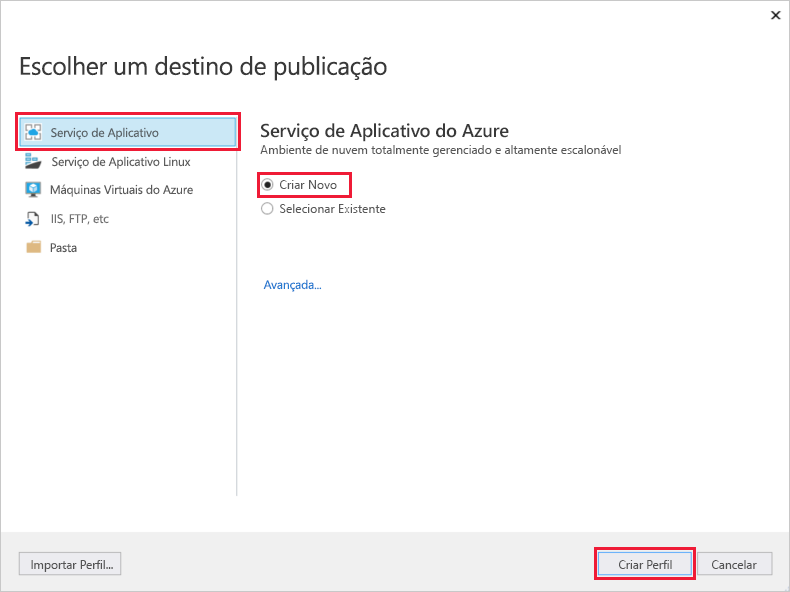

1. No **Serviço de Aplicativo: Criar novo**, forneça um **Nome** globalmente exclusivo para seu aplicativo aceitando o nome padrão ou inserindo um novo nome. Os caracteres válidos são: `a-z`, `A-Z`, `0-9` e `-`. Esse **Nome** é usado como o prefixo de URL para seu aplicativo Web no formato `http://<app_name>.azurewebsites.net`.

1. Em **Assinatura**, aceite a assinatura que está listada ou selecione uma nova na lista suspensa.

1. Em **Grupo de recursos**, selecione **Novo**. Em **Nome do novo grupo de recursos**, insira *myResourceGroup* e selecione **OK**. 

1. Em **Plano de Hospedagem**, selecione **Novo**. 

1. Na caixa de diálogo **Plano de Hospedagem: Criar novo**, insira os valores especificados na tabela a seguir:

   | Configuração  | Valor sugerido | Descrição |
   | -------- | --------------- | ----------- |
   | **Plano de hospedagem**  | *myFirstAzureWebAppPlan* | O nome do plano do Serviço de Aplicativo. |
   | **Localidade**      | *Oeste da Europa* | O datacenter onde o aplicativo Web está hospedado. |
   | **Tamanho**          | *Gratuito* | O [Tipo de preço](https://azure.microsoft.com/pricing/details/app-service/?ref=microsoft.com&utm_source=microsoft.com&utm_medium=docs&utm_campaign=visualstudio) determina os recursos de hospedagem. |
   
   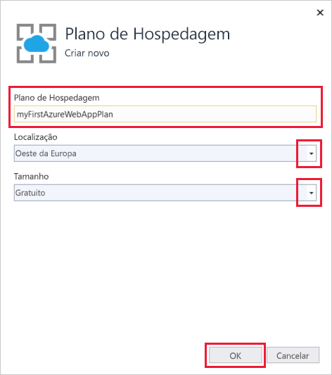

1. Deixe **Application Insights** definido como *Nenhum*.

1. No **Serviço de Aplicativo: Criar**, selecione **Criar** para começar a criar os recursos do Azure.

   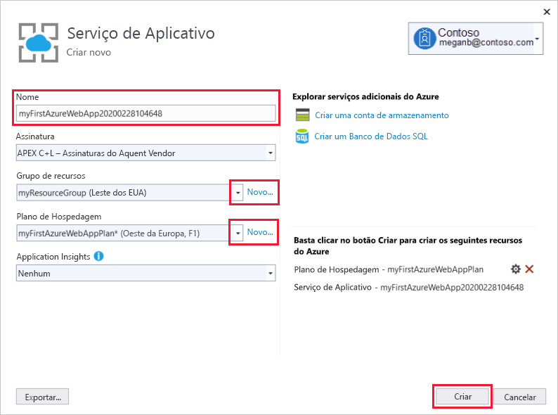

1. Quando o assistente for concluído, selecione **Publicar**.

   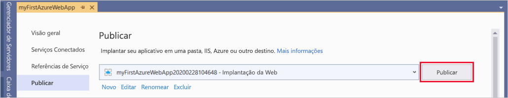

   O Visual Studio publica seu aplicativo Web ASP.NET Core no Azure e inicia o aplicativo no navegador padrão. 

   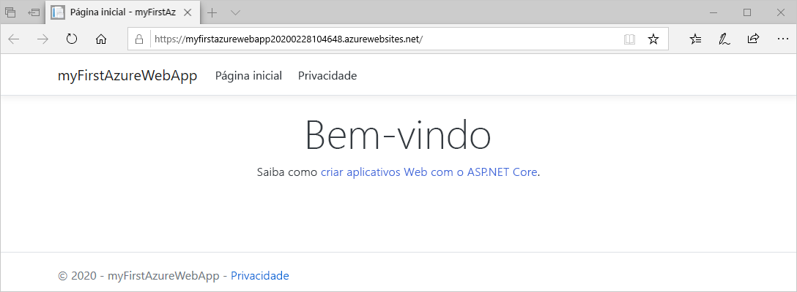

**Parabéns!** Seu aplicativo Web ASP.NET Core está em execução no Serviço de Aplicativo do Azure.

## <a name="update-the-app-and-redeploy"></a>Atualizar o aplicativo e reimplantar

Siga estas etapas para atualizar e reimplantar seu aplicativo Web:

1. No **Gerenciador de Soluções**, em seu projeto, abra **Páginas** > **Index.cshtml**.

1. Substitua as duas marcas `<div>` pelo código a seguir:

   ```HTML
   <div class="jumbotron">
       <h1>ASP.NET in Azure!</h1>
       <p class="lead">This is a simple app that we've built that demonstrates how to deploy a .NET app to Azure App Service.</p>
   </div>
   ```

1. Para implantar novamente no Azure, clique com o botão direito do mouse no projeto **myFirstAzureWebApp**, no **Gerenciador de Soluções** e selecione **Publicar**.

1. Na página de resumo **Publicar**, selecione **Publicar**.

   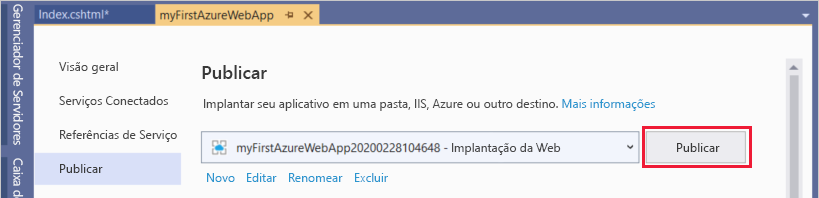

Quando a publicação está concluída, o Visual Studio inicia um navegador para a URL do aplicativo Web.

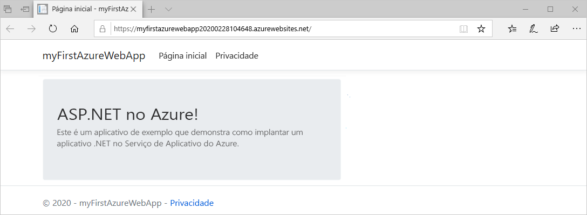

## <a name="manage-the-azure-app"></a>Gerenciar o aplicativo do Azure

Para gerenciar o aplicativo Web, acesse o [portal do Azure](https://portal.azure.com) e procure e selecione **Serviços de Aplicativos**.

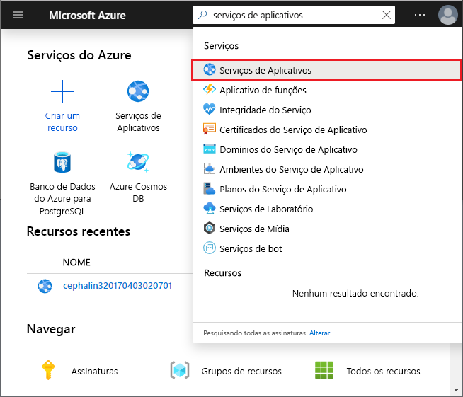

Na página **Serviços de Aplicativos**, selecione o nome do seu aplicativo Web.

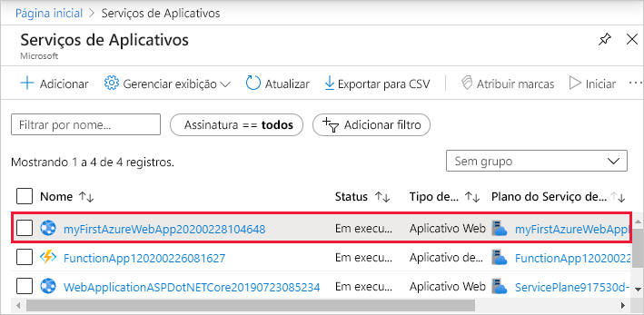

A página **Visão Geral** do aplicativo Web contém opções para gerenciamento básico, como procurar, parar, iniciar, reiniciar e excluir. O menu à esquerda fornece páginas adicionais para configurar o aplicativo.

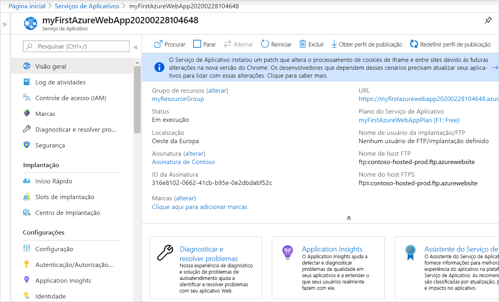

[!INCLUDE [Clean-up section](../../includes/clean-up-section-portal.md)]

## <a name="next-steps"></a>Próximas etapas

Neste guia de início rápido, você usou o Visual Studio para criar e implantar um aplicativo Web ASP.NET Core no Serviço de Aplicativo do Azure.

Avance para o próximo artigo para saber como criar um aplicativo .NET Core e conectá-lo a um Banco de Dados SQL:

> [!div class="nextstepaction"]
> [ASP.NET Core com o Banco de Dados SQL](app-service-web-tutorial-dotnetcore-sqldb.md)
