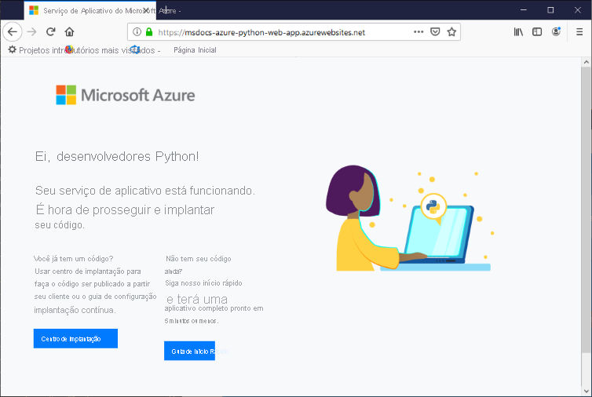

# <a name="configure-a-linux-python-app-for-azure-app-service"></a>Configurar um aplicativo Python do Linux para o Serviço de Aplicativo do Azure

Este artigo descreve como o [Serviço de Aplicativo do Azure](overview.md) executa aplicativos Python, como você pode migrar aplicativos existentes para o Azure e como pode personalizar o comportamento do Serviço de Aplicativo quando necessário. Os aplicativos Python precisam ser implantados com todos os módulos [pip](https://pypi.org/project/pip/) necessários.

O mecanismo de implantação do Serviço de Aplicativo ativará de maneira automática um ambiente virtual e executará `pip install -r requirements.txt` quando você implantar um [repositório Git](deploy-local-git.md) ou um [pacote zip](deploy-zip.md).

Este guia fornece conceitos e instruções essenciais para desenvolvedores do Python que usam um contêiner interno do Linux no Serviço de Aplicativo. Caso nunca tenha usado o Serviço de Aplicativo do Azure, primeiro siga o [Início rápido do Python](quickstart-python.md) e o [Tutorial do Python com o PostgreSQL](tutorial-python-postgresql-app.md).

Será possível usar o [portal do Azure](https://portal.azure.com) ou a CLI do Azure para executar a configuração:

- No **portal do Azure**, use a página **Configurações** > **Configuração** do aplicativo, conforme descrito em [Configurar um aplicativo do Serviço de Aplicativo no portal do Azure](configure-common.md).

- **CLI do Azure**: você tem duas opções.

    - Executar os comandos no [Azure Cloud Shell](../cloud-shell/overview.md).
    - Executar comandos localmente instalando a versão mais recente da [CLI do Azure](/cli/azure/install-azure-cli) e entrar no Azure usando o comando [az login](/cli/azure/reference-index#az-login).
    
> [!NOTE]
> Atualmente, o Linux é a opção recomendada para execução de aplicativos Python no Serviço de Aplicativo. Para obter informações sobre a opção do Windows, confira [Python na variante do Windows do Serviço de Aplicativo](/visualstudio/python/managing-python-on-azure-app-service).

## <a name="configure-python-version"></a>Configurar a versão do Python

- **Portal do Azure**: use a guia **Configurações gerais** na página **Configuração**, conforme descrito em [Definir configurações gerais](configure-common.md#configure-general-settings) para contêineres do Linux.

- **CLI do Azure**:

    -  Mostre a versão atual do Python com o [az webapp config show](/cli/azure/webapp/config#az_webapp_config_show):
    
        ```azurecli
        az webapp config show --resource-group <resource-group-name> --name <app-name> --query linuxFxVersion
        ```
        
        Substitua `<resource-group-name>` e `<app-name>` pelos nomes apropriados para seu aplicativo Web.
    
    - Defina a versão do Python com o [az webapp config set](/cli/azure/webapp/config#az_webapp_config_set)
        
        ```azurecli
        az webapp config set --resource-group <resource-group-name> --name <app-name> --linux-fx-version "PYTHON|3.7"
        ```
    
    - Mostre todas as versões do Python compatíveis com o Serviço de Aplicativo do Azure com o [az webapp list-runtimes](/cli/azure/webapp#az_webapp_list_runtimes):
    
        ```azurecli
        az webapp list-runtimes --linux | grep PYTHON
        ```
    
Você pode executar uma versão sem suporte do Python criando sua própria imagem de contêiner em vez disso. Para obter mais informações, confira [Usar uma imagem do Docker personalizada](tutorial-custom-container.md?pivots=container-linux).

<!-- <a> element here to preserve external links-->
<a name="access-environment-variables"></a>

## <a name="customize-build-automation"></a>Personalizar a automação de build

O sistema de compilação do Serviço de Aplicativo, chamado Oryx, executará as seguintes etapas quando você implantar o aplicativo usando pacotes Git ou zip:

1. Execute um script personalizado de pré-compilação caso seja especificado pela configuração `PRE_BUILD_COMMAND`. (O script pode, por si só, executar outros scripts Python e Node.js, comandos do Pip e do npm e ferramentas baseadas em Node como o Yarn, por exemplo, `yarn install` e `yarn build`.)

1. Execute `pip install -r requirements.txt`. O arquivo *requirements.txt* deverá estar presente na pasta raiz do projeto. Caso contrário, o processo de compilação relatará o seguinte erro: "Não foi possível localizar o setup.py nem o requirements.txt. A instalação de PIP não está sendo executada."

1. Caso o *manage.py* seja encontrado na raiz do repositório (indicando um aplicativo Django), execute o *manage.py collectstatic*. No entanto, caso a configuração de `DISABLE_COLLECTSTATIC` seja `true`, essa etapa será ignorada.

1. Execute um script personalizado de pós-compilação caso seja especificado pela configuração `POST_BUILD_COMMAND`. (Novamente, o script pode executar outros scripts Python e Node.js, comandos do Pip e do npm e ferramentas baseadas em Node.)

Por padrão, as configurações `PRE_BUILD_COMMAND`, `POST_BUILD_COMMAND` e `DISABLE_COLLECTSTATIC` estarão vazias. 

- Para desabilitar a execução de collectstatic ao criar aplicativos Django, defina a configuração `DISABLE_COLLECTSTATIC` como true.

- Para executar comandos de pré-compilação, defina a configuração `PRE_BUILD_COMMAND` para conter um comando, como o `echo Pre-build command`, ou um caminho para um arquivo de script relativo à raiz do projeto, como `scripts/prebuild.sh`. Todos os comandos deverão usar caminhos relativos para a pasta raiz do projeto.

- Para executar comandos de pós-compilação, defina a configuração `POST_BUILD_COMMAND` para conter um comando, como o `echo Post-build command`, ou um caminho para um arquivo de script relativo à raiz do projeto, como `scripts/postbuild.sh`. Todos os comandos deverão usar caminhos relativos para a pasta raiz do projeto.

Para obter configurações adicionais que personalizam a automação de compilação, confira [Configuração de Oryx](https://github.com/microsoft/Oryx/blob/master/doc/configuration.md). 

Para acessar os logs de criação e implantação, confira [Acessar logs de implantação](#access-deployment-logs).

Para obter mais informações sobre como o Serviço de Aplicativo executa e cria aplicativos Python no Linux, confira [Como o Oryx detecta e cria aplicativos Python](https://github.com/microsoft/Oryx/blob/master/doc/runtimes/python.md).

> [!NOTE]
> As configurações `PRE_BUILD_SCRIPT_PATH` e `POST_BUILD_SCRIPT_PATH` são idênticas a `PRE_BUILD_COMMAND` e `POST_BUILD_COMMAND`, além de serem compatíveis para fins de herança.
> 
> Uma configuração chamada `SCM_DO_BUILD_DURING_DEPLOYMENT`, caso contenha `true` ou 1, disparará uma compilação de Oryx durante a implantação. A configuração será true quando a implantação usar o Git, o comando `az webapp up` da CLI do Azure e o Visual Studio Code.

> [!NOTE]
> Sempre use caminhos relativos em todos os scripts de pré e pós-compilação porque o contêiner de compilação no qual o Oryx é executado será diferente do contêiner de runtime no qual o aplicativo será executado. Nunca confie no posicionamento exato da pasta do projeto do aplicativo dentro do contêiner (por exemplo, que a pasta foi colocada em *site/wwwroot*).

## <a name="migrate-existing-applications-to-azure"></a>Migrar aplicativos existentes para o Azure

Os aplicativos Web existentes podem ser reimplantados para o Azure da seguinte maneira:

1. **Repositório de origem**: mantenha seu código-fonte em um repositório adequado, como o GitHub, que permite configurar a implantação contínua posteriormente neste processo.
    1. O arquivo *requirements.txt* precisa estar na raiz do seu repositório para que o Serviço de Aplicativo instale automaticamente os pacotes necessários.    

1. **Banco de dados**: se seu aplicativo depende de um banco de dados, provisione os recursos necessários no Azure também. Confira o [Tutorial: Implantar um aplicativo Web Django com PostgreSQL – criar um banco de dados](tutorial-python-postgresql-app.md#3-create-postgres-database-in-azure) para obter um exemplo.

1. **Recursos do serviço de aplicativo**: crie um grupo de recursos, o Plano do Serviço de Aplicativo e o aplicativo Web do Serviço de Aplicativo para hospedar seu aplicativo. Você pode fazer isso com mais facilidade realizando uma implantação inicial do seu código por meio do comando `az webapp up` da CLI do Azure, conforme mostrado no [Tutorial: Implantar um aplicativo Web Django com PostgreSQL – implantar o código](tutorial-python-postgresql-app.md#4-deploy-the-code-to-azure-app-service). Substitua os nomes do grupo de recursos, do Plano do Serviço de Aplicativo e do aplicativo Web para que eles sejam mais adequados para seu aplicativo.

1. **Variáveis de ambiente**: se seu aplicativo exigir variáveis de ambiente, crie [configurações do aplicativo do Serviço de Aplicativo](configure-common.md#configure-app-settings) equivalentes. Essas configurações do Serviço de Aplicativo aparecem para seu código como variáveis de ambiente, conforme descrito em [Acessar variáveis de ambiente](#access-app-settings-as-environment-variables).
    - As conexões de banco de dados, por exemplo, são geralmente gerenciadas por meio dessas configurações, conforme mostrado no [Tutorial: Implantar um aplicativo Web Django com PostgreSQL – configurar variáveis para conectar o banco de dados](tutorial-python-postgresql-app.md#42-configure-environment-variables-to-connect-the-database).
    - Confira [Configurações de produção para aplicativos Django](#production-settings-for-django-apps) para obter configurações específicas para aplicativos Django típicos.

1. **Inicialização do aplicativo**: examine a seção [Processo de inicialização do contêiner](#container-startup-process) mais adiante neste artigo para entender como o Serviço de Aplicativo tenta executar seu aplicativo. O Serviço de Aplicativo usa o servidor Web Gunicorn por padrão, que precisa ter a capacidade de localizar seu objeto de aplicativo ou a *pasta wsgi.py*. Se necessário, você pode [Personalizar o comando de inicialização](#customize-startup-command).

1. **Implantação contínua**: configure a implantação contínua, conforme descrito em [Implantação contínua para o Serviço de Aplicativo do Azure](deploy-continuous-deployment.md) se estiver usando a implantação do Azure Pipelines ou do Kudu, ou [Fazer a implantação no Serviço de Aplicativo usando o GitHub Actions](./deploy-continuous-deployment.md) se estiver usando ações do GitHub.

1. **Ações personalizadas**: para executar ações no contêiner do Serviço de Aplicativo que hospeda seu aplicativo, como migrações do banco de dados Django, você pode [conectar-se ao contêiner por meio de SSH](configure-linux-open-ssh-session.md). Para obter um exemplo de como executar migrações do banco de dados Django, confira [Tutorial: Implantar um aplicativo Web Django com PostgreSQL – executar migração de banco de dados](tutorial-python-postgresql-app.md#43-run-django-database-migrations).
    - Ao usar a implantação contínua, você pode executar essas ações usando comandos pós-build conforme descrito anteriormente em [Personalizar a automação de build](#customize-build-automation).

Com essas etapas concluídas, você deve poder confirmar as alterações no repositório de origem e fazer com que essas atualizações sejam implantadas automaticamente no Serviço de Aplicativo.

### <a name="production-settings-for-django-apps"></a>Configurações de produção para aplicativos Django

Para um ambiente de produção como o Serviço de Aplicativo do Azure, os aplicativos Django deverão seguir a [Lista de verificação de implantação](https://docs.djangoproject.com/en/3.1/howto/deployment/checklist/) do Django (djangoproject.com).

A tabela a seguir descreverá configurações de produção relevantes para o Azure. Essas configurações serão definidas no arquivo *setting.py* do aplicativo.

| Configuração do Django | Instruções para usar no Azure |
| --- | --- |
| `SECRET_KEY` | Armazene o valor em uma configuração do Serviço de Aplicativo, conforme descrito em como [Acessar configurações de aplicativos como variáveis de ambiente](#access-app-settings-as-environment-variables). Como alternativa, você poderá [armazenar o valor como um "segredo" no Azure Key Vault](../key-vault/secrets/quick-create-python.md). |
| `DEBUG` | Crie uma configuração de `DEBUG` no Serviço de Aplicativo com o valor 0 (falso), depois carregue o valor como uma variável de ambiente. Em seu ambiente de desenvolvimento, crie uma variável de ambiente de `DEBUG` com o valor 1 (true). |
| `ALLOWED_HOSTS` | Na produção, o Django exigirá que você inclua a URL do aplicativo na matriz `ALLOWED_HOSTS` de *settings.py*. Será possível recuperar essa URL no runtime com o código `os.environ['WEBSITE_HOSTNAME']`. O Serviço de Aplicativo definirá a variável de ambiente `WEBSITE_HOSTNAME` de maneira automática para a URL do aplicativo. |
| `DATABASES` | Defina as configurações no Serviço de Aplicativo para a conexão de banco de dados e carregue-as como variáveis de ambiente para preencher o dicionário [`DATABASES`](https://docs.djangoproject.com/en/3.1/ref/settings/#std:setting-DATABASES). Como alternativa, será possível armazenar os valores (especialmente o nome de usuário e a senha) como [segredos do Azure Key Vault](../key-vault/secrets/quick-create-python.md). |

## <a name="serve-static-files-for-django-apps"></a>Fornecer arquivos estáticos para aplicativos Django

Se o seu aplicativo Web Django incluir arquivos estáticos front-end, primeiro, siga as instruções em [Como gerenciar arquivos estáticos](https://docs.djangoproject.com/en/3.1/howto/static-files/) na documentação do Django.

Para o Serviço de Aplicativo, faça as seguintes modificações:

1. Considere o uso de variáveis de ambiente (para desenvolvimento local) e Configurações de Aplicativo (na implantação na nuvem) para definir dinamicamente as variáveis `STATIC_URL` e `STATIC_ROOT` do Django. Por exemplo:    

    ```python
    STATIC_URL = os.environ.get("DJANGO_STATIC_URL", "/static/")
    STATIC_ROOT = os.environ.get("DJANGO_STATIC_ROOT", "./static/")    
    ```

    `DJANGO_STATIC_URL` e `DJANGO_STATIC_ROOT` podem ser alterados conforme necessário para seus ambientes locais e de nuvem. Por exemplo, se o processo de build dos arquivos estáticos os colocar em uma pasta chamada `django-static`, você poderá definir `DJANGO_STATIC_URL` como `/django-static/` para evitar o uso do padrão.

1. Caso você tenha um script de pré-build que gera arquivos estáticos em outra pasta, inclua essa pasta na variável `STATICFILES_DIRS` do Django para que o processo `collectstatic` do Django os encontre. Por exemplo, se você executar `yarn build` na pasta de front-end e o Yarn gerar uma pasta `build/static` contendo arquivos estáticos, inclua essa pasta da seguinte maneira:

    ```python
    FRONTEND_DIR = "path-to-frontend-folder" 
    STATICFILES_DIRS = [os.path.join(FRONTEND_DIR, 'build', 'static')]    
    ```

    Aqui, `FRONTEND_DIR`, para criar um caminho para o local em que uma ferramenta de build como o Yarn é executada. Use novamente uma variável de ambiente e uma Configuração de Aplicativo, conforme desejado.

1. Adicione `whitenoise` ao arquivo *requirements.txt*. [Whitenoise](http://whitenoise.evans.io/en/stable/) (whitenoise.evans.io) é um pacote do Python que simplifica o fornecimento de arquivos estáticos próprios por um aplicativo Django. O Whitenoise fornece especificamente os arquivos encontrados na pasta especificada pela variável `STATIC_ROOT` do Django.

1. No arquivo *settings.py*, adicione a seguinte linha ao Whitenoise:

    ```python
    STATICFILES_STORAGE = ('whitenoise.storage.CompressedManifestStaticFilesStorage')
    ```

1. Além disso, modifique as listas `MIDDLEWARE` e `INSTALLED_APPS` para incluir o Whitenoise:

    ```python
    MIDDLEWARE = [
        "whitenoise.middleware.WhiteNoiseMiddleware",
        # Other values follow
    ]

    INSTALLED_APPS = [
        "whitenoise.runserver_nostatic",
        # Other values follow
    ]
    ```

## <a name="container-characteristics"></a>Características do contêiner

Quando implantados no Serviço de Aplicativo, os aplicativos Python são executados em um contêiner do Linux Docker definido no [repositório GitHub do Serviço de Aplicativo do Python](https://github.com/Azure-App-Service/python). Você pode encontrar as configurações de imagem nos diretórios específicos da versão.

Esse contêiner tem as seguintes características:

- Aplicativos são executados usando o [Gunicorn WSGI HTTP Server](https://gunicorn.org/) com os argumentos adicionais `--bind=0.0.0.0 --timeout 600`.
    - É possível fornecer parâmetros de configuração para o Gunicorn por meio de um arquivo *gunicorn.conf.py* na raiz do projeto, conforme descrito em [Visão geral da configuração do Gunicorn](https://docs.gunicorn.org/en/stable/configure.html#configuration-file) (docs.gunicorn.org). Como alternativa, você pode [personalizar o comando de inicialização](#customize-startup-command).

    - Para proteger seu aplicativo Web contra ataques DDOS acidentais ou deliberados, o Gunicorn será executado atrás de um proxy reverso do Nginx, conforme descrito em [Como implantar o Gunicorn](https://docs.gunicorn.org/en/latest/deploy.html) (docs.gunicorn.org).

- Por padrão, uma imagem de contêiner base inclui somente a estrutura Web do Flask, porém o contêiner é compatível com outras estruturas em conformidade com WSGI e compatíveis com o Python 3.6+, como o Django.

- Para instalar pacotes adicionais, como o Django, crie um arquivo [*requirements.txt*](https://pip.pypa.io/en/stable/user_guide/#requirements-files) na raiz do projeto que especificará as dependências diretas. O Serviço de Aplicativo instalará essas dependências de maneira automática quando você implantar o projeto.

    O arquivo *requirements.txt* *deverá* estar na raiz do projeto para que as dependências sejam instaladas. Caso contrário, o processo de compilação relatará o seguinte erro: "Não foi possível localizar o setup.py nem o requirements.txt. A instalação de PIP não está sendo executada." Caso encontre esse erro, verifique a localização do arquivo de requisitos.

- O Serviço de Aplicativo definirá de maneira automática uma variável de ambiente chamada `WEBSITE_HOSTNAME` com a URL do aplicativo Web, como `msdocs-hello-world.azurewebsites.net`. Ele também definirá `WEBSITE_SITE_NAME` com o nome do seu aplicativo, como `msdocs-hello-world`. 
   
- O npm e o Node.js são instalados no contêiner de modo que você possa executar ferramentas de build baseadas em Node, como o Yarn.

## <a name="container-startup-process"></a>Processo de inicialização do contêiner

Durante a inicialização, o Serviço de Aplicativo no contêiner do Linux executa as seguintes etapas:

1. Use um [comando de inicialização personalizada](#customize-startup-command) se fornecido.
2. Verifique a existência de um [aplicativo Django](#django-app) e inicie Gunicorn para ele se detectado.
3. Verifique a existência de um [aplicativo Flask](#flask-app) e inicie Gunicorn para ele se detectado.
4. Se nenhum outro aplicativo for encontrado, inicie um aplicativo padrão criado no contêiner.

As seções a seguir fornecem detalhes adicionais para cada opção.

### <a name="django-app"></a>Aplicativo do Django

Para aplicativos Django, o Serviço de Aplicativo procura um arquivo chamado `wsgi.py` dentro de seu código do aplicativo e, em seguida, executa Gunicorn usando o seguinte comando:

```bash
# <module> is the name of the folder that contains wsgi.py
gunicorn --bind=0.0.0.0 --timeout 600 <module>.wsgi
```

Caso queira obter um controle mais específico sobre o comando de inicialização, use um [comando de inicialização personalizado](#customize-startup-command), substitua o `<module>` pelo nome da pasta que contém o *wsgi.py* e adicione um argumento `--chdir`, caso esse módulo não esteja na raiz do projeto. Por exemplo, caso o *wsgi.py* esteja localizado em *knboard/back-end/config* na raiz do projeto, use os argumentos `--chdir knboard/backend config.wsgi`.

Para habilitar o log de produção, adicione os parâmetros `--access-logfile` e `--error-logfile`, conforme mostrado nos exemplos de [comandos de inicialização personalizados](#customize-startup-command).

### <a name="flask-app"></a>Aplicativo do Flask

Para Flask, o Serviço de Aplicativo procura um arquivo chamado *application.py* ou *app.py* e inicia Gunicorn da seguinte maneira:

```bash
# If application.py
gunicorn --bind=0.0.0.0 --timeout 600 application:app

# If app.py
gunicorn --bind=0.0.0.0 --timeout 600 app:app
```

Se o módulo principal do aplicativo estiver contido em um arquivo diferente, use um nome diferente para o objeto de aplicativo. Caso você queira fornecer argumentos adicionais para Gunicorn, use um [comando de inicialização personalizado](#customize-startup-command).

### <a name="default-behavior"></a>Comportamento padrão

Se o Serviço de Aplicativo não encontrar um aplicativo Flask, um aplicativo Django ou um comando personalizado, ele executará um aplicativo padrão somente leitura, localizado na pasta _opt/defaultsite_ e mostrado na imagem a seguir.

Se você implantou o código e ainda vê o aplicativo padrão, confira [Solução de problemas – O aplicativo não aparece](#app-doesnt-appear).

[](#app-doesnt-appear)

Novamente, se você esperar ver um aplicativo implantado em vez do aplicativo padrão, confira [Solução de problemas – O aplicativo não aparece](#app-doesnt-appear).

## <a name="customize-startup-command"></a>Personalizar o comando de inicialização

Conforme observado anteriormente neste artigo, você poderá fornecer parâmetros de configuração para o Gunicorn por meio de um arquivo *gunicorn.conf.py* na raiz do projeto, de acordo com o que está descrito em [Visão geral da configuração do Gunicorn](https://docs.gunicorn.org/en/stable/configure.html#configuration-file).

Caso essa configuração não seja suficiente, você poderá controlar o comportamento de inicialização do contêiner fornecendo um comando de inicialização personalizado ou vários comandos em um arquivo de comandos de inicialização. Um arquivo de comandos de inicialização poderá usar qualquer nome que você escolher, como *startup.sh*, *startup.cmd*, *startup.txt* e assim por diante.

Todos os comandos deverão usar caminhos relativos para a pasta raiz do projeto.

Para especificar um comando de inicialização ou um arquivo de comandos:

- **Portal do Azure**: selecione a página de **Configuração** do aplicativo e clique em **Configurações gerais**. No campo **Comando de Inicialização**, coloque o texto completo do comando de inicialização ou o nome do arquivo de comandos de inicialização. Depois clique em **Salvar** para aplicar as alterações. Confira [Definir configurações gerais](configure-common.md#configure-general-settings) para contêineres do Linux.

- **CLI do Azure**: use o comando [az webapp config set](/cli/azure/webapp/config#az_webapp_config_set) com o parâmetro `--startup-file` para definir o arquivo ou comando de inicialização:

    ```azurecli
    az webapp config set --resource-group <resource-group-name> --name <app-name> --startup-file "<custom-command>"
    ```
        
    Substitua `<custom-command>` pelo texto completo do comando de inicialização ou nome do arquivo de comandos de inicialização.
        
O Serviço de Aplicativo ignorará todos os erros que ocorrerem no processamento de um arquivo ou comando personalizado de inicialização, depois ele continuará o processo de inicialização procurando por aplicativos Django e Flask. Caso não veja o comportamento esperado, verifique se o arquivo ou comando de inicialização está isento de erros e se um arquivo de comandos de inicialização foi implantado no Serviço de Aplicativo juntamente com o código do aplicativo. Também será possível verificar os [Logs de diagnóstico](#access-diagnostic-logs) para obter informações adicionais. Verifique também a página **Diagnosticar e resolver problemas** do aplicativo no [portal do Azure](https://portal.azure.com).

### <a name="example-startup-commands"></a>Exemplos de comandos de inicialização

- **Adicionar argumentos Gunicorn**: o seguinte exemplo adicionará o `--workers=4` a uma linha de comando do Gunicorn para iniciar um aplicativo Django: 

    ```bash
    # <module-path> is the relative path to the folder that contains the module
    # that contains wsgi.py; <module> is the name of the folder containing wsgi.py.
    gunicorn --bind=0.0.0.0 --timeout 600 --workers=4 --chdir <module_path> <module>.wsgi
    ```    

    Para obter mais informações, veja [Como executar o Gunicorn](https://docs.gunicorn.org/en/stable/run.html) (docs.gunicorn.org).

- **Habilitar o log de produção para o Django**: adicione os argumentos `--access-logfile '-'` e `--error-logfile '-'` à linha de comando:

    ```bash    
    # '-' for the log files means stdout for --access-logfile and stderr for --error-logfile.
    gunicorn --bind=0.0.0.0 --timeout 600 --workers=4 --chdir <module_path> <module>.wsgi --access-logfile '-' --error-logfile '-'
    ```    

    Esses logs aparecerão no [fluxo de log do Serviço de Aplicativo](#access-diagnostic-logs).

    Para obter mais informações, confira [Logs do Gunicorn](https://docs.gunicorn.org/en/stable/settings.html#logging) (docs.gunicorn.org).
    
- **Módulo principal do Flask personalizado**: por padrão, o Serviço de Aplicativo pressupõe que o módulo principal de um aplicativo Flask será *application.py* ou *app.py*. Caso o módulo principal use um nome diferente, você deverá personalizar o comando de inicialização. Por exemplo, caso tenha um aplicativo Flask cujo módulo principal seja *hello.py* e o objeto do aplicativo Flask nesse arquivo seja chamado de `myapp`, então o comando será o seguinte:

    ```bash
    gunicorn --bind=0.0.0.0 --timeout 600 hello:myapp
    ```
    
    Se seu módulo principal estiver em uma subpasta, como `website`, especifique a pasta com o `--chdir` argumento:
    
    ```bash
    gunicorn --bind=0.0.0.0 --timeout 600 --chdir website hello:myapp
    ```
    
- **Usar um servidor que não seja do Gunicorn**: para usar um servidor Web diferente, como [aiohttp](https://aiohttp.readthedocs.io/en/stable/web_quickstart.html), use o comando apropriado como o comando de inicialização ou no arquivo de comandos de inicialização:

    ```bash
    python3.7 -m aiohttp.web -H localhost -P 8080 package.module:init_func
    ```

## <a name="access-app-settings-as-environment-variables"></a>Acessar configurações de aplicativos como variáveis de ambiente

Configurações de aplicativos são valores armazenados na nuvem especificamente para seu aplicativo, conforme descrito em [Definir configurações de aplicativos](configure-common.md#configure-app-settings). Essas configurações estão disponíveis para o código do aplicativo como variáveis de ambiente e podem ser acessadas usando o padrão [os.environ](https://docs.python.org/3/library/os.html#os.environ).

Por exemplo, caso tenha criado uma configuração de aplicativo chamada `DATABASE_SERVER`, o seguinte código recuperará o valor dessa configuração:

```python
db_server = os.environ['DATABASE_SERVER']
```

## <a name="detect-https-session"></a>Detectar sessão HTTPS

No Serviço de Aplicativo, a [terminação SSL](https://wikipedia.org/wiki/TLS_termination_proxy) (wikipedia.org) ocorrerá nos balanceadores de carga de rede de modo que todas as solicitações HTTPS chegarão ao seu aplicativo como solicitações HTTP não criptografadas. Se a lógica de aplicativo precisar verificar se as solicitações do usuário estão criptografadas ou não, inspecione o cabeçalho `X-Forwarded-Proto`.

```python
if 'X-Forwarded-Proto' in request.headers and request.headers['X-Forwarded-Proto'] == 'https':
# Do something when HTTPS is used
```

Estrutura Web populares permitem que você acesse informações do `X-Forwarded-*` no seu padrão de aplicativo básico. Em [CodeIgniter](https://codeigniter.com/), o [is_https()](https://github.com/bcit-ci/CodeIgniter/blob/master/system/core/Common.php#L338-L365) verifica o valor de `X_FORWARDED_PROTO` por padrão.

## <a name="access-diagnostic-logs"></a>Acessar logs de diagnóstico

[!INCLUDE [Access diagnostic logs](../../includes/app-service-web-logs-access-linux-no-h.md)]

Para acessar logs por meio do portal do Azure, selecione **Monitoramento** > **Fluxo de log** no menu do lado esquerdo do aplicativo.

## <a name="access-deployment-logs"></a>Acessar logs de implantação

Quando você implanta seu código, o Serviço de Aplicativo executa o processo de build descrito anteriormente na seção [Personalizar automação do build](#customize-build-automation). Como o build é executado em um contêiner próprio, os logs de build são armazenados separadamente dos logs de diagnóstico do aplicativo.

Use as seguintes etapas para acessar os logs de implantação:

1. No portal do Azure para seu aplicativo Web, selecione **Implantação** > **Centro de Implantação (versão prévia)** no menu à esquerda.
1. Na guia **Logs**, selecione a **ID de Confirmação** para a confirmação mais recente.
1. Na página **Detalhes do Log** exibida, selecione o link **Mostrar logs...** exibido ao lado de "Executando build do Oryx...".

Problemas de build, como dependências incorretas em *requirements.txt* e erros nos scripts pré ou pós-build aparecerão nesses logs. Os erros também aparecerão se o arquivo de requisitos não estiver nomeado exatamente como *requirements.txt* ou não aparecer na pasta raiz do projeto.

## <a name="open-ssh-session-in-browser"></a>Abra a sessão SSH aberta no navegador

[!INCLUDE [Open SSH session in browser](../../includes/app-service-web-ssh-connect-builtin-no-h.md)]

Quando você se conectar com sucesso à sessão SSH, deverá ver a mensagem "SSH CONNECTION ESTABLISHED", na parte inferior da janela. Se você vir erros como "SSH_CONNECTION_CLOSED" ou uma mensagem informando que o contêiner será reiniciado, poderá haver um erro impedindo que o contêiner do aplicativo seja iniciado. Confira a [Solução de problemas](#troubleshooting) a fim de obter as etapas para investigar possíveis problemas.

## <a name="troubleshooting"></a>Solução de problemas

Em geral, a primeira etapa na solução de problemas é usar o Diagnóstico do Serviço de Aplicativo:

1. No portal do Azure do aplicativo Web, selecione **Diagnosticar e resolver problemas**, no menu à esquerda.
1. Selecione **Disponibilidade e desempenho**.
1. Examine as informações nas opções de **Logs de Aplicativo**, **Falha de Contêiner** e **Problemas de Contêiner**, em que os problemas mais comuns serão exibidos.

Em seguida, examine tanto os [logs de implantação](#access-deployment-logs) quanto os [logs de aplicativo](#access-diagnostic-logs) em busca de eventuais mensagens de erro. Esses logs geralmente identificam problemas específicos que podem impedir a implantação ou a inicialização do aplicativo. Por exemplo, o build poderá falhar se o arquivo *requirements.txt* estiver com o nome incorreto ou não estiver presente na pasta raiz do projeto.

As seções a seguir fornecem diretrizes adicionais para problemas específicos.

- [O aplicativo não aparece – O aplicativo padrão é exibido](#app-doesnt-appear)
- [O aplicativo não aparece – mensagem "Serviço não disponível"](#service-unavailable)
- [Não foi possível localizar setup.py ou requirements.txt](#could-not-find-setuppy-or-requirementstxt)
- [ModuleNotFoundError na inicialização](#modulenotfounderror-when-app-starts)
- [O banco de dados está bloqueado](#database-is-locked)
- [As senhas não aparecem na sessão SSH quando digitadas](#other-issues)
- [Os comandos da sessão SSH parecem estar cortados](#other-issues)
- [Ativos estáticos não aparecem em um aplicativo Django](#other-issues)
- [Uma Conexão SSL Fatal é necessária](#other-issues)

#### <a name="app-doesnt-appear"></a>O aplicativo não aparece

- **Você pode ver o aplicativo padrão depois de implantar seu próprio código de aplicativo.** O [aplicativo padrão](#default-behavior) é exibido porque você não implantou o código do aplicativo no Serviço de Aplicativo ou o Serviço de Aplicativo falhou ao localizar o código do aplicativo e executou o aplicativo padrão em vez disso.

    - Reinicie o Serviço de Aplicativo, aguarde de 15 a 20 segundos e verifique o aplicativo novamente.
    
    - Verifique se você está usando o Serviço de Aplicativo para Linux em vez de uma instância baseada em Windows. Na CLI do Azure, execute o comando `az webapp show --resource-group <resource-group-name> --name <app-name> --query kind`, substituindo `<resource-group-name>` e `<app-name>` adequadamente. Você deve ver `app,linux` como saída; caso contrário, recrie o Serviço de Aplicativo e escolha o Linux.
    
    - Use [SSH](#open-ssh-session-in-browser) para se conectar diretamente ao contêiner do Serviço de Aplicativo e verifique se os arquivos existem em *site/wwwroot*. Se os arquivos não existirem, use as seguintes etapas:
      1. Crie uma configuração de aplicativo chamada `SCM_DO_BUILD_DURING_DEPLOYMENT` com o valor igual a 1, reimplante seu código, aguarde alguns minutos e tente acessar o aplicativo novamente. Para obter mais informações sobre como criar configurações de aplicativo, confira [Configurar um aplicativo do Serviço de Aplicativo no portal do Azure](configure-common.md).
      1. Examine o processo de implantação, [verifique os logs de implantação](#access-deployment-logs), corrija eventuais erros e reimplante o aplicativo.
    
    - Se os arquivos existem, o Serviço de Aplicativo não pôde identificar o arquivo de inicialização específica. Verifique se seu aplicativo está estruturado como o Serviço de Aplicativo espera para [Django](#django-app) ou [Flask](#flask-app), ou use um [comando de inicialização personalizados](#customize-startup-command).

- <a name="service-unavailable"></a>**Você vê a mensagem "Serviço não disponível" no navegador.** O navegador atingiu o tempo limite aguardando uma resposta do Serviço de Aplicativo, o que indica que o Serviço de Aplicativo iniciou o servidor Gunicorn, mas o aplicativo em si não foi iniciado. Essa condição pode indicar que os argumentos do Gunicorn estão incorretos ou que há um erro no código do aplicativo.

    - Atualize o navegador, especialmente se você estiver usando os tipos de preço mais baixos no seu plano de Serviço de Aplicativo. O aplicativo pode levar mais tempo para ser iniciado ao usar camadas gratuitas, por exemplo, e se tornar responsivo novamente depois que você atualizar o navegador.

    - Verifique se seu aplicativo está estruturado como o Serviço de Aplicativo espera para [Django](#django-app) ou [Flask](#flask-app), ou use um [comando de inicialização personalizados](#customize-startup-command).

    - Examine o [fluxo de log do aplicativo](#access-diagnostic-logs) para verificar se há mensagens de erro. Os logs mostrarão eventuais erros no código do aplicativo.

#### <a name="could-not-find-setuppy-or-requirementstxt"></a>Não foi possível localizar setup.py ou requirements.txt

- **O fluxo de log mostrará a mensagem "não foi possível localizar o setup.py nem o requirements.txt. A instalação de PIP não está sendo executada".** : houve falha no processo de compilação do Oryx ao localizar o arquivo *requirements.txt*.

    - Conecte-se ao contêiner do aplicativo Web via [SSH](#open-ssh-session-in-browser) e verifique se o arquivo *requirements.txt* está com o nome correto e se existe diretamente em *site/wwwroot*. Caso contrário, verifique se o arquivo existe em seu repositório e foi incluído na implantação. Em caso afirmativo, mova o arquivo para a raiz em uma pasta separada.

#### <a name="modulenotfounderror-when-app-starts"></a>ModuleNotFoundError quando o aplicativo é iniciado

Se você vir um erro como `ModuleNotFoundError: No module named 'example'`, significa que o Python não pôde localizar um ou mais módulos quando o aplicativo foi iniciado. Isso ocorre com mais frequência se você implantar o ambiente virtual com o código. Ambientes virtuais não são portáteis, portanto, um ambiente virtual não deve ser implantado com o código do aplicativo. Em vez disso, permita que o Oryx crie um ambiente virtual e instale os pacotes no aplicativo Web criando uma configuração de aplicativo, `SCM_DO_BUILD_DURING_DEPLOYMENT`, e definindo como `1`. Isso forçará o Oryx a instalar os pacotes sempre que você implantar no Serviço de Aplicativo. Para obter mais informações, confira [este artigo sobre portabilidade de ambiente virtual](https://azure.github.io/AppService/2020/12/11/cicd-for-python-apps.html).

### <a name="database-is-locked"></a>O banco de dados está bloqueado

Ao tentar executar migrações de banco de dados com um aplicativo Django, você poderá ver "sqlite3. OperationalError: o banco de dados está bloqueado." O erro indica que o aplicativo está usando um banco de dados SQLite para o qual o Django está configurado por padrão em vez de usar um banco de dados de nuvem, como o PostgreSQL para Azure.

Verifique a variável `DATABASES` no arquivo *settings.py* do aplicativo para garantir que ele esteja usando um banco de dados de nuvem em vez do SQLite.

Se estiver encontrando esse erro com a amostra em [Tutorial: Implantar um aplicativo Web Django com PostgreSQL](tutorial-python-postgresql-app.md), verifique se você concluiu as etapas em [Configurar variáveis de ambiente para conectar o banco de dados](tutorial-python-postgresql-app.md#42-configure-environment-variables-to-connect-the-database).

#### <a name="other-issues"></a>Outros problemas

- **As senhas não aparecem na sessão SSH quando digitadas**: Por motivos de segurança, a sessão SSH mantém a senha oculta à medida que você digita. No entanto, os caracteres estão sendo registrados; portanto, digite sua senha normalmente e pressione **Enter** quando terminar.

- **Os comandos da sessão SSH parecem estar cortados**: O editor pode não ter a quebra automática do texto dos comandos, mas eles ainda devem ser executados corretamente.

- **Os ativos estáticos não aparecem em um aplicativo Django**: Verifique se você habilitou o [módulo whitenoise](http://whitenoise.evans.io/en/stable/django.html)

- **Você vê a mensagem "A Conexão SSL Fatal é necessária"** : Verifique os nomes de dados e as senhas usados para acessar recursos (como bancos de dados) de dentro do aplicativo.

## <a name="next-steps"></a>Próximas etapas

> [!div class="nextstepaction"]
> [Tutorial: Aplicativo Python com o PostgreSQL](tutorial-python-postgresql-app.md)

> [!div class="nextstepaction"]
> [Tutorial: Implantação por meio de um repositório de contêiner particular](tutorial-custom-container.md?pivots=container-linux)

> [!div class="nextstepaction"]
> [Perguntas frequentes sobre o Serviço de Aplicativo no Linux](faq-app-service-linux.md)