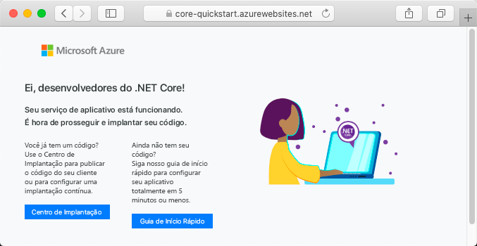

# <a name="create-an-aspnet-core-app-in-app-service-on-linux"></a>Criar um aplicativo ASP.NET Core no Serviço de Aplicativo no Linux

> [!NOTE]
> Este artigo implanta um aplicativo no Serviço de Aplicativo no Linux. Para implantação no Serviço de Aplicativo no _Windows_, confira [Criar um aplicativo ASP.NET Core no Azure](../app-service-web-get-started-dotnet.md).
>

O [Serviço de Aplicativo no Linux](app-service-linux-intro.md) fornece um serviço de hospedagem na Web altamente escalonável e com aplicação automática de patches usando o sistema operacional Linux. Este guia de início rápido mostra como criar um aplicativo [.NET Core](https://docs.microsoft.com/aspnet/core/) no Serviço de Aplicativo no Linux. Crie o aplicativo usando a [CLI do Azure](https://docs.microsoft.com/cli/azure/get-started-with-azure-cli) e use o Git para implantar o código .NET Core no aplicativo.


Você pode seguir as etapas deste artigo usando um computador Mac, Windows ou Linux.

[!INCLUDE [quickstarts-free-trial-note](../../../includes/quickstarts-free-trial-note.md)]

## <a name="prerequisites"></a>Pré-requisitos

Para concluir este guia de início rápido:

* <a href="https://git-scm.com/" target="_blank">Instalar o Git</a>
* <a href="https://dotnet.microsoft.com/download/dotnet-core/3.1" target="_blank">Instalar o SDK do .NET Core 3.1 mais recente</a>

## <a name="create-the-app-locally"></a>Criar o aplicativo localmente

Em uma janela de terminal no computador, crie um diretório chamado `hellodotnetcore` e altere o diretório atual para ele.

```bash
mkdir hellodotnetcore
cd hellodotnetcore
```

Crie um aplicativo .NET Core.

```bash
dotnet new web
```

## <a name="run-the-app-locally"></a>Executar o aplicativo localmente

Execute o aplicativo no local para ver como ele deve ficar quando o implantar no Azure. 

Restaure os pacotes NuGet e execute o aplicativo.

```bash
dotnet run
```

Abra um navegador da Web e navegue até o aplicativo em `http://localhost:5000`.

Você vê a mensagem **Olá, Mundo** no aplicativo de exemplo exibido na página.


Na janela do terminal, pressione **Ctrl+C** para sair do servidor Web. Inicialize um repositório Git para o projeto .NET Core.

```bash
git init
git add .
git commit -m "first commit"
```

[!INCLUDE [cloud-shell-try-it.md](../../../includes/cloud-shell-try-it.md)]

[!INCLUDE [Configure deployment user](../../../includes/configure-deployment-user.md)]

[!INCLUDE [Create resource group](../../../includes/app-service-web-create-resource-group-linux.md)]

[!INCLUDE [Create app service plan](../../../includes/app-service-web-create-app-service-plan-linux.md)]

## <a name="create-a-web-app"></a>Criar um aplicativo Web

[!INCLUDE [Create web app](../../../includes/app-service-web-create-web-app-dotnetcore-linux-no-h.md)]

Navegue para o aplicativo recém-criado. Substitua _&lt;nome-do-aplicativo>_ pelo nome do aplicativo.

```bash
https://<app-name>.azurewebsites.net
```

Seu novo aplicativo deve ficar assim:



[!INCLUDE [Push to Azure](../../../includes/app-service-web-git-push-to-azure.md)] 

<pre>
Enumerating objects: 5, done.
Counting objects: 100% (5/5), done.
Compressing objects: 100% (3/3), done.
Writing objects: 100% (3/3), 285 bytes | 95.00 KiB/s, done.
Total 3 (delta 2), reused 0 (delta 0), pack-reused 0
remote: Deploy Async
remote: Updating branch 'master'.
remote: Updating submodules.
remote: Preparing deployment for commit id 'd6b54472f7'.
remote: Repository path is /home/site/repository
remote: Running oryx build...
remote: Build orchestrated by Microsoft Oryx, https://github.com/Microsoft/Oryx
remote: You can report issues at https://github.com/Microsoft/Oryx/issues
remote:
remote: Oryx Version      : 0.2.20200114.13, Commit: 204922f30f8e8d41f5241b8c218425ef89106d1d, ReleaseTagName: 20200114.13
remote: Build Operation ID: |imoMY2y77/s=.40ca2a87_
remote: Repository Commit : d6b54472f7e8e9fd885ffafaa64522e74cf370e1
.
.
.
remote: Deployment successful.
remote: Deployment Logs : 'https://&lt;app-name&gt;.scm.azurewebsites.net/newui/jsonviewer?view_url=/api/deployments/d6b54472f7e8e9fd885ffafaa64522e74cf370e1/log'
To https://&lt;app-name&gt;.scm.azurewebsites.net:443/&lt;app-name&gt;.git
   d87e6ca..d6b5447  master -> master
</pre>

## <a name="browse-to-the-app"></a>Navegar até o aplicativo

Navegue até o aplicativo implantado usando o navegador da Web.

```bash
http://<app_name>.azurewebsites.net
```

O código de exemplo .NET Core está em execução no Serviço de Aplicativo no Linux com uma imagem interna.


**Parabéns!** Você implantou seu primeiro aplicativo .NET Core no Serviço de Aplicativo no Linux.

## <a name="update-and-redeploy-the-code"></a>Atualizar e reimplantar o código

No diretório local, abra o arquivo _Startup.cs_. Faça uma pequena alteração no texto na chamada do método `context.Response.WriteAsync`:

```csharp
await context.Response.WriteAsync("Hello Azure!");
```

Confirme suas alterações no Git e, em seguida, envie as alterações de código por push para o Azure.

```bash
git commit -am "updated output"
git push azure master
```

Depois que a implantação for concluída, mude de volta para a janela do navegador aberta na etapa **Navegar até o aplicativo** e clique em Atualizar.


## <a name="manage-your-new-azure-app"></a>Gerenciar seu novo aplicativo do Azure

Acesse o <a href="https://portal.azure.com" target="_blank">portal do Azure</a> para gerenciar o aplicativo que você criou.

No menu à esquerda, clique em **Serviços de Aplicativos** e, em seguida, clique no nome do aplicativo do Azure.


Você verá a página Visão geral do aplicativo. Aqui você pode executar tarefas básicas de gerenciamento como procurar, parar, iniciar, reiniciar e excluir. 


O menu à esquerda fornece páginas diferentes para configurar seu aplicativo. 

[!INCLUDE [cli-samples-clean-up](../../../includes/cli-samples-clean-up.md)]

## <a name="next-steps"></a>Próximas etapas

> [!div class="nextstepaction"]
> [Tutorial: Aplicativo ASP.NET Core com o Banco de Dados SQL](tutorial-dotnetcore-sqldb-app.md)

> [!div class="nextstepaction"]
> [Configurar o aplicativo ASP.NET Core](configure-language-dotnetcore.md)
