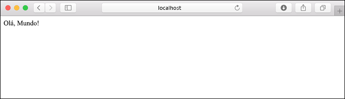
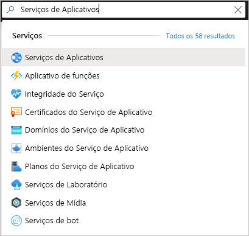

# <a name="quickstart-create-a-python-app-in-azure-app-service-on-linux"></a>Início Rápido: Criar um aplicativo Python no Serviço de Aplicativo do Azure no Linux

Neste Início Rápido, você implantará um aplicativo Web Python no [Serviço de Aplicativo no Linux](app-service-linux-intro.md), um serviço de hospedagem Web do Azure que é altamente escalonável e conta com aplicação automática de patch. Você usa a [CLI (interface de linha de comando) local do Azure](/cli/azure/install-azure-cli) em um computador Mac, Linux ou Windows. O aplicativo Web que você configura usa uma camada de Serviço de Aplicativo gratuita, portanto, os procedimentos neste artigo não resultam em custos para você.

Se preferir implantar aplicativos por meio de um IDE, confira [Implantar aplicativos Python no Serviço de Aplicativo por meio do Visual Studio Code](/azure/python/tutorial-deploy-app-service-on-linux-01).

## <a name="prerequisites"></a>Pré-requisitos

- Assinatura do Azure - [criar uma gratuitamente](https://azure.microsoft.com/free/?ref=microsoft.com&utm_source=microsoft.com&utm_medium=docs&utm_campaign=visualstudio)
- <a href="https://www.python.org/downloads/" target="_blank">Python 3.7</a> (o Python 3.6 também é compatível)
- <a href="https://git-scm.com/downloads" target="_blank">Git</a>
- <a href="https://docs.microsoft.com/cli/azure/install-azure-cli" target="_blank">CLI do Azure</a> 2.0.80 ou superior. Execute `az --version` para verificar sua versão.

## <a name="download-the-sample"></a>Baixar o exemplo

Em uma janela de terminal, execute o comando a seguir para clonar o aplicativo de exemplo para o computador local. 

```terminal
git clone https://github.com/Azure-Samples/python-docs-hello-world
```

Em seguida, acesse esta pasta:

```terminal
cd python-docs-hello-world
```

O repositório contém um arquivo *application.py*, que diz ao Serviço de Aplicativo que o código contém um aplicativo Flask. Para obter mais informações, consulte [Personalizações e o processo de inicialização do contêiner](how-to-configure-python.md).

## <a name="run-the-sample"></a>Execute o exemplo

Em uma janela do terminal, use os comandos abaixo (conforme apropriado para seu sistema operacional) para instalar as dependências necessárias e iniciar o servidor de desenvolvimento interno. 

# <a name="bash"></a>[Bash](#tab/bash)

```bash
python3 -m venv venv
source venv/bin/activate
pip install -r requirements.txt
export FLASK_APP=application.py
flask run
```

# <a name="powershell"></a>[PowerShell](#tab/powershell)

```powershell
py -3 -m venv env
env\scripts\activate
pip install -r requirements.txt
Set-Item Env:FLASK_APP ".\application.py"
flask run
```

# <a name="cmd"></a>[Cmd](#tab/cmd)

```cmd
py -3 -m venv env
env\scripts\activate
pip install -r requirements.txt
SET FLASK_APP=application.py
flask run
```

---

Abra um navegador da Web e vá até o aplicativo de exemplo em `http://localhost:5000/`. O aplicativo exibe a mensagem **Olá, Mundo!** .



Na janela do terminal, pressione **Ctrl**+**C** para sair do servidor Web.

## <a name="sign-in-to-azure"></a>Entrar no Azure

A CLI do Azure fornece muitos comandos úteis que você usa em um terminal local para provisionar e gerenciar recursos do Azure por meio da linha de comando. Você pode usar comandos para concluir as mesmas tarefas que realizaria por meio do portal do Azure em um navegador. Você também pode usar comandos da CLI em scripts para automatizar processos de gerenciamento.

Para executar comandos do Azure na CLI do Azure, primeiro você precisa entrar usando o comando `az login`. Esse comando abre um navegador para coletar suas credenciais.

```azurecli
az login
```

## <a name="deploy-the-sample"></a>Implantar o exemplo

O comando [`az webapp up`](/cli/azure/webapp#az-webapp-up) cria o aplicativo Web no Serviço de Aplicativo e implanta seu código.

Na pasta *python-docs-hello-world* que contém o código de exemplo, execute o comando `az webapp up` a seguir. Substitua `<app-name>` por um nome de aplicativo global exclusivo (*os caracteres válidos são `a-z`, `0-9` e `-`* ).


```azurecli
az webapp up --sku F1 -n <app-name>
```

O argumento `--sku F1` cria o aplicativo Web no tipo de preço Gratuito. Você pode omitir esse argumento para usar um nível Premium, o que incorre em um custo por hora.

Também existe a opção de incluir o argumento `-l <location-name>` em que `<location_name>` é uma região do Azure como **centralus**, **eastasia**, **westeurope**, **koreasouth**, **brazilsouth**, **centralindia** e assim por diante. Você pode recuperar uma lista de regiões permitidas para sua conta do Azure executando o comando [`az account list-locations`](/cli/azure/appservice?view=azure-cli-latest.md#az-appservice-list-locations).

O comando `az webapp up` pode demorar um pouco para ser executado. Na execução, ele exibe informações semelhantes ao seguinte exemplo, em que `<app-name>` será o nome fornecido anteriormente:

<pre>
Creating Resource group 'appsvc_rg_Linux_centralus' ...
Resource group creation complete
Creating App service plan 'appsvc_asp_Linux_centralus' ...
App service plan creation complete
Creating app '&lt;app-name&gt;' ....
Configuring default logging for the app, if not already enabled
Creating zip with contents of dir D:\Examples\python-docs-hello-world ...
Getting scm site credentials for zip deployment
Starting zip deployment. This operation can take a while to complete ...
Deployment endpoint responded with status code 202
You can launch the app at http://&lt;app-name&gt;.azurewebsites.net
{
  "URL": "http://&lt;app-name&gt;.net",
  "appserviceplan": "appsvc_asp_Linux_centralus",
  "location": "eastus",
  "name": "&lt;app-name&gt;",
  "os": "Linux",
  "resourcegroup": "appsvc_rg_Linux_centralus",
  "runtime_version": "python|3.7",
  "runtime_version_detected": "-",
  "sku": "FREE",
  "src_path": "D:\\Examples\\python-docs-hello-world"
}
</pre>

[!INCLUDE [AZ Webapp Up Note](../../../includes/app-service-web-az-webapp-up-note.md)]

## <a name="browse-to-the-app"></a>Navegar até o aplicativo

Navegue até o aplicativo implantado no navegador da Web na URL `http://<app-name>.azurewebsites.net`.

O código de exemplo Python está executando um contêiner Linux no Serviço de Aplicativo usando uma imagem interna.


**Parabéns!** Você implantou seu aplicativo Python no Serviço de Aplicativo no Linux.

## <a name="redeploy-updates"></a>Reimplantar atualizações

No seu editor de código favorito, abra *application.py* e atualize a função `hello` conforme segue. Essa alteração adiciona uma instrução `print` para gerar o log de saída com o qual você trabalha na próxima seção. 

```python
def hello():
    print("Handling request to home page.")
    return "Hello Azure!"
```

Salve suas alterações e saia do editor. 

Reimplante o aplicativo usando o comando `az webapp up` novamente:

```azurecli
az webapp up
```

Esse comando usa valores armazenados em cache no arquivo *.azure/config*, incluindo o nome do aplicativo, o grupo de recursos e o Plano do Serviço de Aplicativo.

Depois que a implantação for concluída, volte para a janela do navegador aberta para `http://<app-name>.azurewebsites.net` e atualize a página, que deve exibir a mensagem modificada:


> [!TIP]
> O Visual Studio Code fornece extensões poderosas para o Python e o Serviço de Aplicativo do Azure, que simplificam o processo de implantação de aplicativos Web do Python no Serviço de Aplicativo. Para obter mais informações, confira [Implantar aplicativos Python no Serviço de Aplicativo por meio do Visual Studio Code](/azure/python/tutorial-deploy-app-service-on-linux-01).

## <a name="stream-logs"></a>Transmitir logs

Você pode acessar os logs do console gerados de dentro do aplicativo e do contêiner no qual ele é executado. Os logs incluem todas as saídas geradas usando instruções `print`.

Para transmitir logs, execute o seguinte comando:

```azurecli
az webapp log tail
```

Atualize o aplicativo no navegador para gerar logs de console, que devem incluir linhas semelhantes ao texto a seguir. Se você não vir a saída imediatamente, tente novamente em 30 segundos.

<pre>
2020-04-03T22:54:04.236405938Z Handling request to home page.
2020-04-03T22:54:04.236497641Z 172.16.0.1 - - [03/Apr/2020:22:54:04 +0000] "GET / HTTP/1.1" 200 12 "-" "Mozilla/5.0 (Windows NT 10.0; Win64; x64) AppleWebKit/537.36 (KHTML, like Gecko) Chrome/81.0.4044.83 Safari/537.36 Edg/81.0.416.41"
</pre>

Você também pode inspecionar os arquivos de log do navegador em `https://<app-name>.scm.azurewebsites.net/api/logs/docker`.

Para interromper o streaming de log a qualquer momento, digite `Ctrl`+`C`.

## <a name="manage-the-azure-app"></a>Gerenciar o aplicativo do Azure

Acesse o <a href="https://portal.azure.com" target="_blank">portal do Azure</a> para gerenciar o aplicativo que você criou. Pesquise e selecione **Serviços de Aplicativos**.



Selecione o nome do seu aplicativo do Azure.


Você verá a página Visão geral do aplicativo. Aqui você pode executar tarefas básicas de gerenciamento como procurar, parar, iniciar, reiniciar e excluir.


O menu de Serviço de Aplicativo fornece páginas diferentes para configurar seu aplicativo.

## <a name="clean-up-resources"></a>Limpar os recursos

Nas etapas anteriores, você criou os recursos do Azure em um grupo de recursos. O grupo de recursos tem um nome como "appsvc_rg_Linux_CentralUS", dependendo da sua localização. Se você usar uma SKU do Serviço de Aplicativo diferente do nível F1 gratuito, esses recursos incorrerão em custos contínuos (confira [Preço do Serviço de Aplicativo](https://azure.microsoft.com/pricing/details/app-service/linux/)).

Se você não espera precisar desses recursos no futuro, exclua o grupo de recursos pela execução do comando a seguir, substituindo `<resource-group-name>` pelo grupo de recursos mostrado na saída do comando `az webapp up`, por exemplo, "appsvc_rg_Linux_centralus". O comando pode demorar um minuto para ser concluído.

```azurecli
az group delete -n <resource-group-name>
```

## <a name="next-steps"></a>Próximas etapas

> [!div class="nextstepaction"]
> [Tutorial: Aplicativo Web Python (Django) com PostgreSQL](tutorial-python-postgresql-app.md)

> [!div class="nextstepaction"]
> [Adicionar entrada do usuário a um aplicativo Web Python](../../active-directory/develop/quickstart-v2-python-webapp.md)

> [!div class="nextstepaction"]
> [Configurar o aplicativo Python](how-to-configure-python.md)

> [!div class="nextstepaction"]
> [Tutorial: Executar o aplicativo Python em um contêiner personalizado](tutorial-custom-docker-image.md)
