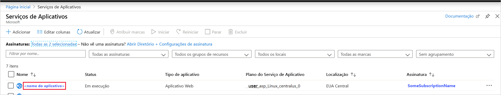
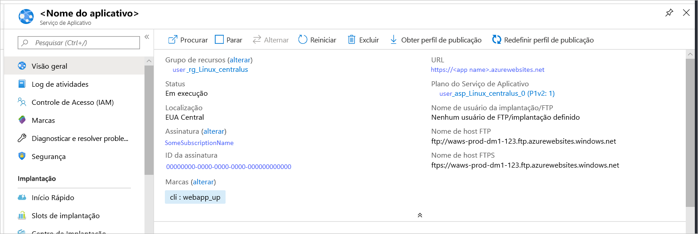

# <a name="quickstart-create-a-python-app-in-azure-app-service-on-linux"></a>Início Rápido: Criar um aplicativo Python no Serviço de Aplicativo do Azure no Linux

Neste artigo, você implantará um aplicativo Python simples no [Serviço de Aplicativo no Linux](app-service-linux-intro.md), que fornece um serviço de hospedagem Web altamente escalonável e com aplicação automática de patch. Use a interface de linha de comando do Azure (a [CLI do Azure](/cli/azure/install-azure-cli)) por meio do Azure Cloud Shell interativo baseado em navegador para seguir as etapas. Use um computador Mac, Linux ou Windows.


## <a name="prerequisites"></a>Pré-requisitos

Para concluir este guia de início rápido:

* <a href="https://www.python.org/downloads/" target="_blank">Instale o Python 3.7</a>
* <a href="https://git-scm.com/" target="_blank">Instalar o Git</a>
* Uma assinatura do Azure. Se você ainda não tiver uma, crie uma [conta gratuita](https://azure.microsoft.com/free/?ref=microsoft.com&utm_source=microsoft.com&utm_medium=docs&utm_campaign=visualstudio) antes de começar.

## <a name="download-the-sample-locally"></a>Baixar o exemplo localmente

Em uma janela do terminal, execute os comandos a seguir para clonar o aplicativo de exemplo no computador local e vá para o diretório que contém o código de exemplo.

```bash
git clone https://github.com/Azure-Samples/python-docs-hello-world
cd python-docs-hello-world
```

O repositório contém um *application.py*, que diz ao Serviço de Aplicativo que o repositório contém um aplicativo Flask. Para obter mais informações, consulte [Personalizações e o processo de inicialização do contêiner](how-to-configure-python.md).

## <a name="run-the-app-locally"></a>Executar o aplicativo localmente

Execute o aplicativo no local para ver como ele deve ficar quando o implantar no Azure. Abra uma janela do terminal e use os comandos a seguir para instalar as dependências necessárias e iniciar o servidor de desenvolvimento interno. 

```bash
# In Bash (for Linux or Mac)
python3 -m venv venv
source venv/bin/activate
pip install -r requirements.txt
FLASK_APP=application.py flask run
```
```powershell
# In Powershell (for Windows)
py -3 -m venv env
env\scripts\activate
pip install -r requirements.txt
Set-Item Env:FLASK_APP ".\application.py"
flask run
```

Abra um navegador da Web e vá até o aplicativo de exemplo em `http://localhost:5000/`.

Você verá o **Olá, Mundo!** mensagem do aplicativo de exemplo exibida na página.


Na janela do terminal, pressione **Ctrl+C** para sair do servidor Web.

[!INCLUDE [cloud-shell-try-it.md](../../../includes/cloud-shell-try-it.md)]

## <a name="download-the-sample"></a>Baixar o exemplo

No Cloud Shell, crie um diretório de início rápido e depois altere-o.

```bash
mkdir quickstart

cd $HOME/quickstart
```

Em seguida, execute o comando a seguir para clonar o repositório de aplicativos de exemplo ao seu diretório de início rápido.

```bash
git clone https://github.com/Azure-Samples/python-docs-hello-world
```

Na execução, ele exibe informações semelhantes ao seguinte exemplo:

```bash
Cloning into 'python-docs-hello-world'...
remote: Enumerating objects: 43, done.
remote: Total 43 (delta 0), reused 0 (delta 0), pack-reused 43
Unpacking objects: 100% (43/43), done.
Checking connectivity... done.
```

## <a name="create-a-web-app"></a>Criar um aplicativo Web

Altere para o diretório que contém o código de exemplo e execute o comando `az webapp up`.

No exemplo a seguir, substitua `<app-name>` por um nome do aplicativo exclusivo globalmente (*os caracteres válidos são `a-z`, `0-9` e `-`* ).

```bash
cd python-docs-hello-world

az webapp up -n <app-name>
```

Esse comando pode demorar um pouco para ser executado. Na execução, ele exibe informações semelhantes ao seguinte exemplo:

```json
The behavior of this command has been altered by the following extension: webapp
Creating Resource group 'appsvc_rg_Linux_CentralUS' ...
Resource group creation complete
Creating App service plan 'appsvc_asp_Linux_CentralUS' ...
App service plan creation complete
Creating app '<app-name>' ....
Webapp creation complete
Creating zip with contents of dir /home/username/quickstart/python-docs-hello-world ...
Preparing to deploy contents to app.
All done.
{
  "app_url": "https:/<app-name>.azurewebsites.net",
  "location": "Central US",
  "name": "<app-name>",
  "os": "Linux",
  "resourcegroup": "appsvc_rg_Linux_CentralUS ",
  "serverfarm": "appsvc_asp_Linux_CentralUS",
  "sku": "BASIC",
  "src_path": "/home/username/quickstart/python-docs-hello-world ",
  "version_detected": "-",
  "version_to_create": "python|3.7"
}
```

[!INCLUDE [AZ Webapp Up Note](../../../includes/app-service-web-az-webapp-up-note.md)]

## <a name="browse-to-the-app"></a>Navegar até o aplicativo

Navegue até o aplicativo implantado usando o navegador da Web.

```bash
http://<app-name>.azurewebsites.net
```

O código de exemplo Python está em execução no Serviço de Aplicativo no Linux com uma imagem interna.


**Parabéns!** Você implantou seu primeiro aplicativo Python no Serviço de Aplicativo no Linux.

## <a name="update-locally-and-redeploy-the-code"></a>Atualizar localmente e reimplantar o código

No Cloud Shell, insira `code application.py` para abrir o editor do Cloud Shell.


 Faça uma pequena alteração no texto na chamada para `return`:

```python
return "Hello Azure!"
```

Salve suas alterações e saia do editor. Use o comando `^S` para salvar e `^Q` para sair.

Reimplante o aplicativo usando o comando [`az webapp up`](/cli/azure/webapp#az-webapp-up). Substitua `<app-name>` pelo nome do aplicativo e especifique uma localização para `<location-name>` (usando um dos valores mostrados no comando [`az account list-locations`](/cli/azure/appservice?view=azure-cli-latest.md#az-appservice-list-locations)).

```bash
az webapp up -n <app-name> -l <location-name>
```

Depois que a implantação for concluída, troque para a janela do navegador aberta na etapa **Navegar até o aplicativo** e atualize a página.


## <a name="manage-your-new-azure-app"></a>Gerenciar seu novo aplicativo do Azure

Acesse o <a href="https://portal.azure.com" target="_blank">portal do Azure</a> para gerenciar o aplicativo que você criou.

No menu à esquerda, selecione **Serviços de Aplicativos** e, em seguida, selecione o nome do seu aplicativo do Azure.



Você verá a página Visão geral do aplicativo. Aqui você pode executar tarefas básicas de gerenciamento como procurar, parar, iniciar, reiniciar e excluir.



O menu à esquerda fornece páginas diferentes para configurar seu aplicativo. 

[!INCLUDE [cli-samples-clean-up](../../../includes/cli-samples-clean-up.md)]

## <a name="next-steps"></a>Próximas etapas

> [!div class="nextstepaction"]
> [Tutorial: Aplicativo Web Python (Django) com PostgreSQL](tutorial-python-postgresql-app.md)

> [!div class="nextstepaction"]
> [Configurar o aplicativo Python](how-to-configure-python.md)

> [!div class="nextstepaction"]
> [Tutorial: Executar o aplicativo Python em um contêiner personalizado](tutorial-custom-docker-image.md)
