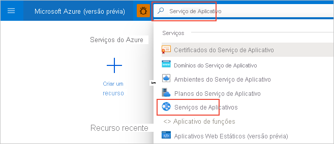

# Guia de início rápido: Criar um aplicativo Python no Serviço de Aplicativo do Azure no Linux (portal do Azure)

Neste Início Rápido, você implantará um aplicativo Web Python no [Serviço de Aplicativo no Linux](overview.md#app-service-on-linux), um serviço de hospedagem Web do Azure que é altamente escalonável e conta com aplicação automática de patch. Use o portal do Azure para implantar um exemplo com as estruturas Flask ou Django. O aplicativo Web que você configura usa uma camada básica de Serviço de Aplicativo que gera um pequeno custo na sua assinatura do Azure.

## Configurar contas

- Caso ainda não tenha uma conta do Azure com uma assinatura ativa, [crie uma conta gratuitamente](https://azure.microsoft.com/free/?ref=microsoft.com&utm_source=microsoft.com&utm_medium=docs&utm_campaign=visualstudio).

- Se você não tiver uma conta do GitHub, acesse [github.com](https://github.com) para criar uma. 

## Criar um fork do repositório GitHub de exemplo

1. Abra [github.com](https://github.com) e entre nele.

1. Navegue até um dos seguintes repositórios de exemplo:
    - [Olá, Mundo do Flask](https://github.com/Azure-Samples/python-docs-hello-world)
    - [Olá, Mundo do Django](https://github.com/Azure-Samples/python-docs-hello-django)

1. No canto superior direito da página do GitHub, selecione **Fork** para fazer uma cópia do repositório na sua conta do GitHub:

    

    O Azure exige que você tenha acesso à organização do GitHub que contém o repositório. Ao criar um fork do exemplo na sua conta do GitHub, você tem automaticamente o acesso necessário e pode fazer alterações no código.

## Provisionar o aplicativo Web do Serviço de Aplicativo

Um aplicativo Web do Serviço de Aplicativo é o servidor Web no qual você implanta seu código.

1. Abra o portal do Azure em [https://portal.azure.com](https://portal.azure.com) e entre nele, se necessário.

1. Na barra de pesquisa na parte superior do portal do Azure, insira "Serviço de Aplicativo" e selecione **Serviços de Aplicativos**.

    

1. Na página **Serviços de Aplicativos**, selecione " **+ Adicionar**:

    

1. Na página **Criar Aplicativo Web**, execute as seguintes ações:
    
    | Campo | Ação |
    | --- | --- |
    | Subscription | Selecione a assinatura do Azure que deseja usar. |
    | Grupo de recursos | Selecione **Criar** abaixo da lista suspensa. No pop-up, insira "AppService-PythonQuickstart" e selecione "**OK**. |
    | Nome | Insira um nome que seja exclusivo no Azure, normalmente, usando uma combinação de nomes pessoais ou da empresa, como *contoso-testapp-123*. |
    | Publicar | Selecione **Código**. |
    | Pilha de runtime | Escolha **Python 3.8**. |
    | Sistema operacional | Escolha **Linux** (só há suporte para o Python no Linux). |
    | Região | Selecione uma região perto de você. |
    | Plano do Linux | Selecione um Plano do Serviço de Aplicativo existente ou use **Criar** para criar um. Recomendamos usar o plano **Básico B1**. |

    

1. Na parte inferior da página, selecione **Examinar + criar**, examine os detalhes e escolha **Criar**.

1. Quando o provisionamento for concluído, selecione **Ir para o recurso** para navegar até a página do novo Serviço de Aplicativo. Neste ponto, seu aplicativo Web só contém uma página padrão. Portanto, a próxima etapa implantará o código de exemplo.

Está com problemas? [Fale conosco](https://aka.ms/FlaskPortalQuickstartHelp).

## Implantar o código de exemplo

1. Na página do aplicativo Web no portal do Azure, selecione **Centro de Implantação**:
    
    

1. Na página **Centro de Implantação**, selecione a guia **Configurações** se ela ainda não estiver aberta:

    

1. Em **Origem**, selecione **GitHub** e, no formulário do **GitHub** exibido, execute as seguintes ações:

    | Campo | Ação |
    | --- | --- |
    | Conectado como | Se você ainda não entrou no GitHub, entre nele agora ou selecione **Alterar Conta*, se necessário. |
    | Organização | Escolha sua organização do GitHub, se necessário. |
    | Repositório | Escolha o nome do repositório de exemplo do qual você criou um fork anteriormente, **python-docs-hello-world** (Flask) ou **python-docs-hello-django** (Django). |
    | Branch | Selecione **main**. |

    

1. Na parte superior da página, selecione **Salvar** para aplicar as configurações:

    

1. Selecione a guia **Logs** para ver o status da implantação. Leva alguns minutos para compilar e implantar o exemplo, e logs adicionais são exibidos durante o processo. Após a conclusão, os logs devem refletir o status **Êxito (Ativo)** :

    

Está com problemas? [Fale conosco](https://aka.ms/FlaskPortalQuickstartHelp).

## Navegar até o aplicativo

1. Após a conclusão da implantação, selecione **Visão geral** no menu à esquerda para voltar à página principal do aplicativo Web.

1. Selecione a **URL** que contém o endereço do aplicativo Web:

    

1. Verifique se a saída do aplicativo é "Olá, Mundo!":

    

Está com problemas? Veja primeiro o [Guia de solução de problemas](configure-language-python.md#troubleshooting). Caso contrário, [fale conosco](https://aka.ms/FlaskPortalQuickstartHelp).

## Fazer uma alteração e uma reimplantação

Como você conectou o Serviço de Aplicativo ao repositório, as alterações das quais você faz commit no repositório de origem são implantadas automaticamente no aplicativo Web.

1. Você pode fazer alterações diretamente no repositório bifurcado no GitHub ou clonar o repositório localmente, fazer alterações e fazer commit delas e enviá-las ao GitHub. Qualquer um desses métodos resulta em uma alteração no repositório que está conectado ao Serviço de Aplicativo.

1. **No repositório bifurcado**, altere a mensagem do aplicativo de "Olá, Mundo!" para "Olá, Azure!" conforme a seguir:
    - Flask (python-docs-hello-world sample): altere a cadeia de texto na linha 6 do arquivo *application.py*.
    - Django (python-docs-hello-django sample): altere a cadeia de texto na linha 5 do arquivo *views.py* dentro da pasta *hello*.

1. Faça commit da alteração no repositório.

    Se estiver usando um clone local, envie essas alterações por push para o GitHub.

1. No portal do Azure do aplicativo Web, volte ao **Centro de Implantação**, selecione a guia **Logs** e anote a nova atividade de implantação que deve estar em andamento.

1. Quando a implantação for concluída, volte à página **Visão geral** do aplicativo Web, abra a URL do aplicativo Web novamente e observe as alterações no aplicativo:

    

Está com problemas? Veja primeiro o [Guia de solução de problemas](configure-language-python.md#troubleshooting). Caso contrário, [fale conosco](https://aka.ms/FlaskCLIQuickstartHelp).

## Limpar os recursos

Nas etapas anteriores, você criou recursos do Azure em um grupo de recursos chamado "AppService-PythonQuickstart", que é mostrado na página *Visão geral** do aplicativo Web. Se você mantiver o aplicativo Web em execução, incorrerá em alguns custos contínuos (confira [Preços do Serviço de Aplicativo](https://azure.microsoft.com/pricing/details/app-service/linux/)).

Se você acha que não precisará desses recursos no futuro, selecione o nome do grupo de recursos na página **Visão geral** do aplicativo Web para navegar até a visão geral dos grupos de recursos. Depois, escolha **Excluir grupo de recursos** e siga os avisos.

Está com problemas? [Fale conosco](https://aka.ms/FlaskCLIQuickstartHelp).

## Próximas etapas

> [!div class="nextstepaction"]
> [Tutorial: Aplicativo Web Python (Django) com PostgreSQL](/azure/developer/python/tutorial-python-postgresql-app-portal)

> [!div class="nextstepaction"]
> [Configurar o aplicativo Python](configure-language-python.md)

> [!div class="nextstepaction"]
> [Adicionar entrada do usuário a um aplicativo Web Python](../active-directory/develop/quickstart-v2-python-webapp.md)

> [!div class="nextstepaction"]
> [Tutorial: Executar o aplicativo Python em um contêiner personalizado](tutorial-custom-container.md)
