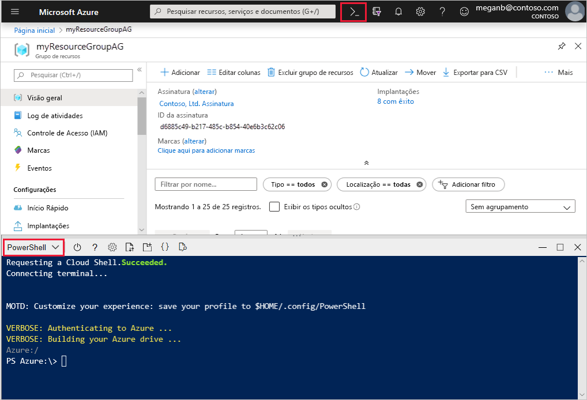

# <a name="tutorial-configure-an-application-gateway-with-tls-termination-using-the-azure-portal"></a>Tutorial: Configurar um gateway de aplicativo com o encerramento de TLS usando o portal do Azure

É possível usar o portal do Azure para configurar um [gateway de aplicativo](overview.md) com um certificado para encerramento de TLS que usa máquinas virtuais para servidores back-end.

Neste tutorial, você aprenderá como:

> [!div class="checklist"]
> * Crie um certificado autoassinado
> * Criar um gateway de aplicativo com o certificado
> * Criar as máquinas virtuais usadas como servidores de back-end
> * Testar o gateway de aplicativo

Se você não tiver uma assinatura do Azure, crie uma [conta gratuita](https://azure.microsoft.com/free/?WT.mc_id=A261C142F) antes de começar.

[!INCLUDE [updated-for-az](../../includes/updated-for-az.md)]

## <a name="prerequisites"></a>Pré-requisitos

Entre no portal do Azure em [https://portal.azure.com](https://portal.azure.com)

## <a name="create-a-self-signed-certificate"></a>Crie um certificado autoassinado

Nesta seção, você usa [New-SelfSignedCertificate](/powershell/module/pkiclient/new-selfsignedcertificate) para criar um certificado autoassinado. Você pode carregar o certificado no portal do Azure quando você cria o ouvinte para o Gateway de Aplicativo.

No computador local, abra uma janela do Windows PowerShell como administrador. Execute o comando a seguir para criar o certificado:

```powershell
New-SelfSignedCertificate `
  -certstorelocation cert:\localmachine\my `
  -dnsname www.contoso.com
```

Você deverá ver algo como esta resposta:

```
PSParentPath: Microsoft.PowerShell.Security\Certificate::LocalMachine\my

Thumbprint                                Subject
----------                                -------
E1E81C23B3AD33F9B4D1717B20AB65DBB91AC630  CN=www.contoso.com
```

Use o [Export-PfxCertificate](/powershell/module/pkiclient/export-pfxcertificate) com a impressão digital que foi retornada para exportar um arquivo pfx do certificado. Verifique se sua senha tem 4-12 caracteres de comprimento:


```powershell
$pwd = ConvertTo-SecureString -String <your password> -Force -AsPlainText
Export-PfxCertificate `
  -cert cert:\localMachine\my\E1E81C23B3AD33F9B4D1717B20AB65DBB91AC630 `
  -FilePath c:\appgwcert.pfx `
  -Password $pwd
```

## <a name="create-an-application-gateway"></a>Criar um Gateway de Aplicativo

1. Selecione **Criar um recurso** no menu esquerdo do portal do Azure. A janela **Novo** é exibida.

2. Selecione **Rede** e depois **Gateway de Aplicativo** na lista **em destaque**.

### <a name="basics-tab"></a>Guia Básico

1. Na página **Básico**, insira estes valores para as seguintes configurações de gateway de aplicativo:

   - **Grupo de recursos**: Selecione **myResourceGroupAG** para o grupo de recursos. Se ele não existir, selecione **Criar novo** para criá-lo.
   - **Nome do gateway de aplicativo**: Insira *myAppGateway* para o nome do gateway de aplicativo.

        

2.  Para que o Azure se comunique entre os recursos que você cria, ele precisa de uma rede virtual. Você pode criar uma nova rede virtual ou usar uma existente. Neste exemplo, você criará uma rede virtual ao mesmo tempo em que cria o gateway de aplicativo. As instâncias do Gateway de Aplicativo são criadas em sub-redes separadas. Crie duas sub-redes neste exemplo: uma para o gateway de aplicativo e outra para os servidores de back-end.

    Em **Configurar rede virtual**, crie uma rede virtual selecionando **Criar nova**. Na janela **Criar rede virtual** que é aberta, insira os seguintes valores para criar a rede virtual e duas sub-redes:

    - **Name**: Insira *myVNet* para o nome da rede virtual.

    - **Nome da sub-rede** (sub-rede do Gateway de Aplicativo): A grade **Sub-redes** mostrará uma sub-rede chamada *Padrão*. Altere o nome dessa sub-rede para *myAGSubnet*.<br>A sub-rede de gateway de aplicativo pode conter apenas gateways de aplicativo. Nenhum outro recurso é permitido.

    - **Nome da sub-rede** (sub-rede do servidor de back-end): Na segunda linha da grade **Sub-redes**, insira *myBackendSubnet* na coluna **Nome da sub-rede**.

    - **Intervalo de endereços** (sub-rede do servidor de back-end): Na segunda linha da grade **Sub-redes**, insira um intervalo de endereços que não se sobreponha ao intervalo de endereços de *myAGSubnet*. Por exemplo, se o intervalo de endereços de *myAGSubnet* for 10.0.0.0/24, digite *10.0.1.0/24* para o intervalo de endereços de *myBackendSubnet*.

    Selecione **OK** para fechar a janela **Criar rede virtual** e salvar as configurações de rede virtual.

    
    
3. Na guia **Básico**, aceite os valores padrão para as outras configurações e selecione **Avançar: Front-ends**.

### <a name="frontends-tab"></a>Guia Front-ends

1. Na guia **Front-ends**, verifique se **Tipo de endereço IP do front-end** está definido como **Público**. <br>É possível configurar o IP de front-end como Público ou Privado, de acordo com o caso de uso. Neste exemplo, você escolherá um IP público de front-end.
   > [!NOTE]
   > Para a SKU do Gateway de Aplicativo v2, você só pode escolher a configuração de IP de front-end **Pública**. A configuração de IP de front-end privado não está habilitada para esta SKU v2.

2. Selecione **Adicionar novo** para o **Endereço IP público**, insira *myAGPublicIPAddress* para o nome do endereço IP público e clique em **OK**. 

   

3. Selecione **Avançar: Back-ends**.

### <a name="backends-tab"></a>Guia Back-ends

O pool de back-end é usado para encaminhar solicitações aos servidores back-end que atendem à solicitação. Os pools de back-end podem ser formados por NICs, conjuntos de dimensionamento de máquinas virtuais, IPs públicos, IPs internos, FQDN (nomes de domínio totalmente qualificados) e back-ends multilocatário como Serviço de Aplicativo do Azure. Neste exemplo, você criará um pool de back-end vazio com o gateway de aplicativo e, em seguida, adicionará destinos de back-end ao pool de back-end.

1. Na guia **Back-ends**, selecione **Adicionar um pool de back-end**.

2. Na janela **Adicionar um pool de back-end** que é aberta, insira os seguintes valores para criar um pool de back-end vazio:

    - **Name**: Insira *myBackendPool* para o nome do pool de back-end.
    - **Adicionar pool de back-end sem destinos**: Selecione **Sim** para criar um pool de back-end sem destinos. Você adicionará destinos de back-end depois de criar o gateway de aplicativo.

3. Na janela **Adicionar um pool de back-end**, selecione **Adicionar** para salvar a configuração do pool de back-end e retornar à guia **Back-ends**.

   

4. Na guia **Back-ends**, selecione **Avançar: Configuração**.

### <a name="configuration-tab"></a>Guia Configuração

Na guia **Configuração**, você conectará o front-end e o pool de back-end que você criou usando uma regra de roteamento.

1. Selecione **Adicionar uma regra de roteamento** na coluna **Regra de roteamento**.

2. Na janela **Adicionar uma regra de roteamento** que é aberta, insira *myRoutingRule* para o **Nome da regra**.

3. Uma regra de roteamento requer um ouvinte. Na guia **Ouvinte** na janela **Adicionar uma regra de roteamento**, insira os seguintes valores para o ouvinte:

    - **Nome do ouvinte**: insira *myListener* para o nome do ouvinte.
    - **IP de front-end**: selecione **Público** para escolher o IP público que você criou para o front-end.
    - **Protocolo**: Selecione **HTTPS**.
    - **Porta**: Verifique se 443 foi inserido para a porta.

   Em **Configurações de HTTPS**:

   - **Escolha um certificado** – selecione **Carregar certificado**.
   - **Arquivo de certificado PFX** – procure e selecione o arquivo c:\appgwcert.pfx criado anteriormente.
   - **Nome do certificado** – digite *mycert1* para o nome do certificado.
   - **Senha** – digite a senha usada para criar o certificado.
  
        Aceite os valores padrão para as outras configurações na guia **Ouvinte** e, em seguida, selecione a guia **Destinos de back-end** para configurar o restante da regra de roteamento.

   

4. Na guia **Destinos de back-end**, selecione **myBackendPool** para o **Destino de back-end**.

5. Para a **Configuração de HTTP**, selecione **Adicionar novo** para criar uma configuração de HTTP. A configuração HTTP determinará o comportamento da regra de roteamento. Na janela **Adicionar uma configuração de HTTP** aberta, insira *myHTTPSetting* para o **Nome da configuração de HTTP**. Aceite os valores padrão para as outras configurações na janela **Adicionar uma configuração de HTTP** e selecione **Adicionar** para retornar à janela **Adicionar uma regra de roteamento**. 

   :::image type="content" source="./media/create-ssl-portal/application-gateway-create-httpsetting.png" alt-text="Criar Gateway de Aplicativo: configuração de HTTP":::

6. Na janela **Adicionar uma regra de roteamento**, selecione **Adicionar** para salvar a regra de roteamento e retornar para a guia **Configuração**.

   

7. Selecione **Avançar: Marcas** e, em seguida, **Avançar: Revisar + criar**.

### <a name="review--create-tab"></a>Guia Examinar + criar

Examine as configurações na guia **Examinar + criar** e selecione **Criar** para criar a rede virtual, o endereço IP público e o gateway de aplicativo. Pode levar vários minutos para que o Azure crie o gateway de aplicativo. Aguarde até que a implantação seja concluída com êxito antes de passar para a próxima seção.

## <a name="add-backend-targets"></a>Adicionar destinos de back-end

Neste exemplo, você usará máquinas virtuais como o back-end de destino. Você pode criar máquinas virtuais ou usar as existentes. Você criará duas máquinas virtuais que o Azure usa como servidores de back-end para o gateway de aplicativo.

Para fazer isso, você precisará:

1. Criar duas novas VMS, *myVM* e *myVM2*, para serem usadas como servidores back-end.
2. Instale IIS nas máquinas virtuais para verificar se o gateway de aplicativo foi criado com êxito.
3. Adicione os servidores back-end ao pool de back-end.

### <a name="create-a-virtual-machine"></a>Criar uma máquina virtual

1. No portal do Azure, selecione **Criar um recurso**. A janela **Novo** é exibida.
2. Selecione **Windows Server 2016 Datacenter** na lista **Popular**. A página **Criar uma máquina virtual** é exibida.

   O Gateway de Aplicativo pode rotear o tráfego para qualquer tipo de máquina virtual usada no pool de back-end. Neste exemplo, você usa um Windows Server 2016 Datacenter.

1. Insira esses valores na guia **Noções básicas** para as seguintes configurações de máquina virtual:

    - **Grupo de recursos**: Selecione **myResourceGroupAG** para o nome do grupo de recursos.
    - **Nome da máquina virtual**: Insira *myVM* para o nome da máquina virtual.
    - **Nome de usuário**: Insira um nome para o nome de usuário do administrador.
    - **Senha**: Insira uma senha para a conta de administrador.
1. Aceite os outros padrões e selecione **Próximo: Discos**.  
2. Aceite os padrões na guia **Discos** e selecione **Próximo: Rede**.
3. Na guia **Rede**, verifique se **myVNet** está selecionado para a **Rede virtual** e se a **Sub-rede** está definida como **myBackendSubnet**. Aceite os outros padrões e selecione **Próximo: Gerenciamento**.

   O Gateway de Aplicativo pode comunicar-se com instâncias fora da rede virtual em que está, mas é necessário garantir que há conectividade IP.
1. Na guia **Gerenciamento**, defina **Diagnóstico de inicialização** como **Desabilitar**. Aceite os outros padrões e selecione **Revisar + criar**.
2. Na guia **Revisar + criar**, examine as configurações, corrija os erros de validação e selecione **Criar**.
3. Aguarde a conclusão da implantação antes de continuar.

### <a name="install-iis-for-testing"></a>Instalar IIS para teste

Neste exemplo, você instala IIS nas máquinas virtuais apenas para verificar se o Azure criou o gateway de aplicativo com êxito.

1. Abra o [PowerShell do Azure](../cloud-shell/quickstart-powershell.md). Para fazer isso, selecione **Cloud Shell** na barra de navegação superior do portal do Azure e selecione **PowerShell** na lista suspensa. 

    

2. Altere a configuração de localização do seu ambiente e execute o seguinte comando para instalar o IIS na máquina virtual: 

   ```azurepowershell-interactive
          Set-AzVMExtension `
            -ResourceGroupName myResourceGroupAG `
            -ExtensionName IIS `
            -VMName myVM `
            -Publisher Microsoft.Compute `
            -ExtensionType CustomScriptExtension `
            -TypeHandlerVersion 1.4 `
            -SettingString '{"commandToExecute":"powershell Add-WindowsFeature Web-Server; powershell Add-Content -Path \"C:\\inetpub\\wwwroot\\Default.htm\" -Value $($env:computername)"}' `
            -Location <location>
   ```

3. Crie uma segunda máquina virtual e instale o IIS usando as etapas que você concluiu anteriormente. Use *myVM2* para o nome da máquina virtual e a configuração **VMName** do cmdlet **Set-AzVMExtension**.

### <a name="add-backend-servers-to-backend-pool"></a>Adicionar servidores back-end ao pool de back-end

1. Selecione **Todos os recursos** e, em seguida, **myAppGateway**.

2. Selecione **Pools de back-end** no menu esquerdo.

3. Selecione **myBackendPool**.

4. Em **Tipo de destino**, selecione **Máquina virtual** na lista suspensa.

5. Em **Destino**, selecione um adaptador de rede em **myVM** na lista suspensa.

6. Repita para adicionar um adaptador de rede para **myVM2**.

    

6. Clique em **Salvar**.

7. Aguarde a conclusão da implantação antes de prosseguir para a próxima etapa.

## <a name="test-the-application-gateway"></a>Testar o gateway de aplicativo

1. Selecione **Todos os recursos** e, em seguida, **myAGPublicIPAddress**.

    

2. Na barra de endereços do navegador, digite *https://\<your application gateway ip address\>* .

   Se você usou um certificado autoassinado, para aceitar o aviso de segurança, selecione **Detalhes** (ou **Avançado** no Chrome) e, em seguida, acesse a página da Web:

    

    Seu site de IIS protegido é exibido, como no exemplo a seguir:

    

## <a name="clean-up-resources"></a>Limpar os recursos

Quando não forem mais necessários, exclua o grupo de recursos e todos os recursos relacionados. Para fazer isso, selecione o grupo de recursos e selecione **Excluir grupo de recursos**.

## <a name="next-steps"></a>Próximas etapas

> [!div class="nextstepaction"]
> [Saiba mais sobre o suporte a TLS do Gateway de Aplicativo](ssl-overview.md)