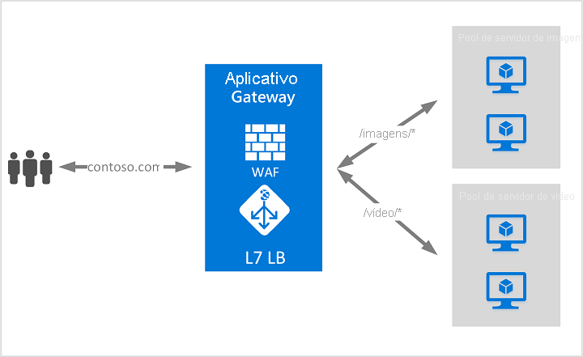

# O que é o Gateway de Aplicativo do Azure?

O Gateway de Aplicativo do Azure é um balanceador de carga do tráfego da Web que permite que você gerencie o tráfego para seus aplicativos Web. Os balanceadores de carga tradicionais operam na camada de transporte (camada OSI 4 – TCP e UDP) e encaminham o tráfego com base no endereço IP de origem e na porta para um endereço IP de destino e uma porta.

O Gateway de Aplicativo pode tomar decisões de roteiros com base em outros atributos de uma solicitação HTTP, por exemplo, o caminho de URI ou os cabeçalhos de host. Por exemplo, você pode encaminhar o tráfego com base na URL de entrada. Portanto, se `/images` estiver na URL de entrada, você poderá encaminhar o tráfego para um conjunto específico de servidores (conhecido como um pool) configurado para as imagens. Se `/video` estiver na URL, esse tráfego será encaminhado para outro pool otimizado para vídeos.

Esse tipo de roteamento é conhecido como balanceamento de carga da camada de aplicativo (camada OSI 7). O Gateway de Aplicativo do Azure pode fazer o roteamento baseado em URL e muito mais.

>[!NOTE]
> O Azure fornece um conjunto de soluções de balanceamento de carga totalmente gerenciadas para seus cenários. 
> * Se você quiser realizar um roteamento global baseado em DNS e **não** tiver os requisitos para encerramento de protocolo TLS ("descarregamento de SSL") ou para processamento de camada de aplicativo por solicitação HTTP/HTTPS, examine [Gerenciador de Tráfego](../traffic-manager/traffic-manager-overview.md). 
> * Se você precisar otimizar o roteamento global do seu tráfego da Web e otimizar o desempenho e a confiabilidade do usuário final de nível superior por meio de um failover global rápido, confira [Front Door](../frontdoor/front-door-overview.md).
> * Para fazer o balanceamento de carga de camada de rede, examine [Load Balancer](../load-balancer/load-balancer-overview.md). 
> 
> Os cenários de ponta a ponta podem se beneficiar da combinação dessas soluções, conforme necessário.
> Para obter uma comparação das opções de balanceamento de carga do Azure, confira [Visão geral das opções de balanceamento de carga no Azure](/azure/architecture/guide/technology-choices/load-balancing-overview).

## Recursos

Para saber mais sobre os recursos do Gateway de Aplicativo, confira [Recursos do Gateway de Aplicativo do Azure](features.md).

## Preço e SLA

Para obter informações sobre preços do Gateway de Aplicativo, confira [Preços do Gateway de Aplicativo](https://azure.microsoft.com/pricing/details/application-gateway/).

Para obter informações sobre SLA do Gateway de Aplicativo, confira [SLA do Gateway de Aplicativo](https://azure.microsoft.com/support/legal/sla/application-gateway/v1_2/).

## Novidades

Para conhecer as novidades do Gateway de Aplicativo do Azure, confira [Atualizações do Azure](https://azure.microsoft.com/updates/?category=networking&query=Application%20Gateway).

## Próximas etapas

Dependendo dos requisitos e do ambiente, você pode criar um Gateway de Aplicativo de teste usando o portal do Azure, o Azure PowerShell ou a CLI do Azure.

- [Início Rápido: Direcionar o tráfego da Web com o Gateway de Aplicativo do Azure – portal do Azure](quick-create-portal.md)
- [Início Rápido: Direcionar o tráfego da Web com o Gateway de Aplicativo do Azure – Azure PowerShell](quick-create-powershell.md)
- [Início Rápido: Direcionar o tráfego da Web com o Gateway de Aplicativo do Azure – CLI do Azure](quick-create-cli.md)