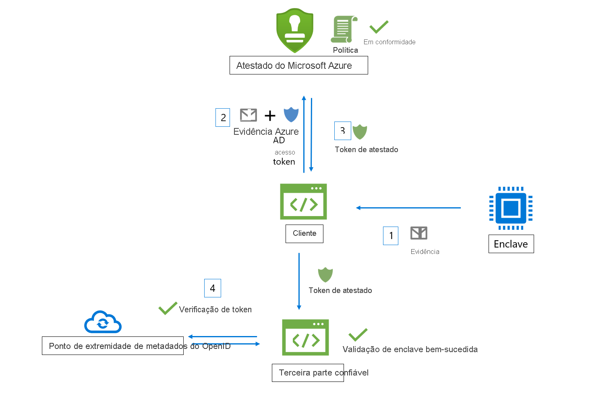
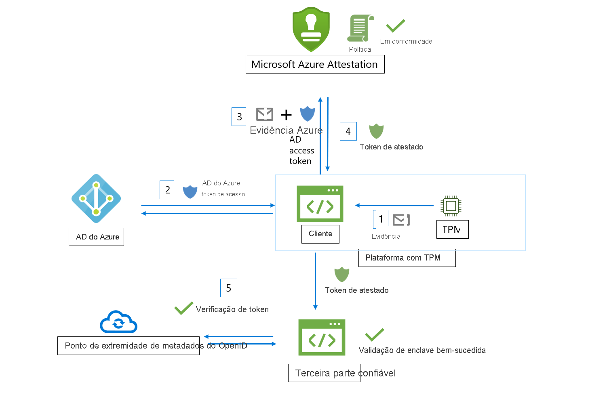

# Fluxo de trabalho

O Atestado do Microsoft Azure recebe as evidências de enclaves e a avalia em relação à linha de base de segurança do Azure e às políticas configuráveis. Após a confirmação bem-sucedida, o Atestado do Azure gera um token de atestado para confirmar a confiabilidade do enclave.

Os seguintes atores estão envolvidos em um fluxo de trabalho do Atestado do Azure:

- **Terceira parte confiável**: o componente que se baseia no Atestado do Azure para verificar a validade do enclave. 
- **Cliente**: o componente que coleta informações de um enclave e envia solicitações para o Atestado do Azure. 
- **Atestado do Azure**: o componente que aceita as evidências do enclave por parte do cliente, valida-a e retorna o token de atestado para o cliente

## Fluxo de trabalho de validação de enclave Intel® SGX (Software Guard Extensions)

Estas são as etapas gerais em um fluxo de trabalho típico de atestado de enclave do SGX (usando o Atestado do Azure):

1. O cliente coleta as evidências de um enclave. As evidências são informações sobre o ambiente do enclave e a biblioteca de clientes em execução no enclave.
1. O cliente tem um URI que se refere a uma instância do Atestado do Azure. O cliente envia evidências para o Atestado do Azure. As informações exatas enviadas ao provedor dependem do tipo de enclave.
1. O Atestado do Azure valida as informações enviadas e avalia-as em relação a uma política configurada. Se a verificação for realizada com sucesso, o Atestado do Azure emitirá um token de atestado e o retornará ao cliente. Se essa etapa falhar, o Atestado do Azure relatará um erro ao cliente. 
1. O cliente envia o token de atestado para a terceira parte confiável. A terceira parte confiável chama o ponto de extremidade de metadados de chave pública do Atestado do Azure para recuperar os certificados de autenticação. Em seguida, a terceira parte confiável verifica a assinatura do token de atestado e garante a confiabilidade do enclave. 

> [!Note]
> Quando você envia solicitações de atestado na versão de API [2018-09-01-preview](https://github.com/Azure/azure-rest-api-specs/tree/master/specification/attestation/data-plane/Microsoft.Attestation/stable/2018-09-01-preview), o cliente precisa enviar evidências para o Atestado do Azure junto com o token de acesso do Azure AD.

## Fluxo de trabalho de validação do enclave TPM (Trusted Platform Module)

Essas são as etapas gerais em um fluxo de trabalho típico de atestado de enclave TPM (usando o Atestado do Azure):

1.  Na inicialização do dispositivo/da plataforma, vários carregadores de inicialização e serviços de inicialização medem eventos que têm o suporte do TPM e são armazenados com segurança (log de TCG).
2.  O cliente coleta os logs de TCG da cota do dispositivo e do TPM, que atuam na evidência do atestado.
3.  O cliente tem um URI que se refere a uma instância do Atestado do Azure. O cliente envia evidências para o Atestado do Azure. As informações exatas enviadas ao provedor dependem da plataforma.
4.  O Atestado do Azure valida as informações enviadas e avalia-as em relação a uma política configurada. Se a verificação for realizada com sucesso, o Atestado do Azure emitirá um token de atestado e o retornará ao cliente. Se essa etapa falhar, o Atestado do Azure relatará um erro ao cliente. A comunicação entre o cliente e o serviço de atestado é determinada pelo protocolo TPM do Atestado do Azure.
5.  O cliente envia o token de atestado para a terceira parte confiável. A terceira parte confiável chama o ponto de extremidade de metadados de chave pública do Atestado do Azure para recuperar os certificados de autenticação. Em seguida, a terceira parte confiável verifica a assinatura do token de atestado e garante a confiabilidade das plataformas.

## Próximas etapas
- [Como criar e assinar uma política de atestado](author-sign-policy.md)
- [Configurar o Atestado do Azure usando o PowerShell](quickstart-powershell.md)
