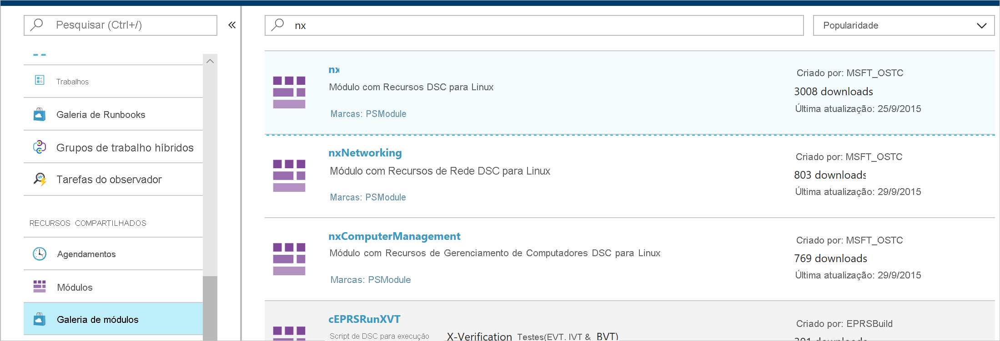
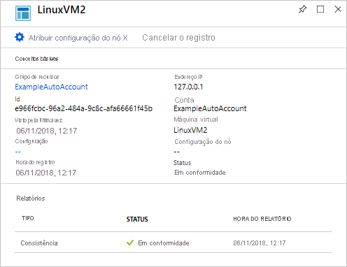

# <a name="configure-a-vm-with-desired-state-configuration"></a>Configurar uma VM com Desired State Configuration

Ao habilitar a Configuração de Estado da Automação do Azure, é possível gerenciar e monitorar as configurações de seus servidores Windows e Linux usando a DSC (Desired State Configuration). Configurações que apresentam um desvio de uma configuração desejada podem ser identificadas ou corrigidas automaticamente. Este início rápido mostra como habilitar uma VM do Linux e implantar uma pilha do LAMP usando a State Configuration da Automação do Azure.

## <a name="prerequisites"></a>Pré-requisitos

Para concluir este início rápido, você precisa de:

* Uma assinatura do Azure. Se você não tiver uma assinatura do Azure, [crie uma conta gratuita](https://azure.microsoft.com/free/).
* Uma conta de Automação do Azure. Para obter instruções sobre como criar uma conta Executar Como de Automação do Azure, consulte [Conta Executar Como do Azure](./manage-runas-account.md).
* Uma VM do Azure Resource Manager (não clássico) executando o Red Hat Enterprise Linux, o CentOS ou o Oracle Linux. Para obter instruções sobre a criação de uma VM, consulte [Criar sua primeira máquina virtual do Linux no portal do Azure](../virtual-machines/linux/quick-create-portal.md)

## <a name="sign-in-to-azure"></a>Entrar no Azure
Entre no Azure em https://portal.azure.com.

## <a name="enable-a-virtual-machine"></a>Habilitar uma máquina virtual

Há vários métodos diferentes para habilitar um computador para o recurso State Configuration. Este início rápido informa como habilitar o recurso para uma VM usando uma conta da Automação. Você pode saber mais sobre métodos diferentes para habilitar seus computadores para State Configuration lendo [Habilitar computadores para gerenciamento pela State Configuration da Automação do Azure](./automation-dsc-onboarding.md).

1. No painel esquerdo do Portal do Azure, selecione **contas de Automação**. Se esse item não estiver visível no painel esquerdo, clique em **Todos os serviços** e pesquise-o na exibição que surgir.
1. Na lista, selecione uma conta de Automação.
1. No painel esquerdo da conta de Automação, selecione **Configurações de estado (DSC)** .
2. Clique em **Adicionar** para abrir a página de seleção da VM.
3. Localize a máquina virtual para a qual habilitar a DSC. É possível usar as opções de campo e filtro de pesquisa para encontrar uma máquina virtual específica.
4. Clique na máquina virtual e, em seguida, clique em **Conectar**
5. Selecione as configurações de DSC adequadas para a máquina virtual. Se você já preparou uma configuração, é possível especificá-la como `Node Configuration Name`. É possível definir o [modo de configuração](/powershell/scripting/dsc/managing-nodes/metaConfig) para controlar o comportamento de configuração do computador.
6. Clique em **OK**. Embora a extensão de DSC seja implantada na máquina virtual, o status aparece como `Connecting`.


## <a name="import-modules"></a>Importar módulos

Os módulos contêm recursos DSC e muitos podem ser encontrados na [Galeria do PowerShell](https://www.powershellgallery.com). Os recursos usados em suas configurações devem ser importados para a conta de Automação antes da compilação. Para este tutorial, o módulo chamado **nx** é necessário.

1. No painel esquerdo da conta de Automação, selecione **Galeria de Módulos** em **Recursos Compartilhados**.
1. Pesquise pelo módulo que você deseja importar digitando parte do nome dele: `nx`.
1. Clique no módulo a ser importado.
1. Clique em **Importar**.



## <a name="import-the-configuration"></a>Importar a configuração

Este guia de início rápido usa uma configuração DSC que configura o Apache HTTP Server, o MySQL e o PHP no computador. Confira [Configurações DSC](/powershell/scripting/dsc/configurations/configurations).

Em um editor de texto, digite o seguinte e salve-o localmente como **AMPServer.ps1**.

```powershell-interactive
configuration LAMPServer {
   Import-DSCResource -module "nx"

   Node localhost {

        $requiredPackages = @("httpd","mod_ssl","php","php-mysql","mariadb","mariadb-server")
        $enabledServices = @("httpd","mariadb")

        #Ensure packages are installed
        ForEach ($package in $requiredPackages){
            nxPackage $Package{
                Ensure = "Present"
                Name = $Package
                PackageManager = "yum"
            }
        }

        #Ensure daemons are enabled
        ForEach ($service in $enabledServices){
            nxService $service{
                Enabled = $true
                Name = $service
                Controller = "SystemD"
                State = "running"
            }
        }
   }
}
```

Para importar a configuração:

1. No painel esquerdo da conta de Automação, selecione **Configuração de estado (DSC)** e, em seguida, clique na guia **Configurações**.
2. Clique em **+ Adicionar**.
3. Selecione o arquivo de configuração que você salvou na etapa anterior.
4. Clique em **OK**.

## <a name="compile-a-configuration"></a>Compilar uma configuração

Você precisa compilar uma configuração DSC em uma configuração de nó (documento MOF) para que ela possa ser atribuída a um nó. A compilação valida a configuração e permite a entrada de valores de parâmetro. Para saber mais sobre como compilar uma configuração, confira [Compilação de configurações na State Configuration](automation-dsc-compile.md).

1. No painel esquerdo da conta de Automação, selecione **Configuração de estado (DSC)** e, em seguida, clique na guia **Configurações**.
1. Selecione a configuração `LAMPServer`.
1. Nas opções do menu, selecione **Compilar** e, em seguida, em **Sim**.
1. Na exibição Configuração, você verá um novo trabalho de compilação enfileirado. Quando o trabalho for concluído com êxito, você estará pronto para passar para a próxima etapa. Se houver falhas, você poderá clicar no trabalho de compilação para obter detalhes.

## <a name="assign-a-node-configuration"></a>Atribuir uma configuração de nó

Você pode atribuir uma configuração de nó compilada a um nó de DSC. A atribuição aplica a configuração ao computador e monitora/corrige automaticamente desvios dessa configuração.

1. No painel esquerdo da conta de Automação, selecione **DSC (State Configuration)** e, em seguida, clique na guia **Nós**.
1. Selecione o nó ao qual você gostaria de atribuir uma configuração.
1. Clique em **Atribuir Configuração de Nó**
1. Selecione o nó de configuração `LAMPServer.localhost` e clique em **OK**. A State Configuration agora atribui a configuração compilada ao nó, cujo status é alterado para `Pending`. Na próxima verificação periódica, o nó recupera a configuração, a aplica e relata o próprio status. Dependendo das configurações do nó, ele pode levar até 30 minutos para recuperar a configuração. 
1. Para forçar uma verificação imediata, é possível executar o seguinte comando localmente na máquina virtual Linux: `sudo /opt/microsoft/dsc/Scripts/PerformRequiredConfigurationChecks.py`



## <a name="view-node-status"></a>Exibir status do nó

Você pode exibir o status de todos os nós gerenciados por State Configuration em sua conta de Automação. As informações são exibidas escolhendo **DSC (State Configuration)** e clicando na guia **Nós**. É possível filtrar a exibição por status, configuração de nó ou pesquisa de nome.


## <a name="next-steps"></a>Próximas etapas

Neste início rápido, você habilitou uma VM do Linux para State Configuration, criou uma configuração para uma pilha LAMP e implantou-a na VM. Para saber como usar a State Configuration da Automação do Azure para habilitar a implantação contínua, prossiga para o artigo:

> [!div class="nextstepaction"]
> [Configurar a implantação contínua com o Chocolatey](./automation-dsc-cd-chocolatey.md)
