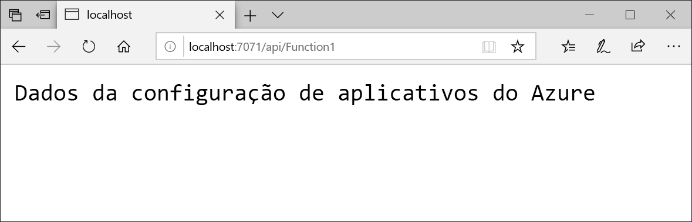

# <a name="tutorial-use-dynamic-configuration-in-an-azure-functions-app"></a>Tutorial: Usar a configuração dinâmica no aplicativo Azure Functions

O provedor de configuração do .NET para Configuração de Aplicativos dá suporte ao cache e à atualização dinâmica da configuração controlada pela atividade do aplicativo. Este tutorial mostra como você pode implementar atualizações de configuração dinâmica no código. Ele se baseia no aplicativo Azure Functions introduzido nos inícios rápidos. Antes de continuar, conclua [Criar um aplicativo Azure Functions com a Configuração de Aplicativos do Azure](./quickstart-azure-functions-csharp.md).

Neste tutorial, você aprenderá como:

> [!div class="checklist"]
> * Configure seu aplicativo Azure Functions para atualizar a configuração em resposta a alterações em um repositório de Configuração de Aplicativos.
> * Insira a configuração mais recente para suas chamadas do Azure Functions.

## <a name="prerequisites"></a>Pré-requisitos

- Assinatura do Azure - [criar uma gratuitamente](https://azure.microsoft.com/free/)
- [Visual Studio 2019](https://visualstudio.microsoft.com/vs) com a carga de trabalho de **desenvolvimento do Azure**
- [Ferramentas do Azure Functions](../azure-functions/functions-develop-vs.md#check-your-tools-version)
- Conclua o início rápido [Criar um aplicativo do Azure Functions com a Configuração de Aplicativos do Azure](./quickstart-azure-functions-csharp.md)

## <a name="reload-data-from-app-configuration"></a>Recarregar os dados da Configuração de Aplicativo

1. Abra *Startup.cs* e atualize o método `ConfigureAppConfiguration`. 

   O método `ConfigureRefresh` registra uma configuração para ser verificada quanto a alterações sempre que uma atualização é disparada dentro do aplicativo, o que será feito na etapa posterior ao adicionar `_configurationRefresher.TryRefreshAsync()`. O parâmetro `refreshAll` instrui o provedor de Configuração de Aplicativos a recarregar toda a configuração sempre que uma alteração é detectada na configuração registrada.

    Todas as configurações registradas para atualização têm um término de cache padrão de 30 segundos. Ele pode ser atualizado chamando o método `AzureAppConfigurationRefreshOptions.SetCacheExpiration`.

    ```csharp
    public override void ConfigureAppConfiguration(IFunctionsConfigurationBuilder builder)
    {
        builder.ConfigurationBuilder.AddAzureAppConfiguration(options =>
        {
            options.Connect(Environment.GetEnvironmentVariable("ConnectionString"))
                   // Load all keys that start with `TestApp:`
                   .Select("TestApp:*")
                   // Configure to reload configuration if the registered 'Sentinel' key is modified
                   .ConfigureRefresh(refreshOptions =>
                      refreshOptions.Register("TestApp:Settings:Sentinel", refreshAll: true));
        });
    }
    ```

   > [!TIP]
   > Quando você estiver atualizando vários valores de chave na Configuração de Aplicativos, normalmente não desejará que seu aplicativo recarregue a configuração antes que todas as alterações sejam feitas. Você pode registrar uma chave **sentinel** e atualizá-la somente quando todas as outras alterações de configuração forem concluídas. Isso ajuda a garantir a consistência da configuração em seu aplicativo.

2. Atualize o método `Configure` para tornar os serviços de Configuração de Aplicativos do Azure disponíveis por meio de injeção de dependência.

    ```csharp
    public override void Configure(IFunctionsHostBuilder builder)
    {
        builder.Services.AddAzureAppConfiguration();
    }
    ```

3. Abra *Function1.cs* e adicione o namespace a seguir.

    ```csharp
    using System.Linq;
    using Microsoft.Extensions.Configuration.AzureAppConfiguration;
    ```

   Atualize o construtor para obter a instância do `IConfigurationRefresherProvider` por meio de injeção de dependência, da qual você pode obter a instância do `IConfigurationRefresher`.

    ```csharp
    private readonly IConfiguration _configuration;
    private readonly IConfigurationRefresher _configurationRefresher;

    public Function1(IConfiguration configuration, IConfigurationRefresherProvider refresherProvider)
    {
        _configuration = configuration;
        _configurationRefresher = refresherProvider.Refreshers.First();
    }
    ```

4. Atualize o método `Run` e sinalize para atualizar a configuração usando o método `TryRefreshAsync` no início da chamada do Functions. Ele não estará operacional se a janela de tempo de término do cache não for atingida. Remova o operador `await` se preferir que a configuração seja atualizada sem bloquear a chamada atual do Functions. Nesse caso, as chamadas do Functions posteriores receberão o valor atualizado.

    ```csharp
    public async Task<IActionResult> Run(
        [HttpTrigger(AuthorizationLevel.Anonymous, "get", "post", Route = null)] HttpRequest req, ILogger log)
    {
        log.LogInformation("C# HTTP trigger function processed a request.");

        await _configurationRefresher.TryRefreshAsync(); 

        string keyName = "TestApp:Settings:Message";
        string message = _configuration[keyName];
            
        return message != null
            ? (ActionResult)new OkObjectResult(message)
            : new BadRequestObjectResult($"Please create a key-value with the key '{keyName}' in App Configuration.");
    }
    ```

## <a name="test-the-function-locally"></a>Testar a função localmente

1. Defina uma variável de ambiente chamada **ConnectionString** e defina-a como a chave de acesso ao repositório de configurações de aplicativo. Se você usar o prompt de comando do Windows, execute o comando a seguir e reinicie o prompt de comando para permitir que a alteração entre em vigor:

    ```console
    setx ConnectionString "connection-string-of-your-app-configuration-store"
    ```

    Se você usa o Windows PowerShell, execute o comando a seguir:

    ```powershell
    $Env:ConnectionString = "connection-string-of-your-app-configuration-store"
    ```

    Se você usa macOS ou Linux, execute o comando a seguir:

    ```console
    export ConnectionString='connection-string-of-your-app-configuration-store'
    ```

2. Para testar sua função, pressione F5. Se solicitado, aceite a solicitação do Visual Studio para baixar e instalar as ferramentas **principais (CLI) do Azure Functions**. Além disso, talvez seja necessário habilitar uma exceção de firewall para que as ferramentas possam manipular solicitações HTTP.

3. Copie a URL da sua função da saída do Azure Functions runtime.

    

4. Cole a URL para a solicitação HTTP na barra de endereços do navegador. A imagem a seguir mostra a resposta no navegador para a solicitação GET local retornada pela função.

    

5. Entre no [portal do Azure](https://portal.azure.com). Escolha **Todos os recursos** e escolha o repositório de Configuração de Aplicativos que você criou no início rápido.

6. Selecione **Gerenciador de configurações** e atualize o valor da seguinte chave:

    | Chave | Valor |
    |---|---|
    | TestApp:Settings:Message | Dados da Configuração de Aplicativos do Azure – Atualizados |

   Em seguida, crie a chave Sentinel ou modifique seu valor, caso já exista, por exemplo,

    | Chave | Valor |
    |---|---|
    | TestApp:Settings:Sentinel | v1 |


7. Atualize o navegador algumas vezes. Quando a configuração armazenada em cache expirar após 30 segundos, a página mostrará a resposta da chamada do Functions com o valor atualizado.

    

> [!NOTE]
> O código de exemplo usado neste tutorial pode ser baixado de [Repositório do GitHub da Configuração de Aplicativos](https://github.com/Azure/AppConfiguration/tree/master/examples/DotNetCore/AzureFunction).

## <a name="clean-up-resources"></a>Limpar os recursos

[!INCLUDE [azure-app-configuration-cleanup](../../includes/azure-app-configuration-cleanup.md)]

## <a name="next-steps"></a>Próximas etapas

Neste tutorial, você habilitou seu aplicativo Azure Functions a atualizar dinamicamente as configurações da Configuração de Aplicativos. Para saber como usar uma identidade gerenciada pelo Azure para simplificar o acesso à Configuração de Aplicativos, passe para o próximo tutorial.

> [!div class="nextstepaction"]
> [Integração de identidade gerenciada](./howto-integrate-azure-managed-service-identity.md)
