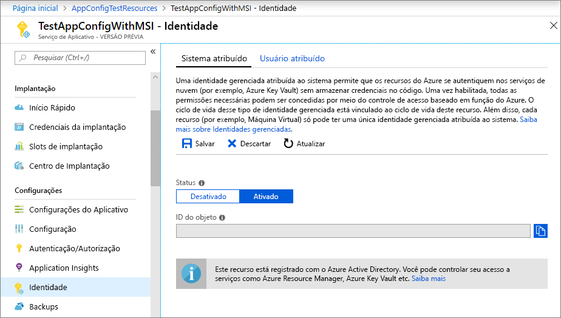
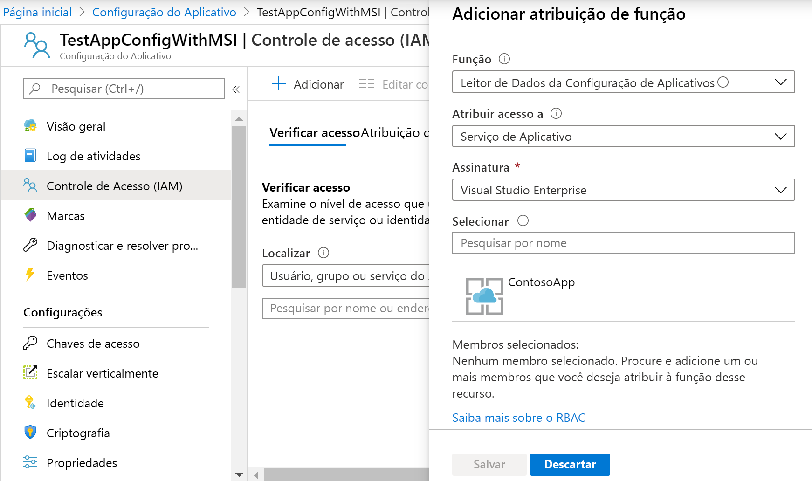

# <a name="use-managed-identities-to-access-app-configuration"></a>Usar identidades gerenciadas para acessar a Configuração de Aplicativos

Azure Active Directory [identidades gerenciadas](../active-directory/managed-identities-azure-resources/overview.md) simplificam o gerenciamento de segredos para seu aplicativo de nuvem. Com uma identidade gerenciada, seu código pode usar a entidade de serviço criada para o serviço do Azure em que ele é executado. Você usa uma identidade gerenciada, em vez de uma credencial separada armazenada no Azure Key Vault ou uma cadeia de caracteres de conexão local.

A configuração de Azure App e suas bibliotecas de cliente .NET Core, .NET Framework e Java Spring têm suporte de identidade gerenciada incorporadas a elas. Embora você não precise usá-lo, a identidade gerenciada elimina a necessidade de um token de acesso que contenha segredos. Seu código pode acessar o repositório de configuração de aplicativo usando apenas o ponto de extremidade de serviço. Você pode inserir essa URL em seu código diretamente sem expor nenhum segredo.

Este artigo mostra como você pode aproveitar a identidade gerenciada para acessar a configuração do aplicativo. Ele se baseia no aplicativo Web introduzido nos Inícios Rápidos. Antes de continuar,  [crie um aplicativo ASP.NET Core com a configuração de aplicativo](./quickstart-aspnet-core-app.md) primeiro.

> [!NOTE]
> Este artigo usa Azure App serviço como um exemplo, mas o mesmo conceito se aplica a qualquer outro serviço do Azure que dê suporte à identidade gerenciada, por exemplo, o [serviço kubernetes do Azure](../aks/use-azure-ad-pod-identity.md), a [máquina virtual do Azure](../active-directory/managed-identities-azure-resources/qs-configure-portal-windows-vm.md)e as [instâncias de contêiner do Azure](../container-instances/container-instances-managed-identity.md). Se sua carga de trabalho estiver hospedada em um desses serviços, você também poderá aproveitar o suporte de identidade gerenciada do serviço.

Este artigo também mostra como você pode usar a identidade gerenciada em conjunto com as referências de Key Vault da configuração de aplicativo. Com uma única identidade gerenciada, você pode acessar diretamente os segredos de Key Vault e os valores de configuração da configuração do aplicativo. Se você quiser explorar esse recurso, conclua o [uso de Key Vault referências com ASP.NET Core](./use-key-vault-references-dotnet-core.md) primeiro.

Você pode usar qualquer editor de código para executar as etapas deste tutorial. O [Visual Studio Code](https://code.visualstudio.com/) é uma excelente opção disponível nas plataformas Windows, macOS e Linux.

Neste artigo, você aprenderá como:

> [!div class="checklist"]
> * Permita acesso a uma identidade gerenciada à Configuração de Aplicativo.
> * Configure seu aplicativo para usar uma identidade gerenciada ao conectar-se à Configuração de Aplicativo.
> * Opcionalmente, configure seu aplicativo para usar uma identidade gerenciada quando você se conectar a Key Vault por meio de uma referência de Key Vault de configuração de aplicativo.

## <a name="prerequisites"></a>Pré-requisitos

Para concluir este tutorial, você deve ter:

* [SDK do .Net Core](https://www.microsoft.com/net/download/windows).
* [Azure cloud shell configurado](../cloud-shell/quickstart.md).

[!INCLUDE [quickstarts-free-trial-note](../../includes/quickstarts-free-trial-note.md)]

## <a name="add-a-managed-identity"></a>Adicionar uma identidade gerenciada

Para configurar uma identidade gerenciada no portal, primeiro crie um aplicativo e, em seguida, habilite o recurso.

1. Crie uma instância dos serviços de aplicativos na [portal do Azure](https://portal.azure.com) normalmente. Vá até ele no portal.

1. Role a página para baixo até o grupo **Configurações** no painel de navegação à esquerda e selecione **Identidade**.

1. Na guia **Sistema atribuído**, alterne o **Status** para **Ativado** e selecione **Salvar**.

1. Responda **Sim** quando solicitado a habilitar a identidade gerenciada atribuída ao sistema.

    

## <a name="grant-access-to-app-configuration"></a>Permitir acesso à Configuração de Aplicativo

1. Na [portal do Azure](https://portal.azure.com), selecione **todos os recursos** e selecione o repositório de configuração de aplicativo que você criou no guia de início rápido.

1. Selecione **IAM (Controle de acesso)** .

1. Na guia **Verificar acesso**, selecione **Adicionar** na interface do usuário de cartão **Adicionar uma atribuição de função**.

1. Em **função**, selecione **leitor de dados de configuração de aplicativo**. Em **Atribuir acesso**, selecione **Serviço de Aplicativo** em **Identidade gerenciada atribuída ao sistema**.

1. Em **Assinatura**, selecione sua assinatura do Azure. Selecione o recurso de Serviço de Aplicativo para o seu aplicativo.

1. Clique em **Salvar**.

    

1. Opcional: se você quiser conceder acesso a Key Vault também, siga as instruções em [atribuir uma política de acesso de Key Vault](../key-vault/general/assign-access-policy-portal.md).

## <a name="use-a-managed-identity"></a>Usar uma identidade gerenciada

1. Adicione uma referência ao pacote *Azure. Identity* :

    ```bash
    dotnet add package Azure.Identity
    ```

1. Localize o ponto de extremidade para seu repositório de configuração de aplicativo. Essa URL é listada na guia **chaves de acesso** para a loja no portal do Azure.

1. Abra *appsettings.json* e adicione o seguinte script. Substitua *\<service_endpoint>* , incluindo os colchetes, pela URL para o repositório de configuração do aplicativo.

    ```json
    "AppConfig": {
        "Endpoint": "<service_endpoint>"
    }
    ```

1. Abra *Program. cs* e adicione uma referência aos `Azure.Identity` `Microsoft.Azure.Services.AppAuthentication` namespaces e:

    ```csharp-interactive
    using Azure.Identity;
    ```

1. Se você quiser acessar apenas os valores armazenados diretamente na configuração do aplicativo, atualize o `CreateWebHostBuilder` método substituindo o `config.AddAzureAppConfiguration()` método (ele é encontrado no `Microsoft.Azure.AppConfiguration.AspNetCore` pacote).

    > [!IMPORTANT]
    > `CreateHostBuilder` substitui `CreateWebHostBuilder` no .NET Core 3.0.  Selecione a sintaxe correta com base em seu ambiente.

    ### <a name="net-core-2x"></a>[.NET Core 2.x](#tab/core2x)

    ```csharp
    public static IWebHostBuilder CreateWebHostBuilder(string[] args) =>
        WebHost.CreateDefaultBuilder(args)
               .ConfigureAppConfiguration((hostingContext, config) =>
               {
                   var settings = config.Build();
                   config.AddAzureAppConfiguration(options =>
                       options.Connect(new Uri(settings["AppConfig:Endpoint"]), new ManagedIdentityCredential()));
               })
               .UseStartup<Startup>();
    ```

    ### <a name="net-core-3x"></a>[.NET Core 3.x](#tab/core3x)

    ```csharp
    public static IHostBuilder CreateHostBuilder(string[] args) =>
        Host.CreateDefaultBuilder(args)
            .ConfigureWebHostDefaults(webBuilder =>
            {
                webBuilder.ConfigureAppConfiguration((hostingContext, config) =>
                {
                    var settings = config.Build();
                    config.AddAzureAppConfiguration(options =>
                        options.Connect(new Uri(settings["AppConfig:Endpoint"]), new ManagedIdentityCredential()));
                });
            })
            .UseStartup<Startup>());
    ```
    ---

    > [!NOTE]
    > Caso você queira usar uma **identidade gerenciada atribuída pelo usuário**, especifique o clientId ao criar o [ManagedIdentityCredential](/dotnet/api/azure.identity.managedidentitycredential).
    >```
    >config.AddAzureAppConfiguration(options =>
    >   options.Connect(new Uri(settings["AppConfig:Endpoint"]), new ManagedIdentityCredential(<your_clientId>)));
    >```
    >Conforme explicado nas [perguntas frequentes sobre identidades gerenciadas para recursos do Azure](../active-directory/managed-identities-azure-resources/known-issues.md#what-identity-will-imds-default-to-if-dont-specify-the-identity-in-the-request), há uma maneira padrão de resolver qual identidade gerenciada é usada. Nesse caso, a biblioteca de identidades do Azure impõe que você especifique a identidade desejada para evitar problemas de tempo de execução possíveis no futuro (por exemplo, se uma nova identidade gerenciada atribuída pelo usuário for adicionada ou se a identidade gerenciada atribuída pelo sistema estiver habilitada). Portanto, você precisará especificar o clientId mesmo se apenas uma identidade gerenciada atribuída pelo usuário for definida e não houver nenhuma identidade gerenciada atribuída pelo sistema.


1. Para usar valores de configuração de aplicativo e referências de Key Vault, atualize *Program. cs* , conforme mostrado abaixo. Esse código chama `SetCredential` como parte do `ConfigureKeyVault` para informar ao provedor de configuração qual credencial usar ao autenticar para Key Vault.

    ### <a name="net-core-2x"></a>[.NET Core 2.x](#tab/core2x)

    ```csharp
    public static IWebHostBuilder CreateWebHostBuilder(string[] args) =>
        WebHost.CreateDefaultBuilder(args)
               .ConfigureAppConfiguration((hostingContext, config) =>
               {
                   var settings = config.Build();
                   var credentials = new ManagedIdentityCredential();

                   config.AddAzureAppConfiguration(options =>
                   {
                       options.Connect(new Uri(settings["AppConfig:Endpoint"]), credentials)
                              .ConfigureKeyVault(kv =>
                              {
                                 kv.SetCredential(credentials);
                              });
                   });
               })
               .UseStartup<Startup>();
    ```

    ### <a name="net-core-3x"></a>[.NET Core 3.x](#tab/core3x)

    ```csharp
    public static IHostBuilder CreateHostBuilder(string[] args) =>
        Host.CreateDefaultBuilder(args)
            .ConfigureWebHostDefaults(webBuilder =>
            {
                webBuilder.ConfigureAppConfiguration((hostingContext, config) =>
                {
                    var settings = config.Build();
                    var credentials = new ManagedIdentityCredential();

                    config.AddAzureAppConfiguration(options =>
                    {
                        options.Connect(new Uri(settings["AppConfig:Endpoint"]), credentials)
                               .ConfigureKeyVault(kv =>
                               {
                                   kv.SetCredential(credentials);
                               });
                    });
                });
            })
            .UseStartup<Startup>());
    ```
    ---

    Agora você pode acessar Key Vault referências, assim como qualquer outra chave de configuração de aplicativo. O provedor de configuração usará o `ManagedIdentityCredential` para autenticar para Key Vault e recuperar o valor.

    > [!NOTE]
    > O `ManagedIdentityCredential` funciona apenas em ambientes do Azure de serviços que dão suporte à autenticação de identidade gerenciada. Ele não funciona no ambiente local. Use [`DefaultAzureCredential`](/dotnet/api/azure.identity.defaultazurecredential) o para que o código funcione em ambientes locais e do Azure, pois ele fará fallback para algumas opções de autenticação, incluindo identidade gerenciada.
    > 
    > Caso você queira usar uma **identidade gerenciada pelo usuário asigned** com o `DefaultAzureCredential` quando implantado no Azure, [especifique o clientId](/dotnet/api/overview/azure/identity-readme#specifying-a-user-assigned-managed-identity-with-the-defaultazurecredential).

[!INCLUDE [Prepare repository](../../includes/app-service-deploy-prepare-repo.md)]

## <a name="deploy-from-local-git"></a>Implantar a partir do Git local

A maneira mais fácil de habilitar a implantação do git local para seu aplicativo com o servidor de compilação kudu é usar [Azure cloud Shell](https://shell.azure.com).

### <a name="configure-a-deployment-user"></a>Configurar um usuário de implantação

[!INCLUDE [Configure a deployment user](../../includes/configure-deployment-user-no-h.md)]

### <a name="enable-local-git-with-kudu"></a>Habilitar Git local com Kudu
Se você não tiver um repositório git local para seu aplicativo, será necessário inicializar um. Para inicializar um repositório git local, execute os seguintes comandos no diretório do projeto do aplicativo:

```cmd
git init
git add .
git commit -m "Initial version"
```

Para habilitar a implantação do git local para seu aplicativo com o servidor de compilação kudu, execute [`az webapp deployment source config-local-git`](/cli/azure/webapp/deployment/#az-webapp-deployment-source-config-local-git) em Cloud Shell.

```azurecli-interactive
az webapp deployment source config-local-git --name <app_name> --resource-group <group_name>
```

Esse comando fornece algo semelhante à seguinte saída:

```json
{
  "url": "https://<username>@<app_name>.scm.azurewebsites.net/<app_name>.git"
}
```

### <a name="deploy-your-project"></a>Implantar o projeto

Na _janela do terminal local_, adicione um remoto do Azure ao repositório git local. Substitua _\<url>_ pela URL do git remoto que você obteve de habilitar o [git local com kudu](#enable-local-git-with-kudu).

```bash
git remote add azure <url>
```

Envie por push para o Azure remoto para implantar seu aplicativo com o comando a seguir. Quando for solicitada uma senha, insira a senha que você criou em [Configurar um usuário de implantação](#configure-a-deployment-user). Não use a senha que você usa para entrar no portal do Azure.

```bash
git push azure main
```

Você pode ver a automação específica do runtime na saída, como MSBuild para ASP.NET, `npm install` para Node.js e `pip install` para o Python.

### <a name="browse-to-the-azure-web-app"></a>Navegar até o aplicativo Web do Azure

Procure o aplicativo web usando um navegador para verificar se o conteúdo foi implantado.

```bash
http://<app_name>.azurewebsites.net
```

## <a name="use-managed-identity-in-other-languages"></a>Usar a identidade gerenciada em outras linguagens

Os provedores da Configuração de Aplicativo para o .NET Framework e o Java Spring também têm suporte interno para a identidade gerenciada. Você pode usar o ponto de extremidade de URL do repositório em vez de sua cadeia de conexão completa ao configurar um desses provedores.

Por exemplo, você pode atualizar o aplicativo de console .NET Framework criado no guia de início rápido para especificar as seguintes configurações no arquivo de *App.config* :

```xml
    <configSections>
        <section name="configBuilders" type="System.Configuration.ConfigurationBuildersSection, System.Configuration, Version=4.0.0.0, Culture=neutral, PublicKeyToken=b03f5f7f11d50a3a" restartOnExternalChanges="false" requirePermission="false" />
    </configSections>

    <configBuilders>
        <builders>
            <add name="MyConfigStore" mode="Greedy" endpoint="${Endpoint}" type="Microsoft.Configuration.ConfigurationBuilders.AzureAppConfigurationBuilder, Microsoft.Configuration.ConfigurationBuilders.AzureAppConfiguration" />
            <add name="Environment" mode="Greedy" type="Microsoft.Configuration.ConfigurationBuilders.EnvironmentConfigBuilder, Microsoft.Configuration.ConfigurationBuilders.Environment" />
        </builders>
    </configBuilders>

    <appSettings configBuilders="Environment,MyConfigStore">
        <add key="AppName" value="Console App Demo" />
        <add key="Endpoint" value ="Set via an environment variable - for example, dev, test, staging, or production endpoint." />
    </appSettings>
```

## <a name="clean-up-resources"></a>Limpar os recursos

[!INCLUDE [azure-app-configuration-cleanup](../../includes/azure-app-configuration-cleanup.md)]

## <a name="next-steps"></a>Próximas etapas
Neste tutorial, você adicionou uma identidade gerenciada do Azure para simplificar o acesso à configuração do aplicativo e melhorar o gerenciamento de credenciais para seu aplicativo. Para saber mais sobre como usar a Configuração de Aplicativo, continue para ver as amostras da CLI do Azure.

> [!div class="nextstepaction"]
> [Exemplos de CLI](./cli-samples.md)