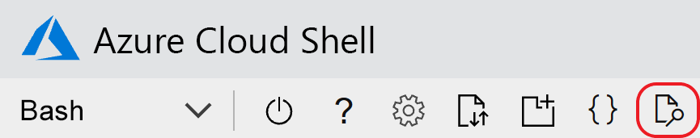

# <a name="quickstart-add-feature-flags-to-an-aspnet-core-app"></a>Início Rápido: Adicionar sinalizadores de recurso a um aplicativo ASP.NET Core

Neste guia de início rápido, você criará uma implementação de ponta a ponta do gerenciamento de recursos no aplicativo ASP.NET Core usando a Configuração de Aplicativos do Azure. Você usará o serviço de Configuração de Aplicativos para armazenar de maneira centralizada todos os sinalizadores de recurso e controlar os estados deles. 

As bibliotecas do Gerenciamento de Recursos do .NET Core estendem a estrutura com suporte abrangente para sinalizadores de recursos. Essas bibliotecas se baseiam no sistema de configuração do .NET Core. Elas são integradas diretamente à Configuração de Aplicativos por meio de seu provedor de configuração do .NET Core.

## <a name="prerequisites"></a>Pré-requisitos

* Assinatura do Azure - [criar uma gratuitamente](https://azure.microsoft.com/free/dotnet)
* [SDK do .NET Core](https://dotnet.microsoft.com/download)

## <a name="create-an-app-configuration-store"></a>Criar um repositório de Configuração de Aplicativos

[!INCLUDE[Azure App Configuration resource creation steps](../../includes/azure-app-configuration-create.md)]

8. Selecione **Operações** > **Gerenciador de recursos** > **Adicionar** para adicionar um sinalizador de recurso chamado *Beta*.

    > [!div class="mx-imgBorder"]
    > 

    Deixe **rótulo** vazio por enquanto. Selecione **Aplicar** para salvar o novo sinalizador de recurso.

## <a name="create-an-aspnet-core-web-app"></a>Criar um aplicativo Web ASP.NET Core

Use a [CLI (interface de linha de comando) do .NET Core](/dotnet/core/tools) para criar um projeto MVC do ASP.NET Core. A vantagem de usar a CLI do .NET Core em vez do Visual Studio é que ela está disponível nas plataformas Windows, macOS e Linux.

Execute o seguinte comando para criar um projeto MVC do ASP.NET Core em uma nova pasta *TestFeatureFlags*:

```dotnetcli
dotnet new mvc --no-https --output TestFeatureFlags
```

[!INCLUDE[Add Secret Manager support to an ASP.NET Core project](../../includes/azure-app-configuration-add-secret-manager.md)]

## <a name="connect-to-an-app-configuration-store"></a>Conectar um repositório de Configuração de Aplicativos

1. Instale os pacotes NuGet [Microsoft.Azure.AppConfiguration.AspNetCore](https://www.nuget.org/packages/Microsoft.Azure.AppConfiguration.AspNetCore) e [Microsoft.FeatureManagement.AspNetCore](https://www.nuget.org/packages/Microsoft.FeatureManagement.AspNetCore) executando os seguintes comandos:

    ```dotnetcli
    dotnet add package Microsoft.Azure.AppConfiguration.AspNetCore
    ```

    ```dotnetcli
    dotnet add package Microsoft.FeatureManagement.AspNetCore
    ```

1. Execute o comando a seguir no mesmo diretório do arquivo *.csproj*. O comando usa o Gerenciador de Segredos para armazenar um segredo chamado `ConnectionStrings:AppConfig`, que armazena a cadeia de conexão do seu repositório de Configuração de Aplicativos. Substitua o espaço reservado `<your_connection_string>` pela cadeia de conexão do repositório de Configuração de Aplicativos. Encontre a cadeia de conexão em **Chaves de Acesso** no portal do Azure.

    ```dotnetcli
    dotnet user-secrets set ConnectionStrings:AppConfig "<your_connection_string>"
    ```

    O Gerenciador de Segredos é usado apenas para testar o aplicativo Web localmente. Quando o aplicativo for implantado no [Serviço de Aplicativo do Azure](https://azure.microsoft.com/services/app-service/web), use a configuração de aplicativo **Cadeias de Conexão** no Serviço de Aplicativo, em vez de armazenar a cadeia de conexão no Gerenciador de Segredos.

    Acesse esse segredo usando a API de Configuração do .NET Core. Um sinal de dois-pontos (`:`) funciona no nome da configuração com a API de Configuração em todas as plataformas com suporte. Para obter mais informações, confira [Chaves e valores de configuração](/aspnet/core/fundamentals/configuration#configuration-keys-and-values).

1. Em *Program.cs*, atualize o método `CreateWebHostBuilder` para usar a Configuração de Aplicativos chamando o método `AddAzureAppConfiguration`.

    > [!IMPORTANT]
    > `CreateHostBuilder` substitui `CreateWebHostBuilder` no .NET Core 3.x. Selecione a sintaxe correta com base em seu ambiente.

     #### <a name="net-5x"></a>[.NET 5.x](#tab/core5x)

    ```csharp
    public static IHostBuilder CreateHostBuilder(string[] args) =>
        Host.CreateDefaultBuilder(args)
            .ConfigureWebHostDefaults(webBuilder =>
                webBuilder.ConfigureAppConfiguration(config =>
                {
                    var settings = config.Build();
                    var connection = settings.GetConnectionString("AppConfig");
                    config.AddAzureAppConfiguration(options =>
                        options.Connect(connection).UseFeatureFlags());
                }).UseStartup<Startup>());
    ```

    #### <a name="net-core-3x"></a>[.NET Core 3.x](#tab/core3x)

    ```csharp
    public static IHostBuilder CreateHostBuilder(string[] args) =>
        Host.CreateDefaultBuilder(args)
            .ConfigureWebHostDefaults(webBuilder =>
                webBuilder.ConfigureAppConfiguration(config =>
                {
                    var settings = config.Build();
                    var connection = settings.GetConnectionString("AppConfig");
                    config.AddAzureAppConfiguration(options =>
                        options.Connect(connection).UseFeatureFlags());
                }).UseStartup<Startup>());
    ```

    #### <a name="net-core-2x"></a>[.NET Core 2.x](#tab/core2x)

    ```csharp
    public static IWebHostBuilder CreateWebHostBuilder(string[] args) =>
        WebHost.CreateDefaultBuilder(args)
               .ConfigureAppConfiguration(config =>
               {
                   var settings = config.Build();
                   var connection = settings.GetConnectionString("AppConfig");
                   config.AddAzureAppConfiguration(options =>
                       options.Connect(connection).UseFeatureFlags());
               }).UseStartup<Startup>();
    ```

    ---

    Com a alteração anterior, o [provedor de configuração da Configuração de Aplicativos](/dotnet/api/Microsoft.Extensions.Configuration.AzureAppConfiguration) foi registrado com a API de Configuração do .NET Core.

1. Em *Startup.cs*, adicione uma referência ao gerenciador de recursos do .NET Core:

    ```csharp
    using Microsoft.FeatureManagement;
    ```

1. Atualize o método `Startup.ConfigureServices` para adicionar suporte ao sinalizador de recursos chamando o método `AddFeatureManagement`. Opcionalmente, você pode incluir qualquer filtro que será usado com sinalizadores de recursos chamando `AddFeatureFilter<FilterType>()`:

     #### <a name="net-5x"></a>[.NET 5.x](#tab/core5x)

    ```csharp    
    public void ConfigureServices(IServiceCollection services)
    {
        services.AddControllersWithViews();
        services.AddFeatureManagement();
    }
    ```
    #### <a name="net-core-3x"></a>[.NET Core 3.x](#tab/core3x)

    ```csharp    
    public void ConfigureServices(IServiceCollection services)
    {
        services.AddControllersWithViews();
        services.AddFeatureManagement();
    }
    ```

    #### <a name="net-core-2x"></a>[.NET Core 2.x](#tab/core2x)

    ```csharp
    public void ConfigureServices(IServiceCollection services)
    {
        services.AddMvc()
            .SetCompatibilityVersion(CompatibilityVersion.Version_2_2);
        services.AddFeatureManagement();
    }
    ```

    ---

1. Adicione um arquivo *MyFeatureFlags.cs* ao diretório do projeto raiz com o seguinte código:

    ```csharp
    namespace TestFeatureFlags
    {
        public enum MyFeatureFlags
        {
            Beta
        }
    }
    ```

1. Adicione um arquivo *BetaController.cs* ao diretório *Controladores* com o seguinte código:

    ```csharp
    using Microsoft.AspNetCore.Mvc;
    using Microsoft.FeatureManagement;
    using Microsoft.FeatureManagement.Mvc;

    namespace TestFeatureFlags.Controllers
    {
        public class BetaController: Controller
        {
            private readonly IFeatureManager _featureManager;

            public BetaController(IFeatureManagerSnapshot featureManager) =>
                _featureManager = featureManager;

            [FeatureGate(MyFeatureFlags.Beta)]
            public IActionResult Index() => View();
        }
    }
    ```

1. Em *Views/_ViewImports.cshtml*, registre o Auxiliar de Marcação do gerenciador de recursos usando uma diretiva `@addTagHelper`:

    ```cshtml
    @addTagHelper *, Microsoft.FeatureManagement.AspNetCore
    ```

    O código anterior permite que o Auxiliar de Marcação do `<feature>` seja usado nos arquivos *.cshtml* do projeto.

1. Abra *_Layout.cshtml* no diretório *Exibições*\\*Compartilhado*. Localize o código de barras `<nav>` em `<body>` > `<header>`. Insira uma nova marca `<feature>` entre os itens de barra de navegação *Página Inicial* e *Privacidade*, conforme mostrado nas linhas realçadas abaixo.

    :::code language="html" source="../../includes/azure-app-configuration-navbar.md" range="15-38" highlight="14-18":::

1. Crie um diretório *Views/Beta* e um arquivo *Index.cshtml* que contém a seguinte marcação:

    ```cshtml
    @{
        ViewData["Title"] = "Beta Home Page";
    }

    <h1>This is the beta website.</h1>
    ```

## <a name="build-and-run-the-app-locally"></a>Compilar e executar o aplicativo localmente

1. Para criar o aplicativo usando a CLI do .NET Core, execute o seguinte comando no shell de comando:

    ```dotnetcli
    dotnet build
    ```

1. Depois que a construção for concluída com êxito, execute o seguinte comando para executar o aplicativo Web localmente:

    ```dotnetcli
    dotnet run
    ```

1. Abra uma janela do navegador e vá para `http://localhost:5000`, que é a URL padrão do aplicativo Web hospedado localmente. Se você estiver trabalhando no Azure Cloud Shell, selecione o botão **Visualização na Web**, seguido de **Configurar**. Quando solicitado, selecione a porta 5000.

    

    O navegador deverá exibir uma página semelhante à imagem abaixo.

    :::image type="content" source="media/quickstarts/aspnet-core-feature-flag-local-before.png" alt-text="Aplicativo de início rápido local antes da alteração" border="true":::

1. Entre no [portal do Azure](https://portal.azure.com). Escolha **Todos os recursos** e escolha a instância do repositório de Configuração de Aplicativos que você criou no início rápido.

1. Selecione **Gerenciador de Recursos**. 

1. Habilite o sinalizador *Beta* marcando a caixa de seleção em **Habilitado**.

1. Retorne para o shell de comando. Cancele o processo `dotnet` em execução pressionando <kbd>Ctrl+C</kbd>. Reinicie o aplicativo usando `dotnet run`.

1. Atualize a página do navegador para ver as novas definições de configuração.

    :::image type="content" source="media/quickstarts/aspnet-core-feature-flag-local-after.png" alt-text="Aplicativo de início rápido local após a alteração" border="true":::

## <a name="clean-up-resources"></a>Limpar os recursos

[!INCLUDE[Azure App Configuration cleanup](../../includes/azure-app-configuration-cleanup.md)]

## <a name="next-steps"></a>Próximas etapas

Neste início rápido, você criou um novo repositório de Configuração de Aplicativos e o usou para gerenciar recursos em um aplicativo Web ASP.NET Core por meio das [bibliotecas do Gerenciamento de Recursos](/dotnet/api/Microsoft.Extensions.Configuration.AzureAppConfiguration).

* Saiba mais sobre o [gerenciamento de recursos](./concept-feature-management.md).
* [Gerenciar sinalizadores de recursos](./manage-feature-flags.md).
* [Usar sinalizadores de recursos em um aplicativo ASP.NET Core](./use-feature-flags-dotnet-core.md).
* [Usar a configuração dinâmica em um aplicativo ASP.NET Core](./enable-dynamic-configuration-aspnet-core.md)