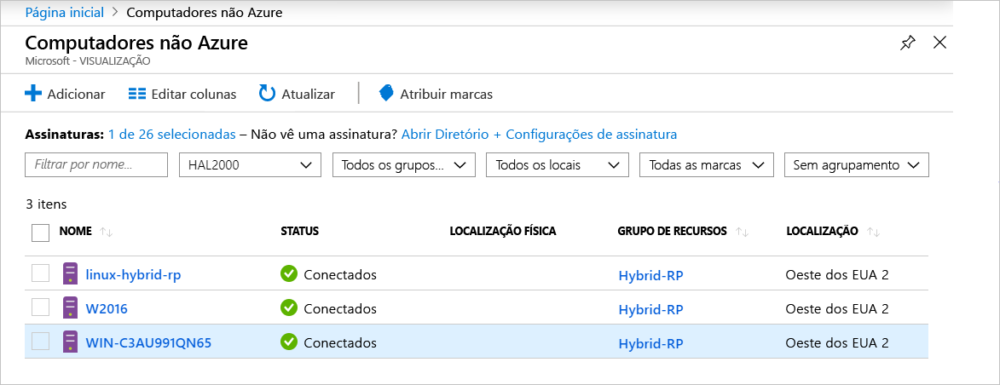

# <a name="what-is-azure-arc-for-servers"></a>O que é o Azure Arc para servidores?

O Azure Arc para servidores permite que você gerencie computadores que estão fora do Azure.
Quando um computador não Azure é conectado ao Azure, ele se torna um **computador conectado** e é tratado como um recurso no Azure. Cada **computador conectado** tem uma ID de recurso, é gerenciado como parte de um grupo de recursos dentro de uma assinatura e se beneficia de constructos padrão do Azure, tais como o Azure Policy e a marcação.

Um pacote de agente precisa ser instalado em cada computador para conectá-lo ao Azure. O restante deste documento explica esse processo mais detalhadamente.

Os computadores terão um status de **Conectado** ou **Desconectado** de acordo com o tempo decorrido desde o check-in do agente. Cada check-in é chamado de pulsação. Se um computador não tiver feito check-in nos últimos cinco minutos, ele será exibido como offline até que a conectividade seja restaurada.  <!-- For more information on troubleshooting agent connectivity, see [Troubleshooting Azure Arc for servers](troubleshoot/arc-for-servers.md). -->



## <a name="clients"></a>Clientes

### <a name="supported-operating-systems"></a>Sistemas operacionais com suporte

Na versão prévia pública, oferecemos suporte a:

- Windows Server 2012 R2 e mais recente
- Ubuntu 16.04 e 18.04

A versão prévia pública foi projetada para fins de avaliação e não deve ser usada para gerenciar recursos de produção críticos.

## <a name="azure-subscription-and-service-limits"></a>Limites de serviço e assinatura do Azure

Verifique se você leu os limites do Azure Resource Manager e planejou o número de computadores a serem conectados de acordo com a diretriz listada para a [assinatura](../../azure-subscription-service-limits.md#subscription-limits---azure-resource-manager) e para os [grupos de recursos](../../azure-subscription-service-limits.md#resource-group-limits). Em particular, por padrão, há um limite de 800 servidores por grupo de recursos.

## <a name="networking-configuration"></a>Configuração de rede

Durante a instalação e o runtime, o agente requer conectividade com os **pontos de extremidade de serviço do Azure Arc**. Se a conectividade de saída estiver bloqueada por firewalls, verifique se as URLs a seguir não estão bloqueadas por padrão. Todas as conexões são de saída do agente para o Azure e são protegidas com **SSL**. Todo o tráfego pode ser roteado por meio de um proxy **HTTPS**. Se você permitir os intervalos de IP ou nomes de domínio aos quais os servidores têm permissão para se conectar, precisará permitir também o acesso à porta 443 para as marcas de serviço e os nomes DNS a seguir.

Marcas de serviço:

* AzureActiveDirectory
* AzureTrafficManager

Para obter uma lista de endereços IP para cada tag de serviço/região, confira o arquivo JSON – [Intervalos de IP do Azure e marcas de serviço – nuvem pública](https://www.microsoft.com/download/details.aspx?id=56519). A Microsoft publica atualizações semanais que contêm cada serviço do Azure e os intervalos de IP que ele usa. Confira [Marcas de conteúdo](https://docs.microsoft.com/azure/virtual-network/security-overview#service-tags) para obter mais detalhes.

Esses nomes DNS são fornecidos juntamente com as informações de intervalo de IP de tag de serviço, pois a maioria dos serviços atualmente não tem um registro de tag de serviço e, por isso, os IPs estão sujeitos a alterações. Se os intervalos de IP forem necessários para sua configuração de firewall, a tag de serviço **AzureCloud** deverá ser usada para permitir o acesso a todos os serviços do Azure. Permita o monitoramento de segurança ou a inspeção dessas URLs, como você faria com outro tráfego de Internet.

| Ambiente de Domínio | Pontos de extremidade de serviço do Azure exigidos |
|---------|---------|
|management.azure.com|Azure Resource Manager|
|login.windows.net|Azure Active Directory|
|dc.services.visualstudio.com|Application Insights|
|agentserviceapi.azure-automation.net|Configuração de convidado|
|*-agentservice-prod-1.azure-automation.net|Configuração de convidado|
|*.his.hybridcompute.azure-automation.net|Serviço de identidade híbrida|

### <a name="installation-network-requirements"></a>Requisitos de rede para a instalação

Baixe o [pacote do agente do computador conectado ao Azure](https://aka.ms/AzureConnectedMachineAgent) de nossos servidores de distribuição oficiais. Os sites abaixo precisam estar acessíveis do seu ambiente. Você pode optar por baixar o pacote em um compartilhamento de arquivo e fazer com que o agente seja instalado por meio dele. Nesse caso, o script de integração gerado no portal do Azure talvez precise ser modificado.

Windows:

* `aka.ms`
* `download.microsoft.com`

Linux:

* `aka.ms`
* `packages.microsoft.com`

Consulte a seção [Configuração do servidor proxy](quickstart-onboard-powershell.md#proxy-server-configuration) para obter informações sobre como configurar o agente para usar o proxy.

## <a name="register-the-required-resource-providers"></a>Registrar os provedores de recursos necessários

Para usar o Azure Arc para Servidores, você deve registrar os Provedores de Recursos necessários.

* **Microsoft.HybridCompute**
* **Microsoft.GuestConfiguration**

Você pode registrar os provedores de recursos com os seguintes comandos:

PowerShell do Azure:

```azurepowershell-interactive
Login-AzAccount
Set-AzContext -SubscriptionId [subscription you want to onboard]
Register-AzResourceProvider -ProviderNamespace Microsoft.HybridCompute
Register-AzResourceProvider -ProviderNamespace Microsoft.GuestConfiguration
```

CLI do Azure:

```azurecli-interactive
az account set --subscription "{Your Subscription Name}"
az provider register --namespace 'Microsoft.HybridCompute'
az provider register --namespace 'Microsoft.GuestConfiguration'
```

Você também pode registrar os provedores de recursos usando o portal, seguindo as etapas em [portal do Azure](../../azure-resource-manager/resource-manager-supported-services.md#azure-portal).

## <a name="machine-changes-after-installing-the-agent"></a>O computador é alterado após a instalação do agente

Se você tiver uma solução de controle de alterações implantada em seu ambiente, poderá usar a lista abaixo para acompanhar, identificar e permitir as alterações feitas pelo pacote de instalação do **AzCMAgent (Agente do Computador Conectado do Azure)** .

Depois de instalar o agente, você verá as seguintes alterações feitas nos servidores.

### <a name="windows"></a>Windows

Serviços instalados:

* `Himds` – o serviço do **Agente do Computador Conectado do Azure**.
* `Dscservice` ou `gcd` – o serviço de **Configuração de convidado**.

Arquivos adicionados ao servidor:

* `%ProgramFiles%\AzureConnectedMachineAgent\*.*` – localização dos arquivos do **Agente do Computador Conectado do Azure**.
* Logs da `%ProgramData%\GuestConfig\*.*` - **Configuração de convidado**.

Localizações da chave do Registro:

* `HKEY_LOCAL_MACHINE\SOFTWARE\Microsoft\Azure Connected Machine Agent` – chaves do Registro do **Agente do Computador Conectado do Azure**.

### <a name="linux"></a>Linux

Serviços instalados:

* `Himdsd` – o serviço do **Agente do Computador Conectado do Azure**.
* `dscd` ou `gcd` – o serviço de **Configuração de convidado**.

Arquivos adicionados ao servidor:

* `/var/opt/azcmagent/**` – localização dos arquivos do **Agente do Computador Conectado do Azure**.
* Logs da `/var/lib/GuestConfig/**` - **Configuração de convidado**.

## <a name="supported-scenarios"></a>Cenários com suporte

Depois de registrar um nó, você pode começar a gerenciar seus nós usando outros serviços do Azure.

Na versão prévia pública, os cenários a seguir são compatíveis com **computadores conectados**.

## <a name="guest-configuration"></a>Configuração de convidado

Depois de conectar o computador ao Azure, você pode atribuir políticas do Azure a **computadores conectados** usando a mesma experiência encontrada na atribuição de política para máquinas virtuais do Azure.

Para obter mais informações, confira [Entender a configuração de convidado do Azure Policy](../../governance/policy/concepts/guest-configuration.md).

Os logs do Agente de Configuração de Convidado para um **Computador Conectado** estão nos seguintes locais:

* Windows - `%ProgramFiles%\AzureConnectedMachineAgent\logs\dsc.log`
* Linux: - `/opt/logs/dsc.log`

## <a name="log-analytics"></a>Log Analytics

Os dados de log coletados pelo [MMA (Microsoft Monitoring Agent)](https://docs.microsoft.com/azure/azure-monitor/log-query/log-query-overview) e armazenados no workspace do Log Analytics agora conterão propriedades específicas para o computador, tais como **ResourceId**, que pode ser usado para o acesso ao log centrado em recursos.

- Os computadores que já têm o agente MMA instalado terão a funcionalidade do **Azure Arc** habilitada por meio de pacotes de gerenciamento atualizados.
- [O agente MMA versão 10.20.18011 ou posterior](https://docs.microsoft.com/azure/virtual-machines/extensions/oms-windows#agent-and-vm-extension-version) é necessário para a integração do Azure Arc para servidores.
- Ao consultar dados de log no [Azure Monitor](https://docs.microsoft.com/azure/azure-monitor/log-query/log-query-overview), o esquema de dados retornado conterá o **ResourceId** híbrido no formulário `/subscriptions/<SubscriptionId/resourceGroups/<ResourceGroup>/providers/Microsoft.HybridCompute/machines/<MachineName>`.

Para obter mais informações, confira [Introdução ao Log Analytics no Azure Monitor](https://docs.microsoft.com/azure/azure-monitor/log-query/get-started-portal).

<!-- MMA agent version 10.20.18011 and later -->

## <a name="next-steps"></a>Próximas etapas

Há dois métodos para conectar computadores usando o Azure Arc para servidores.

* **Interativamente** – siga o [Guia de início rápido do portal](quickstart-onboard-portal.md) para gerar um script no portal e executá-lo no computador. Essa será a melhor opção se você estiver conectando um computador por vez.
* **Em escala** – siga o [Guia de início rápido do PowerShell](quickstart-onboard-powershell.md) para criar uma entidade de serviço para conectar computadores de modo não interativo.
